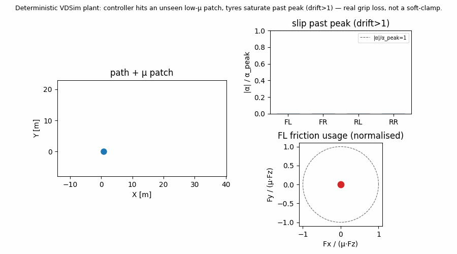

# VDSim

[English](README.md) · **한국어**

[](https://github.com/Onlyti/VDSim/actions/workflows/build.yml)
[](LICENSE)




*결정론적 VDSim plant: 컨트롤러가 사전에 모르는 저-μ patch를 통과하며 타이어가 peak
너머 포화(drift>1) — soft-clamp가 아닌 실제 grip loss.* 재현:
`python examples/demo_grip_loss.py` (`pip install vdsim[plot]` 또는 로컬 wheel).

Open-core 차량동역학 시뮬레이터. VDSim 은 **차량 그 자체**를 담당합니다 — 검증된
L1–L5 동역학 + 실제 Pacejka MF / LuGre / belt-transient 타이어 + 설계검증 가능한
hardpoint 서스펜션 운동학 + 양방향 FMI 2.0. 렌더링·센서는 CARLA 같은 도구에
위임합니다. perception 스택에 없는 "섀시 정확도" 절반을 채웁니다.

> v0.5.1+ — experimental / pre-release. analytic + ISO + cross-model (Chrono Pac02)
> self-consistency 로 검증 (자세히는 [VALIDATION](docs/VALIDATION.md)); 양산용 아님.

문서(이론·리포트): **https://onlyti.github.io/VDSim/** · 모든 실행 모드
(API / batch / FMI): [docs/RUNNING.md](docs/RUNNING.md) · catalog·물리 옵션:
[docs/CATALOG_AND_PHYSICS.md](docs/CATALOG_AND_PHYSICS.md)

## Quickstart (pip wheel)

전제: Python 3.10–3.12. 미리 빌드된 wheel 설치(로컬 빌드는 [소스](#소스-빌드) 참고).

```bash
pip install "./vdsim-*.whl[plot]"
vdsim-quickstart          # cwd 에 run.csv + run.png 생성
```

측정 (clean conda, Python 3.11, Linux x86_64, 2026-06-25): **첫 결과까지 수 초** —
pip install `[plot]` + `vdsim-quickstart` → `run.csv` + `run.png` **~6 s wall-clock**
(cold; lab 네트워크, matplotlib wheel 포함). 재실행 ~1.5 s.

설치 확인:

```bash
python -c "import vdsim; from vdsim_lab import Sim; Sim(vehicle='sedan', level='L2')"
```

스크립트: [`examples/quickstart.py`](examples/quickstart.py) — `from vdsim_lab import Sim, Road` 만 사용.

## 소스 빌드

전제: C++17 컴파일러, CMake ≥ 3.20, Python ≥ 3.10.
- Linux: `g++ ≥ 9` 또는 `clang ≥ 10`
- Windows: Visual Studio 2019+ "C++ 데스크톱 개발"(MSVC)

Python 패키지 (editable / 로컬 wheel 빌드):
```bash
pip install ".[plot]"
python -c "import vdsim; print('ok')"
```

전체 C++ 트리 (tests, real-time runtime, FMI, CARLA bridge):
```bash
cmake -B build -DVDSIM_BUILD_PYTHON=ON          # Linux 는 -G Ninja 추가
cmake --build build --config Release            # Linux 는 -j
ctest --test-dir build -C Release               # 328/328 ; 바이너리는 build/bin/
```

## Python 으로 실험하기 (제어기는 직접 작성)

VDSim 은 **시뮬레이션 seam** 만 제공하고, 루프와 알고리즘은 당신이 소유합니다.
시나리오 파일·네트워크 없이 core 에서 바로 plant 를 만들고(vehicle / tire / level /
road), `set_input(action) → run_core_dt()` 로 구동하며 `state()` / `measurements(id)`
를 읽습니다.

```python
from vdsim_lab import Sim, Road, Sensors

sim = Sim(vehicle="sedan", level="L2", road=Road.iso8608("C"),
          sensors=Sensors().gnss(pos_std=0.3).imu(), v0=12.0,
          sensor_mounts={"gnss": {"type": "gnss", "pos": [1.4, 0, 1.0]}})

while not sim.done(12.0):
    st = sim.state()                                  # ground truth
    gnss = sim.measurements("gnss")                   # noisy, mount pose 기준
    steer, throttle, brake = my_controller(st, gnss)  # <-- 당신의 알고리즘
    sim.set_input(steer=steer, throttle=throttle, brake=brake)
    sim.run_core_dt()                                 # core 한 스텝 전진

sim.to_csv("run.csv")                                 # ground-truth + per-wheel 로그
sim.metrics(["peak_ay", "cte_rms", "lap_time"])       # 스칼라 지표
sim.plot("run.png", signals=("vx", "ay", "r", "xy"))  # 옵션 (matplotlib 필요)
```

`templates/experiment_template.py` 를 복사해 `controller(...)` 만 채우고 클론 트리에서 실행:
```bash
PYTHONPATH=build/python:python python3 templates/experiment_template.py
```
예제 (클론+빌드 필요): `examples/experiment_quickstart.py`,
`examples/experiment_path_follow.py` (pure-pursuit + CTE). pip 사용자는
[`examples/quickstart.py`](examples/quickstart.py) / `vdsim-quickstart` 사용. 전체 레퍼런스(seam, `Sim(...)` 옵션, evidence):
**[docs/EXPERIMENT_API.md](docs/EXPERIMENT_API.md)**. real-time 서버·batch 러너가
쓰는 `set_input → tick` 과 동일한 seam — real-time 은 action 이 UDP 로, 여기선
당신 함수에서 들어옵니다.

## 시각화 — Web GUI

```bash
python3 gui/server.py --port 8100        # Windows: python gui\server.py --port 8100
```
브라우저 `http://localhost:8100`. GUI 가 real-time runtime 을 자동 기동해 렌더링:
3D 뷰(orbit / chase / cockpit), 도로·지형, per-wheel Fz / slip(κ, α) / 타이어 힘
벡터, telemetry HUD. 키보드(↑↓ 가감속, ←→ 조향) 또는 게임패드-휠로 운전 —
force feedback 은 `python tools/wheel_ffb_sdl.py --server <host> --udp-port 8101`.

## 설정 — parts catalog & scene (v0.3)

차량 = `configs/parts/` 조합 **blueprint**, 실행 = `fleet[]`가 있는 **scene**
(`configs/scenes/`). 레이아웃·GUI API·drivetrain 관성·LuGre 타이어(opt-in)는
[CATALOG_AND_PHYSICS](docs/CATALOG_AND_PHYSICS.md) 참고.

## 제어 — real-time UDP runtime

`vdsim_realtime` 가 VDSim 의 real-time application 입니다: 같은 core 를 wall clock
으로 돌리며 고정포맷 바이너리 UDP 를 주고받음 — **CMD**(steer / throttle / brake)
입력, **STATE**(pose, 속도, Fz, slip, 타이어 힘, measured 센서 …) 출력. 이게
SIL / HIL / co-sim 경계이고, GUI·외부 제어기는 전부 이것의 클라이언트입니다.

```bash
build/bin/vdsim_realtime --scene=configs/scenes/two_vehicle_race.yaml \
    --cmd-port=7001 --state-port=7002 --rate=200
```
wire 포맷 = canonical VDS1 바이너리 프로토콜 (`cosim/cosim_protocol.hpp`; 계약서는
[docs/vdsim_bridge_interface_requirements.md](docs/vdsim_bridge_interface_requirements.md)).
Python 클라이언트는 `cosim/protocol.py` 로 CMD 인코딩 / STATE 디코딩해 byte-호환.

## 규약

SI 단위 · body frame ISO 8855 RH (X 전방, Y 좌, Z 상) · world frame ENU ·
wheel 인덱스 **FL = 0, FR = 1, RL = 2, RR = 3**.

## 라이선스

Apache-2.0 (core / kinematics / tools / validation / FMI export). FMI 2.0 헤더는
BSD-2-Clause (Modelica Association). 서드파티(Eigen / yaml-cpp / spdlog /
GoogleTest)는 각자 라이선스; CMake FetchContent 로 가져옴.
