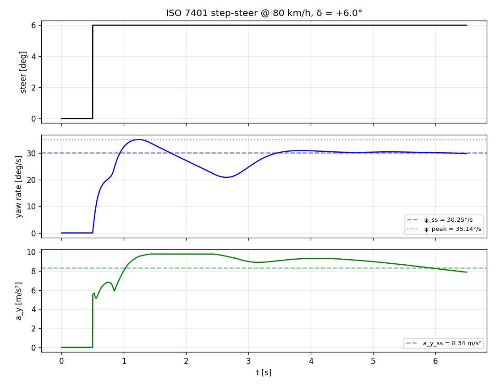
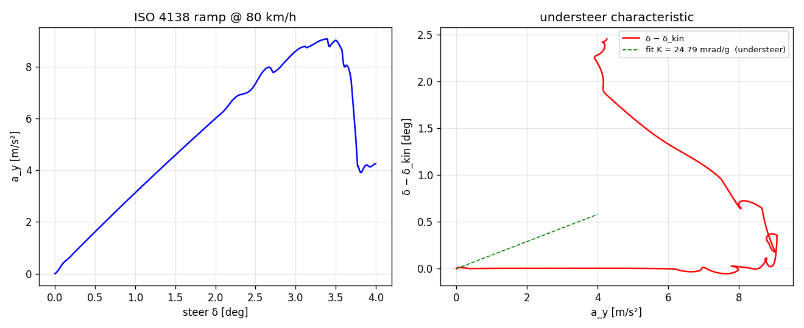
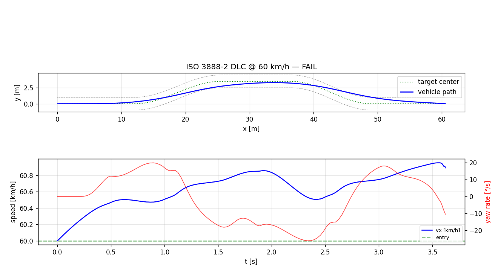

# VDSim ISO maneuver validation report

- Vehicle config : `configs/parts/chassis/sedan.yaml`
- Tire config    : `configs/parts/tire/default_pacejka.yaml`
- Dynamics level : `L2`
- Mass           : `1500 kg`
- Wheelbase      : `2.700 m`

## ISO 7401 — step-steer transient response

    === ISO 7401 — step-steer transient response ===
      v_target           : 22.22 m/s  (80 km/h)
      steer input        : +6.0 deg (step)
    
      psi_dot_ss         : +30.253  deg/s  (+0.5280 rad/s)
      psi_dot_peak       : +35.146  deg/s
      U  (peak / SS)     : 1.162    -> +16.2% overshoot
      T_max  (to peak)   : 0.742  s
      T_psi_dot (90% SS) : 0.384  s
      Settling 5%        : 2.786  s
      a_y_ss             : 8.336  m/s²  (0.85 g)

## ISO 4138 — steady-state circular driving

    === ISO 4138 — steady-state circular (constant speed) ===
      v_target              : 22.22 m/s  (80 km/h)
      Handling tendency     : UNDERSTEER
      K (per g)             : +24.792 mrad/g
      K (per m/s²)          : +2.528 mrad·(s²/m)
      Linear range a_y      : up to 4.00 m/s²
      a_y_max in test       : 9.08 m/s² (0.93 g)

## ISO 3888-2 — Double Lane Change

    === ISO 3888-2 — Severe lane-change (DLC / moose test) ===
      v_entry            : 60.0 km/h
      v_exit             : 60.9 km/h
      Speed loss         : -0.89 km/h
      Max lateral excursion (vs target lane): 1.182 m
      Peak yaw rate      : 26.0 °/s
      Peak |a_y|         : 0.748 g
      Verdict            : FAIL
                           (criteria: speed loss < 2.0 km/h AND
                            excursion < 1.0 m vs target lane)

