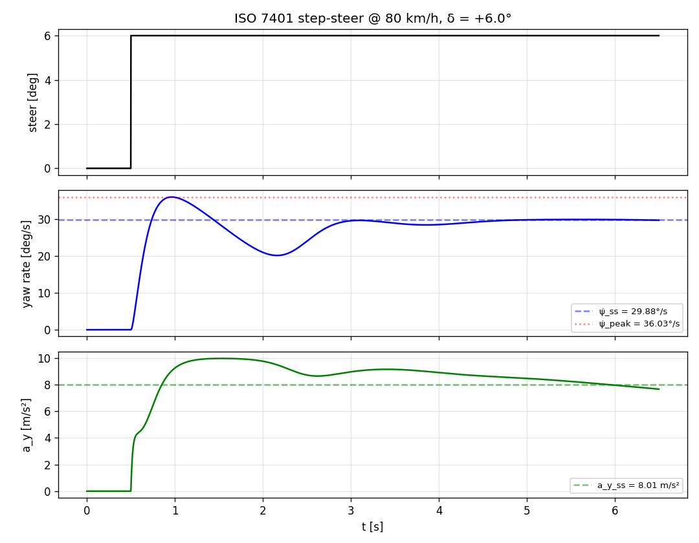
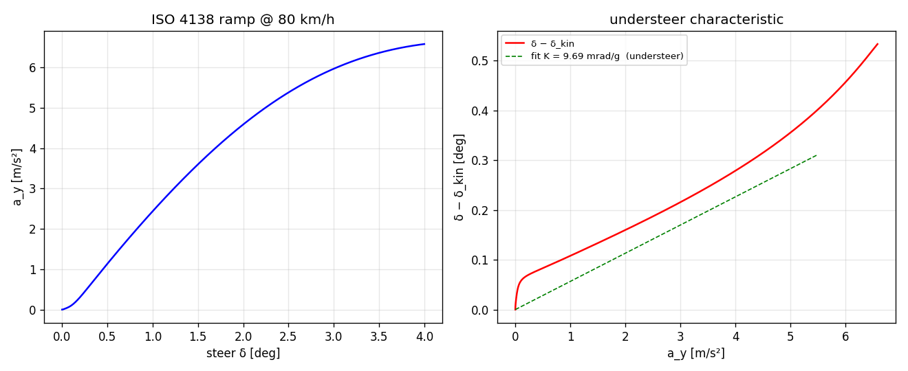
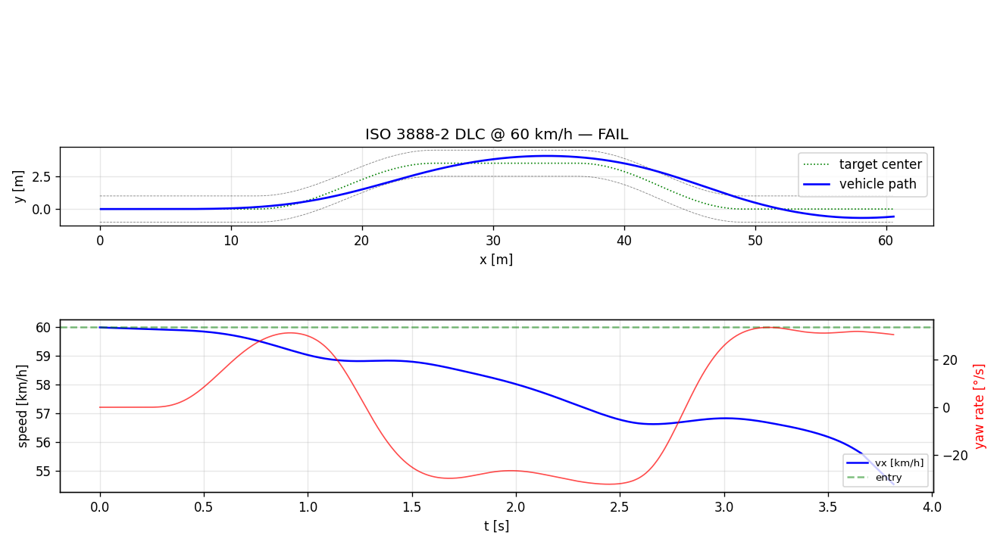

# VDSim ISO maneuver validation report

- Vehicle config : `configs/vehicles/sports.yaml`
- Tire config    : `configs/tires/default_pacejka.yaml`
- Dynamics level : `L3`
- Mass           : `1320 kg`
- Wheelbase      : `2.550 m`

## ISO 7401 — step-steer transient response

    === ISO 7401 — step-steer transient response ===
      v_target           : 22.22 m/s  (80 km/h)
      steer input        : +6.0 deg (step)
    
      psi_dot_ss         : +29.882  deg/s  (+0.5215 rad/s)
      psi_dot_peak       : +36.033  deg/s
      U  (peak / SS)     : 1.206    -> +20.6% overshoot
      T_max  (to peak)   : 0.464  s
      T_psi_dot (90% SS) : 0.200  s
      Settling 5%        : 2.286  s
      a_y_ss             : 8.010  m/s²  (0.82 g)

## ISO 4138 — steady-state circular driving

    === ISO 4138 — steady-state circular (constant speed) ===
      v_target              : 22.22 m/s  (80 km/h)
      Handling tendency     : UNDERSTEER
      K (per g)             : +9.689 mrad/g
      K (per m/s²)          : +0.988 mrad·(s²/m)
      Linear range a_y      : up to 5.48 m/s²
      a_y_max in test       : 6.58 m/s² (0.67 g)

## ISO 3888-2 — Double Lane Change

    === ISO 3888-2 — Severe lane-change (DLC / moose test) ===
      v_entry            : 60.0 km/h
      v_exit             : 54.5 km/h
      Speed loss         : +5.46 km/h
      Max lateral excursion (vs target lane): 1.298 m
      Peak yaw rate      : 33.6 °/s
      Peak |a_y|         : 0.892 g
      Verdict            : FAIL
                           (criteria: speed loss < 2.0 km/h AND
                            excursion < 1.0 m vs target lane)

