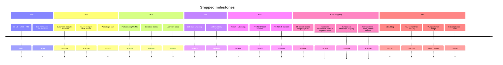

# VDSim product roadmap

**Last updated:** 2026-06-20 · **Tests:** 388/388 ctest green (`main`) · 402 on `VDSim-Thesis` (+ VLA plant)

Living roadmap from early PoC through v0.6. Tracks what shipped in **`main`** vs what
is planned. The **VLA thesis closed-loop plant** (`python/vdsim_plant.py`) ships on
`VDSim-Thesis` only (tag `vdsim-thesis-beta`); core APIs it depends on are on `main`.
Detail specs: `docs/design/*`; tire phases in [`design/TIRE_ROADMAP.md`](design/TIRE_ROADMAP.md).

!!! note "How to read"
    - [x] **Shipped** — in repo, default or opt-in, covered by ctest where applicable  
    - [ ] **Planned** — scoped in design docs; not yet implemented  
    - **Opt-in** — implemented but not default catalog (baseline frozen)
    - **Thesis-only** — on `VDSim-Thesis`; not merged to `main` yet

**Velocity (recent):** v0.5 terrain + tire T1/T2 → **v0.6 L5 MBD** (untagged) → **per-wheel
tire + direct-control session factory** on `main` → **VLA plant beta** on thesis branch.

---

## At a glance

| Area | Shipped (high level) | Next |
|------|----------------------|------|
| Dynamics L1–L5 | L1–L3 planar/14-DOF; **Ld4** hard-joint; **Ld5** stunt + terrain; **Ld5 high-fidelity MBD** ([design](design/L5_MBD_FREE3D_UNSPRUNG.md)) | **v0.6.0 tag**; KC compliance; GUI terrain Play (v0.5.2); V2V |
| Tire | MF96 + LuGre **default**; **MF2002 `.tir` (T1)**; **belt transient (T2)**; **per-axle/per-wheel `TireSetup`** | GUI `.tir` import; T3 VLOW unified low-speed |
| Drivetrain | Engine inertia + open-diff; **2D torque map + gearbox + shift policy (v2, opt-in)**; **catalog `drivetrain_v2` part** | Engine-map workshop (UI); L1 powertrain |
| Brake / steer | Pluggable modules + deadtime; **user-defined modules (C++/Python subclass)** | Booster/MDPS physics |
| Catalog / runtime | `--scene=`, fleet, FMI; **`make_direct_control_session`**, `FrictionMapConfig`, `SimOutput` wheel GT | External part packs; VDS1 v4; **Fx→τ contract (#1)** |
| Closed-loop plant | Core session API on `main` | **VLA `VDSimPlant`** thesis-only → main PR when client done |
| GUI | 3-tab scene UI, catalog API, workshops, multi-vehicle compare | **GUI v2** (framework decision); terrain Play; `.tir` import |
| Validation | ISO 7401/4138/3888 **re-baselined + CI-gated** (`IsoBaseline`), **388** ctest | Adams x-check |

---

## 1. Dynamics ladder

| Item | Status | Notes |
|------|--------|-------|
| [x] Ld1 bicycle (5 state) | Shipped | `bicycle_dynamics.cpp` |
| [x] Ld2 seven-DOF planar | Shipped | Per-wheel Pacejka, Ackermann |
| [x] Ld3 fourteen-DOF (sprung + unsprung) | Shipped | Ride/heave/roll; L2 planar inner |
| [x] L1↔L2↔L3 cross-model consistency | Shipped | `PlanarMotionMatchesL2`, grid sweeps |
| [x] Low-speed kinematic blend (default tire) | Shipped | [`LOW_SPEED_HANDLING.md`](design/LOW_SPEED_HANDLING.md) |
| [x] LuGre path skips blend | Shipped opt-in | Full dynamic EOM at all speeds |
| [x] Ld4 hardpoint kinematics (attach) | Shipped | Native kin YAML; `level=L4` |
| [x] Ld4 multibody M1–M7 | Shipped | [`LD4_MULTIBODY.md`](design/LD4_MULTIBODY.md); M4 runtime, M7 offline |
| [x] Ld5 6-DOF 3D body + quaternion | Shipped v0.4 (stunt) | `free_3d_dynamics.cpp`; terrain → v0.5 |
| [x] 3D contact / airborne / ramp jump | Shipped v0.4 | [`V0.4_SLOPE_JUMP_DYNAMICS.md`](design/V0.4_SLOPE_JUMP_DYNAMICS.md) |
| [x] **Ld5 free-3D inertial unsprung MBD** (per-corner world point mass + anisotropic 2-point bushing; energy-consistent on any surface; replaces the B1 lumped strut) | Shipped v0.6 (untagged) | [`L5_MBD_FREE3D_UNSPRUNG.md`](design/L5_MBD_FREE3D_UNSPRUNG.md) |
| [x] **Hardpoint-emergent anti-dive/squat + roll-centre migration** (wheel follows the real DAE travel path; tyre Fx/Fy → vertical reaction) | Shipped v0.6 (untagged) | active when a corner DAE is attached |
| [x] **Progressive coil rate + damper** (k_coil·(l−l_free)·MR from real spring eye-to-eye; bump/rebound asymmetric) | Shipped v0.6 (untagged) | wheel-rate fallback w/o spring hardpoints |
| [x] **Gyroscopic wheel-spin coupling** (Σ I_wheel·ω_spin lateral momentum; yaw↔roll at speed) | Shipped v0.6 (untagged) | `Stunt.GyroscopicWheelSpinCouplesYawToRoll` |
| [x] Per-substep contact re-query default in `SimSession` (exact on curved surfaces) | Shipped v0.6 (untagged) | no-op for non-free_3d |
| ~~Ld5 → full 6-DOF multibody~~ (superseded designs: `L5_6DOF_MULTIBODY`, `L5_MBD_DYNAMIC_COUPLING`, `L5_MBD_RIGOROUS`) | Superseded by free-3D MBD above | kept for history |
| [x] **Terrain + L5 general driving** (heightmap hub contact, hill/cliff, inclined) | Shipped v0.5 (headless/batch/cosim; GUI → v0.5.2) | [`V0.5_TERRAIN_L5.md`](design/V0.5_TERRAIN_L5.md) |
| [x] Curved banked track (`CurvedGround` + banked oval) | Shipped v0.5 (was v0.4 M3) | `V0.5_TERRAIN_L5.md` M5b |
| [ ] V2V collision | Planned | [`V0.2_MULTIVEHICLE.md`](design/V0.2_MULTIVEHICLE.md) |

---

## 2. Tire

**Today:** empirical Pacejka MF96 (default) + library MF2002 evaluator + opt-in LuGre brush.

**Future layers:** [`design/TIRE_ROADMAP.md`](design/TIRE_ROADMAP.md) (belt transient, catalog MF, …).

### 2.1 Shipped

| Item | Status | Reference |
|------|--------|-----------|
| [x] Pacejka MF96 BCDE long/lat | Shipped | `pacejka_mf96.cpp` |
| [x] Combined slip (friction ellipse) | Shipped | Ch.03 §3.5 |
| [x] Aligning moment $M_z$ + trail falloff | Shipped | |
| [x] Load sensitivity $\mu_{\mathrm{eff}}(F_z)$ | Shipped | |
| [x] Lateral relaxation length → `alpha_dyn_` | Shipped | Off when LuGre on |
| [x] Camber thrust (linear API) | Shipped | Ld4 forward |
| [x] Full Magic Formula `.tir` evaluator | Shipped lib | `magic_formula_tire.cpp`; not default catalog |
| [x] `python/tir_to_yaml.py` | Shipped | Workshop wire-up open |
| [x] LuGre decoupled $z_{\mathrm{long}}, z_{\mathrm{lat}}$ | Shipped **default** | [`V0.2_TIRE_LUGRE.md`](design/V0.2_TIRE_LUGRE.md) |
| [x] `tire.kinematic_fallback` (LuGre off) | Shipped | ISO / legacy baseline |
| [x] MF96 as breakaway $g(\cdot)$ | Shipped | |
| [x] Asymmetric $g$ floors (no long $\mu F_z$; α-gated lat) | Shipped | 2026-06 tuning |
| [x] ISO $F_y$ sign ($F_y = -F_{\mathrm{raw}}$) | Shipped | |
| [x] Peak-axis combined ellipse (LuGre path) | Shipped | Skip triple circular clip |
| [x] RK4: $z$ advanced 4× per substep ($h/4$) | Shipped | |
| [x] `fx_kin` = clipped LuGre $F_x$ for wheel spin | Shipped | |
| [x] Catalog preset `tire.lugre_on` | Shipped | |
| [x] CLI `--lugre` / `--no-lugre` | Shipped | |
| [x] GUI LuGre toggle + `fleet_overrides` persist | Shipped | |
| [x] Scene `lugre_grade_demo.yaml` | Shipped | |
| [x] `LuGreTire/*` integration tests | Shipped | 209 ctest suite |
| [x] Theory ch.19 + user docs synced | Shipped | |
| [x] **Per-axle `TireSetup`** (front/rear yaml, L1/L2/L3/L5) | Shipped 2026-06-20 | `PerAxleTire.*`; catalog `tire_rear` slot |
| [x] **Per-wheel `TireSetup`** (FL/FR/RL/RR corner yaml) | Shipped 2026-06-20 | `PerWheelTire.*`; catalog `tire_fr`/`tire_rl`/`tire_rr` |

### 2.2 Planned (tire)

| Phase | Item | Status |
|-------|------|--------|
| T1 | `.tir` / MF2002 as **catalog** tire backend (`TireParams.backend`) | [x] merged |
| T1 | MF2002 combined slip bypasses host friction ellipse | [x] merged |
| T1 | **Tire model selectable per-part** via `backend: mf96 \| mf2002 \| linear` — all three live in `create_tire_from_params` (mf96 default, mf2002→.tir, linear→`create_linear_tire`), routed by every dynamics (L1/L2/L5). | [x] infra present; TODO: formalize `linear` (catalog preset + tests + docs), confirm L1/L5 parity. Requested 2026-06-18 |
| T1 | GUI tire import + public sample `.tir` | [ ] (v0.5.2 GUI) |
| T1 | Chrono Pac02 parity gate (`ctest -R ChronoPac02Parity`) | [x] pure-long ~2% + pure-lat ~1% gated |
| T1 | LuGre $g()$ from MF2002 $F_{x0},F_{y0}$ (optional) | [ ] |
| T2 | **Belt transient** (`belt_relax`, σ/\|Vx\| first-order) | [x] merged |
| T2 | Filtered slip → MF96/MF2002 + LuGre (L2/L3/L5) | [x] merged |
| T2 | bicycle (L1) belt wiring (MF + LuGre) | [x] merged |
| T3 | VLOW-class unified low speed (reduce blend reliance) | [ ] |
| T4 | MF2002 $G_{x\alpha}, G_{y\kappa}$ on dynamic path | [ ] |
| T5 | Turn-slip, inflation, temperature | [ ] |
| T6 | External tire FMU co-sim; public benchmark report | [ ] |

### 2.3 Belt transient (planned — summary)

Steady MF maps slip → force **instantly**. Real tires lag because the **carcass/belt**
deflects first. Belt transient adds states (e.g. $q_y$ or $\alpha_{\mathrm{eff}}$)
with $\tau \approx \sigma_y / |V_x|$ before the constitutive law — complementary to
LuGre (contact bristle, presliding). See [`TIRE_ROADMAP.md`](design/TIRE_ROADMAP.md) §3.

---

## 3. Drivetrain

| Item | Status | Reference |
|------|--------|-----------|
| [x] Pluggable `IDrivetrain` module | Shipped | WS1 #159–162 |
| [x] Open / locked / LSD split | Shipped | |
| [x] `engine_rotational_inertia` reflected ($I \cdot N_f^2$) | Shipped | [`V0.2_DRIVETRAIN.md`](design/V0.2_DRIVETRAIN.md) |
| [x] Open-diff coupled 2x2 axle inertia (`open_axle_spin_accel`) | Shipped | engine inertia felt under symmetric accel, free under wheel-diff |
| [x] Legacy mode (`I_engine = 0`) | Shipped | |
| [x] Catalog `drivetrain_v1` part type | Shipped | |
| [x] **Engine 2D torque map** $T(\mathrm{rpm},\theta)$ (Drivetrain v2, opt-in) | Shipped | theory ch.22; `powertrain:` block |
| [x] **Multi-ratio gearbox** + RPM coupling + gear-dependent reflected inertia | Shipped | `EngineGearbox` |
| [x] **Shift policy** (manual / auto-RPM / **user-defined function**, pybind callback) | Shipped | `set_shift_policy` |
| [x] Engine speed + gear in output (`engine_rpm()`, `current_gear()`) | Shipped | + pybind |
| [x] Idle-floor + slipping launch clutch | Shipped | |
| [x] Catalog `drivetrain_v2` part (materialize powertrain into chassis) | Shipped | `drivetrain.sedan_v2` part + `vehicle.sedan_powertrain` blueprint |
| [ ] Workshop engine map editor (WS2-6) | Planned | Stub in GUI |
| [x] ISO baseline unaffected (powertrain opt-in, default flat) | Shipped | `IsoBaseline` green |

---

## 4. Brake & steering

| Item | Status | Reference |
|------|--------|-----------|
| [x] `IBrakeSystem` / `ISteeringSystem` interfaces | Shipped | [`V0.2_SUBSYSTEMS.md`](design/V0.2_SUBSYSTEMS.md) |
| [x] Proportional brake + front/rear bias | Shipped | |
| [x] EBD by $F_z$ | Shipped | |
| [x] Ratio steering + rack travel | Shipped | |
| [x] Actuator deadtime (throttle/brake/steer) | Shipped | WS2-0 |
| [x] Steering rack torque in STATE | Shipped | |
| [x] LuGre column friction (separate module) | Shipped | Theory ch.17 |
| [ ] Booster → line pressure → pad $\mu$ | Planned | |
| [ ] Brake thermal fade | Planned | |
| [ ] ABS / ESC interface | Planned | |
| [ ] MDPS assist, variable ratio | Planned | |
| [ ] Column compliance model | Planned | |

---

## 5. Suspension & anti-roll

| Item | Status | Reference |
|------|--------|-----------|
| [x] Linear spring/damper per corner (L3) | Shipped | |
| [x] `IAntiRollBar` per-wheel force (#162) | Shipped | |
| [x] Ld4 hardpoint toe/camber into dynamics | Shipped | Fleet `susp_kinematics` |
| [x] Catalog `susp_ride`, `susp_kinematics` parts | Shipped | |
| [x] Workshops: suspension tab | Shipped | WS2-1 |
| [x] **Progressive coil rate + bump/rebound stops** (L5) | Shipped v0.6 (untagged) | MR(z_v) from real spring hardpoints; stops on wheel travel; [`L5_MBD_FREE3D_UNSPRUNG.md`](design/L5_MBD_FREE3D_UNSPRUNG.md) |
| [x] **Genuine per-corner unsprung masses** (L5 free-3D) | Shipped v0.6 (untagged) | inertial world particles, not body-relative DOF |
| [ ] Progressive / bump-stop spring curves (L3 catalog) | Planned | L3 ride model (L5 done) |
| [ ] Unsprung vs sprung damper split (L3) | Planned | PoC backlog |
| [ ] KC compliance (bushing) under load — full model | Planned | L5 link is a stiff penalty today |
| [ ] Dependent axle (twist-beam, solid beam) | Planned | Config stubs only |
| [x] Ld4 multibody M1–M7 | Shipped | [`LD4_MULTIBODY.md`](design/LD4_MULTIBODY.md); bushing step off in L4 |

---

## 6. Actuator, driver & control ladder

| Item | Status | Reference |
|------|--------|-----------|
| [x] Lc4 pedal (throttle/brake/steer) primary | Shipped | CARLA-compatible |
| [x] Lc5–Lc8 cascade (PI, PP, waypoint) | Shipped | Demos + theory ch.07–10 |
| [x] Driver latency + noise | Shipped | |
| [x] First-order actuator lag | Shipped | |
| [ ] LQR / MPC (HPIPM) | Planned | PoC Phase 2 |
| [ ] Per-channel actuator nonlinearities (beyond deadtime) | Planned | `references/actuator_nonlinearity.md` |

---

## 7. Catalog, scenes & runtime

| Item | Status | Reference |
|------|--------|-----------|
| [x] `configs/catalog/` manifest + parts + blueprints | Shipped | v0.3 M1 |
| [x] Legacy flat `vehicles/` / `tires/` removed | Shipped | M2 |
| [x] `vdsim_realtime --scene=` only | Shipped | M3 |
| [x] GUI `/api/catalog`, `/api/scene`, simconfig v3 | Shipped | M4 |
| [x] `fleet[]` + part overrides materialization | Shipped | |
| [x] Maneuvers `configs/maneuvers/` | Shipped | |
| [x] Python `Vehicle.preset()` / `Tire.preset()` | Shipped | |
| [x] **`TireSetup` pybind** + `initialize_setup` | Shipped 2026-06-20 | per-axle / per-wheel |
| [x] **`IVehicleDynamics::tire(wheel)`** | Shipped 2026-06-20 | L1/L2/L5 |
| [x] **`make_direct_control_session`** + `FrictionMapConfig` | Shipped 2026-06-20 | CmdL1 direct path; `make_friction_ground()` |
| [x] **`SimOutput` wheel GT** (μ, μ_peak, α/κ peak, `tire_forces_wheel`) | Shipped 2026-06-20 | `SimSession::output()` |
| [x] **`ladder_lowering.hpp`** (ISO-frozen L1–L3→L4 calib) | Shipped 2026-06-20 | was duplicated in dynamics |
| [x] Steer deadtime via **ActuatorModel** (not ad-hoc lag) | Shipped 2026-06-20 | `vp.steer_deadtime_s` on direct path |
| [x] Plant data-access view `plant.vehicle.tire.{model,params}` (vehicle→part→physics, read-only) | Shipped 2026-06-18 | tyre only |
| [ ] Extend the data-access view to brake/steering/drivetrain/suspension/ARB parts | TODO | needs const module getters on IVehicleDynamics (only set_*_module exists); tyre is the only part with a live model handle today |
| [ ] **VLA Thesis Plant API P1:** roll angle in obs (`obs["roll"]`, `obs["pitch"]`) | Planned | BETA #1 customer request; already computed in L2–L5 |
| [ ] **VLA Thesis Plant API P1:** split-μ friction map (left/right different grip) | Planned | `create_split_mu_ground` exists in C++; needs Python API surface |
| [ ] **VLA Thesis Plant API P2:** steering actuator lag option (selectable 1st-order LPF) | Planned | `VehicleParams.steer_deadtime_s` implemented; needs API convenience + docs |
| [ ] **VLA Thesis Plant API P2:** smooth friction patch transition (tanh vs step μ) | Planned | Reduces numerical jitter at patch boundaries |
| [x] `tools/import_part_pack.py` stub | Shipped | M5 |
| [x] **VLA plant beta** (`VDSimPlant`, friction patch, obs contract) | **Thesis-only** | tag `vdsim-thesis-beta`; [`design/VLA_THESIS_PLANT.md`](design/VLA_THESIS_PLANT.md) |
| [x] VLA P1: `obs["roll"]`, `obs["pitch"]` | **Thesis-only** | L2–L5 qs angles |
| [x] VLA P1: 1-D + **2-D polygon** friction map | **Thesis-only** | `PolygonFrictionGround` |
| [x] VLA P2: smooth patch blend (1 m) + steer lag docs | **Thesis-only** | [`VDSIM_PLANT_TUTORIAL.md`](VDSIM_PLANT_TUTORIAL.md) |
| [x] VLA: **`mu_peak`** per wheel (realized friction circle) | **Thesis-only** | fixes useGT>1 artifact |
| [ ] VLA **#0 Fx→τ** C++ contract + **`drive_split_front`** (#6) | Planned | spec in `VLA_THESIS_PLANT.md`; thesis uses CmdL1 shim |
| [ ] VLA plant merge to `main` | Planned | after client delivery; single PR |
| [ ] C++ in-process catalog resolver | Planned | PARTS_CATALOG §12 |
| [ ] External catalog zip import (full) | Planned | |
| [ ] VDS1 protocol v4 (`vehicle_id` field) | Planned | Multi-vehicle I/O |
| [ ] In-engine V2V collision | Planned | |

---

## 8. GUI & workshops

| Item | Status | Reference |
|------|--------|-----------|
| [x] Full-screen `app.html` (3D + telemetry) | Shipped | v0.2 redesign |
| [x] 3-tab setup (vehicle / env / simulator) | Shipped | |
| [x] Multi-vehicle fleet tree + viz | Shipped | |
| [x] Data-comms panel (UDP targets) | Shipped | 2026-06 week |
| [x] Scene save/load (simconfig v3) | Shipped | |
| [x] Workshops window (susp/brake/steer/drivetrain) | Shipped | WS2 |
| [x] Live tire/vehicle edit → plant | Shipped | |
| [x] Catalog part picker in GUI | Shipped | v0.3 M4 |
| [ ] Tire workshop: `.tir` import button | Planned | WS2-5 |
| [ ] Engine map workshop (curves) | Planned | WS2-6 |
| [ ] Stunt *authoring* preset panel (ramp / loop / banked) | Planned **v0.5** (render-only today) | `V0.5_TERRAIN_L5.md` M5c |

---

## 9. Co-simulation, FMI & integrations

| Item | Status | Reference |
|------|--------|-----------|
| [x] VDS1 UDP CMD/STATE (`vdsim_realtime`) | Shipped | 200 Hz class |
| [x] FMI 2.0 export + round-trip Δ=0 | Shipped | |
| [x] Multi-vehicle single process | Shipped | |
| [x] CARLA raycast ABI skeleton | Shipped | PoC ~45% |
| [ ] CARLA UE5 full sensor bridge | Planned | PoC backlog |
| [ ] External MF-Tyre / tire FMU co-sim | Planned | Tire T6 |
| [ ] CarMaker ERG cross-validation | Planned | License + confidential data |

---

## 10. Validation & credibility

| Item | Status | Reference |
|------|--------|-----------|
| [x] Analytic benchmarks (bicycle, coast, weight transfer) | Shipped | [`VALIDATION.md`](VALIDATION.md) |
| [x] ISO 7401 step-steer runner | Shipped | |
| [x] ISO 4138 understeer gradient | Shipped | |
| [x] ISO 3888-2 DLC metric | Shipped | |
| [x] ISO 8608 road PSD classes | Shipped | |
| [x] **382** automated ctests | Shipped | 2026-06-17 |
| [x] **385** automated ctests (`main`, post core port) | Shipped | 2026-06-20 |
| [x] **388** automated ctests (`main`, SessionKind + KC + T3) | Shipped | 2026-06-20 |
| [x] **402** on `VDSim-Thesis` (+ VLA plant suite) | Shipped thesis | 2026-06-20 |
| [x] ISO matrix re-baseline (post engine inertia + LuGre) + CI gate | Shipped | `IsoBaseline`; VALIDATION.md table 2026-06-10 |
| [x] Stunt / L5 validation suite | Shipped | `test_stunt`, `test_l5_strut_validation` (loop critical, ballistic jump, camber=L4 DAE, gyro, energy) |
| [x] **KC geometry cross-validation** (L5 DAE travel ≡ independent native kinematics, rtol-gated) | Shipped | `MultibodyKcXval.DaeTravelMatchesNativeKinematics`; rules out engine bugs (internal consistency) |
| [x] **KC analytic anchor** (pure-lateral trailing arm ⇒ camber/toe gain = 0, closed form) | Shipped | `MultibodyKcAnalytic.PureTrailingArmZeroCamberToe`; validates the engine vs math, not just itself |
| [x] **External Chrono KC cross-val** (camber/toe vs travel vs Chrono::Vehicle `ChSuspensionTestRig`, same hardpoints) | Reference CSV + gate green | `external/chrono_kc/` + `ChronoKcParity` (8 % / 0.1° bands; rebound reach ~−14 mm) |
| [ ] External Adams / physical KC-rig cross-val (absolute, third-party) | Planned | Chrono is an independent MBD but still a simulator; physical/commercial data remains the gap |
| [ ] Published commercial cross-val (open data) | Planned | Honest gap today |

---

## 11. v0.4 — stunt physics (planned release)

Single tag **v0.4.0** per [`V0.4_PLAN.md`](design/V0.4_PLAN.md). Does not block tire T1/T2.

| Milestone | Item | Status |
|-----------|------|--------|
| M1 | T23 jump C++ + contact `is_valid` | [x] |
| M2 | RampGround + ramp scene + GUI render | [x] |
| M3 | CurvedGround + banked scenario | → **v0.5** (M5b) |
| M4 | Ld5 core + jump on Ld5 | [x] |
| M5 | LoopGround + `vertical_loop_demo.yaml` | [x] |
| M6 | Loop validation (✓) + theory `20_ld5_stunt` | [x] |

**v0.4.0 tagged.** Descoped to v0.5 (now shipped): banked curve
(`CurvedGround`/`banked_oval`, M5b). Still deferred to v0.5.2 GUI: stunt
*authoring* panel (render-only today).

---

## 12. Version history (checklist)

### PoC → v0.1 (2025)

- [x] L1–L3 dynamics + MF96 tire  
- [x] Combined slip, $M_z$, diff, EBD, aero  
- [x] FMI 2.0, Python bindings, ISO runners  
- [x] Driver L5–L8, scenarios (step, DLC, skidpad, …)

### v0.2 — composable vehicle (2026-06)

- [x] WS1 subsystem modules (brake, steer, drivetrain, susp, ARB)  
- [x] WS2 workshops shell + deadtime bridge  
- [x] WS3 scene UI redesign + data-comms  
- [x] WS4 part registry + fleet assembly  
- [x] Multi-vehicle runtime (single process)

### v0.3 — parts catalog (2026-06)

- [x] M1 catalog resolver + manifest  
- [x] M2 migrate configs, delete legacy trees  
- [x] M3 `--scene=` CLI  
- [x] M4 GUI catalog API + simconfig v3  
- [x] M5 docs sweep + import stub  
- [x] Drivetrain `engine_rotational_inertia`  
- [x] LuGre tire default on + `kinematic_fallback` part + tests + docs  

### v0.4 — stunt / Ld5 (2026-06, tagged)

- [x] Stunt / Ld5 / 3D contact (this doc §11)
- [x] Ld4 multibody M1–M7

### v0.5.0 — terrain + L5 (2026-06, tagged)

- [x] Terrain + L5 general driving (heightmap hub contact, hill/cliff/inclined, banked)

### v0.5.1 — tire layers (2026-06, tagged)

- [x] Tire T1 MF2002 `.tir` backend + combined-slip ellipse bypass
- [x] Tire T2 belt transient (L2/L3/L5, MF+LuGre, validation, theory ch.21)
- [x] ISO re-baseline (flat, sedan L2 LuGre) + CI gate `IsoBaseline`

### v0.6.0 — L5 high-fidelity MBD (2026-06, on `main`, untagged)

- [x] Ld5 free-3D inertial unsprung MBD (per-corner world point mass + anisotropic 2-point
  bushing; energy-consistent on any surface; replaces the B1 lumped strut)
- [x] Hardpoint-emergent anti-dive/squat + roll-centre migration (wheel constrained to the
  real DAE travel path; tyre Fx/Fy → vertical reaction)
- [x] Progressive coil rate + damper from the real spring eye-to-eye geometry (MR(z_v),
  bump/rebound asymmetric); wheel-rate fallback without spring hardpoints
- [x] Gyroscopic wheel-spin coupling (yaw↔roll at speed)
- [x] Per-substep contact re-query default in `SimSession`; contact sampled at the wheel
  particle (exact on curved surfaces, no false contact leaving a loop/bank)
- [x] 385/385 ctest; design [`L5_MBD_FREE3D_UNSPRUNG.md`](design/L5_MBD_FREE3D_UNSPRUNG.md)

### v0.6.1 — core port from thesis (2026-06-20, on `main`)

- [x] `TireSetup` per-axle / per-wheel + catalog cosim slots + `PerAxleTire` / `PerWheelTire` tests
- [x] `make_direct_control_session`, `FrictionMapConfig`, polygon friction canonical path
- [x] `IVehicleDynamics::tire(wheel)`, `SimOutput` wheel GT fields
- [x] `ladder_lowering.hpp`; steer deadtime via actuator on direct-control path
- [ ] **v0.6.2 tag** — SessionKind + KC compliance + T3 VLOW (code ready)

### v0.6.2 — core quality + tire T3 (2026-06-20, on `main`)

- [x] `SessionKind` (`Standard` / `DirectControl`) replaces `SimConfig.direct_control_path`
- [x] KC bushing compliance in L3/L4 hard-joint step (`compliance_targets_rad` under tire load)
- [x] T3: `TireParams.low_speed_mode` (`kinematic_blend` | `tire_vlow`) + `vlow_speed_eps`
- [x] 388/388 ctest

### v0.5.2+ (planned)

- [ ] GUI terrain Play (M4) + stunt authoring (M5c) + `.tir` import — browser-gated
- [x] Tire: bicycle (L1) belt (MF+LuGre) + Chrono Pac02 parity gate — done
- [ ] Engine-map workshop UI (drivetrain v2 already in core)
- [ ] Brake/steer physics upgrade
- [ ] L5 next cut: KC compliance model, gyro axis tilt + spin-up reaction
- [ ] GUI v2 (framework + design system — see HANDOFF)
- [ ] CARLA full bridge · open benchmark

---

## 13. External messaging (approved)

**Shipped today**

> Open-core L1–L5 vehicle dynamics with Pacejka MF tire, optional LuGre brush + belt
> transient layers, opt-in MF2002 `.tir` backend, per-wheel tire setup, drivetrain v2
> (engine map + gearbox), parts catalog, real-time UDP/FMI, and ISO-standard validation
> (385 ctests on `main`). The L5 model is a hardpoint-driven free-3D multibody:
> anti-dive/squat, roll-centre migration and a progressive coil rate emerge from the
> suspension geometry, energy-consistent on arbitrary surfaces (banks, loops, jumps).

**In active development**

> v0.6 release tag; Adams/KC cross-validation of hardpoint-emergent geometry; full bushing
> compliance; workshop importers; GUI terrain play; VLA closed-loop plant (thesis channel,
> merge to main after client sign-off) — default baselines frozen per phase.

**Do not claim (yet)**

> MF-Tyre product parity, published real-vehicle cross-validation, Adams-validated KC
> numbers, or production sign-off.

---

## 14. Related documents

| Doc | Role |
|-----|------|
| **[`PLANT_CUSTOMER_FEEDBACK.md`](PLANT_CUSTOMER_FEEDBACK.md)** | **BETA #1 customer feedback (VLA thesis); P1/P2 feature requests** |
| [`VDSIM_PLANT_TUTORIAL.md`](VDSIM_PLANT_TUTORIAL.md) | External closed-loop plant user guide |
| [`PLANT_DELIVERY_NOTE.md`](PLANT_DELIVERY_NOTE.md) | Thesis-side handoff (setup, API, validation) |
| [`design/VLA_THESIS_PLANT.md`](design/VLA_THESIS_PLANT.md) | Plant specification |
| [`design/V0.2_PLAN.md`](design/V0.2_PLAN.md) | v0.2 workstreams (historical + status) |
| [`design/V0.4_PLAN.md`](design/V0.4_PLAN.md) | Stunt / Ld5 |
| [`design/V0.4_SLOPE_JUMP_DYNAMICS.md`](design/V0.4_SLOPE_JUMP_DYNAMICS.md) | Grade, terrain, T23 jump path |
| [`design/L5_MBD_FREE3D_UNSPRUNG.md`](design/L5_MBD_FREE3D_UNSPRUNG.md) | **L5 free-3D MBD (shipped): unsprung, anti-dive/roll-centre, progressive coil, gyro** |
| `design/L5_6DOF_MULTIBODY.md`, `L5_MBD_DYNAMIC_COUPLING.md`, `L5_MBD_RIGOROUS.md` | Superseded L5 MBD designs (history) |
| [`design/TIRE_ROADMAP.md`](design/TIRE_ROADMAP.md) | Tire phases T1–T6 detail |
| [`design/V0.2_DRIVETRAIN.md`](design/V0.2_DRIVETRAIN.md) | Engine inertia |
| [`design/V0.2_TIRE_LUGRE.md`](design/V0.2_TIRE_LUGRE.md) | LuGre shipped spec |
| [`design/PARTS_CATALOG.md`](design/PARTS_CATALOG.md) | Catalog M1–M5 |
| [`VALIDATION.md`](VALIDATION.md) | Evidence matrix |
| [`HANDOFF.md`](HANDOFF.md) | Agent handoff / current sprint |
| [`design/VLA_THESIS_PLANT.md`](design/VLA_THESIS_PLANT.md) | VLA closed-loop plant spec (thesis channel) |
| [`VDSIM_PLANT_TUTORIAL.md`](VDSIM_PLANT_TUTORIAL.md) | VLA plant user guide (thesis branch) |

---

## 15. Development priorities (`main`, 2026-06-20)

Ordered for **implementation** (not doc-only). ISO / default subsystem numbers stay frozen
unless an explicit re-baseline is agreed.

| P | Track | Task | Why now |
|---|-------|------|---------|
| **P0** | Release | **Tag v0.6.1** (core port) + **v0.6.2** (quality/T3) | v0.6.0 already tagged |
| **P1** | Contract | **#1 Fx→τ C++ path** + force-intent API (`VLA_THESIS_PLANT.md` §#0) | Blocks clean plant merge; thesis uses CmdL1 shim |
| **P1** | Contract | **#6 `drive_split_front`** vs brake bias semantics | AWD thesis acceptance; design conflict with `brake_bias_front` |
| **P2** | API | **#2 `SessionKind`** generalisation (`plant_path` / direct control) | [x] 2026-06-20 |
| **P2** | L5 | **KC compliance** (bushing under load) | [x] 2026-06-20 (L3/L4 step; quasi-static bushing) |
| **P2** | Validation | **Chrono KC offline build** → un-skip `ChronoKcParity` | [x] 2026-06-20 (reference CSV + gate green) |
| **P4** | Tire | **T3 VLOW** unified low-speed (reduce kinematic blend reliance) | [x] 2026-06-20 (`low_speed_mode`, `vlow_speed_eps`) |
| **P3** | GUI | **v0.5.2:** terrain Play **or** `.tir` import (pick one) | Browser-gated; no headless path |
| **P3** | GUI | **Framework decision** (React/Svelte + Figma) before more `app.js` polish | HANDOFF: external review 4/10 |
| **—** | Thesis | **VLA hotfix only** on `VDSim-Thesis`; merge plant PR when client done | `vdsim-thesis-beta` frozen baseline |

**Explicitly not now:** V2V collision, GUI full rearchitecture without framework choice,
MF-Tyre parity claims, ISO number re-baselining.
