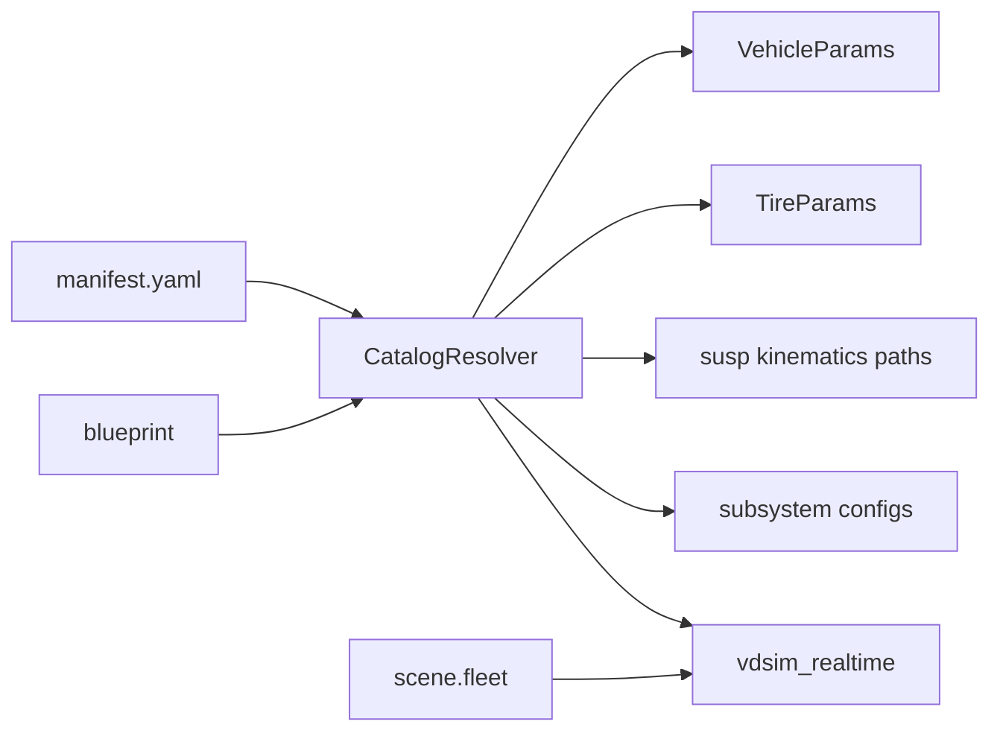

# Parts catalog, vehicle blueprint, and scene — config model (v0.3 cutover)

Status: **DRAFT** (2026-06-06). Target release: **v0.3.0**.

**Policy: big-bang only.** v0.2 stem paths (`configs/vehicles/*.yaml`, fleet
`vehicle`/`tire`/`front_susp` fields, simconfig v2 flat fleet, topology-only
suspension in runtime lists) are **removed in one release**. No dual-read, no
deprecation shims, no “fallback to old layout”. CI and examples migrate in the
same PR series.

Supersedes the data-layout portions of `V0.2_PLAN.md` WS4 and retires the v0.2
`configs/components/` split. Complements `SIM_CONFIG_ARCH.md` (execution modes,
comms, sensors-on-host) — scenarios here are **scene files** that reference
blueprints and maps.

---

## 1. Principle

| Layer | Question it answers | Mutable by |
|-------|---------------------|------------|
| **Part** | What is this physical component? | Parts library / import |
| **Vehicle blueprint** | Which parts form one car? | Vehicle builder |
| **Scene** | Where, who, on what map, how wired? | Scene editor |

Setup = **references only**. Scenes never embed Pacejka coefficients or hardpoints;
they point at part `id`s. The GUI/builder **authors YAML**; runtime **resolves**
parts into `VehicleParams`, tire models, kinematics attach paths, etc.

Distribution later: a **catalog package** = `manifest.yaml` + `parts/**` (+ optional
`blueprints/**`), installable beside the repo or from a URL.

---

## 2. Stack (one diagram)

```
parts/catalog/manifest.yaml
parts/<type>/<name>.yaml          ──┐
                                    ├──▶ blueprints/<name>.yaml ──┐
                                    │         (vehicle assembly)   │
maps/<name>.yaml ───────────────────┼────────────────────────────┼──▶ scenes/<name>.yaml
comms/<name>.yaml ──────────────────┘                            │
sensors/suites/<name>.yaml ────────────────────────────────────────┘
                                              │
                                              ▼
                                    vdsim_realtime --scene=...
                                    vdsim.Simulation("scenes/...")
                                    gui/server.py (authors + Play)
```

---

## 3. Part file — universal envelope

Every part file **must** have this header. Body schema depends on `type`.

```yaml
id: tire.sport_grip          # globally unique within a catalog install
type: tire                   # see §4
version: 1                   # integer, bump on breaking body change
schema: pacejka_mf96_v1      # parser / validator key
label: "Sport grip (demo)"   # GUI display
tags: [pacejka, demo]        # optional search

body:                        # type-specific payload (or file: for large blobs)
  # ...
```

Rules:

- **`id`** — dot-separated, stable across releases (`chassis.sedan`, `susp.dw_front_sports`).
  Scenes and blueprints reference **only `id`**, never filesystem paths.
- **`schema`** — selects deserializer (e.g. `pacejka_mf96_v1`, `kinematics_l3_native_v1`,
  `topology_preview_v1` for non-runtime preview-only assets).
- **`body`** — inline YAML or `body: { file: parts/tire/blobs/foo.yaml }` for large TIR exports.
- **Preview-only parts** (`topology_preview_v1`) — allowed in catalog for workshop 3D view;
  **resolver rejects** them for L3 attach (same rule as v0.2.3 `is_l3_kinematics_yaml`).

---

## 4. Part types (v0.3.0 minimum set)

| `type` | `schema` (initial) | Resolves to (runtime) |
|--------|-------------------|------------------------|
| `chassis` | `vehicle_params_v1` | `VehicleParams` mass/geom/aero/drive meta |
| `tire` | `pacejka_mf96_v1` | `TireParams` (+ optional `lugre:` block, `V0.2_TIRE_LUGRE.md`) |
| `susp_kinematics` | `kinematics_l3_native_v1` | L3 `attach_*_kinematics` YAML path |
| `susp_ride` | `spring_damper_v1` | per-corner k/c on `VehicleParams` (L2/L3) |
| `brake` | `brake_subsystem_v1` | WS1 brake module config (v0.3 wires L3) |
| `steering` | `steering_subsystem_v1` | ratio, deadtime |
| `drivetrain` | `drivetrain_v1` | `engine_rotational_inertia`, diff, ratios (`V0.2_DRIVETRAIN.md`) |
| `actuator` | `actuator_v1` | `ActuatorParams` |
| `sensor_suite` | `sensor_suite_v1` | `SensorParams` + mount list |

New types add a row + resolver branch; they do not change the envelope.

---

## 5. Vehicle blueprint

A blueprint is **not** a full vehicle YAML. It is an assembly manifest.

```yaml
id: vehicle.sedan_comfort
version: 1
label: "Sedan comfort package"
level: L2                    # L1 | L2 | L3 — dynamics ladder for this assembly

parts:
  chassis:           chassis.sedan
  tire:              tire.default_pacejka
  front_susp_kin:    susp.mp_front_sedan      # required when level: L3
  rear_susp_kin:     susp.ta_rear_sedan
  front_susp_ride:   ride.sedan_comfort
  rear_susp_ride:    ride.sedan_comfort
  brake:             brake.sedan_default
  steering:          steering.sedan_rack
  drivetrain:        drivetrain.generic_ev
  actuator:          actuator.identity
  sensors:           sensors.sedan_default    # optional default suite

overrides: {}                # optional dotted keys → last-wins on resolved params
```

Rules:

- **Required keys by level**
  - L1/L2: `chassis`, `tire`, `brake`, `steering`, `drivetrain`
  - L3: above + `front_susp_kin`, `rear_susp_kin` (ride parts optional but recommended)
- **No inline physics** in blueprints — only `parts` + `overrides`.
- Fleet **instances** in a scene may override individual part refs (see §6).

Resolver entry point (C++ / Python):

```text
ResolvedVehicle resolve_blueprint(blueprint_id, optional<PartOverrides> inst)
  → VehicleParams vp, TireParams tp, SuspPaths, SubsystemHandles, ...
```

---

## 6. Scene file

Replaces v0.2 `configs/scenarios/*.yaml` + GUI `simconfig v2` as the **single**
saved run description. Filename: `configs/scenes/<name>.yaml`.

```yaml
id: scene.two_vehicle_race
version: 1
label: "Two-car straight launch"

map: map.figure8                  # ref → configs/maps/map.figure8.yaml
path: map.figure8.centerline      # ref → path inside map or separate path id
comms: comms.gui_default            # ref → configs/comms/...

sim:
  rate: 200
  cmd_timeout: 0.1
  run_mode: rt_comms                # rt_comms | api  (SIM_CONFIG_ARCH §5)

environment:
  mu: 1.0
  grade: 0.0
  bank: 0.0

fleet:
  - id: 0
    blueprint: vehicle.sedan_comfort
    pose: { x0: -15, y0: -1.5, yaw0: 0, vx0: 12 }
  - id: 1
    blueprint: vehicle.sports_aggressive
    parts:                          # instance-level swap (optional)
      tire: tire.sport_grip
    pose: { x0: -15, y0: 1.5, yaw0: 0, vx0: 12 }

infra_sensors:                      # fixed world sensors (authoring → runtime v0.4+)
  - id: cam_tower_1
    type: camera
    pose: { x: 0, y: 0, z: 8, yaw: 0 }

maneuver:                           # optional — batch / ISO (existing experiments/)
  ref: maneuvers.step_steer
  params: { steer_deg: 5, t_start: 2.0 }
```

Priority for part values on one vehicle instance:

```text
catalog part defaults  <  blueprint.parts  <  fleet[].parts  <  fleet[].overrides
```

---

## 7. Repository layout (after cutover)

**Delete** (v0.3.0 removes these trees entirely):

| Removed | Replaced by |
|---------|-------------|
| `configs/vehicles/*.yaml` (monolithic) | `parts/chassis/*.yaml` + `blueprints/*.yaml` |
| `configs/tires/*.yaml` | `parts/tire/*.yaml` |
| `configs/suspensions/*.yaml` | `parts/susp_kinematics/*.yaml` (+ `parts/susp_topology/*.yaml` preview-only) |
| `configs/components/**` | `parts/susp_ride/*.yaml`, etc. |
| `configs/scenarios/*.yaml` | `configs/scenes/*.yaml` |
| GUI `simconfig` version 2 fleet stems | `scene` + `blueprint` ids |
| `/api/suspension/list` stem scan | `/api/catalog/parts?type=` |

**New layout:**

```text
configs/
  catalog/
    manifest.yaml              # index of all built-in part & blueprint ids
  parts/
    chassis/
    tire/
    susp_kinematics/
    susp_topology/             # preview-only; not attachable
    susp_ride/
    brake/
    steering/
    drivetrain/
    actuator/
  blueprints/
    sedan_comfort.yaml
    sports_aggressive.yaml
    ...
  maps/
    figure8.yaml               # unchanged role; may gain path refs
  scenes/
    two_vehicle_race.yaml
    l3_sedan_demo.yaml
  comms/
  sensors/
    suites/
  maneuvers/                   # optional ISO / driver refs
```

`manifest.yaml` (built-in catalog):

```yaml
catalog_id: vdsim.builtin
catalog_version: 1
parts:
  - id: chassis.sedan
    path: parts/chassis/sedan.yaml
  - id: tire.default_pacejka
    path: parts/tire/default_pacejka.yaml
  # ...
blueprints:
  - id: vehicle.sedan_comfort
    path: blueprints/sedan_comfort.yaml
packages: []                    # external packs: { id, version, root, sha256 }
```

External package (future):

```text
hyundai_sedan_pack/
  manifest.yaml                # declares package_id, depends, part ids
  parts/...
  blueprints/...
```

Install = merge manifests (builtin + N packages); **id collision is an error**, not override.

---

## 8. Runtime & GUI contract

### 8.1 CLI (breaking)

```bash
# REMOVED:
# vdsim_realtime configs/vehicles/sedan.yaml configs/tires/foo.yaml --level=L2

# NEW:
vdsim_realtime --scene=configs/scenes/two_vehicle_race.yaml
# optional overrides:
#   --catalog=configs/catalog/manifest.yaml
#   --rate=200 --cmd-port=7001 ...
```

Single-vehicle is `fleet.size() == 1` inside the scene — no separate flat CLI mode.

### 8.2 Resolver pipeline



On Play, GUI:

1. Load `catalog/manifest.yaml`
2. Validate scene (all ids exist, L3 kin parts are `kinematics_l3_native_v1`)
3. Write **ephemeral resolved bundle** under tmp (or pass ids to server if resolver moves C++)
4. Start `vdsim_realtime --scene=...`

### 8.3 HTTP API (breaking)

| Removed | New |
|---------|-----|
| `GET /api/suspension/list` | `GET /api/catalog/parts?type=susp_kinematics` |
| `GET /api/parts/registry` (stems) | `GET /api/catalog` (manifest + search) |
| `POST /api/simconfig` v2 fleet stems | `POST /api/scene` / `GET /api/scene/:id` |
| `save_scenario` → `configs/scenarios/` | `save_scene` → `configs/scenes/` |

Workshop editors open **`/api/catalog/parts/:id`** (GET/PATCH body), not raw vehicle yaml.

---

## 9. One-shot migration (v0.3.0 PR checklist)

No runtime support for old files after merge. Order:

1. **Add** `configs/parts/**`, `configs/blueprints/**`, `configs/catalog/manifest.yaml`.
2. **Script** `tools/migrate_v02_configs.py` (one-time, run in CI on branch):
   - Split each `vehicles/*.yaml` → `parts/chassis/<stem>.yaml` + default blueprint.
   - Move `tires/*` → `parts/tire/*` with envelope.
   - Move attachable `suspensions/*` → `parts/susp_kinematics/*`; topology → `parts/susp_topology/*`.
   - Convert `scenarios/*` → `scenes/*` with `blueprint:` refs.
3. **Update** all examples, ctest fixtures, `two_vehicle_race`, GUI defaults.
4. **Delete** old directories and all dual-read code paths (`susp_stem_from_ref` on raw
   paths, `fleet_spec[].vehicle` string stems, `VEHICLE_SUSP_DEFAULT`, etc.).
5. **Bump** simconfig export to **version 3** (scene document only — reject v2 import).

---

## 10. Validation rules (fail fast)

| Check | When |
|-------|------|
| Unknown `id` | load scene / blueprint |
| `susp_topology` in blueprint L3 kin slot | resolve |
| Duplicate `id` across packages | manifest merge |
| `level: L3` without kin parts | resolve |
| `schema` not registered | load part |
| Scene `fleet[].id` not unique | load scene |

Errors surface in GUI pre-launch (`kinematics_warnings` generalizes to `resolve_errors[]`).

---

## 11. Implementation phases (v0.3.0)

| Phase | Deliverable |
|-------|-------------|
| **M1** | `CatalogResolver` (C++ or Python), manifest, part envelope validator |
| **M2** | Migrate built-in configs + delete old trees; ctest green on new paths only |
| **M3** | `vdsim_realtime --scene=` only; remove flat vehicle+tire argv |
| **M4** | GUI catalog API + vehicle builder + scene save/load (simconfig v3) |
| **M5** | Docs, examples, `tools/import_part_pack` stub for external catalog zip |

WS1 (drivetrain/LuGre) lands as **new part types** in the same catalog — no second config system.

---

## 12. Open decisions (resolve before M1)

1. **Resolver language** — C++ only (server hot path) vs Python (GUI already) with resolved
   tmp yaml passed to C++. Recommendation: **Python resolver + tmp bundle** for v0.3.0,
   C++ `load_resolved_bundle()` in v0.3.1.
2. **Blueprint file location** — `configs/blueprints/` vs `parts/blueprint/` type.
   Recommendation: **`configs/blueprints/`** (assembly ≠ physical part).
3. **TIR / large imports** — `body.file` relative to part dir vs content-addressed `blobs/`.
4. **Map path** — inline in `maps/*.yaml` vs separate `paths/*.yaml` ids.

---

## 13. Related docs

| Doc | Relationship |
|-----|--------------|
| `SIM_CONFIG_ARCH.md` | run modes, comms, sensor `host` — **still valid** |
| `V0.2_DRIVETRAIN.md` | `drivetrain` part `schema` |
| `V0.2_SUBSYSTEMS.md` | brake/steering part bodies |
| `RUNTIME_ARCH.md` | GUI does not own plant; scene drives `vdsim_realtime` |

---

## 14. Example: end-to-end

**Part** `parts/tire/sport_grip.yaml`:

```yaml
id: tire.sport_grip
type: tire
version: 1
schema: pacejka_mf96_v1
label: Sport grip
body:
  # ... Pacejka coefficients (today's sport_grip.yaml contents)
```

**Blueprint** `blueprints/sports_aggressive.yaml`:

```yaml
id: vehicle.sports_aggressive
version: 1
level: L3
parts:
  chassis: chassis.sports
  tire: tire.sport_grip
  front_susp_kin: susp.dw_front_sports
  rear_susp_kin: susp.5link_rear_sports
  brake: brake.sports_default
  steering: steering.sports_quick
  drivetrain: drivetrain.sports_rwd
```

**Scene** `scenes/sports_solo.yaml`:

```yaml
id: scene.sports_solo
version: 1
map: map.figure8
comms: comms.gui_default
sim: { rate: 200, cmd_timeout: 0.1, run_mode: rt_comms }
environment: { mu: 1.0 }
fleet:
  - id: 0
    blueprint: vehicle.sports_aggressive
    pose: { x0: 0, y0: 0, yaw0: 0, vx0: 15 }
```

```bash
vdsim_realtime --scene=configs/scenes/sports_solo.yaml
```

---

*Cutover owner: v0.3.0 milestone. No legacy code paths after merge.*
