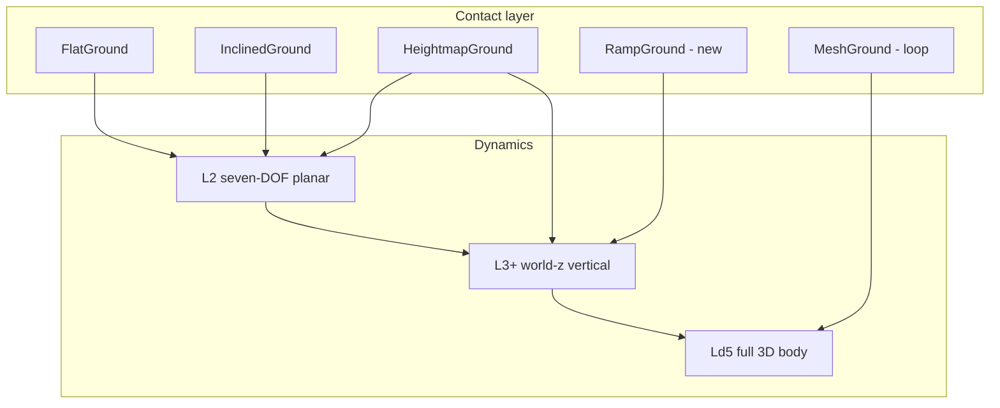

# v0.4 — slope & jump dynamics plan

Status: **M0–M5 implemented** (2026-06-05, branch `feat/v0.4-slope-jump-m5`).
Loop uses educative rail guide; free Ld5 remains in [`V0.4_PLAN.md`](V0.4_PLAN.md).
Jump spec to port: [`docs/tasks/T23_jump_14dof/REPORT.md`](../tasks/T23_jump_14dof/REPORT.md).

## 1. Goals

| Capability | User-visible outcome | Dynamics level |
|------------|----------------------|----------------|
| **Grade / bank** | Uphill, downhill, banked curve, heightmap terrain | L2 (now partial) → L3 ride follows surface |
| **Ramp jump** | Take-off, ballistic flight, landing impulses | L3+ world-z (T23 port) |
| **Vertical loop** | Inverted apex, mesh track | Ld5 (later in same v0.4 tag) |

Flat-road L2/L3 ISO behaviour stays **default and frozen**; slope/jump modes are
**opt-in** (`level=L3` + stunt scenario, or `level=L5` for loop).

## 2. Today (v0.3) — what works vs gaps

### Shipped

| Layer | Slope-related | Jump-related |
|-------|---------------|--------------|
| `IContactProvider` | `InclinedGround`, `HeightmapGround`, per-wheel `normal`, `position.z`, `road_dz` | `ContactPoint.is_valid` field exists |
| L2 (`seven_dof`) | Grade/bank gravity in quasi-static Fz; tire μ from contact | `is_valid` / penetration **not consumed** (comment ~L375) |
| L3 (`fourteen_dof`) | Heave/roll/pitch on **flat** z=0; `road_dz` roughness only | `g_z_effective ≈ 0`; tire always tied to z=0 → **no flight** |
| Runtime | GUI `road_grade` / `road_bank`; terrain.bin heightmap to cosim | T23 Python prototype + sanity checks only |
| Theory | ch.06 L3 small-angle vertical | T23 REPORT = C++ target spec |

### Gap summary

```text
  contact (z, normal, is_valid)
           │
           ▼
  L2 planar ──► uses μ, normal (partial); ignores airborne
           │
           ▼
  L3 vertical ──► perturbation about static eq; ground always z=0
```

**경사:** L2는 완만한 grade/bank에서 planar 주행 가능하나, L3 서스펜션·차고 z는
노면을 따라가지 않음. **점프:** 구조적으로 불가 (공중 Fz=0 분기 없음).

## 3. Target architecture



Per-wheel each step:

1. `ground->query()` → `z_road`, `n`, `is_valid`, `μ`, `road_dz`
2. **L2:** if `!is_valid` → Fx=Fy=0, skip quasi-static Fz; else forces in contact frame
3. **L3+:** `Fz_tire = max(0, k_tire · deflection)` with deflection from `z_road + r − z_u`
4. **Ld5:** same contact branch; body attitude from quaternion (no small-angle)

## 4. Build phases

### P0 — Contact contract (blocker for all)

**Files:** `seven_dof_dynamics.cpp`, `fourteen_dof_dynamics.cpp`, `contact_providers.cpp`

| Task | Detail |
|------|--------|
| Wire `is_valid` | Off-ground → no longitudinal/lateral tire force; no L2 quasi-static Fz split |
| Use `position.z` | Per-wheel road height (not hard-coded 0) |
| Surface normal | Long/lat tire axes from contact `normal` (already partial on L2) |
| `state.position.z` | Sprung CG world z published in STATE / FMI / Python |

**Exit:** unit test — wheel with `is_valid=false` → zero Fz contribution from that corner;
inclined contact → non-zero pitch tendency on steady climb (L2).

**ISO impact:** default flat L2/L3 ctest path unchanged (flat ground only).

---

### P1 — Grade & terrain (no jump)

**Goal:** drive on slope/bank/heightmap with credible load transfer; L3 ride follows surface.

| Task | L2 | L3 |
|------|----|----|
| Steady grade hold | verify + test 5–10 % grade coast / throttle | — |
| Heightmap | per-wheel z + normal from `HeightmapGround` | `ground_z[i]` into vertical EOM |
| Vertical gravity | — | option A: keep perturbation + road-following offset; option B: world-z (merges into P2) |
| GUI | grade/bank already in setup; terrain mesh preview | telemetry z, per-wheel Fz |

**Exit:** `tests/integration/test_grade_l2.cpp` — constant grade, monotonic z or speed change;
`tests/integration/test_terrain_l3.cpp` — heightmap bump, heave response, wheels stay in contact.

**Not in P1:** airborne, ramp lip, loop.

---

### P2 — Jump foundation (T23 → C++)

Port [`T23 REPORT`](../tasks/T23_jump_14dof/REPORT.md) into `fourteen_dof_dynamics.cpp` + L2 coupling.

| From (C++ L3 today) | To (L3+) |
|---------------------|----------|
| z perturbation about static eq | world z (sprung + unsprung) |
| `g_z_effective ≈ 0` | full `−g` on sprung & unsprung |
| tire `k·(−z_u)` vs z=0 | `max(0, k·((z_road+r)−z_u))` |
| linear spring only | droop stop + bump stop (progressive, not hard clip) |
| damper always on | damper off when spring topped-out (hanging wheel) |

**New provider:** `RampGround` — 1D profile (half-cosine + lip + cliff); reuse for T23 regression.

**Scenario:** `configs/scenarios/jump_ramp.yaml` (or `configs/maneuvers/`).

**Exit:** `tests/stunt/test_jump_l3.cpp` — five T23 sanity checks:

1. static Fz ≈ theory (±2 %)
2. ramp entry → front Fz spike + nose-up pitch
3. airborne interval → all Fz = 0
4. ballistic z_s vs time (spot check)
5. landing → front-before-rear Fz phasing

**ISO:** stunt suite isolated; no change to default ISO matrix.

---

### P3 — Ld5 full 3D (loop / extreme attitude)

Only required when **bank + jump + inverted apex** exceed L3 small-angle limits.

| Item | Notes |
|------|-------|
| New level `L5` / `Ld5_Full3D` | quaternion body; separate factory `create_full_3d()` |
| Tire | Pacejka/LuGre in wheel contact frame at arbitrary γ, inverted normal |
| Ground | `CurvedGround`, `MeshGround` for loop surface |
| Flat default | L2/L3 unchanged; `level=L5` opt-in |

**Exit:** jump regression on Ld5; loop MVP per `V0.4_PLAN.md` M5–M6.

## 5. Milestones (slope + jump track)

| # | Milestone | Phase | Delivers |
|---|-----------|-------|----------|
| M0 | Contact wired in L2 | P0 | `is_valid`, `position.z` |
| M1 | Grade L2 verified + tests | P1 | uphill/downhill coast |
| M2 | L3 follows heightmap | P1 | terrain ride |
| M3 | T23 jump in C++ | P2 | `test_jump_l3.cpp` green |
| M4 | RampGround + GUI preset | P2 | `jump_ramp.yaml`, stunt panel stub |
| M5 | Ld5 + loop | P3 | `vertical_loop.yaml` (see parent plan) |

Tag **v0.4.0** when parent [`V0.4_PLAN.md`](V0.4_PLAN.md) M1–M6 are green; M0–M4
are the **slope + jump** critical path.

## 6. Suggested implementation order

```text
P0 (contact) ──► P1a (L2 grade tests) ──► P2 (T23 / jump)
                    │
                    └──► P1b (L3 heightmap) ──► P2
                                              └──► P3 (Ld5 / loop)
```

**Parallel safe:** P1a after P0; T23 port design can start before P1b if interfaces frozen.

## 7. Parameters & YAML

New or extended `VehicleParams` (names TBD):

| Param | Role |
|-------|------|
| `spring_travel_compression_max` | bump stop engagement |
| `spring_travel_extension_max` | droop stop |
| `bump_stop_stiffness` / curve | progressive rubber (replace T23 hard clip) |
| `tire_vertical_stiffness` | already implicit; expose per corner if needed |

Scenes:

```yaml
# configs/scenes/jump_ramp_demo.yaml (sketch)
level: L3
ground: ramp
  profile: half_cosine
  height_m: 0.6
  lip_m: 0.4
  v0_mps: 15
```

## 8. Validation tiers

| Tier | Suite | Claim |
|------|-------|-------|
| Default | 210 ctest flat L2/L3 | ISO / analytic unchanged |
| Slope | `test_grade_*`, `test_terrain_*` | load transfer & ride on surface |
| Stunt | `tests/stunt/*` | jump phase / landing phasing (not quantitative peak Fz) |

Landing peak Fz: **phasing & relative magnitude only** (T23 REPORT — bump model educative).

## 9. Non-goals (this plan)

- V2V collision, corkscrew, track CAD editor
- Replacing default L3 for normal road sims
- Quantitative stunt load sign-off vs real vehicle
- Fz hunting / `ay_prev` LPF on L2 (not required for slope/jump)

## 10. Risks

| Risk | Mitigation |
|------|------------|
| P2 breaks flat L3 | stunt behind scenario flag; regression on flat path |
| L2 quasi-static Fz wrong on steep grade | cap grade in P1 scenarios; Ld5 for extreme |
| GUI scope | M4 = one ramp preset + telemetry, not full editor |
| LuGre landing grip | keep LuGre default before M5 loop |

## 11. Links

| Doc | Role |
|-----|------|
| [`V0.4_PLAN.md`](V0.4_PLAN.md) | Full v0.4 WS-A..E, loop MVP |
| [`T23_jump_14dof/REPORT.md`](../tasks/T23_jump_14dof/REPORT.md) | Jump numbers to regression |
| [`theory/06_ld3_fourteen_dof.md`](../theory/06_ld3_fourteen_dof.md) | Current L3 vertical model |
| [`ROADMAP.md`](../ROADMAP.md) | §1 dynamics ladder, §11 v0.4 |
| [`HANDOFF.md`](../HANDOFF.md) | Sprint entry |
