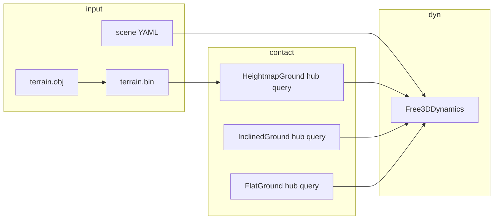

# VDSim v0.5 — terrain + L5 (arbitrary ground driving)

Status: **planning** (2026-06-06). Builds on v0.4 L5 `Free3DDynamics` + contact providers.

## 1. Product goal

**Rigid multibody-class chassis (6-DOF) driving on arbitrary ground** — not tied to
`stunt:` presets (ramp/loop). User loads terrain (baked heightmap or analytic slope),
sets `level: L5`, and the vehicle follows surface normal, heaves over bumps, and
can leave the ground on sharp drops.

This is **Tier A** from the product thread: L5 body + per-wheel 3D contact. Full
Ld4 link/bushing DAE remains **v0.6+** (`multibody.hpp` M1–M7).

## 2. Baseline (v0.4 entry)

| Asset | State |
|-------|--------|
| `Free3DDynamics` (L5) | Shipped — quat body, 4-wheel MF/LuGre, hub offset `r_body.z` |
| `HeightmapGround` | Shipped — bilinear H(x,y), per-wheel normal |
| `terrain.bin` → cosim | Shipped — GUI bake OBJ → `--terrain=` / `world.yaml` |
| L5 + `stunt_physics` without `stunt:` | Shipped — `realtime_server` sets world-z + `-g` |
| Heightmap + **L5 validated** | **Done (M1, 2026-06-09)** — `HeightmapGround` already hub-consistent (M0); `tests/integration/test_terrain_l5.cpp` proves no-sink + hill climb |
| Sample scene L5 + terrain | **Gap** (M3) |
| GUI Play on terrain + L5 | **Partial** — visual mesh yes; physics contact mismatch (M4) |

Flat L2/L3 ISO numbers stay **frozen** (no re-baseline).

> **M0/M1/M2 status (2026-06-09):** the hub-contact unification (M0) already shipped
> across FlatGround / SplitMu / Inclined / Rough / **Heightmap** — each uses
> `wheel_world_positions` + `hub_penetration`. So M1 reduced to closing the CI gap:
> `Terrain.L5NoSinkOnFlat`, `Terrain.L5ClimbsHill`, `Terrain.L5SettlesOnHillFlank`.
> M2 (drop / airborne): `Terrain.L5BriefAirOverCliff` — a step-down cliff makes the
> hub penetration go to 0 naturally, so the body goes airborne (Fz→0, no mid-air
> phantom load) and lands on the lower plateau; the optional `is_valid=false` cliff
> band was **not needed** (penetration=0 suffices). All synthetic in-memory grids,
> no `.bin` blobs. 270/270 ctest.
>
> **M3 (runtime + scene) done (2026-06-09):** the cosim runtime was already wired —
> `make_ground` loads a terrain `.bin`, `world_scenario` parses top-level `terrain:`,
> L5+terrain sets `stunt_physics`+substeps, and `settle_spawn_on_ground` runs. The
> gap was authoring: added `tools/bake_synthetic_hill.py` (writes the loader's
> int32/float64 grid format), `assets/terrain/hill_demo.bin` (61×41 Gaussian hill,
> 20 KB), `configs/scenes/terrain_hill_demo.yaml` (L5 fleet + `terrain:`), and made
> `materialize_scene_file` forward `terrain` (resolved to an absolute path) +
> `rough_amp/rough_wl/iso_class`. `scene_materialize` asserts the terrain path
> reaches the world YAML and exists; `vdsim_realtime --scene=<world>` runs headless
> with no load failure.
>
> **M5 (banked / inclined) done (2026-06-09):** `InclinedGround` was already
> hub-consistent. Added `Terrain.L5CoastUphillSlows` (grade bleeds speed vs flat) and
> `Terrain.L5BankInducesRoll` (banked plane → body settles to a roll attitude with the
> bank's sign, within [0.3, 2.0]×bank), plus `configs/scenes/banked_grade_demo.yaml`
> (L5, grade+bank → InclinedGround, no `.bin`). 272/272 ctest.
>
> **M5b (curved banked turn) done (2026-06-09):** new `CurvedGround` provider — a
> banked circular turn in x-y (radius R about a centre, banked inward by `bank`;
> height rises with radial distance, normal tilts centripetally). `create_curved_ground`
> + cosim `make_ground` branch (`stunt.ground == banked`) + `configs/scenes/
> banked_oval.yaml`. Test `Terrain.BankedTurnHoldsLine`: at the neutral speed
> `v_n = √(g R tan β)` with Ackermann steer the body corners around the turn and holds
> the radius (no slide-off). `scene_materialize` + headless `vdsim_realtime` smoke pass.
> 273/273 ctest.
>
> **M6 (docs + tag) done (2026-06-09):** CHANGELOG `[0.5.0]`, RUNNING.md terrain run
> section, theory ch.20, roadmap/handoff synced. **v0.5.0 scope = terrain + L5 for the
> headless / batch / cosim paths.** M4 (GUI terrain load + L5 Play) and M5c (GUI stunt
> authoring) are **deferred to v0.5.2** — they need in-browser verification and are not
> on the headless path. Tagged `v0.5.0`.

## 3. Scope

### In (v0.5.0)

- Hub-consistent contact for **Flat / Inclined / Heightmap / Ramp** when `level=L5`
- Headless + integration tests on **synthetic heightmap** (hill, ridge, drop)
- Catalog scene `terrain_hill_demo.yaml` (L5, terrain path or embedded analytic hill)
- GUI: terrain load + L5 fleet → Play without `stunt:` block
- Spawn settle: sample ground at `(x0,y0)`, place CG at `z_road + cg_height`
- STATE / telemetry: `position.z`, pitch, roll (already partial)

### Out (defer)

- Generic triangle **mesh raycast** (loop `MeshGround` only) → v0.6
- Ld4 bushing compliance / full multibody DAE → v0.6+
- L3 world-z on terrain (L5 is the terrain path)
- V2V collision, tire belt transient
- ISO maneuver re-baseline on terrain

## 4. Architecture



Per wheel each step (L5):

1. `ground->query()` → hub world position, `position.z` = road, `normal`, `penetration`, `is_valid`
2. `Fz = clamp(k·pen + c·vn, 0, Fz_cap)`; airborne if `!is_valid || pen≤0`
3. Fx/Fy in **wheel contact frame** from `normal` + body heading
4. Integrate 6-DOF body + wheel spin

## 5. Milestones (ship tag **v0.5.0** when M1–M6 green)

| ID | Name | Deliverable | Exit criteria |
|----|------|-------------|---------------|
| **M0** | Hub contact unification | Refactor ground queries to shared `wheel_world_positions()`; hub-based penetration `(road + n·R) − hub` | Unit test: flat spawn → zero net sink 5 s L5; existing Stunt + loop tests unchanged |
| **M1** | Heightmap L5 core | Fix `HeightmapGround`; `SolverParams` for L5+terrain (substeps); analytic `SyntheticHillGround` for CI | `Terrain.L5ClimbsHill`, `Terrain.L5NoSinkOnFlat` green |
| **M2** | Drop / airborne | Heightmap cliff or invalid band; respect `is_valid` | `Terrain.L5BriefAirOverCliff` — sum Fz &lt; threshold while airborne |
| **M3** | Runtime + scene | `configs/scenes/terrain_hill_demo.yaml`; `world.yaml` `terrain:` + `level: L5`; spawn z from height sample | `scene_materialize` + headless 30 s run completes |
| **M4** | GUI path | Map/terrain load + L5 Play; chase cam uses `position.z`; spawn on mesh | Manual checklist in §7 |
| **M5** | Banked / inclined | `InclinedGround` hub path; optional `banked_grade_demo.yaml` (L5, grade+bank) | `Terrain.L5CoastUphillSlows` (reuse Stunt grade idea on L5) |
| **M5b** | Curved banked track (from v0.4 M3) | `CurvedGround` (arc/spline segment; per-wheel z + surface normal); `banked_oval.yaml` (cornering on bank, L3+/L5); min-speed pass/fail check | `Terrain.BankedOvalHoldsLine` (sustained corner on bank, no slide-off) |
| **M5c** | GUI stunt authoring (from v0.4 WS-D) | setup panel to *author* ramp/loop/banked scenes (height, loop R, entry-speed hint `v_min≈√(5gR)`), not just render | manual checklist; scene saves + reloads |
| **M6** | Docs + gate | `RUNNING.md` § terrain L5; theory cross-link ch.13; **ctest green** | Tag `v0.5.0` |

**Critical path:** M0 → M1 → M2 → M3 → M4. M5 / M5b / M5c parallel after M0. M6 last.

> **Moved from v0.4 (2026-06-09):** M5b `CurvedGround` + `banked_oval` and M5c GUI stunt
> authoring were planned under v0.4 (M3 / WS-D) but descoped — curved banked track belongs
> with terrain, and stunt scenes are currently render-only (no authoring UI). See
> [`V0.4_PLAN.md`](V0.4_PLAN.md) "Confirmed gaps at v0.4 close".

## 6. Test plan (new integration suite `tests/integration/test_terrain_l5.cpp`)

| Test | Setup | Assert |
|------|--------|--------|
| `L5NoSinkOnFlat` | Flat ground, L5, cg at `cg_height`, coast 4 s | `\|Δz\| < 0.04` m |
| `L5ClimbsHill` | Synthetic hill: H = h_max·exp(−((x−xc)²+(y−yc)²)/σ²), drive + throttle | `z_peak > z0 + 0.3` m |
| `L5FollowsSurfaceNormal` | Inclined plane grade=0.08, L5 | pitch qs sign matches grade; `\|vx\|` decreases uphill coast |
| `L5BriefAirOverCliff` | 1D heightmap: plateau → step down 0.5 m at x=x_cliff | airborne interval; no phantom Fz mid-air |
| `L5SpawnSettleOnHeightmap` | spawn above hill | after settle, all wheels `pen>0` or valid contact |

Synthetic hill provider lives in test helper or `contact_providers` `#ifdef` test factory — avoid committing large `.bin` blobs.

## 7. GUI manual checklist (M4)

- [ ] Load `terrain_hill_demo` or bake small OBJ → terrain visible
- [ ] Fleet **L5**, no `stunt:` in scene
- [ ] Play: vehicle sits on surface (not floating / not sinking)
- [ ] Drive uphill: speed drops vs flat; pitch telemetry non-zero
- [ ] Sharp edge (if in demo mesh): brief hop, no mud-sink on landing

## 8. Sample scene sketch

```yaml
# configs/scenes/terrain_hill_demo.yaml
id: scene.terrain_hill_demo
version: 1
label: Terrain hill (L5)
rate: 200
mu: 1.0
road:
  terrain: assets/terrain/hill_demo.bin   # or relative path resolved at materialize
fleet:
- id: 0
  blueprint: vehicle.sedan_comfort
  level: L5
  # tire: blueprint default = LuGre (default tire). Override to
  # tire.kinematic_fallback only as an opt-in escape hatch on a steep demo.
  x0: 0.0
  y0: 0.0
  z0: 0.55          # overridden by settle from terrain sample
  yaw0: 0.0
  vx0: 12.0
```

Ship a **small analytic hill** `.bin` in `assets/terrain/` (≤ 64×64) generated by
`tools/bake_synthetic_hill.py` (new, no confidential data).

## 9. Implementation notes

### M0 — contact

- `HeightmapGround`, `FlatGround`, `InclinedGround`, `SplitMuGround`: use same hub
  offset as `RampGround` / L5 (`wheel_world_positions`).
- Penetration: `max(0, (road_pt + n·R − hub)·n)` (Ramp pattern).
- L2/L3 paths: verify no ISO number drift on flat default scenes.

### M1 — L5 + terrain flags

- `realtime_server`: if `level=L5` && `terrain` non-empty → `stunt_physics=true`,
  `max_substep_dt=1e-4`, `max_substeps=24` (match stunt_world).
- Rename internal flag later (`world_z_physics`); v0.5 keep behaviour only.

### M2 — airborne on heightmap

- Optional: mark `is_valid=false` when hub height &gt; road + `kAirReach` (reuse ramp
  lip pattern) for cliff cells with large downward gradient.

### Non-goals reminder

- Suspension travel DOF on L5 → v0.5.2 or v0.6 (optional unsprung 4-state on L5 body).

## 10. v0.6 preview (do not block v0.5)

| Item | Notes |
|------|--------|
| L5 + unsprung vertical 4-DOF | Ride on terrain without full Ld4 |
| Generic mesh contact | Loop mesh generalised |
| Ld4 M3 compliance | Force-dependent toe/camber |
| CARLA bridge L5 + heightmap | ego on UE terrain |

## 11. Risks

| Risk | Mitigation |
|------|------------|
| Hub refactor breaks L3 ISO | Run full ctest; flat L3 unchanged if hub offset only in L5 query path |
| LuGre on steep terrain | **LuGre stays the default tire**; stabilize via substep (1e-4×24) + Fz cap. `kinematic_fallback` is an opt-in escape hatch only if a specific steep demo destabilizes — not the default. |
| Large terrain dt instability | substep 1e-4×24 for L5+terrain |
| GUI/cosim spawn z wrong | `settle_spawn_on_ground` + height sample at spawn xy |

## 12. References

- [`V0.4_SLOPE_JUMP_DYNAMICS.md`](V0.4_SLOPE_JUMP_DYNAMICS.md) — contact target architecture
- [`V0.4_PLAN.md`](V0.4_PLAN.md) — L5 origin
- [`theory/13_multibody_outlook.md`](../theory/13_multibody_outlook.md) — long-term Ld4/Ld5
- `core/src/free_3d_dynamics.cpp`, `core/src/contact_providers.cpp`
