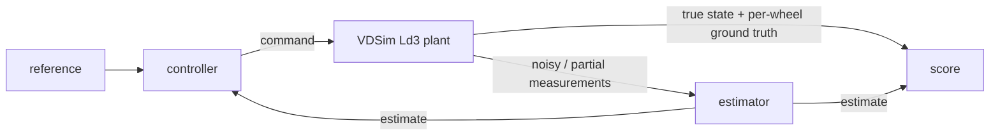

# Pattern: estimator-in-the-loop

**Using VDSim as the truth plant to grade a state estimator or controller.**

This is a *usage pattern*, not a benchmark result. No accuracy numbers are claimed here;
the point is the experimental structure.

## The problem

A state estimator (for example a body-slip β or tire-force observer), and the controller
that consumes it, are usually designed on a low-order model such as the
[Ld1 bicycle](../theory/04_ld1_bicycle.md). That model is cheap and differentiable, but
friction-blind. The question that decides whether the estimator is trustworthy is: *does
it still track when the plant leaves the linear region?*

VDSim answers it by being the plant the estimator is graded against, with per-wheel
ground truth the estimator never sees but you can score against.

## The loop

1. **Design** the estimator and controller on Ld1 or a linear model.
2. **Run** the closed loop with Ld3 as the plant (dynamic load transfer, combined-slip
   saturation).
3. **Measure** estimation error against the plant's true β, per-wheel slip angle,
   lateral force and normal load — quantities a test vehicle cannot observe cleanly but
   the simulator exposes exactly. Field names: [Experiment API](../EXPERIMENT_API.md).
4. **Sweep** μ and manoeuvre severity to find where the estimator's linear assumptions
   break. A sweep is one declaration with the campaign runner
   ([design note](../design/BATCH_RUNNER.md)).

## Why VDSim fits

- **Per-wheel ground truth** gives an unambiguous scoring target: the estimator is
  graded against the actual forces, not against another estimate.
- **Determinism** makes an A/B between two estimators causal: same plant, same
  disturbances, only the estimator changes.
- **The fidelity ladder** lets you design on Ld1 and grade on Ld3 with a one-line level
  change; the divergence is the gap the estimator must survive.
- Mind the rung limits in [Assumptions & limitations](../ASSUMPTIONS.md): pitch and
  roll converge first-order in the substep size, so check convergence before scoring on
  them.

## Honesty note

This page describes how to set up the experiment. A specific accuracy result must be
produced and reported with its configuration, metric and a reproduce command, as in
[Validation](../VALIDATION.md). None is asserted here.
