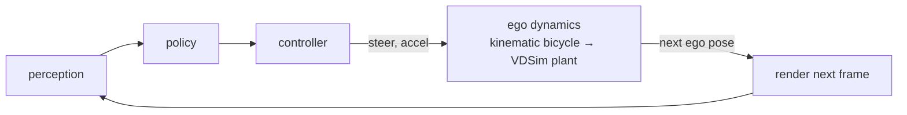

# Pattern: VDSim as the ego plant inside an external benchmark

**Replacing a kinematic ego model with a friction-aware plant, and changing nothing else.**

This is a *usage pattern*. It makes no benchmark claim and shows no result numbers:
the repository does not yet contain a script that reproduces one, and a number without
a reproduce command is not a result ([Validation](../VALIDATION.md)).

## The setup

Many closed-loop driving benchmarks propagate the ego vehicle with a **kinematic
bicycle model**. One example is NeuroNCAP[^nc], an open closed-loop safety benchmark
whose authors state that its ego model ignores delays, friction, suspension and road
surface. That is a reasonable simplification for a perception benchmark. It is also
exactly the assumption VDSim exists to test: a manoeuvre the kinematic ego executes
perfectly may be infeasible on real tyres at real grip.

## The idea

Keep the whole loop — renderer, policy, controller, scenarios — and swap only the block
that turns a command into motion.

Everything else is unchanged, so any difference in outcome is attributable to the
dynamics substitution alone.

## What to measure, in order

Keep the claims in separate layers and do not quote a higher layer from a lower one.

| Layer | Question | What it needs |
|---|---|---|
| 1 — open-loop replay | Is an identical steer profile feasible on the kinematic model but not on VDSim at lower μ? | one recorded steer profile, a μ sweep |
| 2 — simple closed loop | Does a feedback planner driving VDSim hit a μ-dependent feasibility boundary? | a stub planner in the loop |
| 3 — full benchmark | Does a real driving policy's benchmark score change under VDSim dynamics? | the full rendered closed loop |

The expected direction is that lower grip shrinks the avoidance margin the kinematic
ego reports. The size of that effect depends on vehicle parameters and on the
manoeuvre, so publish it only together with the configuration and a reproduce command.

[^nc]: A. Tonderski et al., *NeuroNCAP: Photorealistic Closed-loop Safety Testing for
    Autonomous Driving*, arXiv:2404.07762. NeuroNCAP is MIT-licensed. This page is an
    independent usage note and is not affiliated with or endorsed by its authors.
