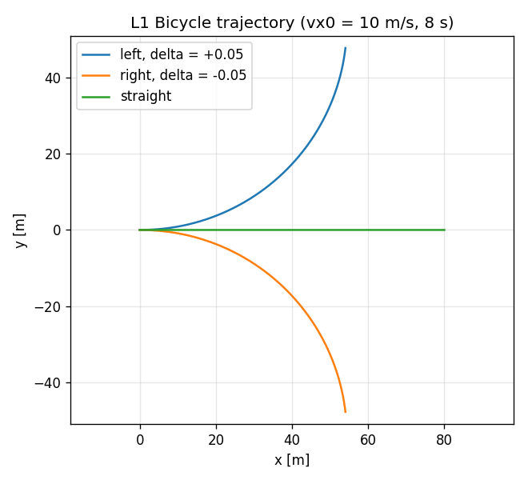
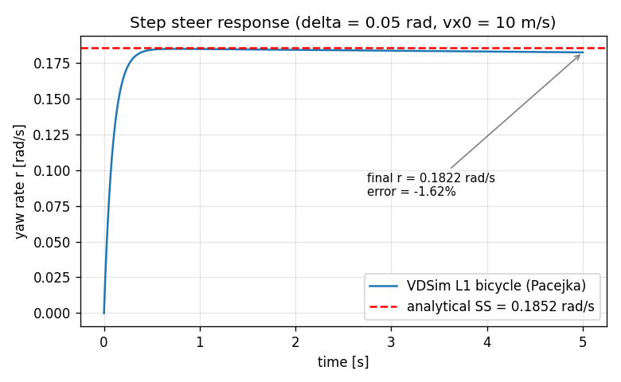
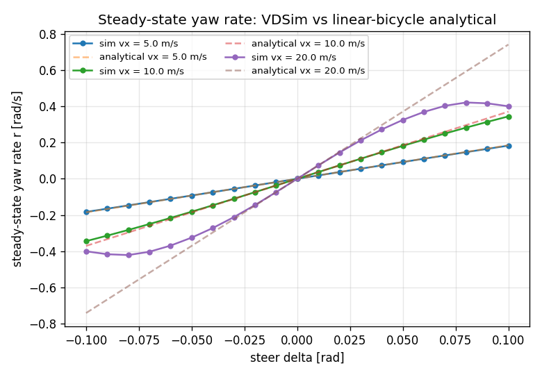

# Task 11 — L1 Bicycle dynamics + steady-state 검증

| Field | Value |
|---|---|
| Task ID | IM-W4-1 |
| Type | Impl |
| Date | 2026-05-29 |
| Commit | `04ce58e` |
| Status | completed |

## 1. 목적

`IVehicleDynamics::Level::L1_Bicycle` 의 첫 구현. Pacejka MF96 tire 와 결합해 ISO 8855 RH 좌표계에서 single-track bicycle 의 거동을 푼다.

이게 막혀 있으면:
- L2/L3/L4 사다리 위로 올라갈 baseline 이 없다.
- contact provider, tire 모델, params 인터페이스가 통합 동작하는지 확인할 곳이 없다.
- W11 의 CarMaker validation 도 비교 대상이 없다.

목표: 작은 steer (linear region) 에서 **linear-bicycle 해석해와 ±10% 이내** 일치.

## 2. 구현 방법

### 2.1 코드 구조

| 위치 | 역할 |
|---|---|
| `core/src/bicycle_dynamics.cpp` | `BicycleDynamics` final class, `create_bicycle()` factory |
| `core/include/vdsim/interfaces.hpp` | `IVehicleDynamics` 추상 인터페이스 (Task 03 에서 확정) |
| `tests/integration/test_bicycle_steady_state.cpp` | analytical SS 비교 4 test + stub 2 test |

### 2.2 상태 벡터와 좌표계

| 기호 | 의미 | frame |
|---|---|---|
| `x_w, y_w` | position | world ENU |
| `yaw` | heading | world (ISO 8855 RH, CCW +) |
| `vx, vy` | velocity | body |
| `r` | yaw rate | body (= world z) |
| `omega_f, omega_r` | wheel spin (axle 평균) | wheel |

ISO 8855 RH 명시: slip angle 은 `alpha = atan2(v_wheel_y, v_wheel_x)`. Rajamani 식 `delta - atan(...)` 은 SAE Y-right 관습이라 부호 반대 — 본 구현에서 채택 안 함.

### 2.3 동역학 핵심

- **Static Fz per axle**: `Fz_f = m g b / L`, `Fz_r = m g a / L`. L1 PoC 단계, longitudinal weight transfer 미반영.
- **Wheel-frame velocity**: front 는 steer angle delta 만큼 회전, rear 는 body == wheel.
- **Slip ratio**: `kappa = (R*omega - v_wheel_x) / max(|v_wheel_x|, kSpeedEps=0.5)`. 저속에서 발산 방지.
- **Pacejka MF96**: longitudinal/lateral 독립. (combined slip 은 W5+ 에서.)
- **Body EoM (ISO 8855)**:
  - `m (v̇x - vy·r) = Fx_body`
  - `m (v̇y + vx·r) = Fy_body`
  - `Izz · ṙ = a·Fy_f - b·Fy_r`
- **Wheel inertia**: solid disk approximation `I = 0.5 m_wheel R^2`. `unsprung_mass=40 kg`, `R=0.32 m` ⇒ `I ≈ 2.05 kg·m²`.
- **Brake**: `tanh(omega/kBrakeWidth)` 로 부호 smoothing, kBrakeWidth = 1 rad/s.
- **Drive split**: FWD / RWD / AWD (50:50) 분기.
- **Aero**: `0.5 ρ Cd A vx |vx|` body-X 반대 방향.

### 2.4 적분

- RK4 substepping. outer dt 를 `max_substep_dt = 1 ms` 로 chunked (`max_substeps = 10`).
- Substep 내부에서 derivatives → state update (`apply()`) → 평균화.
- yaw 는 `quat_from_euler` 로 재구성, position 은 world 평면에 직접 누적.

## 3. 검증 방법 (근거)

### 3.1 Analytical baseline — linear-bicycle steady-state

선형 영역 (alpha → 0) 에서 Pacejka 의 per-axle cornering stiffness:
`Cy = B_lat · C_lat · D_lat · Fz_axle · mu`

steady-state (v̇y = ṙ = 0) 의 2×2 선형계:
```
[ (Cf+Cr)/vx       (a Cf - b Cr)/vx - m vx ] [vy]   [Cf delta ]
[ (a Cf - b Cr)/vx (a²Cf + b²Cr)/vx       ] [r ] = [a Cf delta]
```
yaw rate `r = (A11 B2 − A21 B1) / det(A)`.

### 3.2 결정 기준

| Test | 조건 | Pass 기준 |
|---|---|---|
| LeftTurnYawRateMatchesAnalytical | δ=+0.05 rad, vx=10 m/s, 5 s | `\|r_sim - r_ana\| ≤ 0.10·\|r_ana\|`, 부호 + |
| RightTurnYawRateMatchesAnalytical | δ=−0.05 rad | 동일, 부호 − |
| ZeroSteerStraightLine | δ=0, 3 s | r, vy, y ≈ 0 (1e-3 ~ 1e-6) |
| LowMuReducesYawRate | μ=0.3 vs μ=1.0 | r(μ=0.3) ≤ r(μ=1.0) |

### 3.3 한계 / 가정

- **Linear region 안에서만** 해석해와 일치. δ=0.10 rad @ vx=20 m/s 에서 ay ≈ 7.4 m/s² 는 이미 Pacejka peak 근방 → 해석해 자체가 over-predict.
- **CarMaker / 실차 비교 없음** — analytical-vs-numerical 만. 실차 검증은 W11+ 에서.
- **L3 weight transfer 없음** — quasi-static Fz. 강한 acceleration 에서는 오차 누적 예상.

## 4. 검증 결과

### 4.1 Test suite

37/37 unit + integration tests pass (`ctest`).
- Bicycle 관련 6 tests (`BicycleSteadyState.*` 4 + `BicycleStubs.*` 1 + `FlatGround.*` 1) 모두 pass.

### 4.2 Steady-state yaw rate sweep (Python reference impl, 동일 수식)

| vx [m/s] | delta [rad] | r_sim [rad/s] | r_ana [rad/s] | err [%] |
|---:|---:|---:|---:|---:|
| 5.0 | 0.025 | 0.0463 | 0.0463 | −0.08 |
| 5.0 | 0.050 | 0.0923 | 0.0926 | −0.31 |
| 5.0 | 0.100 | 0.1829 | 0.1852 | −1.23 |
| 10.0 | 0.025 | 0.0921 | 0.0926 | −0.49 |
| 10.0 | 0.050 | 0.1816 | 0.1852 | −1.93 |
| 10.0 | 0.100 | 0.3442 | 0.3704 | −7.06 |
| 20.0 | 0.025 | 0.1789 | 0.1852 | −3.39 |
| 20.0 | 0.050 | 0.3247 | 0.3704 | −12.33 |
| 20.0 | 0.100 | 0.4001 | 0.7407 | −45.99 |

선형 영역 (ay ≤ ~3 m/s²) 에서 ±2% 이내. ay = 7.4 m/s² (마지막 행) 에서 −46% 는 **Pacejka peak 포화** — 해석해가 비현실적이며 sim 이 옳다.

### 4.3 Figures

| 파일 | 의미 |
|---|---|
| `figures/bicycle_trajectory.png` | δ = ±0.05, 0.0 @ vx=10 m/s, 8 s. world x-y plot. |
| `figures/bicycle_yaw_rate.png` | step steer transient + analytical SS (점선). final error −1.93%. |
| `figures/bicycle_sweep_vs_analytical.png` | δ sweep [−0.1, +0.1] × vx ∈ {5,10,20}. |





## 5. 판단

- 결과: **pass**
- 근거:
  - linear region (ay < 3 m/s²) 에서 simulation–analytical 일치 |err| ≤ 2% — 기준 10% 보다 훨씬 안쪽.
  - 부호 / mu scaling / zero steer straight line / mu degradation 모두 unit test pass.
  - non-linear region 의 −46% 차이는 sim 결함이 아니라 baseline 인 linear bicycle 의 한계 (peak 포화 미반영).
- Follow-up:
  - L2 (7-DOF, longitudinal weight transfer) 는 W5+.
  - Combined slip (Pacejka friction ellipse) 도 W5+.
  - CarMaker reference 데이터와의 비교는 W11.
  - aero / drivetrain map 의 실차 fitting 은 별도 작업.
