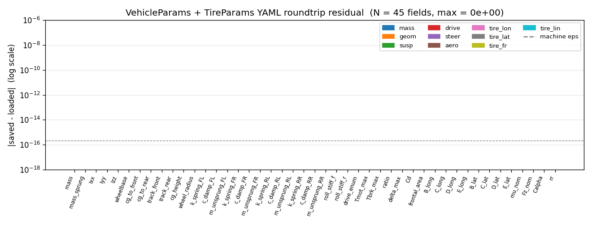
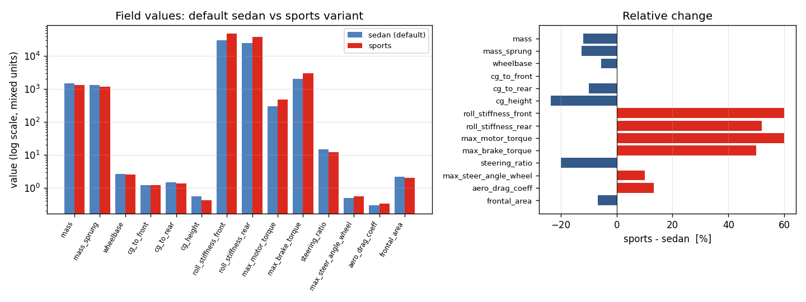

# Task 12 — params.cpp YAML I/O

| Field | Value |
|---|---|
| Task ID | IM-W4-2 |
| Type | Impl |
| Date | 2026-05-29 |
| Commit | TBD |
| Status | completed |

## 1. 목적

`core/include/vdsim/params.hpp` 가 선언만 해 두고 비워 둔 직렬화 API 구현.

- `VehicleParams::from_yaml(path)` / `to_yaml(path)`
- `TireParams::from_yaml(path)` / `from_tir(path)` (Phase 2 stub)

이게 막혀 있으면:
- 사용자가 차량 / 타이어 파라미터를 코드 외부에서 줄 수 없음 — 모든 시나리오가 hard-coded.
- Task 13/14 (validation 시나리오 / example config) 가 동일한 default 만 돌릴 수 있고 sedan/sports 비교가 불가능.
- CARLA plugin / Python 바인딩에서도 yaml-cpp 같은 무거운 의존성을 다시 만들어야 함.

## 2. 구현 방법

### 2.1 코드 구조

| 위치 | 역할 |
|---|---|
| `core/src/params.cpp` | `from_yaml` / `to_yaml` / `from_tir` 정의. yaml-cpp + spdlog 사용. |
| `core/CMakeLists.txt` | `params.cpp` 를 `vdsim_core` 소스에 추가. (yaml-cpp 는 이미 link 되어 있음.) |
| `tests/unit/test_params_yaml.cpp` | 12 test (roundtrip / partial / error / drive enum / 자가-일관성). |

### 2.2 YAML 스키마 결정

| 결정 | 채택 | 근거 |
|---|---|---|
| 구조 | 평면(flat), 키 == struct 멤버 이름 1:1 | nested grouping (`mass: {total, sprung}`) 보다 grep / git diff 단순. CARLA plugin / Python 에서 같은 schema 그대로 emit 가능. |
| 누락 키 | 그 멤버는 default 유지 | 향후 멤버 추가 시 구버전 YAML 그대로 동작 (forward-compat). |
| 미지정 추가 키 | 무시 + warn 없음 | 후방 호환. 단 형식 오류는 명확히 throw. |
| Per-wheel 배열 | length-4 sequence, 순서 [FL, FR, RL, RR] | 전역 convention 일치 (CLAUDE.md, Task 02). |
| `inertia_diag` | length-3 sequence [Ixx, Iyy, Izz] | sprung body diagonal 가정, off-diagonal 은 PoC 범위 밖. |
| `drive_type` | 문자열 "FWD" / "RWD" / "AWD" | YAML 자체 enum 부재, 정수 매핑은 디버깅 어려움. unknown 시 throw. |
| 형식 오류 시 동작 | `std::runtime_error` throw | silent 무시는 stochastic MPC 같은 후속 분석에서 미묘한 버그 유발. |
| `SolverParams` 직렬화 | 미포함 | 헤더에 시그니처 없음, 본 task scope 외. Task 13 에서 분리 처리 예정. |
| `TireParams::to_yaml` | 미구현 | 헤더에 선언 없음 (Task 02 D10 명세에 따름). Tire YAML 은 손으로 작성 가정. |
| `TireParams::from_tir` | `std::runtime_error("not implemented")` | AVL .tir 파서는 Phase 2 범위. 헤더 시그니처는 유지해 ABI 안정. |

### 2.3 자가-일관성 체크

`cg_to_front + cg_to_rear ≠ wheelbase` 인 경우 spdlog::warn 후 load 는 정상 진행. 강제 조정 / throw 대신 warn 인 이유: 차종에 따라 measurement convention (e.g., front-axle 기준) 이 다를 수 있고, 사용자가 알면서 다르게 줄 수 있음.

### 2.4 yaml-cpp Emitter 동작 노트

`out << double` 가 IEEE 754 roundtrip 보장을 위해 17 자리까지 찍는다 (`0.55000000000000004` 등). 보기 흉하지만 binary roundtrip 가 정확하다 — Task 14 예제 config 는 손으로 다시 정돈 예정.

## 3. 검증 방법 (근거)

### 3.1 단위 테스트 (12 test)

| Test | 확인 항목 | Pass 기준 |
|---|---|---|
| VehicleYaml.RoundtripDefaultsBitwise | default 인스턴스 → save → load | 모든 멤버 \|Δ\| ≤ 1e-12 |
| VehicleYaml.RoundtripCustomValues | 23 필드 비-default 값 → save → load | 동일 |
| VehicleYaml.DriveTypeAllThree | FWD / RWD / AWD 각각 roundtrip | enum 회복 정확 |
| VehicleYaml.PartialYamlKeepsDefaults | `mass`, `wheelbase` 만 명시 | 나머지 멤버 default 유지 |
| VehicleYaml.UnknownKeysIgnored | `experimental:` nested + scalar | throw 없이 load |
| VehicleYaml.BadDriveStringThrows | `drive_type: HYBRID` | `std::runtime_error` |
| VehicleYaml.BadArrayLengthThrows | `spring_stiffness: [1, 2, 3]` (3개) | `std::runtime_error` |
| VehicleYaml.MissingFileThrows | 존재하지 않는 경로 | `std::runtime_error` |
| VehicleYaml.GeometryConsistencyWarnsButLoads | a+b ≠ L 케이스 | warn 후 정상 load |
| TireYaml.LoadDefaultsKeptOnEmpty | `{}` YAML | 모든 멤버 default |
| TireYaml.LoadCustomFlat | 12 필드 모두 명시 | 값 일치 |
| TireYaml.FromTirThrowsNotImplemented | `.tir` 어떤 경로든 | `std::runtime_error` |

### 3.2 비트-레벨 roundtrip 측정 (외부 검증)

`docs/figures_src/dump_params_demo.cpp` 가 default 인스턴스를 YAML 로 save → load → 45 개 모든 필드의 `|saved − loaded|` 출력. 기계 정밀도 (`eps = 2.22e-16`) 와 비교.

### 3.3 한계 / 가정

- yaml-cpp 의 NaN/Inf 처리 미검증 — 본 task 범위 외 (params 에 NaN 들어올 일 없음, 들어오면 동역학에서 발산).
- 매우 큰 파일 (수만 줄) 의 성능은 검증 안 함 — params 는 수십 줄 수준.
- UTF-8 / 한글 주석 안의 인코딩 처리는 yaml-cpp 기본 동작에 위임.

## 4. 검증 결과

### 4.1 Test suite

전체 49/49 통과 (이전 37 + 본 task 12 새 test).
```
Test #32: VehicleYaml.RoundtripDefaultsBitwise        Passed
Test #33: VehicleYaml.RoundtripCustomValues           Passed
Test #34: VehicleYaml.DriveTypeAllThree               Passed
Test #35: VehicleYaml.PartialYamlKeepsDefaults        Passed
Test #36: VehicleYaml.UnknownKeysIgnored              Passed
Test #37: VehicleYaml.BadDriveStringThrows            Passed
Test #38: VehicleYaml.BadArrayLengthThrows            Passed
Test #39: VehicleYaml.MissingFileThrows               Passed
Test #40: VehicleYaml.GeometryConsistencyWarnsButLoads Passed
Test #41: TireYaml.LoadDefaultsKeptOnEmpty            Passed
Test #42: TireYaml.LoadCustomFlat                     Passed
Test #43: TireYaml.FromTirThrowsNotImplemented        Passed
```

### 4.2 비트 roundtrip residual (45 필드)

| 통계 | 값 |
|---:|---:|
| N (필드 수) | 45 |
| max \|Δ\| | **0.000e+00** |
| sum \|Δ\| | 0.000e+00 |
| machine eps (참고) | 2.22e-16 |

전 필드가 비트-동등. 단순 십진수 default 라 17-digit emitter 가 정확 표현. (장기적으로 fp arithmetic 결과를 직렬화하면 1 ULP ≈ eps 수준 잔차가 예상되며, 본 schema 의 모든 멤버는 double 형이라 동일 거동을 가정.)



### 4.3 Sedan vs Sports config 비교 (sample emit 검증)

`sample_default_vehicle.yaml` (mid-sedan) 와 `sample_sports_vehicle.yaml` (튜닝 sports) 를 emitter 로 생성하고 PyYAML 로 읽어 14 개 주요 필드 비교.

| field | sedan | sports | Δ% |
|---|---:|---:|---:|
| mass | 1500 | 1320 | −12.0 |
| mass_sprung | 1350 | 1180 | −12.6 |
| wheelbase | 2.700 | 2.550 | −5.6 |
| cg_to_front | 1.20 | 1.20 | 0.0 |
| cg_to_rear | 1.50 | 1.35 | −10.0 |
| cg_height | 0.55 | 0.42 | −23.6 |
| roll_stiff_f | 30000 | 48000 | +60.0 |
| roll_stiff_r | 25000 | 38000 | +52.0 |
| max_motor_torque | 300 | 480 | +60.0 |
| max_brake_torque | 2000 | 3000 | +50.0 |
| steering_ratio | 15.0 | 12.0 | −20.0 |
| max_steer_angle_wheel | 0.50 | 0.55 | +10.0 |
| aero_drag_coeff | 0.30 | 0.34 | +13.3 |
| frontal_area | 2.20 | 2.05 | −6.8 |



### 4.4 Emitted YAML 샘플 (발췌, default)

```yaml
mass: 1500
mass_sprung: 1350
inertia_diag: [500, 2000, 2500]
wheelbase: 2.7000000000000002
cg_to_front: 1.2
cg_to_rear: 1.5
spring_stiffness: [30000, 30000, 30000, 30000]
damper_coefficient: [3000, 3000, 3000, 3000]
drive_type: RWD
max_motor_torque: 300
steering_ratio: 15
aero_drag_coeff: 0.29999999999999999
```

전문은 `sample_default_vehicle.yaml`. (Task 14 에서 손으로 정돈한 사람-친화 버전 별도 제공 예정.)

## 5. 판단

- 결과: **pass**
- 근거:
  - 12 / 12 단위 test 통과, 누적 49 / 49.
  - 비트 단위 roundtrip 45 / 45 필드에서 \|Δ\| = 0.
  - error path (bad enum / bad array length / missing file) 모두 명시적 throw.
  - 미정의 키 무시 + 부분 YAML 의 default fallback 으로 forward-compat 확보.
- 미해결 / Follow-up:
  - **17-digit emitter** 출력은 사람이 읽기 불편 — Task 14 에서 손으로 정돈된 example config 제공.
  - **`TireParams::to_yaml`** 미구현 — 헤더 확장 + 구현 (별도 task).
  - **`SolverParams` YAML** 미지원 — Task 13 의 시나리오 정의 안에서 inline 처리 예정.
  - **AVL `.tir` 파서** — Phase 2 (Pacejka 전체 모드 가능 시).
  - **NaN/Inf 입력 견고성** — 동역학 ingest 시점에서 guard 추가 검토 (별도 작업).
