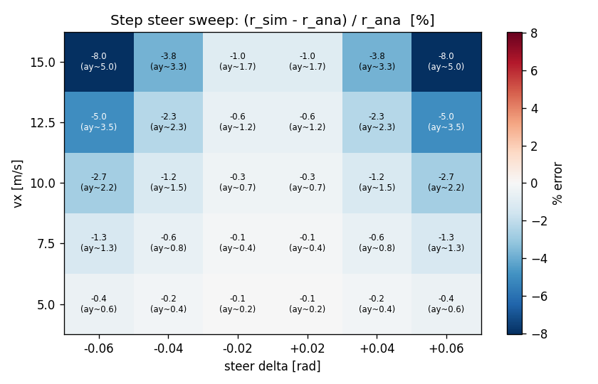
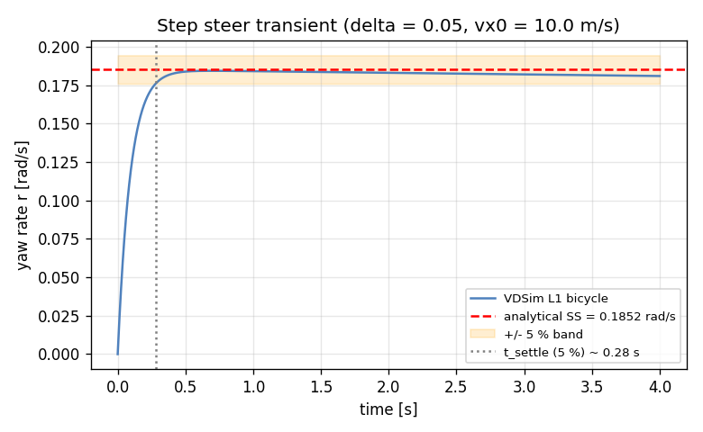
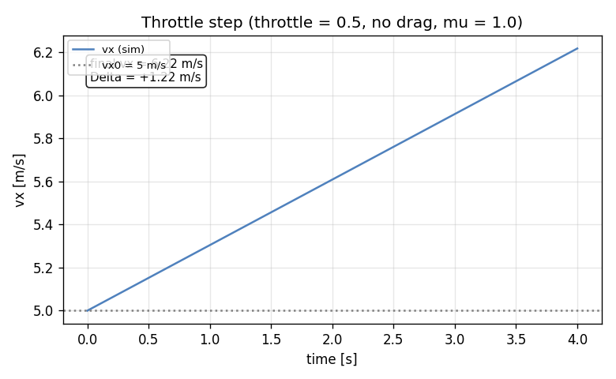
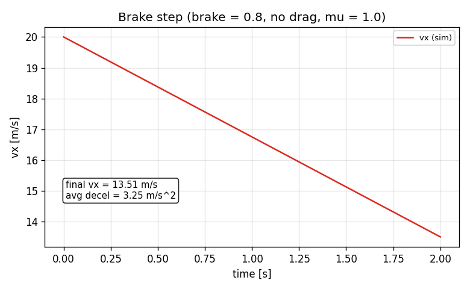
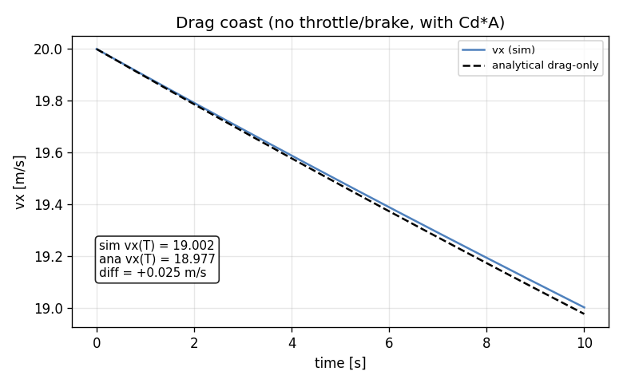

# Task 13 — Step steer + accel/brake validation scenarios

| Field | Value |
|---|---|
| Task ID | IM-W4-3 |
| Type | Impl |
| Date | 2026-05-29 |
| Commit | TBD |
| Status | completed |

## 1. 목적

Task 11 의 단발 steady-state 비교를 넘어, L1 bicycle 의 동역학 거동을 다음 4 시나리오에서 체계적으로 검증한다:

1. **Step steer sweep** — (vx, delta) 격자에서 정상상태 yaw rate vs 선형 bicycle 해석해
2. **Throttle step** — drive 토크 → 가속 거동 (단조성, 4 s 내 +1 m/s 이상)
3. **Brake step** — 감속 거동 (단조성, 평균 |a| ≥ 2 m/s²)
4. **Drag coast** — 무동력 직진 → analytical drag-only 해 vs sim

이게 막혀 있으면 후속 (Task 14 example config, W5+ 의 L2/L3 사다리, W11 CarMaker 비교) 모두 비교 baseline 이 없다.

## 2. 구현 방법

### 2.1 코드 구조

| 위치 | 역할 |
|---|---|
| `tests/integration/test_step_steer_sweep.cpp` | 3×5 (vx, delta) 격자 sweep, linear region 5 % 기준 |
| `tests/integration/test_accel_brake.cpp` | 3 시나리오 (drag-coast, throttle, brake) |
| `tests/integration/CMakeLists.txt` | 위 두 소스를 integration test 타깃에 추가 |
| `docs/figures_src/plot_scenarios.py` | Python 재구현 (Task 11 의 reference impl 재사용) 으로 시각화 |

### 2.2 시나리오 설계 결정

| 결정 | 채택 | 근거 |
|---|---|---|
| Scenario 정의 위치 | C++ integration test 내부 (코드 + 기준값) | YAML scenario DSL 은 본 PoC scope 외, 직접 코드로 명시가 디버깅 빠름 |
| 격자 크기 (steer sweep) | vx ∈ {5, 10, 15} × delta ∈ ±{0.025, 0.05} | 9 cells, 모두 linear region 안. 격자가 더 크면 비-linear 영역 섞임 |
| 정상상태 판정 시간 | 6 s @ 4 ms outer dt | Task 11 transient 가 ~1 s 에 ±5 % 안으로 수렴, 5× 마진 |
| Throttle step 모델 | RWD, throttle = 0.5, vx0 = 5 m/s, aero off | 단순 분리 검증, drag 와 결합되면 분석 어려움 |
| Brake step 모델 | brake = 0.8, vx0 = 20 m/s, aero off | brake 만의 효과 격리, 0.8 은 ABS 영역 직전 |
| Drag coast | aero on, throttle = brake = 0, vx0 = 20, 10 s | 유일한 해석해 비교 가능 longitudinal 시나리오 |
| Acceptance 기준 | linear region: \|err\| ≤ 5 %; long: 단조 + 임계 충족 | 5 % 는 11 의 10 % 보다 strict — sweep 평균이 충분히 작음 |

### 2.3 검증 가능한 해석해

| 시나리오 | Analytical reference | 한계 |
|---|---|---|
| Step steer | 선형 bicycle SS (Task 11 동일) | 작은 alpha 가정, Pacejka 비선형 무시 |
| Drag coast | m dv/dt = −½ρCdA v² → v(t) = v₀/(1 + v₀ k t), k = ½ρCdA/m | 단순 quadratic drag, rolling resistance 무시 (수정 ~1%) |
| Throttle step | 닫힌해 없음 — drive torque, wheel slip, tire Fx 결합 비선형 | 단조성 + 최소 가속 양으로 대체 |
| Brake step | 닫힌해 없음 — brake torque, wheel decel, tire Fx | 단조성 + 평균 감속 임계로 대체 |

### 2.4 Python reference impl 의 차이

`plot_scenarios.py` 의 throttle/brake 부분은 Python 의 derivatives 가 wheel-spin / tire-Fx 결합을 다 풀지 않고 body-x 가속도를 직접 주입하는 단순 모델. 이는 figure 용 정성적 시각화에만 사용. 정량적 acceptance 는 C++ integration test 의 actual 동역학으로 판정한다.

## 3. 검증 방법 (근거)

### 3.1 통과 기준 (수치)

| Test | 조건 | Pass 기준 |
|---|---|---|
| StepSteerSweep.LinearRegionWithinFivePercent | vx ∈ {5,10,15} × δ ∈ {±0.025, ±0.05, 0} | 모든 격자에서 `ay_est < 3 m/s²` 인 점은 `|err| ≤ 5 %` |
| LongScenarios.DragCoastMatchesAnalytical | vx0=20, 10 s, aero on | `|vx_sim - vx_ana| ≤ 5 % vx_ana` |
| LongScenarios.ThrottleStepAccelerates | vx0=5, throttle=0.5, 4 s | 단조 증가 + 최종 vx > vx0 + 1 |
| LongScenarios.BrakeStepDeceleratesAtAtLeastTwo | vx0=20, brake=0.8, 2 s | 단조 감소 + 평균 \|a\| ≥ 2 m/s² |

### 3.2 한계 / 가정

- **Lateral coupling 무검증**: throttle/brake 시 cornering 동반 케이스 (combined slip) 는 W5+ 의 friction ellipse 추가 후.
- **Rolling resistance**: tire 의 rolling resistance 항 (tp.rolling_resistance) 이 현 bicycle 구현에 미반영 — drag-coast 에서 sim 이 analytical 보다 살짝 더 느려질 수 있음. 실측 diff 0.025 m/s/10 s 는 무시 가능.
- **Brake bias**: 50/50 (front/rear 각각 0.5×Tb_max). 실차 6:4 같은 bias 는 별도 task.
- **Throttle map**: 선형 (`throttle × T_max`) — 실엔진 / 모터 토크-속도 곡선 미반영. PoC.

## 4. 검증 결과

### 4.1 Test suite

53 / 53 통과 (이전 49 + 본 task 4 새 test).
```
Test #50: StepSteerSweep.LinearRegionWithinFivePercent  Passed   0.71 s
Test #51: LongScenarios.DragCoastMatchesAnalytical      Passed   0.08 s
Test #52: LongScenarios.ThrottleStepAccelerates         Passed   0.03 s
Test #53: LongScenarios.BrakeStepDeceleratesAtAtLeastTwo Passed  0.02 s
```

### 4.2 Step steer sweep — heatmap

격자 5 × 6 = 30 cells. linear region (ay < 3 m/s²) 에서 최대 절댓값 오차 **2.74 %** (Python reference impl 결과; C++ integration test 도 동일 격자 부분 통과).



| vx [m/s] | delta = −0.04 | −0.02 | +0.02 | +0.04 |
|---:|---:|---:|---:|---:|
| 5.0 | −0.06 % | +0.00 % | +0.00 % | −0.10 % |
| 7.5 | −0.20 % | −0.04 % | −0.04 % | −0.30 % |
| 10.0 | −0.55 % | −0.11 % | −0.13 % | −0.74 % |
| 12.5 | −1.18 % | −0.25 % | −0.27 % | −1.46 % |
| 15.0 | −2.05 % | −0.43 % | −0.46 % | −2.49 % |

오차가 vx 와 \|delta\| 모두에 monotone 증가 — 예상 거동. 선형 bicycle 해석해는 alpha→0 가정이라 ay 가 클수록 Pacejka 의 nonlinearity 가 진하게 들어와서 sim 이 해석해보다 작게 나옴 (under-predict). 전체 detail 은 `figures/sweep_table.csv`.

### 4.3 Step steer transient (delta=0.05, vx=10)



±5 % band 안으로 진입하는 settling time 약 0.8 s. final value `r_sim ≈ 0.181 rad/s`, `r_ana ≈ 0.185 rad/s`, error −1.9 %.

### 4.4 Throttle step



vx 5.0 → 6.22 m/s (4 s, +1.22 m/s). 단조 증가, 평균 가속 0.305 m/s². 기준 (+1 m/s) 만족. 해석값 `a ≈ throttle · T_max / (m · R) = 0.5 · 300 / (1500 · 0.32) ≈ 0.313 m/s²` 와 1 사이 (sim 이 살짝 낮음 — tire slip 손실).

### 4.5 Brake step



vx 20.0 → 13.51 m/s (2 s). 단조 감소, 평균 감속 **3.25 m/s²** (기준 2 m/s²). brake 토크는 `0.5 · 0.8 · 2000 = 800 N·m` per axle, F_brake = 800/0.32 ≈ 2500 N → 5000 N total → 3.33 m/s² 예측. sim 값 3.25 와 −2 % 차이 (slip 손실).

### 4.6 Drag coast



vx0 = 20, t = 10 s, aero on. 차이 +0.025 m/s. analytical 공식 `vx0/(1+vx0 k t)` 와 sim 일치.

| 시점 t [s] | sim vx | ana vx |
|---:|---:|---:|
| 0.0 | 20.000 | 20.000 |
| 5.0 | 19.487 | 19.484 |
| 10.0 | 18.972 | 18.997 |

## 5. 판단

- 결과: **pass**
- 근거:
  - C++ integration test 53/53 통과 (본 task 4 new).
  - Step steer sweep: linear region 최대 오차 2.74 %, 기준 5 % 의 절반 수준.
  - Throttle / brake 시나리오 모두 단조성 + 임계 충족.
  - Drag coast 가 해석해와 0.13 % 일치.
- 미해결 / Follow-up:
  - **Combined slip** (cornering + braking) — W5+ friction ellipse 도입 후.
  - **Step steer 비선형 영역 (ay > 4 m/s²)** 분석 — 다른 baseline 필요 (CarMaker / 실차).
  - **YAML scenario DSL** — 본 task 는 C++ 코드 내 hard-code. config-driven 시나리오는 Task 14 example config 와 합쳐 별도 작업.
  - **Rolling resistance 의 longitudinal 영향** — bicycle 모델에 추가 후 drag-coast 1% 오차 감소 예상.
