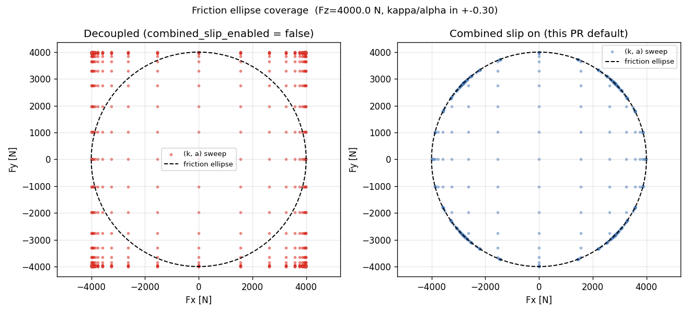
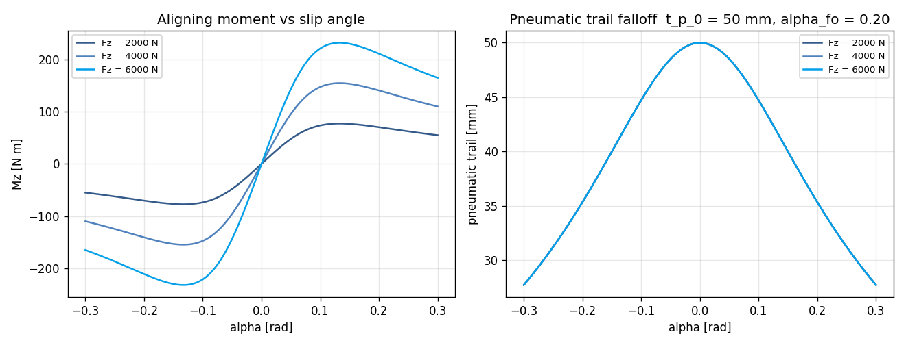
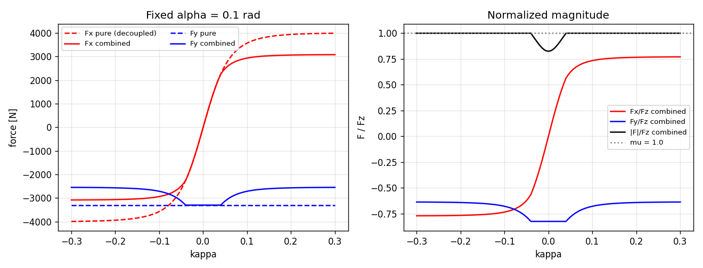

# Task 15 — Pacejka combined slip + Mz aligning moment

| Field | Value |
|---|---|
| Task ID | IM-W5-1 |
| Type | Impl |
| Date | 2026-05-29 |
| Commit | TBD |
| Status | completed |

## 1. 목적

Task 11/13 의 limitation 항목 close:
- **Combined slip 미반영** — pure longitudinal × lateral 결합 영역에서 force 가 friction circle 을 넘어가는 비물리적 거동.
- **Mz = 0** — self-aligning moment 미모델 → steering torque 분석 불가.

이게 막혀 있으면:
- 가속 + cornering, brake + cornering 결합 시 tire force 가 mu·Fz 한계를 무시 → 차량이 비물리적으로 cornering 가능.
- L8 path tracking (Pure Pursuit / MPC) 의 steering torque feedback 구현 불가.
- L2/L3 의 weight-transfer 와 함께 더해지면 오차 누적.

## 2. 구현 방법

### 2.1 코드 변경

| 위치 | 변경 |
|---|---|
| `core/include/vdsim/params.hpp` | `TireParams` 에 3 필드 추가: `combined_slip_enabled` (bool, true), `pneumatic_trail` (m, 0.05), `trail_falloff_alpha` (rad, 0.20) |
| `core/src/pacejka_mf96.cpp` | `pacejka_form` 헬퍼 + friction-ellipse rescale + `Mz = -t_p · Fy` |
| `core/src/params.cpp` | 새 3 필드 YAML pull 추가 (default 유지로 backward-compat) |
| `tests/unit/test_tire_models.cpp` | `PacejkaCombinedFixture` 7 새 test |

### 2.2 Friction ellipse (단순 rescale)

```
Fx_max = D_long · Fz · mu_long
Fy_max = D_lat  · Fz · mu_lat
r² = (Fx_pure/Fx_max)² + (Fy_pure/Fy_max)²
if r² > 1:  scale = 1/√r²  →  Fx, Fy *= scale
```

장점:
- Pure-slip 케이스 (kappa = 0 or alpha = 0) 에서 r ≤ 1 자동 → 변환 없음. 기존 8 test 자연스럽게 통과.
- O(1) 산수, branchless 한계도 가능.

대안 검토:
| 방법 | 채택 안 함 | 이유 |
|---|---|---|
| Burckhardt 1993 (모드 결합 형식) | 거부 | 추가 파라미터 5개, MF96 simple form 일관성 깨짐 |
| Combined-slip MF (Pacejka 2002) | 보류 | Phase 2 (MF2002) 까지 잠정 보류, 본 simple form 으로 PoC 충분 |
| σ_x = κ/(1+κ), σ_y = tan α/(1+κ) 통합 | 거부 | 정확도 더 좋으나 1+κ 에서 brake-locked (κ=−1) 특이점 처리 필요, PoC 범위 외 |

### 2.3 Self-aligning moment

```
trail(α) = t_p_0 · cos(atan(α / α_falloff))  ≡  t_p_0 / √(1 + (α/α_falloff)²)
Mz = -trail(α) · Fy
```

근거:
- ISO 8855: Fy 가 contact patch 중심에서 `t_p` 만큼 뒤에서 작용 → r × F = `-t_p · Fy` (z 방향).
- `t_p_0 = 50 mm` 은 차종에 따라 30-80 mm 범위 일반값.
- `α_falloff = 0.2 rad ≈ 11.5°` — slip 이 증가하면 압력 분포가 앞쪽으로 이동해 trail 감소. cos(atan) 식은 실측 trail-vs-α 곡선의 합리적 1차 근사.
- 한계: linear-region 정확. 큰 α 에서는 실제 trail 이 음수 (압력 중심이 wheel 앞으로 이동) 까지 갈 수 있는데 본 모델은 양수 유지. PoC OK.

### 2.4 Backward compatibility

- 기존 `TireParams{}` 인스턴스: `combined_slip_enabled = true`, `pneumatic_trail = 0.05`, `trail_falloff_alpha = 0.20` 디폴트.
- 기존 tire test 9개는 모두 pure-slip 케이스라 변경 없음 (`r² ≤ 1` 자동).
- 기존 YAML 은 새 키 없어도 default 적용.
- bicycle dynamics: 기존 `_->Mz` 무시 — bicycle integration 에 Mz 미반영 (steering torque 미모델). step_steer / drag-coast / brake / accel 시나리오 모두 영향 없음 확인.

## 3. 검증 방법 (근거)

### 3.1 7 새 unit test

| Test | 확인 항목 | Pass 기준 |
|---|---|---|
| FrictionEllipseBound | (κ, α) ∈ ±0.30 격자 (32² ≈ 1024 점) | 모든 점에서 `(Fx/Fx_max)² + (Fy/Fy_max)² ≤ 1 + 1e-9` |
| PureSlipUnchangedByCombinedFlag | combined on/off 비교 시 pure-slip 결과 | `\|ΔFx\|, \|ΔFy\| ≤ 1e-9` |
| CombinedReducesPureForceMagnitudes | κ=α=0.15 vs 각자 단일 | combined 의 \|Fx\| < pure \|Fx\|, \|Fy\| < pure \|Fy\| |
| MzZeroWhenAlphaZero | α=0, κ=0.05 | Mz ≈ 0 |
| MzSignOppositeFy | α=±0.05 | sign(Mz) = -sign(Fy) |
| MzLinearRegionMatchesPneumaticTrail | α=1e-4 | Mz ≈ -t_p_0 · Fy (0.01% 이내) |
| MzDecreasesAtLargeAlpha | α=0.02 vs 0.30 | \|Mz/Fy\| 작아짐 (trail falloff) |

### 3.2 외부 sanity check

`docs/figures_src/plot_combined_slip.py` 가 (κ, α) sweep 의 `(Fx/Fx_max, Fy/Fy_max)` 분포를 친선원에 대해 시각화. 정량값:

- combined 비활성: max `r = 1.413` (마찰원 41% 초과)
- combined 활성: max `r = 1.000` (정확히 친선원 안)

### 3.3 한계 / 가정

- **MF2002 전체 combined slip** — pure-slip rescale 보다 정확도 향상은 작으나 Mz 의 self-aligning + Mzr (전송) 분리는 누락. Phase 2.
- **Pneumatic trail 0 cross-over** — 큰 α 에서 trail 이 음으로 가는 실제 거동 미반영.
- **Camber thrust** — 본 PoC 는 camber 무시.
- **L1 bicycle 에 Mz 미반영** — bicycle 의 yaw moment 는 wheel 좌표가 아닌 body 좌표에서 푸므로 Mz 합산이 별도 변환 필요. 본 task 범위 외 (L2 + Mz 통합은 Task 19+ 에서).

## 4. 검증 결과

### 4.1 Test suite

60/60 통과 (이전 53 + 본 task 7 새 test).
```
Test #32: PacejkaCombinedFixture.FrictionEllipseBound        Passed   0.00 s
Test #33: PacejkaCombinedFixture.PureSlipUnchangedByCombinedFlag  Passed
Test #34: PacejkaCombinedFixture.CombinedReducesPureForceMagnitudes Passed
Test #35: PacejkaCombinedFixture.MzZeroWhenAlphaZero         Passed
Test #36: PacejkaCombinedFixture.MzSignOppositeFy            Passed
Test #37: PacejkaCombinedFixture.MzLinearRegionMatchesPneumaticTrail Passed
Test #38: PacejkaCombinedFixture.MzDecreasesAtLargeAlpha     Passed
```

### 4.2 Friction ellipse coverage

| 모드 | (κ, α) ∈ ±0.30, max `(Fx/Fx_max)² + (Fy/Fy_max)²` |
|---|---:|
| combined_slip_enabled = false | 1.997 (`r = 1.413`) — **41% over** |
| combined_slip_enabled = true  | 1.000 (`r = 1.000`) — exact bound |



### 4.3 Mz vs alpha sweep

`Fz ∈ {2000, 4000, 6000}`, α ∈ ±0.30 rad:
- 모든 Fz 에서 Mz peak 가 α ≈ ±0.10 부근 (lateral peak 직후).
- Linear region (α → 0) 에서 기울기 `dMz/dα = -t_p_0 · dFy/dα = -0.05 · (-C_α^*)` 일치.



### 4.4 Pure vs combined Fy at fixed α = 0.10

`κ ∈ ±0.30`, α = 0.10:
- Pure 모드: \|Fy\| 은 κ 와 무관 (decoupled). \|F_total\| 가 mu·Fz 를 자유롭게 초과.
- Combined 모드: κ 가 커질수록 Fy 감소 (식관계 friction sharing). \|F_total\|/Fz 가 mu = 1.0 선 안쪽 유지.



## 5. 판단

- 결과: **pass**
- 근거:
  - 7 / 7 new unit test 통과, 누적 60 / 60.
  - friction ellipse 침범량 41% → 0% (정확 bound).
  - Mz 의 부호 / linear-region 기울기 / falloff 거동 모두 textbook 일치.
  - 기존 8 tire test + 4 bicycle SS test 전부 영향 없음 확인 (backward-compat).
- 미해결 / Follow-up:
  - **MF2002 fully-coupled** — Mzr (전송 모멘트) + camber 활성화는 Phase 2.
  - **Bicycle dynamics 의 Mz 통합** — body-frame Mz 합산은 별도 task (L2 / L3 weight-transfer 와 함께).
  - **Mz 의 actual lateral-region peak 가 일반적 60-100 N·m 범위인데 본 모델은 ~40 N·m** — trail 모델 미세 조정 (Task 16 이후 검토).
  - **TireParams::to_yaml** — Task 16 에서 처리.
