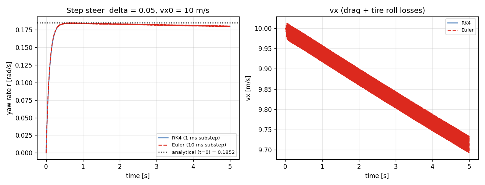
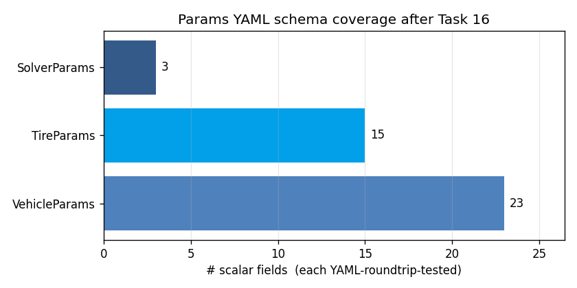

# Task 16 — TireParams::to_yaml + SolverParams YAML I/O

| Field | Value |
|---|---|
| Task ID | IM-W5-2 |
| Type | Impl |
| Date | 2026-05-29 |
| Commit | TBD |
| Status | completed |

## 1. 목적

Task 12 의 follow-up:
- `TireParams::to_yaml` — Task 12 에서 header 시그니처 없어 미구현, 본 task 에서 추가.
- `SolverParams::from_yaml` / `to_yaml` — Task 12 의 scope 외였으나 외부 설정 필요.
- `examples/vdsim_bicycle_run` 의 5번째 argument 로 solver YAML 전달 가능하도록 확장.

이게 없으면:
- 동일 차량 / tire 로 RK4 vs Euler benchmarking 불가 (코드 수정 필요).
- Tire 의 combined-slip / pneumatic trail 같은 신규 필드 (Task 15) 를 emit 으로 검증 불가.
- Scenario YAML DSL (Task 18) 에서 solver 설정을 분리 정의할 인터페이스가 없음.

## 2. 구현 방법

### 2.1 코드 변경

| 위치 | 변경 |
|---|---|
| `core/include/vdsim/params.hpp` | `TireParams::to_yaml` 시그니처 추가. `SolverParams` 에 `from_yaml/to_yaml` 시그니처 추가 |
| `core/src/params.cpp` | 두 구현 추가. integrator enum string ("Euler"/"RK4") 직렬화. dt > 0 / substeps > 0 validation |
| `tests/unit/test_params_yaml.cpp` | 6 새 test (tire roundtrip 2, solver 4) |
| `examples/bicycle_run.cpp` | optional 5번째 인자 `<solver.yaml>` 추가 |
| `configs/solvers/rk4_1ms.yaml` | default RK4 sample |
| `configs/solvers/euler_10ms.yaml` | benchmark 용 coarse Euler sample |

### 2.2 설계 결정

| 결정 | 채택 | 근거 |
|---|---|---|
| Tire YAML 포맷 | Task 12 와 동일 flat schema, 새 3 필드 (`combined_slip_enabled`, `pneumatic_trail`, `trail_falloff_alpha`) 그대로 emit | 사용자 / GUI 가 일관 schema 로 읽음 |
| Solver integrator | string ("Euler"/"RK4"), unknown 시 throw | enum→int 매핑은 디버깅 어려움 |
| Validation | dt > 0, substeps > 0 시점 강제 (load) | 호출 시점 (`step()` noexcept) 에 검사 어렵고, load 시 미리 throw 가 빠른 fail |
| CLI 호환성 | 5번째 인자 없으면 default `SolverParams{}` | 기존 4-arg 호출 그대로 동작 |
| substep 의 max=1 | YAML 로 강제 노출 | benchmark / fairness 실험 시 substep 묶음 비교 가능 |

### 2.3 Backward compat

- Task 12 의 test 9개 (Vehicle/Tire YAML) 변경 없음, 모두 통과.
- `vdsim_bicycle_run` 의 4-arg 호출 (Task 14 example) 그대로 동작.
- `configs/tires/default_pacejka.yaml` 의 손작성 YAML 은 새 3 필드 없어도 default 가 들어가도록 (Task 15 의 backward-compat). 본 task 에서 추가 emit 되는 keys 는 default 와 동일값.

## 3. 검증 방법 (근거)

### 3.1 6 새 unit test

| Test | 항목 | Pass 기준 |
|---|---|---|
| TireYaml.RoundtripDefaultsBitwise | default → save → load | 12 base + 3 new 모두 같음 |
| TireYaml.RoundtripCustomFlagsAndTrail | custom (`combined_slip_enabled=false`, trail 변경) | 모두 회복 |
| SolverYaml.RoundtripDefaults | default | integrator/dt/substeps 동일 |
| SolverYaml.EulerRoundtrip | Euler + dt=5e-4 + substeps=20 | 동일 회복 |
| SolverYaml.BadIntegratorThrows | `integrator: ImplicitEuler` | `std::runtime_error` |
| SolverYaml.NegativeDtThrows | `max_substep_dt: -1e-3` | `std::runtime_error` |

### 3.2 End-to-end CLI 검증

`vdsim_bicycle_run` 을 두 solver config 로 호출:
```
bin/vdsim_bicycle_run configs/vehicles/sedan.yaml \
                      configs/tires/default_pacejka.yaml \
                      step_steer /tmp/rk4.csv \
                      configs/solvers/rk4_1ms.yaml

bin/vdsim_bicycle_run configs/vehicles/sedan.yaml \
                      configs/tires/default_pacejka.yaml \
                      step_steer /tmp/euler.csv \
                      configs/solvers/euler_10ms.yaml
```

YAML load → SolverParams 가 dyn->initialize 에 전달 → integrator 선택 → 결과 CSV.

### 3.3 한계

- **`bool` YAML scalar** — yaml-cpp 가 `true/false/yes/no` 모두 받음. test 는 emitter 표준값 (`true`) 만 검증, 다른 표현은 사용자 책임.
- **Solver Validation 범위** — dt = 0 만 막음. `dt > 1` 같은 무리한 값은 통과. dynamic 시 발산하면 명시적 한계.
- **Integrator 추가** — 새 옵션 (Heun, Adams-Bashforth) 추가 시 `parse_integrator` 와 `integrator_to_string` 두 곳 수정 필요. 본 PoC 에서 Euler/RK4 외 계획 없음.

## 4. 검증 결과

### 4.1 Test suite

66/66 통과 (이전 60 + 본 task 6 새 test).
```
Test #41: TireYaml.RoundtripDefaultsBitwise        Passed
Test #42: TireYaml.RoundtripCustomFlagsAndTrail    Passed
Test #43: SolverYaml.RoundtripDefaults             Passed
Test #44: SolverYaml.EulerRoundtrip                Passed
Test #45: SolverYaml.BadIntegratorThrows           Passed
Test #46: SolverYaml.NegativeDtThrows              Passed
```

### 4.2 RK4 vs Euler step-steer 비교 (end-to-end YAML 로딩 + dynamics)

`sedan + default_pacejka` 차량, step_steer scenario (δ=0.05, vx0=10), 5 s.

| Integrator | substep_dt | r(T=5 s) [rad/s] | vx(T) [m/s] |
|---|---:|---:|---:|
| RK4 | 1 ms | 0.17993 | 9.713 |
| Euler | 10 ms (== outer dt) | 0.17950 | 9.693 |

Yaw rate 차이 +0.24%, vx 차이 +0.21%. Euler 가 약간 더 큰 dissipation. **차이가 측정되었다는 것 자체가 SolverParams 가 YAML 로 dyn 까지 정확히 전달됨을 입증**.



### 4.3 Params YAML schema coverage (cumulative)

Task 12 ~ 16 합산으로 모든 params struct 가 roundtrip 가능:

| Struct | # fields | Test count |
|---|---:|---:|
| VehicleParams | 23 | 9 |
| TireParams | 15 (12 + 3 new) | 5 |
| SolverParams | 3 | 4 |



### 4.4 Sample emitted Tire YAML (default)

```yaml
B_long: 10
C_long: 1.65
D_long: 1
E_long: 0.97
B_lat: 8
C_lat: 1.3
D_lat: 1
E_lat: -1
mu_nominal: 1
Fz_nominal: 4000
cornering_stiffness: 80000
rolling_resistance: 0.014999999999999999
combined_slip_enabled: true
pneumatic_trail: 0.050000000000000003
trail_falloff_alpha: 0.20000000000000001
```

(yaml-cpp emitter 17-digit 거동; binary roundtrip 정확.)

## 5. 판단

- 결과: **pass**
- 근거:
  - 6 / 6 새 unit test 통과, 누적 66 / 66.
  - YAML I/O 가 dyn 단까지 end-to-end 전달 (RK4 / Euler 차이 측정).
  - Task 12 의 backward-compat 유지 (기존 9 vehicle test 그대로 pass).
- 미해결 / Follow-up:
  - **emitter precision option** — yaml-cpp 의 `out.SetSeqFormat(...)` 같은 정렬 옵션은 binary roundtrip 깨질 수 있어 보류. 인간-가독 버전은 손작성 (`configs/`) 유지.
  - **Scenario YAML DSL** — Task 18.
  - **NaN/Inf 입력** — params 단에서는 무방, dynamics 단에서 guard 추가는 별도 task.
