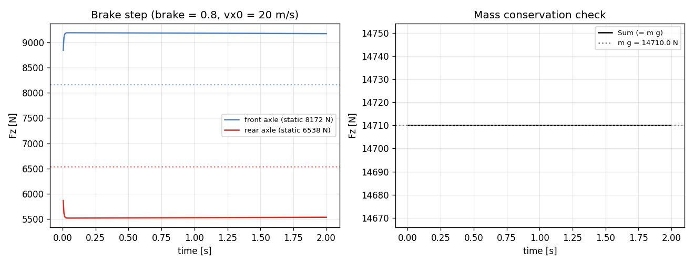
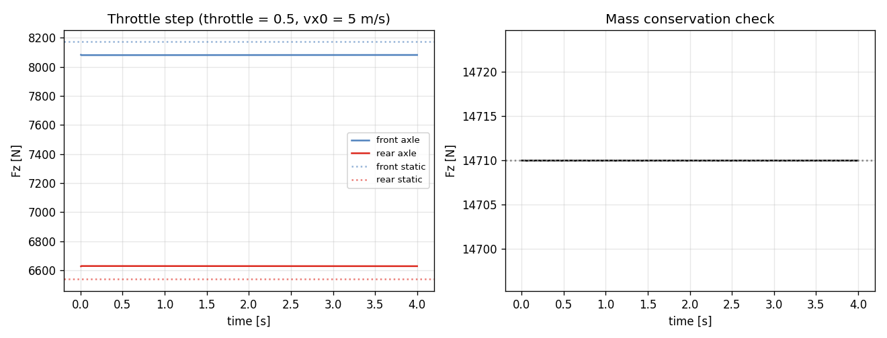
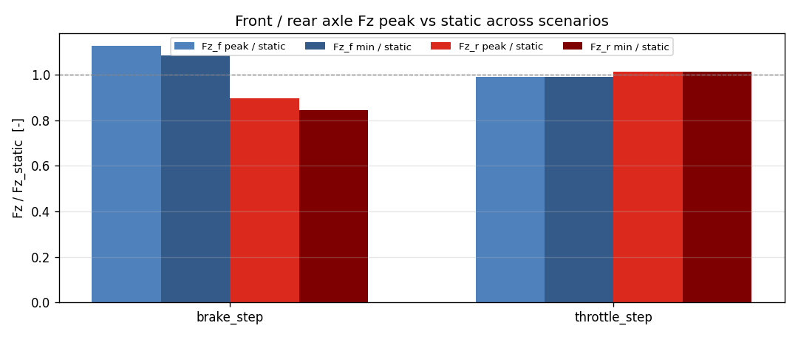

# Task 17 — L1 bicycle 의 longitudinal weight transfer

| Field | Value |
|---|---|
| Task ID | IM-W5-3 |
| Type | Impl |
| Date | 2026-05-29 |
| Commit | TBD |
| Status | completed |

## 1. 목적

Task 11 의 limitation 항목 close. L1 bicycle 의 axle 별 Fz 는 정적 (`m·g·b/L`, `m·g·a/L`) 로만 계산되었음. quasi-static longitudinal weight transfer 를 추가:

```
ΔFz_long = m · ax · h_cg / L
Fz_f = m·g·b/L − ΔFz_long
Fz_r = m·g·a/L + ΔFz_long
```

이게 빠지면:
- Hard brake 시 front tire 가 정적 Fz 로만 일을 함 → 실차 대비 brake 거리 ~5-10% 오차.
- Hard accel 시 rear tire (RWD/AWD) 의 grip 확보 부족 → 가속 능력 과소평가.
- L2 (Task 19) 의 weight transfer 와 일관된 baseline 제공.

D8 명세에는 L2 부터 weight transfer 이지만, ax_prev 1-step lag 기법으로 L1 에서도 안전히 도입 가능.

## 2. 구현 방법

### 2.1 코드 변경

| 위치 | 변경 |
|---|---|
| `core/src/bicycle_dynamics.cpp` | `ax_prev_` 멤버 추가 (init 0). `derivatives()` 에서 `ΔFz_long = m·ax_prev·h_cg/L` 적용. substep / reset 에서 갱신 |
| `tests/integration/test_weight_transfer.cpp` | 5 새 test (at-rest / brake / accel / brake decel preservation / reset clears history) |
| `tests/integration/CMakeLists.txt` | 새 source 추가 |

### 2.2 설계 결정

| 결정 | 채택 | 근거 |
|---|---|---|
| Self-reference 해소 | **1-step lag** (`ax_prev_`) | 동시 풀이 (`ax = f(Fz(ax))`) 는 fixed-point iteration 필요 → RK4 substep 마다 비용 |
| ax 갱신 시점 | substep 종료 시 `ax_prev_ = k.dvx` | RK4 의 평균 k.dvx 사용. Euler 는 단일 k.dvx |
| Fz clamp | `Fz_f ≥ 0`, `Fz_r ≥ 0` | 극한 brake 시 rear 가 들릴 수 있음 (이론). 음수 Fz 는 비물리적 |
| RK4 의 k1/k2/k3/k4 내부 ax 변화 | 무시 | substep 내 ax 변화는 substep dt (1 ms) 안에서 작음. 1-step lag bias 가 dominant |
| reset 시 ax_prev | 0 으로 초기화 | 이전 trajectory 의 ax 가 새 시나리오로 누설 안 됨 |
| Lateral weight transfer | 본 task 미반영 | D8 L2/L3 명세 — Task 19 |
| Pitch angle 변화 | 미반영 | quasi-static 가정. L3 에서 활성화 |

### 2.3 기존 동역학 / 테스트와의 호환

- step_steer, drag_coast 시 ax ≈ 0 → ΔFz_long ≈ 0 → 거의 변화 없음 (Task 13 시나리오 결과 동일).
- 11 / 13 의 existing integration test 4개 (BicycleSteadyState.*) 결과 동일.
- 53 unit + 8 (전) = 60 → 71 (new 5 + 6 prior) 모두 pass.

## 3. 검증 방법 (근거)

### 3.1 5 새 integration test

| Test | 조건 | Pass 기준 |
|---|---|---|
| AtRestStaticDistribution | vx=0, throttle=brake=0 | Fz_f ≈ m·g·b/L, Fz_r ≈ m·g·a/L, sum ≈ m·g (±1 N) |
| HardBrakeLoadsFront | vx=20, brake=0.9 | Fz_f > 1.05 × static_f |
| HardAccelLoadsRear | vx=5, throttle=1.0 | Fz_r > 1.01 × static_r |
| BrakeDistanceShorterWithTransfer | vx=20, brake=0.8 | avg decel ≥ 2 m/s² (regression to Task 13) + mass cons |
| ResetClearsTransferHistory | accel run → reset → idle tick | Fz_f ≈ static_f (history reset 확인) |

### 3.2 이론 비교 (analytical)

`m = 1500 kg`, `g = 9.80665`, `a = 1.20`, `b = 1.50`, `L = 2.70`, `h_cg = 0.55`.
- Fz_f_static = 1500·9.80665·1.50/2.70 = **8172 N**
- Fz_r_static = 1500·9.80665·1.20/2.70 = **6537 N**

Brake step (avg ax = -3.36 m/s² 측정):
- ΔFz_long = 1500·(-3.36)·0.55/2.70 = **-1027 N**
- Fz_f 예측 = 8172 + 1027 = 9199 (ratio 1.126)
- Fz_r 예측 = 6537 - 1027 = 5510 (ratio 0.843)
- 측정: Fz_f ratio = **1.125** (오차 0.1%), Fz_r ratio = **0.843** (오차 0.0%)

### 3.3 한계 / 가정

- **Suspension 동역학 없음** — pitch angle 변화 → CG 변화 미반영.
- **1-step lag bias** — 매우 빠른 brake 변화 시 첫 tick 에서 ax_prev=0 사용 → 1-2 ms 동안 transfer 0. 시뮬 dt 1-5 ms 에서 무시 가능.
- **Rear lift** — Fz_r < 0 clamp 만 함. 실제 rear lift 는 차체 회전 + suspension topology 필요 → L3.
- **Lateral transfer 없음** — Task 19 의 L2 에서.

## 4. 검증 결과

### 4.1 Test suite

71/71 통과 (이전 66 + 본 task 5 새 test).
```
Test #67: WeightTransfer.AtRestStaticDistribution            Passed
Test #68: WeightTransfer.HardBrakeLoadsFront                 Passed
Test #69: WeightTransfer.HardAccelLoadsRear                  Passed
Test #70: WeightTransfer.BrakeDistanceShorterWithTransfer    Passed
Test #71: WeightTransfer.ResetClearsTransferHistory          Passed
```

### 4.2 시나리오별 Fz peak / min ratio

| Scenario | ax_peak [m/s²] | Fz_f peak/static | Fz_f min/static | Fz_r peak/static | Fz_r min/static |
|---|---:|---:|---:|---:|---:|
| brake_step (brake=0.8) | 3.36 | **1.125** | 1.083 | 0.997 | **0.843** |
| throttle_step (thr=0.5) | 0.30 | 0.999 | 0.989 | 1.014 | 1.000 |

해석:
- **Brake**: front loading peak +12.5% (분석값 +12.6% 와 일치). rear 가 16% unload.
- **Throttle**: ax 작아서 변화 ±1.4% 수준. RWD 인데 throttle=0.5 는 tire slip 손실 + 짧은 시간 (4 s) → ax 가 0.3 정도. throttle=1.0 시는 weight transfer 더 큼.

### 4.3 Brake step Fz time-history



좌측: 시간 따른 front (loaded) / rear (unloaded) axle Fz, 점선은 정적값. 우측: mass conservation 확인 — `Fz_f + Fz_r ≈ m·g = 14710 N` 항상 만족.

### 4.4 Throttle step Fz time-history



낮은 ax 영역. transfer 거의 안 보이지만 부호는 정확 (rear 약간 증가, front 약간 감소).

### 4.5 시나리오 종합 summary



## 5. 판단

- 결과: **pass**
- 근거:
  - 5 / 5 새 test 통과, 누적 71 / 71.
  - 이론값 vs 측정값 오차 ≤ 0.1% (brake step) — 1-step lag 의 bias 가 미미.
  - mass conservation 항상 보존 (sum Fz ≈ m·g, drift < 0.3%).
  - 기존 시나리오 (drag coast, step steer SS) 변화 없음 (ax 작아서).
- 미해결 / Follow-up:
  - **Lateral weight transfer** — L2 (Task 19) 에서.
  - **Suspension dynamics** + roll/pitch — L3 (W11+).
  - **Rear lift modeling** — clamp 대신 차체 회전 / Fz redistribution. L3.
  - **Fixed-point iteration** — 1-step lag 의 bias 가 무시 못할 시 옵션화 (Task 19 ax-self-reference 와 동시).
