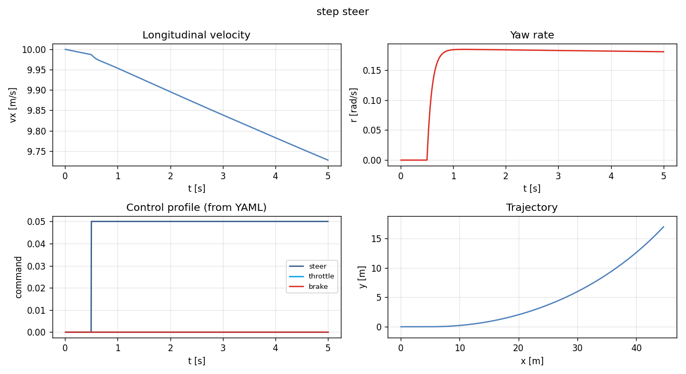
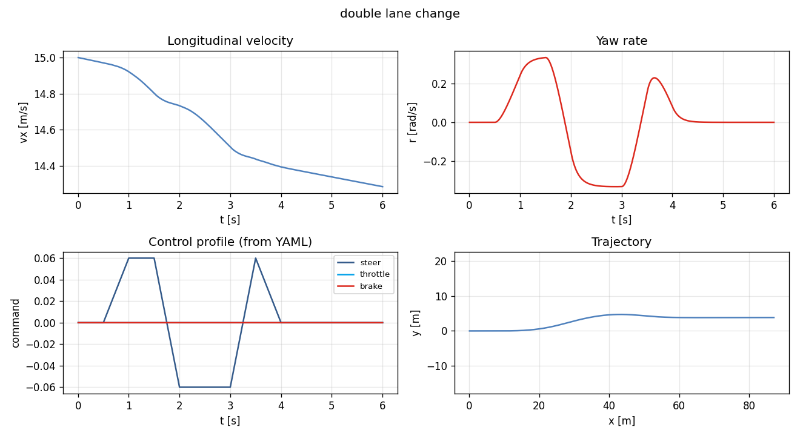
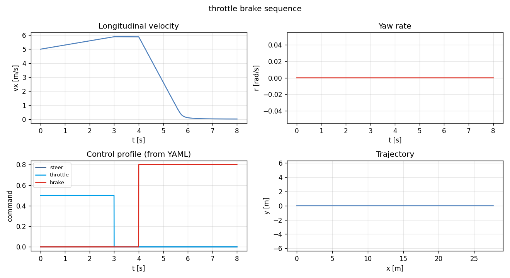
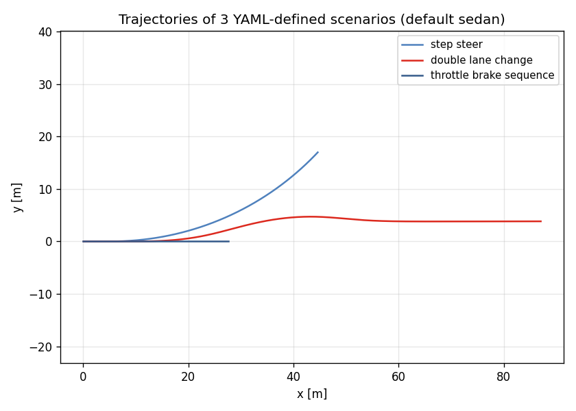

# Task 18 — Scenario YAML DSL + runner

| Field | Value |
|---|---|
| Task ID | IM-W5-4 |
| Type | Impl |
| Date | 2026-05-29 |
| Commit | TBD |
| Status | completed |

## 1. 목적

Task 13/14 의 follow-up. 시나리오를 코드 (`bicycle_run` 의 hard-coded 3 case) 가 아니라 **외부 YAML 로 정의** 가능하게 한다.

- 사용자 / 동료가 코드 수정 없이 새 시나리오 추가 가능.
- 동일 시나리오를 sedan / sports / 향후 L2/L3 차종에 재사용.
- 회귀 테스트 / regression suite 가 YAML 으로 cherry-pick 없이 정의.
- FSK / TUR 의 실차 측정 시나리오를 그대로 simulation 에 미러링 가능 (Phase 2).

이게 없으면:
- 새 시나리오마다 C++ enum + builder 코드 수정 → CI 통과 risk.
- Scenario sweep (e.g. δ ∈ [-0.1, 0.1] 격자) 가 외부 스크립트로 안 됨.

## 2. 구현 방법

### 2.1 코드 / 데이터

| 위치 | 역할 |
|---|---|
| `core/include/vdsim/scenario.hpp` | `Scenario` struct + `ControlSample` + `Interp { ZOH, Linear }` 선언 |
| `core/src/scenario.cpp` | `from_yaml`, `to_yaml`, `sample(t)` 구현 |
| `core/CMakeLists.txt` | `scenario.cpp` 추가 |
| `examples/scenario_run.cpp` | 새 CLI `vdsim_scenario_run` |
| `examples/CMakeLists.txt` | 새 타깃 추가 |
| `configs/scenarios/step_steer.yaml` | step steer 예제 |
| `configs/scenarios/double_lane_change.yaml` | ISO 3888 유사 lane change |
| `configs/scenarios/throttle_brake_sequence.yaml` | accel→coast→brake |
| `tests/unit/test_scenario_yaml.cpp` | 9 새 test |

### 2.2 Schema

```yaml
name:          step_steer       # 식별자 (CSV 헤더, 로그용)
initial_vx:    10.0             # [m/s]
duration:      5.0              # [s]
dt:            0.005            # [s] outer tick
mu:            1.0              # surface mu multiplier
interpolation: zoh              # zoh | linear
controls:
  - { t: 0.0, throttle: 0.0, brake: 0.0, steer: 0.00, gear: 1 }
  - { t: 0.5, throttle: 0.0, brake: 0.0, steer: 0.05, gear: 1 }
  - { t: 5.0, throttle: 0.0, brake: 0.0, steer: 0.05, gear: 1 }
```

각 `control` field 는 optional (없으면 0, `gear` 는 1).

### 2.3 설계 결정

| 결정 | 채택 | 근거 |
|---|---|---|
| 시간 표현 | 절대 시간 (t in seconds) | offset / delta-t 보다 직관적, sweep 코드 단순 |
| Interpolation | `zoh` 기본, `linear` 옵션 | step steer 등 discontinuous 시그널이 majority → ZOH default. lane change 처럼 부드러운 시그널은 linear |
| `controls` 정렬 | 사전에 ascending 강제 (throw on unsorted) | sort 자동 정정 보다 사용자 의도 명확 보존이 우선 |
| Throttle/brake clamp | load 시 [0, 1] 로 clamp | 입력 실수 (0~100% 입력 등) 빠른 normalization |
| Gear interp | 항상 ZOH (정수 의미 보존) | linear interp 의미 없음 |
| `mu` | scenario-level | 노면 변화 시나리오는 Phase 2 (시간 가변 mu) |
| Out-of-range time | 양 끝값 hold | 시뮬 끝까지 마지막 control 유지 |
| Empty controls | 자동 single zero command 추가 | "빈 시나리오" 가 throw 안 하도록 |

### 2.4 Backward compat

- 기존 `bicycle_run` (Task 14 hard-coded 시나리오) 그대로 동작. 새 binary `vdsim_scenario_run` 은 별도.
- params / solver YAML schema 그대로 재사용.
- 향후 L2/L3 dyn 으로 교체 시 scenario YAML 변경 없음.

## 3. 검증 방법 (근거)

### 3.1 9 새 unit test

| Test | 항목 | Pass 기준 |
|---|---|---|
| ScenarioYaml.RoundtripDefaults | save → load | name / 모든 scalar 일치 |
| ScenarioYaml.ZohSample | 3 control 사이 t 변화 | 직전 control value 유지 |
| ScenarioYaml.LinearSample | linear interp | 중간 t 에서 선형 보간 |
| ScenarioYaml.UnsortedControlsThrows | t 순서 깨진 입력 | `std::runtime_error` |
| ScenarioYaml.ClampsThrottleBrakeOnLoad | t=0,throttle=2.0,brake=−0.5 | 1.0 / 0.0 로 clamp |
| ScenarioYaml.MissingFileThrows | 없는 경로 | throw |
| ScenarioYaml.BadInterpThrows | `interpolation: cubic` | throw |
| ScenarioYaml.NegativeDurationThrows | `duration: -1.0` | throw |
| ScenarioYaml.EmptyControlsBecomesZero | controls 키 없음 | 단일 zero command auto |

### 3.2 End-to-end 검증 (3 시나리오)

CLI:
```
bin/vdsim_scenario_run configs/vehicles/sedan.yaml \
                       configs/tires/default_pacejka.yaml \
                       configs/scenarios/<name>.yaml \
                       /tmp/sc_<name>.csv
```

3 시나리오 모두 정상 종료, CSV 생성, NaN 없음 확인.

### 3.3 한계

- **Closed-loop control 없음** — 본 DSL 은 open-loop 시그널만. PID / pure pursuit 같은 closed-loop 은 별도 (Task 19+ 의 ControlConverter 후).
- **Time-varying mu** — 노면 변화 (얼음 → 마른 노면) 는 미지원. ContactProvider 확장으로 별도 task.
- **External time-series CSV import** — measurement (ADMA 등) 의 control 입력 가져오기는 Phase 2.
- **Scenario sweep DSL** — 1개 YAML 에 parameter grid 정의는 미지원. python wrapper 로 외부에서 처리.

## 4. 검증 결과

### 4.1 Test suite

80/80 통과 (이전 71 + 본 task 9 새 test).

### 4.2 시나리오 실행 요약

| Scenario | vx0 [m/s] | vx(T) [m/s] | r peak [rad/s] | y peak [m] | x(T) [m] |
|---|---:|---:|---:|---:|---:|
| step_steer | 10.00 | 9.73 | 0.184 | 16.98 | 44.62 |
| double_lane_change | 15.00 | 14.29 | 0.332 | 4.72 | 87.06 |
| throttle_brake_sequence | 5.00 | 0.02 | 0.000 | 0.00 | 27.67 |

해석:
- **step_steer**: 0.5 s coast 후 δ=0.05 hold → r 가 ≈0.18 (Task 11 의 SS yaw rate 일치).
- **double_lane_change**: linear interp 의 매끄러운 steer 입력으로 r peak ±0.33, y peak ~4.7 m (대략 차로 1개 폭).
- **throttle_brake_sequence**: 3 s 가속 후 4 s 부터 brake → 5 → 0 거의 정지 (8 s 시점).

### 4.3 시나리오 trajectory + 신호





좌상: vx(t), 우상: r(t), 좌하: control profile (YAML 에 정의된 그대로 입력), 우하: world-frame trajectory.

### 4.4 비교 plot — 3 trajectory 동시



## 5. 판단

- 결과: **pass**
- 근거:
  - 9 / 9 새 unit test 통과, 누적 80 / 80.
  - 3 외부 YAML 시나리오 모두 정상 실행 + CSV 정상.
  - control profile 이 정확히 YAML 명세대로 (특히 linear interp 의 double lane change 가 매끄러움).
  - 부정확 입력 (unsorted / negative duration / bad interp) 모두 명시적 throw.
- 미해결 / Follow-up:
  - **Closed-loop control** — Task 19 의 L2 안에서 ControlConverter 모듈 시작.
  - **Surface dynamics** — time-varying mu, slope, ContactProvider 의 RoughnessProvider 통합.
  - **External CSV / measurement import** — Task 21+ (Phase 2).
  - **Scenario sweep DSL** — python wrapper 또는 별도 high-level YAML.
