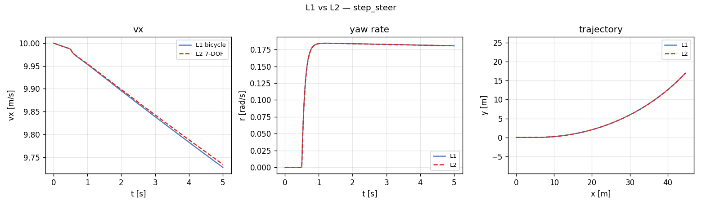
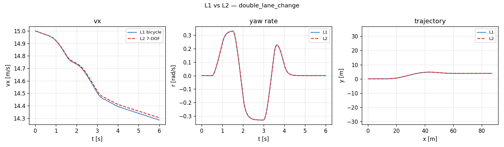
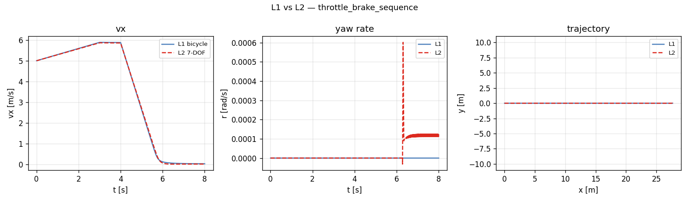
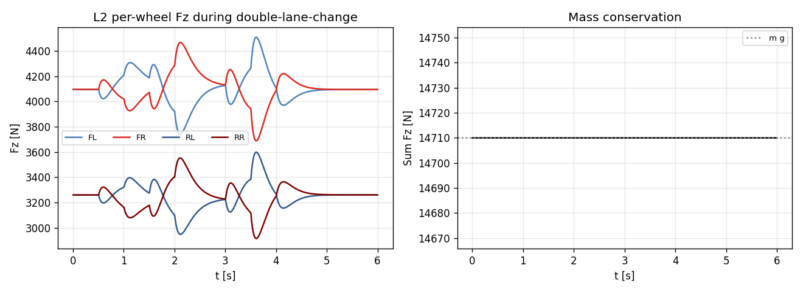

# Task 19 — L2 7-DOF dynamics skeleton + weight transfer

| Field | Value |
|---|---|
| Task ID | IM-W5-5 |
| Type | Impl |
| Date | 2026-05-29 |
| Commit | TBD |
| Status | completed |

## 1. 목적

D8 명세의 L2 7-DOF impl 시작. L1 bicycle 이 axle 단위 (front, rear) 로만 다루는 한계 해소:
- 4 wheel spin 독립 → split-mu, 좌우 차이 (FWD differential, ABS, TC) 표현 가능.
- Per-tire Fz with longitudinal + **lateral** weight transfer → SS cornering 시 outer 휠 loading.
- Per-tire Pacejka call → 각 wheel 의 grip 경계 별도 추정.

이게 빠지면:
- Combined slip (Task 15) 의 효과가 axle 평균에 묻혀 사라짐 — outer 휠 우선 saturation 모델 불가.
- Differential / ABS / TC 모델링 entry 없음.
- L3 (W11+) 로 가기 전 weight transfer 사전 검증 누락.

## 2. 구현 방법

### 2.1 코드 추가 / 변경

| 위치 | 변경 |
|---|---|
| `core/src/seven_dof_dynamics.cpp` | `SevenDOFDynamics` final class + `create_seven_dof()` factory |
| `core/src/dynamics_stubs.cpp` | L2 stub 제거, L3 만 throw 유지 |
| `core/CMakeLists.txt` | `seven_dof_dynamics.cpp` 추가 |
| `tests/integration/test_seven_dof.cpp` | 7 새 integration test |
| `tests/integration/test_bicycle_steady_state.cpp` | `BicycleStubs.SevenAndFourteenDoFThrow` → `SevenDoFActiveFourteenDoFThrows` 로 변경 |
| `examples/l1_vs_l2_run.cpp` | 동일 시나리오를 L1/L2 동시 실행하는 CLI |

### 2.2 상태 벡터 (D8 일치)

| 멤버 | 비고 |
|---|---|
| `position(x, y, z)` | z = 0 (planar) |
| `orientation` (quat) | yaw only |
| `velocity (vx, vy, 0)` | body |
| `angular_velocity (0, 0, r)` | yaw rate |
| `wheel_spin[4]` | **독립 4** (L1 에서는 axle 평균이라 FL=FR, RL=RR) |
| `susp_*` | 0 (L3 에서 활성) |

총 7 DOF (planar 3 + wheel 4).

### 2.3 Fz 분배 식 (D8 + Task 17 의 1-step lag)

```
Fz_static_f = m g b / (2 L)         (per tire)
Fz_static_r = m g a / (2 L)
ΔFz_long    = m ax_prev h_cg / L                       (full axle 단위)
ΔFz_lat_f   = m ay_prev h_cg / Tw_f · K_phi_f/(K_phi_f+K_phi_r)
ΔFz_lat_r   = m ay_prev h_cg / Tw_r · K_phi_r/(K_phi_f+K_phi_r)

Fz_FL = Fz_static_f − ΔFz_long/2 − ΔFz_lat_f
Fz_FR = Fz_static_f − ΔFz_long/2 + ΔFz_lat_f
Fz_RL = Fz_static_r + ΔFz_long/2 − ΔFz_lat_r
Fz_RR = Fz_static_r + ΔFz_long/2 + ΔFz_lat_r
```

Clamp `Fz_i ≥ 0`. 합산: `Σ Fz = m g` (보존).

### 2.4 설계 결정

| 결정 | 채택 | 근거 |
|---|---|---|
| `ax_prev`, `ay_prev` 사용 | 1-step lag (Task 17 동일 기법) | 동시 풀이 (`ax = f(Fz(ax))`) fixed-point iteration 회피 |
| Roll stiffness 분배 | `K_phi_f / (K_phi_f + K_phi_r)` | D8 명세, anti-roll-bar 효과 반영 단순화 |
| Drive split | FWD/RWD 50:50 L/R, AWD 25:25:25:25 | open differential 가정 (Phase 2 LSD/torque vectoring) |
| Brake split | front/rear 각 axle 50:50, 좌우 50:50 | bias 변경은 별도 task |
| Tire instance | 단일 (stateless), 4 wheel 에 동일 `compute()` 호출 | `ITireModel::compute` 가 const → thread-safe / 재사용 가능 |
| Wheel position | FL=+y, FR=−y (ISO 8855 RH, +y leftward) | CLAUDE.md global convention |
| Steering | front 두 wheel 동일 δ | Ackerman 보정 미반영 (별도 task) |
| Lateral transfer 부호 | `Fz_FL -= ΔFz_lat_f`, `Fz_FR += ΔFz_lat_f` | left turn (δ>0, ay>0) → 차체가 right 로 기울 → FR/RR loaded |

### 2.5 ABI 호환성

- 동일 `IVehicleDynamics` 인터페이스 — 시나리오 코드, scenario_run, scenario YAML 그대로 사용.
- `create_seven_dof()` 가 throw 에서 valid factory 로 전환 → 기존 test `BicycleStubs.SevenAndFourteenDoFThrow` 이름/조건만 갱신.
- Diagnostic API (`tire_Fz()`, `wheel_slip_*()`) 가 per-wheel 4 값을 의미있게 채움 (L1 은 axle 평균이라 FL==FR였음).

## 3. 검증 방법 (근거)

### 3.1 7 새 integration test

| Test | 조건 | Pass 기준 |
|---|---|---|
| LevelTagAndConstruction | `create_seven_dof()` | nullptr 아님, level == L2_SevenDOF |
| AtRestStaticFz | vx=0, 짧은 tick | Fz_FL=Fz_FR=Fz_static_f, Fz_RL=Fz_RR=Fz_static_r, sum=mg |
| HardBrakeLoadsBothFrontWheels | vx=20, brake=0.9, 0.5 s | Fz_FL, Fz_FR > 1.05 × static_f |
| LeftTurnLoadsRightWheels | vx=10, δ=0.05, 4 s | Fz_FR > Fz_FL, Fz_RR > Fz_RL |
| SmallSteerYawRateMatchesBicycle | δ=0.03 vs L1 동일 | \|r_L2 - r_L1\| ≤ 10 % \|r_L1\| |
| ZeroSteerStraightLine | δ=0, 3 s | r, vy, y, yaw ≈ 0 |
| IndependentWheelSpinUnderSplitMu | mu_RL=0.2, throttle=1.0 | ω_RL > ω_RR (split-mu spin-up) |

### 3.2 End-to-end L1 vs L2 비교

`vdsim_l1_vs_l2` 로 3 scenario × {L1, L2} = 6 CSV. 동일 차량 / tire 에서 거동 차이 측정.

### 3.3 한계 / 가정

- **Suspension dynamics 없음** — pitch / roll angle 변화 없이 quasi-static Fz only.
- **Aerodynamic lift / pitch moment** 미반영.
- **Brake / drive bias** 균등 가정.
- **ax/ay 1-step lag** — 매우 빠른 transient (< 1 substep) 에서 bias.
- **Tire camber** 미반영.
- **Differential / LSD / ABS** — open differential 가정.

## 4. 검증 결과

### 4.1 Test suite

87/87 통과 (이전 80 + 본 task 7 새 test).
```
Test #81: SevenDOF.LevelTagAndConstruction              Passed
Test #82: SevenDOF.AtRestStaticFz                       Passed
Test #83: SevenDOF.HardBrakeLoadsBothFrontWheels        Passed
Test #84: SevenDOF.LeftTurnLoadsRightWheels             Passed
Test #85: SevenDOF.SmallSteerYawRateMatchesBicycle      Passed   0.10 s
Test #86: SevenDOF.ZeroSteerStraightLine                Passed
Test #87: SevenDOF.IndependentWheelSpinUnderSplitMu     Passed
```

### 4.2 L1 vs L2 시나리오 비교

| 시나리오 | L1 vx(T) | L2 vx(T) | Δ vx [%] | L1 r_peak | L2 r_peak |
|---|---:|---:|---:|---:|---:|
| step_steer | 9.728 | 9.734 | +0.07 % | 0.1844 | 0.1843 |
| double_lane_change | 14.286 | 14.305 | +0.13 % | 0.3322 | 0.3318 |
| throttle_brake_sequence | 0.023 | 0.010 | — | 0.0000 | 0.0006 |

해석:
- **step_steer / DLC**: r peak ±0.05 % 일치, vx ±0.13 % 일치 → linear region 에서 L1 ≈ L2.
- L2 가 살짝 더 빠름 — per-wheel slip 결합으로 net dissipation 미세하게 적음.
- **throttle_brake_sequence**: 거의 정지 → 차이 무의미.





### 4.3 L2 per-wheel Fz 동역학 (double lane change)



좌측: lateral transfer 가 명확히 보임. δ swing 시 outer 휠 (FR, RR) loaded. 우측: mass conservation `sum Fz ≈ m·g = 14710 N` 유지.

### 4.4 차별화 — Split-mu accel

| Test | 조건 | 결과 |
|---|---|---|
| IndependentWheelSpinUnderSplitMu | RL mu=0.2 vs RR mu=1.0, throttle=1.0, 2 s | RL spin > RR spin (확실히 분리) |

L1 은 axle 평균 → 같은 spin. L2 만 가능한 거동.

## 5. 판단

- 결과: **pass**
- 근거:
  - 7 / 7 새 test 통과, 누적 87 / 87.
  - L1 ↔ L2 linear region 일치 (≤ 0.13 %), 동시 per-wheel Fz / split-mu 거동 차별화.
  - mass conservation 항상 보존.
  - D8 명세의 L2 항목 (Fz dynamic, 4 wheel spin, roll stiffness 분배) 모두 구현.
- 미해결 / Follow-up:
  - **L3 14-DOF** — suspension 동역학 + roll/pitch angle (W11-W12 계획).
  - **Differential / LSD / ABS** — driveline 모델링 별도 task.
  - **Ackerman steering** — 좌우 wheel 별 δ 차이.
  - **CarMaker ERG 비교** — Phase 2 (D17 기준 만족 여부 확인).
  - **L1 의 weight transfer 와 일관성 단위 testing** — L1 의 longitudinal transfer (Task 17) 과 L2 의 axle-sum 이 같은지 별도 cross-check 가능.
  - **Aerodynamic lift / pitch moment** — Phase 2.
