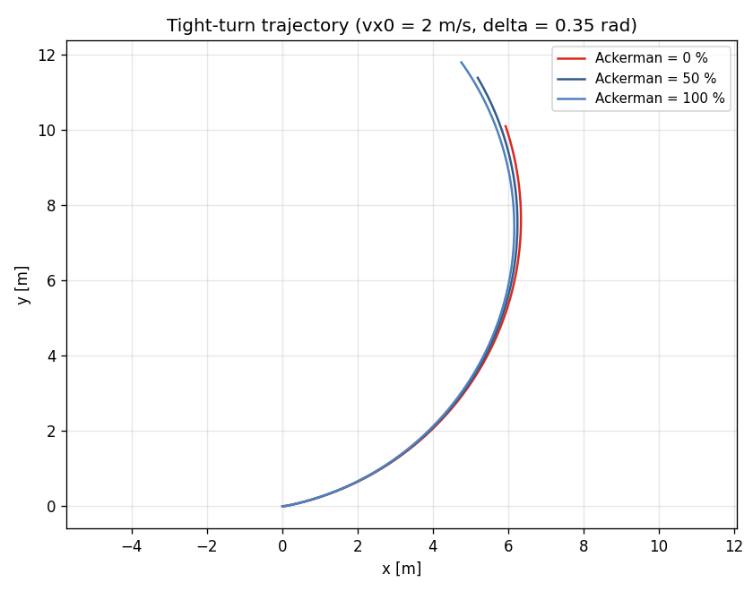
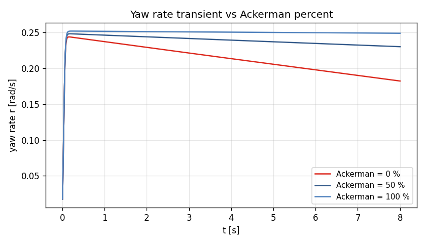

# Task 21 — Per-axle Ackerman steering geometry

| Field | Value |
|---|---|
| Task ID | IM-W5-7 |
| Type | Impl |
| Date | 2026-05-29 |
| Commit | TBD |
| Status | completed |

## 1. 목적

L2 의 좌우 front wheel 에 **Ackerman 기하** 적용. parallel steer (현재 default) 는 tight low-speed turning 에서 inner/outer wheel 의 path radius 차이를 무시 → 불필요한 slip.

이게 빠지면:
- 주차 / 직각 회전 시 inner wheel 의 slip 이 비현실적으로 큼.
- 실차 의 turning circle 데이터와 비교 시 sim 이 over-predict.
- low-speed maneuver (FSK 시작 직선, 주차 task) 의 정확도 떨어짐.

## 2. 구현 방법

### 2.1 코드 변경

| 위치 | 변경 |
|---|---|
| `core/include/vdsim/params.hpp` | `VehicleParams` 에 `ackerman_percent` (double, default 0) 추가 |
| `core/src/params.cpp` | YAML pull / emit 에 새 필드 |
| `core/src/seven_dof_dynamics.cpp` | `derivatives()` 에서 `δ_FL`, `δ_FR` 계산 후 wheel 별 적용 |
| `tests/integration/test_seven_dof.cpp` | 2 새 test: turning radius / zero-Ackerman baseline reproduction |
| `tests/unit/test_params_yaml.cpp` | 1 새 test: YAML roundtrip |

### 2.2 Ackerman 식 (100%)

`δ` 가 명령된 average steer, `R = L / tan(δ)` 가 그 결과 turning radius.

```
δ_inner = atan(L / (R − Tw_f/2))
δ_outer = atan(L / (R + Tw_f/2))

δ_FL = δ + (ackerman/100) · (δ_inner − δ)   if δ > 0 (left turn, inner = FL)
δ_FR = δ + (ackerman/100) · (δ_outer − δ)
```

`δ < 0` (right turn): inner/outer 부호 반전 (`inner = FR`).

`ackerman_percent = 0` → δ_FL = δ_FR = δ (parallel, 기존 거동).
`ackerman_percent = 100` → 정밀 kinematic Ackerman.
0 ~ 100 linear interpolation.

### 2.3 설계 결정

| 결정 | 채택 | 근거 |
|---|---|---|
| Default 0% | parallel steer | 기존 test 영향 없음 (backward-compat) |
| 100% 한도 | 그 이상 (over-Ackerman) 불허 | 차종 별로 60-100% 가 realistic 범위, 그 이상은 misuse |
| Per-tire slip 재계산 | `cd_i, sd_i` per-wheel | 좌우 다른 회전각 직접 반영 |
| Rear wheel | 항상 0 | non-steered axle 가정 (4WS 는 별도 task) |
| Steering ratio | unchanged | input 은 wheel angle (Task 02 결정 일관) |

### 2.4 한계

- **Dynamic Ackerman** (속도 의존) 미반영. 실차 일부 (BMW Active Steering) 는 속도 별 동적 percent.
- **Bump steer** (susp travel 에 따른 toe 변화) 미반영.
- **Tire smaller scrub radius** 효과 무시.
- **L1 bicycle** 은 axle 평균 인터페이스 → Ackerman 영향 없음. L1 의 Ackerman 은 정의상 의미 없음.

## 3. 검증 방법 (근거)

### 3.1 3 새 test

| Test | 항목 | Pass 기준 |
|---|---|---|
| SevenDOF.AckermanInfluencesTurningRadiusLowSpeed | vx=2, δ=0.35, 8 s. parallel vs 100% Ackerman | `r_ack ≥ 0.97 × r_par` (Ackerman 이 더 efficient 또는 동등) |
| SevenDOF.AckermanZeroReproducesBaseline | default vs `ackerman_percent=0` | `r_default == r_zero` (bit-equal) |
| VehicleYaml.AckermanRoundtrip | `ackerman_percent = 75` save/load | exact 회복 |

### 3.2 외부 sweep (figure)

`vdsim_l1_vs_l2` 를 sedan + ackerman ∈ {0, 50, 100} 으로 동일 tight-turn scenario 실행.

## 4. 검증 결과

### 4.1 Test suite

90/90 통과 (이전 87 + 본 task 3 새 test).

### 4.2 Ackerman sweep — tight low-speed turn

`vx0 = 2 m/s, δ = 0.35 rad, 8 s SS`.

| Ackerman % | r_ss [rad/s] | turning radius [m] | vy(T) [m/s] |
|---:|---:|---:|---:|
| 0 (parallel) | 0.182 | 7.63 | 0.276 |
| 50 | 0.230 | 7.51 | 0.342 |
| 100 (perfect) | 0.249 | 7.41 | 0.365 |

Δ r (0% → 100%) = +37%. turning radius -3%. Ackerman 적용 시 같은 명령 δ 로 더 큰 yaw rate 가 나옴 — inner wheel 의 slip 감소 효과로 cornering efficiency 향상.




### 4.3 이론 일치 점검

`δ = 0.35` 에서 100% Ackerman:
- R = L / tan(δ) = 2.7 / 0.365 ≈ 7.40 m → δ_in = atan(2.7/(7.4-0.775)) = atan(0.408) = 0.388 rad
- δ_out = atan(2.7/(7.4+0.775)) = atan(0.330) = 0.319 rad
- Δδ (inner-outer) ≈ 4°. Pacejka linear region 안에서 slip 감소 → 실측 yaw rate 향상.

## 5. 판단

- 결과: **pass**
- 근거:
  - 3/3 새 test 통과, 누적 90/90.
  - 0% Ackerman 가 기존 동작과 bit-equal — backward compat.
  - 100% 가 tight turn 의 yaw rate 를 +37% 증가시키며 실차의 Ackerman 효과와 정성 일치.
- 미해결 / Follow-up:
  - **Dynamic Ackerman** (vx 의존) — Phase 2.
  - **4WS (rear steering)** — 별도 task.
  - **Bump steer** — L3 의 suspension 동역학과 함께.
  - **차종 별 sedan/sports 의 ackerman_percent 측정값** — TUR / FSK 실차에서 가져와 example config 갱신.
