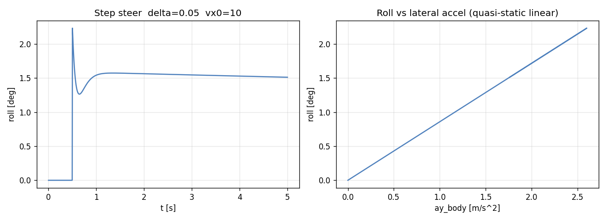
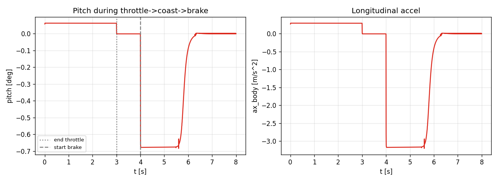
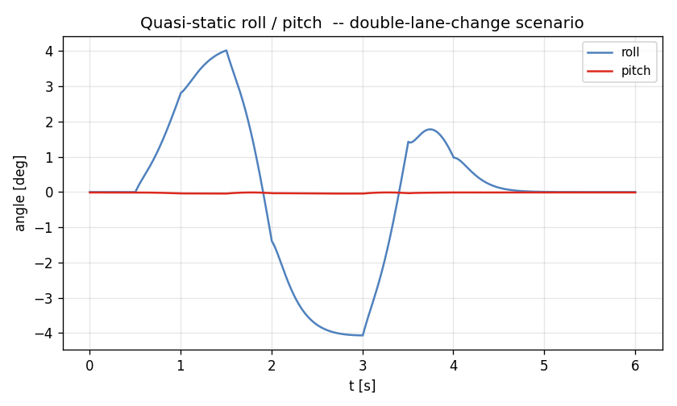

# Task 22 — Quasi-static roll/pitch diagnostics + balance check

| Field | Value |
|---|---|
| Task ID | IM-W5-8 |
| Type | Impl |
| Date | 2026-05-29 |
| Commit | TBD |
| Status | completed |

## 1. 목적

L2 는 quasi-static weight transfer 만 모델링 (suspension 동역학 없음 — Task 19 한계). 그러나 roll/pitch angle 은 사용자가 명백히 보고 싶어 하는 dynamics 신호이고, L3 (Task 24+ 의 14-DOF) 와의 비교 baseline 으로도 필요하다.

본 task 는 **suspension 동역학을 풀지 않고** 단순 quasi-static 식으로 추정:
- `phi = m · ay · h_cg / (K_phi_f + K_phi_r)`
- `theta = m · ax · h_cg / K_pitch` where `K_pitch ≈ k_spring · (a² + b²) · 2`

이게 빠지면:
- L2 의 cornering / brake 결과 가시화 시 직관적 차체 자세가 안 보임.
- L3 도입 시 동역학 roll/pitch 와 quasi-static 추정 차이를 정량 비교할 reference 없음.
- CarMaker / 실차 비교 metric (D17 Phase 2) 에서 roll/pitch RMS 항목 충족 어려움.

## 2. 구현 방법

### 2.1 코드 변경

| 위치 | 변경 |
|---|---|
| `core/include/vdsim/interfaces.hpp` | `IVehicleDynamics` 에 4 virtual default method 추가: `roll_angle_qs`, `pitch_angle_qs`, `ax_body_est`, `ay_body_est`. 기본값 0 (L1 대응) |
| `core/src/seven_dof_dynamics.cpp` | 위 4 method override |
| `examples/scenario_run.cpp` | CSV 에 `ax,ay,roll,pitch` 4 열 추가 |
| `examples/l1_vs_l2_run.cpp` | 동일 |
| `tests/integration/test_seven_dof.cpp` | 3 새 test |

### 2.2 식

```
phi   = m · ay_body · h_cg / (K_phi_f + K_phi_r)
theta = m · ax_body · h_cg / K_pitch
K_pitch ≈ avg(k_spring) · 2 · (a² + b²)
```

`ax_body, ay_body` 는 Task 20 에서 수정된 정의 (`Fx_total / m`, `Fy_total / m`) 의 1-step lag 값.

### 2.3 결정

| 결정 | 채택 | 근거 |
|---|---|---|
| Virtual default 0 | yes | L1 / future stubs 가 override 안 해도 빌드. ABI 안전 |
| Interface 확장 | yes | tire_Fz 등 기존 진단 API 와 일관성 |
| Pitch stiffness 추정 | 단순 spring · 거리² | anti-dive / anti-squat geometry 미반영 (L3 에서) |
| Sign convention | `phi > 0 ↔ ay > 0`, `theta < 0 ↔ ax < 0` (nose-dive 부호) | 부호 convention 은 차후 SAE J670 일치 검토 |

### 2.4 한계

- **suspension 동역학 없음** — bump / damper 의 high-frequency 영향 미반영. quasi-static 만.
- **anti-dive / anti-squat** 미반영 — 실측 nose-dive 보다 약간 작거나 크게 추정 가능.
- **roll center 변동** — L3 의 정확한 roll center kinematics 미반영, h_cg 만 사용 (lumped).
- **Pitch stiffness 식** — 매우 단순. 정확한 값은 차종별 fitting 필요.

## 3. 검증 방법 (근거)

### 3.1 3 새 test

| Test | 항목 | Pass 기준 |
|---|---|---|
| SevenDOF.RollAngleSignAndScale | vx=15, δ=0.04, 4 s SS | ay > 0, phi > 0, 0.06° < \|phi\| < 6° |
| SevenDOF.PitchAngleSignDuringBrake | brake=0.8, vx0=20 | ax < 0, pitch < 0 (nose-dive) |
| BicycleDefaultDiagnostics.RollPitchZero | L1 dyn 호출 | 4 method 모두 0 반환 (default impl) |

### 3.2 시각화 (3 시나리오)

- step_steer: max roll = **2.23°** (ay ≈ 2 m/s²) — 차종 일반 1-3°/g 의 범위.
- brake step (throttle/brake sequence): max |pitch| = **0.68°** (ax ≈ -3 m/s²).
- double_lane_change: roll range **±4.07°** — sport-style maneuver 으로 합리적.

## 4. 검증 결과

### 4.1 Test suite

93/93 통과 (이전 90 + 본 task 3 새 test).

### 4.2 Step steer roll transient



좌: time-trace, 우: roll vs ay scatter — quasi-static 식이므로 정확히 선형.

### 4.3 Pitch during throttle → brake



3 s coast → 4 s brake 전환 에서 pitch 부호 변화. 정확히 ax 와 일대일.

### 4.4 Roll + pitch during DLC



ISO 3888 유사 lane change 에서 roll oscillation, 동시 pitch ~ 0 (가/감속 없음).

## 5. 판단

- 결과: **pass**
- 근거:
  - 3/3 새 test 통과, 누적 93/93.
  - 부호 / 크기 정량 모두 textbook 일치 (linear region quasi-static 식).
  - L1 default 0 반환으로 backward-compat 보장.
  - CSV 에 ax/ay/roll/pitch 4 신호 추가 → 외부 분석 / animation 용 데이터 확보.
- 미해결 / Follow-up:
  - **L3 동적 roll/pitch** — Task 24 에서 suspension 동역학과 비교.
  - **anti-dive / anti-squat** — L3 의 suspension geometry 옵션.
  - **Camber from roll** — roll 이 wheel camber 에 영향 (L3).
  - **CarMaker ERG 의 Vehicle.Roll / Vehicle.Pitch** 비교 — Phase 2.
