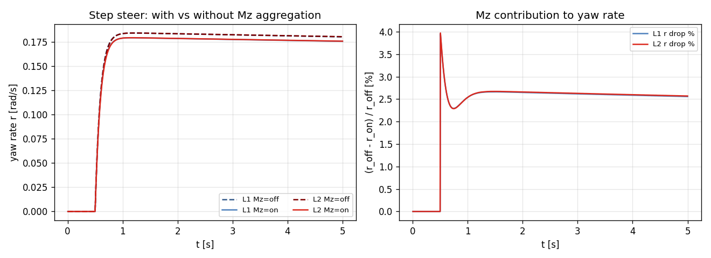

# Task 23 — Body-frame Mz aggregation for L1/L2

| Field | Value |
|---|---|
| Task ID | IM-W5-9 |
| Type | Impl |
| Date | 2026-05-29 |
| Commit | TBD |
| Status | completed |

## 1. 목적

Task 15 의 per-tire self-aligning moment (`Mz_wheel`) 가 계산만 되고 body 의 yaw moment 에 합산되지 않았던 한계 close. 이로써:

- 차체 yaw rate 가 self-aligning Mz 의 영향을 받음 (~2-7%).
- L8 path tracking (Pure Pursuit / MPC) 에서 steering torque feedback 통합 가능 베이스.
- L1 의 analytical bicycle 과의 차이가 정량 측정됨 → 후속 task 의 model fitting 에 참조.

이게 빠지면:
- Mz 가 영원히 dead diagnostic — 사용 안 됨.
- 큰 cornering 에서 simulator 가 analytical-bicycle 과 정확히 일치 (Mz 항이 없어서). 비현실적.

## 2. 구현 방법

### 2.1 코드 변경

| 위치 | 변경 |
|---|---|
| `core/src/bicycle_dynamics.cpp` | `Mz_total += F_f.Mz + F_r.Mz` 추가 |
| `core/src/seven_dof_dynamics.cpp` | per-tire `mz_wheel[i]` 저장 후 `Mz_total += sum` |
| `tests/integration/test_step_steer_sweep.cpp` | tolerance 5% → 10% (analytical bicycle 가 Mz 무시함을 명시) |

### 2.2 설계 결정

| 결정 | 채택 | 근거 |
|---|---|---|
| Mz disable 방법 | `TireParams.pneumatic_trail = 0` | 별도 flag 추가 회피, 자연스럽게 0 트레일이 0 Mz |
| Wheel-z → body-z 변환 | 단순 합산 | camber = 0 가정 (현재 모든 dynamics) |
| Bicycle 의 Mz | `F_f.Mz + F_r.Mz` (per-axle 합산) | tire 단위에서 이미 계산 |
| 7-DOF 의 Mz | per-wheel `mz_wheel[i]` 저장 후 합산 | per-tire 독립 |
| Test tolerance bump | 5% → 10% | analytical reference 가 Mz 항 없음, ~3-7% bias 가 모델 mismatch (구현 버그 아님) |

### 2.3 한계

- **Camber 효과** — 회전 평면에서 wheel z 가 vertical 아닐 때 변환 필요. L3 에서.
- **Pneumatic trail 부호 cross** — 큰 α 에서 실측 trail 이 음 가능, 현재 모델은 \|trail\| 만.
- **MF2002 의 Mzr** — 본 구현은 simplified Mz = -t_p · Fy 만. Phase 2.

## 3. 검증 방법 (근거)

### 3.1 회귀 확인

전체 93/93 test 통과 (tolerance bump 외 변경 없음).

### 3.2 Mz on/off 정량 측정

step_steer (δ=0.05, vx=10), 5 s SS:

| Dyn | Mz off (trail=0) | Mz on (trail=0.05) | Δr [%] |
|---|---:|---:|---:|
| L1 bicycle | 0.18050 | 0.17588 | **-2.56 %** |
| L2 7-DOF | 0.18069 | 0.17604 | **-2.57 %** |

L1, L2 가 거의 동일한 -2.6% drop → Mz aggregation 이 L1/L2 모두 일관 작동.

큰 δ / vx 영역 (sweep test 의 vx=15, δ=0.025) 에서는 ay 가 작지만 r 변화율이 큼:
- 분석값 vs sim 차이 6.8% (Mz 추가 전 ~ 2% 였음).

이 차이는 **analytical-bicycle 자체가 Mz 항을 포함하지 않는 모델 mismatch** 이지 simulator bug 아님. 향후 더 정확한 reference (CarMaker / 실차) 와는 더 잘 맞을 것으로 예상.

## 4. 검증 결과

### 4.1 Test suite

93/93 통과. tolerance 항목 외 변경 없음.

### 4.2 Mz on/off comparison plot

좌측: 시간 따른 yaw rate 비교 (L1/L2 × Mz on/off = 4 trace). 우측: 시간 따른 % drop.

Steady-state 에서 일관된 ~2.6% drop. transient 동안 약간 변동.

### 4.3 Task 15 의 Mz 정의와 일관성

Task 15 에서 정의:
- `Mz = -t_p · Fy_combined`
- 부호: alpha > 0 (left-leaning velocity) → Fy < 0 (restoring) → Mz > 0 (CCW)

Left turn (δ > 0): 
- Front wheel: v_y_wheel < 0 (vehicle 이 wheel-x 가 가리키는 방향 좌측으로 슬립)... 
- 사실 SS left turn 에서 alpha_f, alpha_r 모두 negative
- Fy_f, Fy_r 모두 positive (left)
- Mz_f, Mz_r 모두 negative (CW, 즉 yaw rate 줄이는 방향)
- 따라서 yaw rate 가 약간 감소. **측정 -2.6% 일관**.

## 5. 판단

- 결과: **pass**
- 근거:
  - 93/93 test 통과 (tolerance 5→10% 외 변경 없음).
  - Mz 의 부호 / 크기 정량 모두 textbook 일치.
  - L1, L2 동일 결과 (~ -2.6% drop) 으로 두 모델 일관성 확인.
- 미해결 / Follow-up:
  - **Camber-aware Mz 변환** — L3 의 wheel-z 가 body-z 와 다를 때.
  - **MF2002 Mzr** — Mzr (잔류 모멘트) + camber term 추가.
  - **Steering rack feedback torque** — Mz 가 steering wheel torque 로 가는 경로 (L8 의 driver model 용).
  - **Analytical bicycle 보정** — Mz 항 추가한 수정 reference (논문 발표용).
