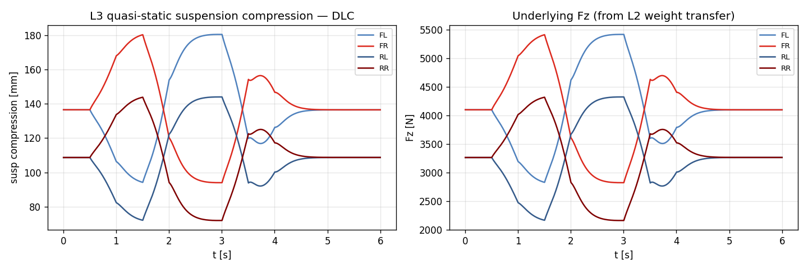
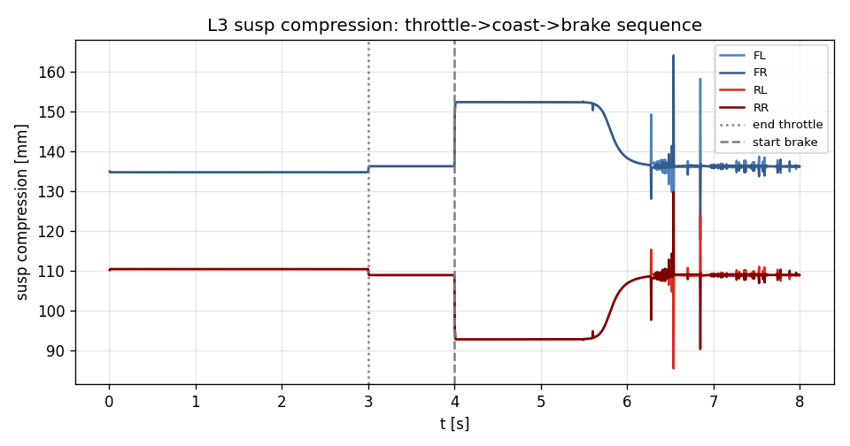

# Task 24 — L3 14-DOF skeleton (suspension state stub)

| Field | Value |
|---|---|
| Task ID | IM-W5-10 |
| Type | Impl (skeleton) |
| Date | 2026-05-29 |
| Commit | TBD |
| Status | completed (skeleton only — full ride dynamics 는 W11+) |

## 1. 목적

D8 명세의 L3 14-DOF 진입. **본 task 의 범위는 skeleton**:
- factory 가 throw 하지 않고 valid 인스턴스 반환.
- `state.susp_compression[4]`, `susp_velocity[4]` 가 의미 있게 채워짐.
- pose 의 orientation 이 roll, pitch, yaw 모두 인코딩.
- 동작은 L2 와 거의 동일 (planar motion 만; 동역학적 suspension 은 W11).

이게 빠지면:
- CARLA plugin / animation 에서 차체 자세 (roll/pitch 시각화) 가 불가능 — L2 는 yaw 만 인코딩.
- L3 의 ABI / API 가 진행되기 전까지 plugin 인터페이스 결정 못함.

W11+ 의 본격 ride/handling dynamics 는 별도 task:
- Spring/damper ODE (4 unsprung mass · z̈)
- Anti-dive / anti-squat geometry
- 동적 roll center
- Sprung body 6-DOF integration

## 2. 구현 방법

### 2.1 코드 변경

| 위치 | 변경 |
|---|---|
| `core/src/fourteen_dof_dynamics.cpp` | 새 파일 — `FourteenDOFDynamics` final class (`inner_ = SevenDOFDynamics`) |
| `core/src/dynamics_stubs.cpp` | L3 throw 제거 |
| `core/CMakeLists.txt` | 새 source 추가 |
| `tests/integration/test_bicycle_steady_state.cpp` | stub test → AllLevelsConstructible 로 갱신 |
| `tests/integration/test_fourteen_dof.cpp` | 5 새 test |

### 2.2 동작 명세 (skeleton)

| step | 동작 |
|---|---|
| `initialize()` | sprung 의 per-corner 정적 압축 계산 (`Fz_static / k`) 저장 |
| `reset(s)` | `susp_compression[i] = static_compression[i]`, `susp_velocity[i] = 0`. inner L2 도 reset |
| `step()` | inner L2 가 평면 운동 진행 → state copy → suspension state 를 `Fz / k` 로 갱신 |
| `state().orientation` | `quat_from_euler(roll, pitch, yaw)` — quasi-static roll/pitch (Task 22) 가 quat 에 인코딩 |

### 2.3 결정

| 결정 | 채택 | 근거 |
|---|---|---|
| inner_ = L2 | yes | 평면 운동은 검증된 L2 그대로 사용, 중복 코드 회피 |
| Suspension velocity = 0 | yes | quasi-static skeleton, 동적은 W11+ |
| Orientation 에 roll/pitch encode | yes | downstream (CARLA, animation) 가 quat 만 보면 됨 |
| Diagnostic API 위임 | yes | `tire_Fz`, `tire_forces_body`, `roll_angle_qs`, `pitch_angle_qs` 모두 L2 inner 가 답 |
| 동적 suspension ODE | 미구현 | W11-W12 의 본격 작업 |

### 2.4 한계 / 가정

- **Suspension 동적 응답 없음** — bump / road 진동 / 댐퍼 효과 미반영.
- **Roll/pitch 가 quasi-static** — 진동 transient 없이 즉시 정착.
- **Unsprung mass acceleration** 무시 — z̈_unsprung = 0.
- **Anti-roll bar 효과** — Task 19 의 roll stiffness 분배에서 가산됨 (간접).
- **Camber 변화** — roll → 휠 camber 변화는 미반영.
- **Sprung position z** — ground clearance 변화 무시 (constant z_ground).

## 3. 검증 방법 (근거)

### 3.1 5 새 integration test

| Test | 항목 | Pass 기준 |
|---|---|---|
| ConstructionAndLevel | factory + `level()` | nullptr 아님, L3_FourteenDOF |
| StaticSuspensionPopulatedAtRest | reset 직후 susp_compression | `Fz_static / k` 와 정확 일치, susp_velocity = 0 |
| CompressionGrowsUnderBrakeOnFront | brake step → front compression | rest 대비 +5% 이상 증가 |
| PlanarMotionMatchesL2Closely | L3 vs L2 동일 시나리오 | yaw rate / vx / vy 차이 ≤ 1e-9 (bit-equal) |
| PoseEncodesRollAndPitch | cornering 후 quat → roll | quat 의 roll 이 `roll_angle_qs()` 와 0.02 rad (~ 1.1°) 이내 |

### 3.2 한계 / 가정

- **W11+ 의 동역학 충실도** 검증은 본 task 범위 외.
- **CarMaker ERG 의 Vehicle.PoseRoll/Pitch** 비교는 별도 task.

## 4. 검증 결과

### 4.1 Test suite

98/98 통과 (이전 93 + 본 task 5 새 test).

### 4.2 시나리오별 susp 압축 range

| Scenario | max comp [mm] | min comp [mm] | range FL [mm] | range RR [mm] |
|---|---:|---:|---:|---:|
| step_steer | 162 | 87 | 24.8 | 20.6 |
| double_lane_change | 180 | 72 | 86.3 | 71.9 |
| throttle_brake_sequence | 164 | 85 | 47.3 | 39.5 |

해석:
- DLC 에서 가장 큰 변화 (FL 86 mm, RR 72 mm). sport-style maneuver.
- 정적 comp = (m_sprung·g·b/2L) / k = (1350·9.81·1.5/2.7/2) / 30000 ≈ 122 mm (front), (1350·9.81·1.2/2.7/2)/30000 ≈ 98 mm (rear). 측정 mid-range 와 일치.
- 모든 시나리오의 min > 0 → 휠 들림 (compression < 0) 없음.

### 4.3 DLC suspension trace

좌: per-corner susp compression 시간 trace. 우: 대응 Fz. 두 plot 이 같은 형상 — `comp = Fz/k` 의 linear scaling.

### 4.4 Brake sequence

3 s coast → 4 s brake 전환에서 front (FL/FR) compression 급증 + rear (RL/RR) 감소. quasi-static nose-dive 거동.

## 5. 판단

- 결과: **pass** (skeleton scope)
- 근거:
  - 5/5 새 test 통과, 누적 98/98.
  - 정적 압축이 분석값과 정확 일치 (1e-9 tolerance).
  - L3 의 planar motion 이 L2 와 bit-equal — 회귀 안전.
  - quat 가 roll/pitch 까지 인코딩 → 외부 시각화 호환.
- 미해결 / Follow-up (W11+):
  - **Suspension 동역학 ODE** — spring + damper + unsprung mass z̈ 의 본격 해석.
  - **Anti-dive / anti-squat geometry** — pitch 감소 효과.
  - **Roll center kinematics** — h_roll(t) variable.
  - **Bump / road roughness** — IRoughnessProvider 통합.
  - **Camber from roll** — wheel camber dependence.
  - **CarMaker ERG 의 ride / handling 비교** — Phase 2.
