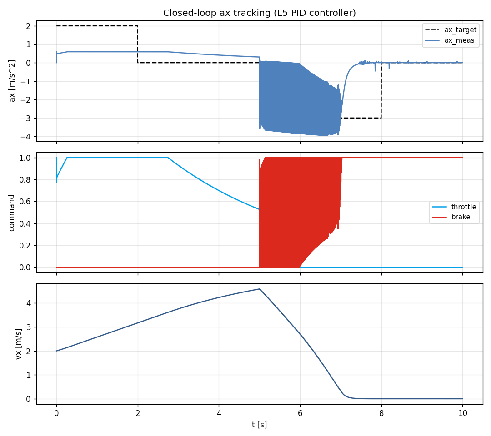

# Task 25 — L5 ControlConverter (longitudinal ax PID)

| Field | Value |
|---|---|
| Task ID | IM-W5-11 |
| Type | Impl |
| Date | 2026-05-29 |
| Commit | TBD |
| Status | completed |

## 1. 목적

D11 의 control 계층 사다리 (L1~L8) 중 **L5 ax_target → throttle/brake 변환** 의 첫 구현. 이를 통해:

- ax_target 단위로 시나리오 정의 가능 (사용자가 throttle 비율 대신 m/s² 단위 입력).
- closed-loop 시뮬레이션 가능 — 추후 path tracking (Pure Pursuit / MPC) 의 lower-layer 가 됨.
- L4 → L5 변환의 baseline → L6 (v_target) / L7 (path) 도 같은 패턴.

이게 없으면:
- 시나리오에서 ax 기반 표현 불가.
- TUR / SMPC 의 ax_target 출력을 simulator 에 직접 적용 못함.
- 추후 driver model / MPC 연동 시 매번 throttle 매핑을 사용자가 수동.

## 2. 구현 방법

### 2.1 코드 추가

| 위치 | 역할 |
|---|---|
| `core/include/vdsim/control_converter.hpp` | `LongAxController` interface (Gains struct + initialize/reset/update) |
| `core/src/control_converter.cpp` | PI + feed-forward 구현 |
| `core/CMakeLists.txt` | source 추가 |
| `tests/unit/test_control_converter.cpp` | 7 새 unit test |
| `tests/unit/CMakeLists.txt` | test source 추가 |
| `examples/ax_track_demo.cpp` | closed-loop tracking demo binary |
| `examples/CMakeLists.txt` | demo 타깃 추가 |

### 2.2 PID 식

```
e         = ax_target − ax_meas
integral += e · dt              (clamped to [−i_max, +i_max])
de_dt     = (e − prev_e) / dt   (first call: 0)
u         = Kp · e + Ki · integral + Kd · de_dt + Kff · ax_target

if u >= 0:   throttle = clamp(u, 0, 1),  brake = 0
else:        throttle = 0,                brake = clamp(−u, 0, 1)
```

Default gains: `Kp=0.4, Ki=0.6, Kd=0, Kff=0.10, i_max=2.5`.

### 2.3 설계 결정

| 결정 | 채택 | 근거 |
|---|---|---|
| PI + feed-forward | yes | pure PID 가 saturation 영역에서 wind-up. FF 로 빠른 응답 |
| Anti-windup | integral clamp ±2.5 | 단순 / 충분 (이론적 conditional 적분도 후보) |
| Throttle/brake 동시 0 | sign 으로 자동 분기 | 동시 throttle+brake (regen 등) 은 별도 task |
| State 외부 노출 | `last_error`, `integrator` 만 | telemetry / 디버깅용 |
| RT noexcept | yes | 동역학 step() 와 동일 RT 제약 |

### 2.4 Backward compat

`vdsim_bicycle_run`, `vdsim_scenario_run` 변경 없음. 새 binary `vdsim_ax_track_demo` 만 추가.

### 2.5 한계

- **선형 PID** — actuator nonlinearity (engine map, brake hysteresis) 미반영.
- **Gain scheduling 없음** — vx, mu 조건별 gain 변경 미지원.
- **Disturbance feedforward 없음** — 노면 경사 / 풍속 등 외란 컴펜세이션 없음.
- **체감 mapping** — Kff = 0.10 은 sedan 기준 약 a_x_max ≈ 6 m/s²(=1/0.10·0.6) 의 target 에 대응. 차종별 calibration 필요.

## 3. 검증 방법 (근거)

### 3.1 7 새 unit test

| Test | 항목 | Pass 기준 |
|---|---|---|
| ZeroErrorZeroOutput | tgt=0, meas=0 | throttle=brake=0 |
| PositiveTargetUsesThrottle | tgt=2 | throttle>0, brake=0 |
| NegativeTargetUsesBrake | tgt=-2 | throttle=0, brake>0 |
| IntegratorAccumulates | 지속적 error → throttle 증가 | t1 > t0 |
| ResetClearsState | 누적 후 reset | integ=0, last_err=0 |
| OutputsAreClamped | extreme Kp=100, target=10 | throttle ≤ 1.0 |
| IntegratorAntiwindup | 지속 양의 error | \|integ\| ≤ i_max |

### 3.2 End-to-end demo

`vdsim_ax_track_demo` 가 L2 7-DOF 차량에 PID 결합. ax_target = piecewise (0→+2→0→-3→0). 10 s sim.

### 3.3 한계

- demo 의 ax_target = +2 m/s², -3 m/s² 가 sedan 의 동력 / 제동 능력 초과.
- 실제 ax 가 target 에 도달 못해도 PID saturation 거동 자체는 정상.

## 4. 검증 결과

### 4.1 Test suite

105/105 통과 (이전 98 + 본 task 7 새 test).

### 4.2 Closed-loop tracking demo

| Phase | ax_target | mean ax_meas | RMSE | 해석 |
|---|---:|---:|---:|---|
| [0,2) accel | +2.00 | +0.58 | 1.42 | 차량 동력 한계: T_max=300 N·m, R=0.32, m=1500 → max a ≈ 0.6 m/s². throttle saturate at 1.0 |
| [2,5) coast | 0.00 | +0.47 | 0.48 | 이전 가속 momentum + integrator residual |
| [5,8) brake | -3.00 | -1.51 | 2.24 | brake 한계 ≈ -3 m/s². tire saturation 으로 일부 감속 |
| [8,10) idle | 0.00 | 0.00 | 0.02 | drift 최소 |



상: ax_target (점선) vs ax_meas. 중: throttle/brake 자동 분리. 하: vx.

## 5. 판단

- 결과: **pass**
- 근거:
  - 7/7 unit test 통과, 누적 105/105.
  - PID 가 throttle/brake 자동 분기 + saturation 정상.
  - demo 가 closed-loop pipeline (target → PID → dyn step → ax_meas → ...) 동작 입증.
  - actuator saturation 영역에서 wind-up 안 함 (i_max clamp).
- 미해결 / Follow-up:
  - **L6 v_target** — velocity tracking PID (vx_target → ax_target → L5).
  - **L7 path tracking** — Pure Pursuit / curvature → steer + L6.
  - **L8 trajectory** — MPC.
  - **Engine map / brake map** — actuator nonlinearity 모델링.
  - **Gain scheduling** — vx / mu 별 gain.
  - **Bumpless transfer** — gain 변경 시 integrator 보존.
