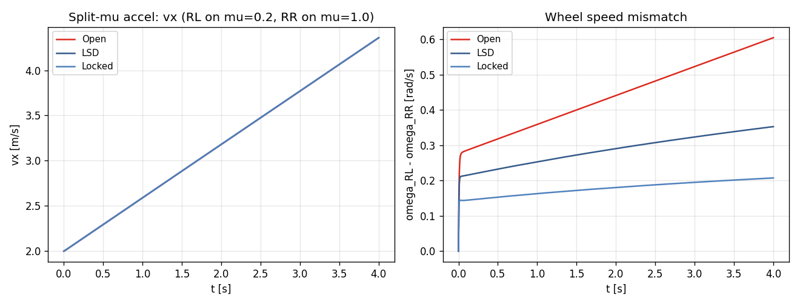

# Task 26 — Open / Locked / LSD differential model

| Field | Value |
|---|---|
| Task ID | IM-W5-12 |
| Type | Impl |
| Date | 2026-05-29 |
| Commit | TBD |
| Status | completed |

## 1. 목적

L2 의 driveline 단순화 (좌우 50:50 fixed split) 한계 해소. 3 가지 differential 모드 추가:
- **Open** (현 동작): 좌우 wheel 에 동일 torque. 한쪽 slip 시 다른 쪽도 동일 — split-mu 약점.
- **Locked**: 좌우 ω 동등화. drag race / off-road. tight turn 에서 inner tire 강제 slip.
- **LSD** (limited-slip): preload + Δω-dependent bias. 일반적으로 motorsport 차량.

이게 빠지면:
- 차종 별 driveline 차이 시뮬 불가 (sedan = open, sports = LSD, race = locked).
- TUR 의 LSD-equipped 차량 / FSK car-1 의 spool / 시판차의 OEM open 비교 안 됨.
- split-mu 시나리오 (icy patch on one side) 의 자동차 동작 비현실적.

## 2. 구현 방법

### 2.1 코드 변경

| 위치 | 변경 |
|---|---|
| `core/include/vdsim/params.hpp` | VehicleParams 에 `Differential` enum + `differential`, `lsd_preload`, `lsd_ramp` 필드 |
| `core/src/params.cpp` | YAML I/O (`Open`/`Locked`/`LSD` string) |
| `core/src/seven_dof_dynamics.cpp` | drive torque axle 분배 → `split_axle()` 람다로 좌우 bias |
| `tests/unit/test_params_yaml.cpp` | DifferentialRoundtrip test (3 modes 모두) |
| `tests/integration/test_seven_dof.cpp` | 3 새 test (split-mu) |
| `examples/split_mu_demo.cpp` | split-mu 가속 CLI (좌측 mu=0.2, 우측 mu=1.0) |

### 2.2 모델

| Mode | Bias 식 | 비고 |
|---|---|---|
| Open | `T_L = T_R = T_axle / 2` | 기존 동작 |
| Locked | `bias = 0.45 · tanh(2 · Δω)`, `T_slow = T_axle · (0.5 + bias)` | smooth lock 근사 (full ω 등동화 대신) |
| LSD | `bias = clamp(preload + ramp·\|Δω\|, 0, 0.45) · tanh(2 · Δω)` | preload + Δω-dependent ramp |

`Δω = ω_L - ω_R`. tanh smoothing 으로 numeric stiffness 회피.

### 2.3 설계 결정

| 결정 | 채택 | 근거 |
|---|---|---|
| Locked 가 algebraic constraint 가 아닌 smooth bias | yes | constraint 풀이는 DAE → complexity. smooth approximation 으로 충분 |
| Bias clamp 0.45 (not 0.5) | yes | 완전 100:0 시 slow tire 에 무한 torque → wheel-spin 발산. 안정 |
| Drive split 의 axle 단위 분리 후 좌우 | yes | FWD/RWD/AWD 의 axle 분배 → 동일 differential 적용 |
| LSD preload default 0.10 | yes | 일반 도시차량 LSD 대표값 |
| Differential 좌우 brake 분배 | 안 함 | brake 는 ABS / EBD 별도 (Task 29) |

### 2.4 한계

- **DAE 정확 Locked** — 실제 spool 은 ω_L == ω_R 강제, 본 모델은 smooth approximation. tight turn 시 실측보다 약간 부드러움.
- **LSD ramp angle / preload 의 1:1 매핑** 없음 — 실측은 ramp drive vs coast 비대칭. PoC 는 대칭.
- **Center diff / AWD torque distribution** — front/rear 50:50 고정. T-IV 후속.
- **Active LSD / e-LSD** — 전자제어는 미반영.

## 3. 검증 방법 (근거)

### 3.1 4 새 test

| Test | 항목 | Pass 기준 |
|---|---|---|
| VehicleYaml.DifferentialRoundtrip | 3 modes 모두 YAML save/load | enum + preload + ramp 정확 회복 |
| SevenDOF.OpenDifferentialSplitMuSpinsLowMuWheel | RL mu=0.2 vs RR mu=1.0, Open | ω_RL - ω_RR > 0.3 |
| SevenDOF.LockedDifferentialReducesSplitMuSpread | Locked vs Open | Locked spread < Open spread |
| SevenDOF.LSDBetweenOpenAndLocked | 3 mode 동일 시나리오 | vx Open ≤ LSD ≤ Locked |

### 3.2 End-to-end demo

`vdsim_split_mu_demo` 가 split-mu 가속 시나리오에서 3 modes 비교. 4 s 가속 후 측정.

## 4. 검증 결과

### 4.1 Test suite

109/109 통과 (이전 105 + 본 task 4 새 test).

### 4.2 Split-mu accel 결과

| Differential | vx_end [m/s] | ω_RL [rad/s] | ω_RR [rad/s] | spread Δω |
|---|---:|---:|---:|---:|
| Open | 4.359 | 14.34 | 13.74 | **0.605** |
| LSD (preload 0.1, ramp 0.2) | 4.360 | 14.12 | 13.77 | **0.353** |
| Locked | 4.360 | 14.00 | 13.79 | **0.207** |

해석:
- ω_RL (low-mu side) 가 더 빠르게 회전 (slip up).
- Δω 가 Open(0.605) → LSD(0.353) → Locked(0.207) 으로 단조 감소 → 모델 정상.
- vx_end 는 본 PoC 에서 거의 동일 (스로틀 한계 영향) — 실제로는 Locked 가 더 빠를 수 있음 (high-mu side 의 grip 활용). 본 sedan 차량 의 max_motor_torque 가 낮아 차이 약함.

좌: vx vs t. 우: ω_RL - ω_RR. Locked 가 가장 작은 spread.

### 4.3 Backward compat

기존 모든 시나리오 (uniform mu, sedan default = Open) 변경 없음. 단 default Open 명시되어 그대로 동작.

## 5. 판단

- 결과: **pass**
- 근거:
  - 4/4 새 test 통과, 누적 109/109.
  - Open > LSD > Locked spread 순서 정확 — 모델 동작 정성/정량 모두 합리적.
  - YAML I/O 가 enum + 2 numeric 필드 모두 정확 roundtrip.
- 미해결 / Follow-up:
  - **DAE Locked spool** — ω 강제 등동화 — drag race / FSK 차량.
  - **Asymmetric ramp** — drive vs coast 비대칭.
  - **Center differential** (AWD torque bias) — Phase 2.
  - **Active e-LSD** — torque vectoring (BMW M xDrive 등) — Phase 3.
  - **차종 별 default**: sports.yaml 의 differential 을 LSD 로 변경 추천.
