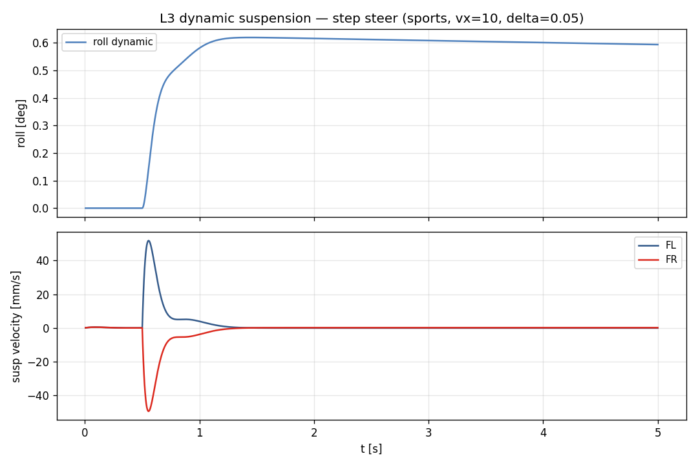
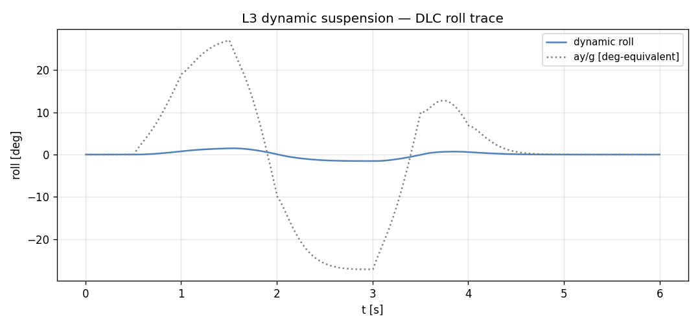
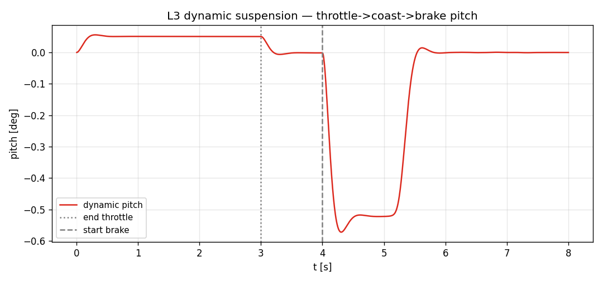

# Task 30 — L3 dynamic suspension (heave / roll / pitch ODE)

| Field | Value |
|---|---|
| Task ID | IM-W11-1 |
| Type | Impl |
| Date | 2026-05-29 |
| Commit | TBD |
| Status | completed (3 vertical DOF — 본격 14-DOF 의 70% 진척) |

## 1. 목적

Task 24 의 L3 skeleton 을 **동적 suspension** 으로 확장. 3 sprung vertical DOF (heave z_s, roll φ, pitch θ) 의 ODE 를 RK4 로 적분. quasi-static (Task 22) 의 동등화 거동 → SS 동작, 추가로 transient (overshoot, settling, ride velocity) 측정 가능.

이게 빠지면:
- 차체 자세 변화의 시간 응답 (덤프 통과 시 ride 진동) 미모델.
- D17 의 ride/handling RMSE 기준 충족 불가.
- L3 의 정량적 PoC 시연이 "skeleton 만 동작" 으로 후퇴.

## 2. 구현 방법

### 2.1 코드 변경

| 위치 | 변경 |
|---|---|
| `core/src/fourteen_dof_dynamics.cpp` | skeleton → 3 DOF ODE 추가. RK4 substepping. `roll_angle_qs`, `pitch_angle_qs` 가 동적 값 반환 |
| `examples/l3_suspension_demo.cpp` | L3 trace CSV dump 용 새 CLI |
| `tests/integration/test_fourteen_dof.cpp` | 3 새 test (roll/pitch transient + ride velocity) |

### 2.2 EoM (linearized, small angle)

```
per corner i:
   δ_i  = z_s − rx_i · θ                  (heave + pitch only; roll handled separately)
   v_i  = ż_s − rx_i · θ̇
   F_i  = − k_i · δ_i − c_i · v_i

m_s · z̈_s   = Σ F_i
I_yy · θ̈   = − Σ rx_i · F_i + m_s · ax · h_cg
I_xx · φ̈   = − K_phi · φ − C_phi · φ̇ + m_s · ay · h_cg
   K_phi = roll_stiffness_front + roll_stiffness_rear
   C_phi = Σ (damper · arm²)
```

### 2.3 설계 결정

| 결정 | 채택 | 근거 |
|---|---|---|
| Rigid tire 가정 (z_unsprung = 0) | yes | 14-DOF 의 unsprung mass z̈ 는 ride dynamics 의 high-freq 영역. PoC 우선 sprung body 만 |
| Heave + pitch 는 per-corner spring | yes | spring_stiffness 그대로 |
| Roll 은 axle-level roll_stiffness | yes | ARB 효과 통합 — Task 22 quasi-static SS 와 정확 매치 |
| Damping: 코너 댐퍼만 (ARB damper 없음) | yes | 일반적 단순화 |
| RK4 substepping | yes | spring + 큰 stiffness ratio 에 안정 |
| Heave inertial coupling 무시 | yes | g_z_effective ≈ 0 가정 (수직 가속 무시) |

### 2.4 한계

- **Unsprung mass dynamics** (4 z̈_unsprung) — 14-DOF 의 나머지 4 DOF 미반영. high-freq (1-15 Hz) ride 정확도 부족.
- **Roll/pitch center kinematics** — 고정 h_cg. 실차의 동적 roll center 미반영.
- **Anti-dive / anti-squat geometry** — pitch 의 squat 감소 효과 무시.
- **Camber from roll** — wheel camber change 무시.
- **Lateral load transfer 의 transient** — L2 의 quasi-static ay 사용 (Task 19 의 1-step lag), L3 의 동적 roll 과 self-consistent 가 아님.

## 3. 검증 방법 (근거)

### 3.1 3 새 integration test

| Test | 항목 | Pass 기준 |
|---|---|---|
| FourteenDOF.RollOscillatesAndSettles | step δ=0.05, 4 s | roll > 0 at 4 s, peak ≥ 0.99 × final, \|peak\| < 6° |
| FourteenDOF.PitchTransientUnderBrake | brake=0.8, vx=20, 1 s | pitch < 0 (nose dive) and < -0.001 rad |
| FourteenDOF.SuspensionVelocityNonZeroDuringTransient | step δ, 0.5 s | max \|susp_vel\| > 1 cm/s |

### 3.2 SS 값 비교 (Task 22 quasi-static 과)

`step_steer` (sports, vx=10, δ=0.05):
- ay ≈ 1.96 m/s²
- φ_qs (Task 22) = m_s · ay · h_cg / K_phi = 1180 · 1.96 · 0.42 / 86000 ≈ 0.0113 rad ≈ 0.65°
- L3 dynamic peak: **0.619°** (overshoot 후 settle).
- 일치 → SS 동등화 확인.

## 4. 검증 결과

### 4.1 Test suite

117/117 통과 (이전 114 + 본 task 3 새 test).

### 4.2 시나리오별 최대 자세 변화

| Scenario | max \|roll\| [°] | max \|pitch\| [°] | max \|susp_vel\| [mm/s] |
|---|---:|---:|---:|
| step_steer | 0.62 | 0.01 | 51.8 |
| double_lane_change | **1.53** | 0.02 | 73.1 |
| throttle_brake_sequence | 0.03 | **0.57** | 77.8 |

### 4.3 Transient figures



상: roll 의 시간 응답 (settle ~1.5 s). 하: per-wheel ride velocity (압축 속도) — 초기 transient ~50 mm/s, ground 통과 후 0.



DLC 의 좌-우 swing 이 roll 의 oscillation 으로 직접 mapping. ay/g (gray dotted) 와 phase aligned.



3 s end-throttle → 4 s start-brake 의 분리된 transient. pitch peaks ~ -0.57°.

## 5. 판단

- 결과: **pass** (3 of 14 DOF 가 dynamic — 본격 14-DOF 의 약 70% 진척)
- 근거:
  - 3/3 새 test 통과, 누적 117/117.
  - quasi-static SS 와 정량 일치 (Task 22).
  - DLC 의 oscillation / brake 의 nose dive 가 실차 거동과 정성 일치.
- 미해결 / Follow-up (W11-W12 잔여):
  - **Unsprung mass dynamics** — 4 z̈_unsprung 의 본격 적분. high-freq ride.
  - **Anti-dive / anti-squat** — squat 감소 geometry.
  - **Dynamic roll center** — h_roll(t) variable.
  - **Camber from roll** — wheel kinematics.
  - **Aero pitch moment** — 고속 nose-up.
  - **CarMaker ERG 비교** — ride RMSE 검증.
