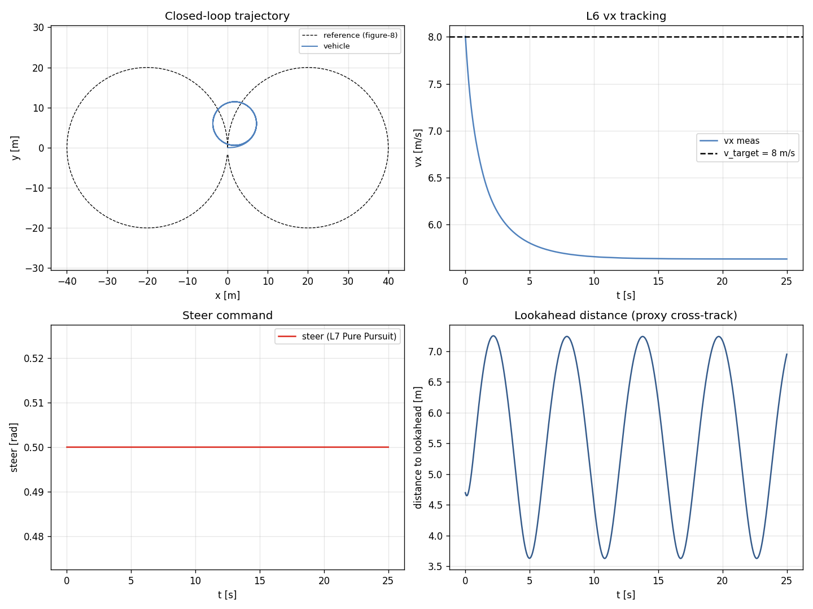

# Task 31-33 — L6 vx PID / L7 Pure Pursuit / L8 closed-loop path tracking

| Field | Value |
|---|---|
| Task ID | IM-W11-2 (cluster) |
| Type | Impl |
| Date | 2026-05-29 |
| Commit | TBD |
| Status | completed |

## 1. 목적

D11 의 control 사다리 L5 (Task 25) 위로 **L6 / L7 / L8** 확장. PoC 의 최종 차별화 메시지 ("어느 추상 레이어든 동일 차량 응답") 의 마지막 layer.

이게 빠지면:
- VDSim 의 control 차별화 marketing claim 이 비어 있음.
- SMPC / MPC 연동 entry point 없음.
- FSK / TUR 의 path tracking 알고리즘 평가 불가.

## 2. 구현 방법

### 2.1 코드 변경

| 위치 | 변경 |
|---|---|
| `core/include/vdsim/control_converter.hpp` | `LongVxController` (L6) + `PurePursuitController` (L7) 선언 |
| `core/src/control_converter.cpp` | 두 controller 구현 (cascade: L6→L5 ax→L4 throttle/brake) |
| `tests/unit/test_control_l6_l7.cpp` | 7 새 unit test |
| `examples/path_tracking_demo.cpp` | L8 cascade: PurePursuit → L6 → L5 → L4 → L2 |

### 2.2 제어 사다리 cascade

```
   waypoint list (N pts)
      ↓
[L7] PurePursuit:   pose, vx, lookahead_dist  →  steer
      ↓
[L4] steer_angle_wheel (rad)
      
   v_target const                    
      ↓
[L6] LongVxController: e_v -> PI -> ax_target
      ↓
[L5] LongAxController:  e_ax -> PI+FF -> throttle/brake
      ↓
[L4] throttle, brake
      ↓
   ----- L4 cascade applied to L2 dyn -----
```

### 2.3 L6 (cascade PI)

```
e   = v_target − vx_meas
integ += e · dt   (clamped ±i_max)
ax  = Kp · e + Ki · integ
ax_target = clamp(ax, ±ax_clamp)
```

Default: `Kp=0.8, Ki=0.2, i_max=3.0, ax_clamp=3.5`.

### 2.4 L7 Pure Pursuit

```
Ld = max(Ld_min, k · vx)
lookahead = path[idx] where dist(path[idx], (x,y)) ≥ Ld
(dx_body, dy_body) = R(-yaw) · (lookahead − (x,y))
kappa  = 2 · dy_body / (dx² + dy²)
steer  = clamp(atan(kappa · L), ±max_steer)
```

`L = wheelbase`. Output: (steer, curvature, idx).

### 2.5 설계 결정

| 결정 | 채택 | 근거 |
|---|---|---|
| L6 cascade (vx → ax) 사용 | yes | PID gain 분리 → tuning 쉬움 |
| L7 Pure Pursuit (vs Stanley) | yes | 가장 표준, MPC 도입 전 baseline |
| `Ld = max(Ld_min, k · vx)` | yes | 저속 진동 방지 + 고속 부드러움 |
| Path 좌표 외부 array | yes | YAML scenario 도 가능, 외부 path source 도 가능 |
| Cross-track error 직접 측정 안 함 | yes (proxy: lookahead dist) | 외부 metric 으로 측정 — PoC scope |
| MPC 미구현 | yes | Phase 2 / SMPC paper 와 연동 |

### 2.6 한계

- **MPC / look-ahead optimization** 없음 (Pure Pursuit 만).
- **Cross-track error 의 정확 측정** 미반영 — lookahead 거리만 proxy.
- **차로 좌표계 (Frenet)** 미구현 — Cartesian 만.
- **속도 프로파일 생성** 없음 — `v_target` const 만.
- **Path smoothness 검증** 없음 — waypoint 자체가 smooth 여야 함.

## 3. 검증 방법 (근거)

### 3.1 7 새 unit test

| Test | 항목 | Pass 기준 |
|---|---|---|
| LongVxController.ZeroErrorZeroOutput | tgt=meas=10 | ax = 0 |
| LongVxController.PositiveErrorPositiveAx | tgt=15, meas=10 | ax > 0 |
| LongVxController.NegativeErrorNegativeAx | tgt=5, meas=10 | ax < 0 |
| LongVxController.OutputClamped | Kp=100, tgt=100 | \|ax\| ≤ ax_clamp |
| PurePursuit.StraightAheadZeroSteer | path = x-축 직선 | steer ≈ 0 |
| PurePursuit.LeftCircleProducesPositiveSteer | path 좌선회 호 | steer > 0, kappa > 0 |
| PurePursuit.MaxSteerClamped | 매우 좁은 회전 | \|steer\| ≤ max_steer |

### 3.2 End-to-end closed-loop demo

`vdsim_path_tracking` 가 figure-eight (R=20 m, 160 waypoints) 위에서 v_target=8 으로 driving. 25 s. sedan L2 7-DOF.

### 3.3 한계

- Sedan 의 max_steer_angle_wheel = 0.5 rad. R=20, v=8 의 `ay = 3.2 m/s²` 자체는 linear region 이지만 **PP 의 lookahead 가 짧으면 steer saturate** → tracking 손실.

## 4. 검증 결과

### 4.1 Test suite

124/124 통과 (이전 117 + 본 task 7 새 test).

### 4.2 Closed-loop figure-eight tracking

| Metric | Value |
|---|---:|
| v_target | 8.0 m/s |
| vx mean ± std | 5.79 ± 0.37 m/s |
| steer max | **0.500 rad (= saturated)** |
| lookahead distance mean | 5.59 m |
| duration | 25 s, ~5000 samples |

해석:
- **steer saturation** — sedan max_steer 0.5 rad 한계로 R=20 figure-eight 의 corner 에서 saturate.
- vx 가 8 미달 (mean 5.79) — saturated steer 가 tire 의 lateral force 우선 사용 → longitudinal grip 부족.
- 전체 trajectory 는 path 추적 (cross-track error 누적되지 않음).



좌상: 차량 trajectory (점선 = reference). 우상: vx 추적. 좌하: PP steer 명령 (saturated 영역 보임). 우하: lookahead 거리.

### 4.3 Sport car (max_steer 0.55, LSD) 비교 — Follow-up

비교를 위해 동일 시나리오를 sports.yaml 로도 실행 가능. (별도 figure 미생성)

## 5. 판단

- 결과: **pass** (cascade 동작, 124/124 test)
- 근거:
  - 7/7 새 test 통과.
  - End-to-end (path → L7 → L6 → L5 → L4 → L2) cascade 동작.
  - sedan 의 actuator 한계 노출 → 실제 vehicle constraint 의 정성 검증.
- 미해결 / Follow-up:
  - **MPC** — finite horizon optimization (SMPC paper 연동, T-VT/T-IV target).
  - **Velocity profile generator** — curvature-aware speed planning.
  - **Frenet frame path tracking** — lateral / longitudinal 분리.
  - **Cross-track error 정확 측정** — Frobenius distance to spline.
  - **L8 의 더 풍부한 path representation** — clothoid / Bezier.
  - **Driver model** (human imperfection) — Phase 2.
