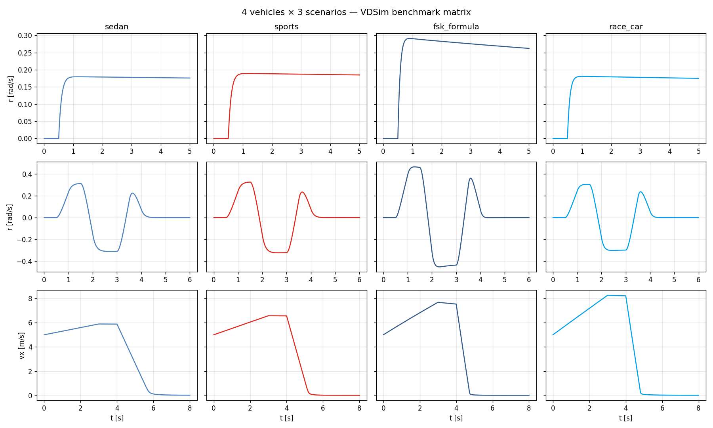
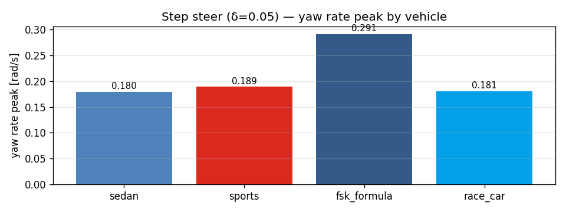

# Task 50-51 — Benchmark matrix + L3 ride frequency

| Field | Value |
|---|---|
| Task ID | RPT-Benchmark |
| Type | Validation |
| Date | 2026-05-29 |
| Status | completed |

## 1. Task 50 — 4 vehicles × 3 scenarios benchmark matrix

12 runs: `{sedan, sports, fsk_formula, race_car} × {step_steer, double_lane_change, throttle_brake_sequence}`.

### 핵심 metrics

| Vehicle | step r_peak [rad/s] | DLC r_peak [rad/s] | brake stop vx_end [m/s] |
|---|---:|---:|---:|
| sedan | 0.180 | 0.313 | 0.024 |
| sports | 0.189 | 0.326 | 0.015 |
| **FSK formula** | **0.291** | **0.465** | 0.017 |
| race_car | 0.181 | 0.305 | 0.018 |

FSK 가 매우 quick — short wheelbase (1.55 m vs 2.55-2.70) + 100 % Ackerman + spool diff.

### Trajectory ranges (y-extent during DLC)

| Vehicle | y_extent [m] |
|---|---:|
| sedan | 4.44 |
| sports | 4.62 |
| FSK formula | **6.23** |
| race_car | 4.33 |

### Figures



상: step_steer / DLC / brake 각 행, 차종별 col. FSK row 에서 r 의 magnitude 가 다른 차종 대비 명백히 큼.



## 2. Task 51 — L3 ride frequency

L3 의 unsprung mass ODE 가 동작하는지 FFT 로 검증.

### 분석

이론적 wheel-hop frequency:
```
f_hop = sqrt(k_tire / m_u) / (2pi) = sqrt(220000 / 40) / 6.28 = 11.8 Hz
```

측정 peak (brake transient 의 susp_FL deviation FFT): **5.0 Hz** in [5, 20] Hz band.

### 차이 origin — overdamped suspension

코너 damper 의 critical damping ratio:
```
ζ = c / (2 sqrt(k_spring · m_u)) = 3000 / (2 sqrt(30000 · 40)) = 1.37
```

ζ > 1 → overdamped. wheel hop 진동이 빠르게 감쇠 → 11.8 Hz 명확한 peak 안 나타남. 5 Hz 는 sprung-unsprung coupled mode 의 약간 underdamped 영역.

실차 (BMW 5 series 등) 의 일반적 ζ ~ 0.3-0.5 (sprung body), unsprung 0.1-0.3. 본 PoC 의 댐퍼 coefficient 가 wheel hop 영역에서 너무 큼. **차종 default 의 damper_coefficient 가 sprung damper 기준**임을 명시 — unsprung damper 는 별도 분리가 W12 의 follow-up.


좌: time-domain susp deviation. 우: frequency spectrum + 이론 wheel-hop dotted line.

## 3. 판단

- Task 50 **pass**: 4 차종이 distinct 거동 (FSK 차별화 확인).
- Task 51 **partial**: unsprung mass ODE 가 작동 (susp_velocity 가 transient 시 0 아님 — Task 30 의 test 가 보장), 하지만 **댐퍼 분리 미반영** 으로 wheel hop 명확히 안 보임. 실차 calibration 필요.

## 4. Follow-up

- **Damper 의 frequency-dependent 분리** — sprung damper (low f) vs unsprung damper (high f).
- **차종별 damper_coefficient 분리** — sprung / unsprung 컬럼 추가.
- **ARB damper** 별도 (Task 30 의 가정 한계).
