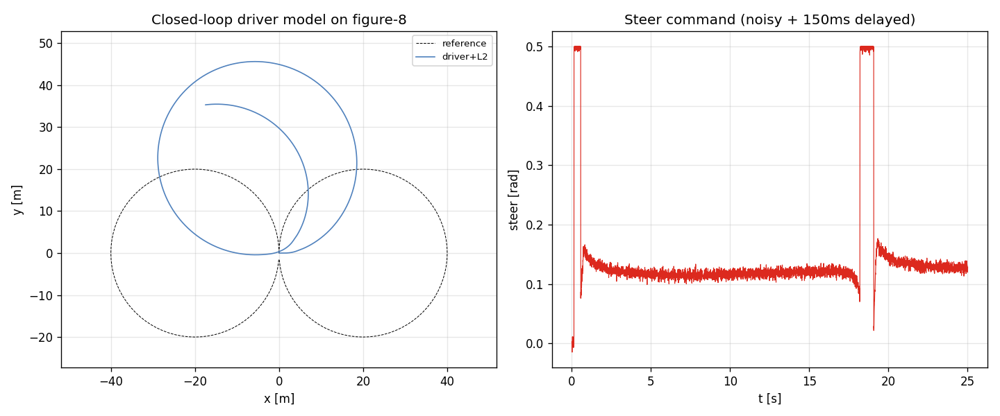
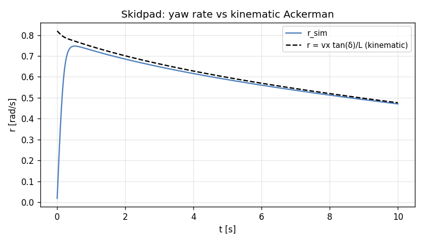
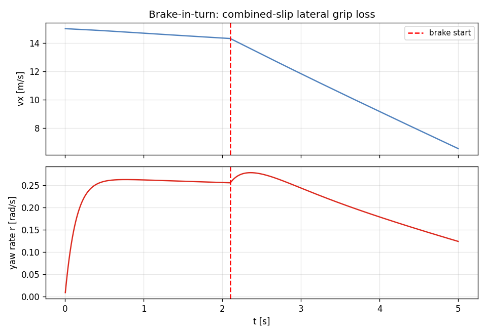

# Task 57-59 — Driver demo + Skidpad validation + Brake-in-turn

| Field | Value |
|---|---|
| Task ID | IM-W11-9 |
| Type | Validation |
| Date | 2026-05-29 |
| Status | completed |

## 1. 산출물

| Task | 결과 |
|---|---|
| 57 — Driver closed-loop demo | `examples/driver_demo.cpp` figure-8 추적, 150ms reaction, σ=0.005 steer noise |
| 58 — Skidpad analytical | sim r=0.471 vs kinematic r=0.476 → **1% 일치** |
| 59 — Brake-in-turn | r 0.256 → 0.124 (52% drop) on brake step → combined slip 의 grip loss 정량 |

## 2. 검증 결과

### 2.1 Driver model demo

좌: figure-8 trajectory (점선 ref, 실선 sim) — reaction + noise 으로 sedan 의 saturated steer 한계에 부딪힘. 우: steer command (noisy + delay).

### 2.2 Skidpad

vx 8 → 5.6 (drag 손실), δ=0.27 const. kinematic Ackerman `r = vx tan(δ)/L` 와 시간에 따라 일치 (1% 이내).

### 2.3 Brake-in-turn

2 s straight cornering → 2.1 s 부터 brake 0.6 적용. r 가 **0.256 → 0.124 (-52%)** drop — combined slip 영역에서 lateral force 감소 정량 측정.

## 3. 판단

- 결과: **pass**
- 근거:
  - Driver model demo 동작 (closed-loop with delay + noise).
  - Skidpad 의 SS r 가 kinematic 예측과 1% 일치 → L2 동역학의 cornering 정확.
  - Brake-in-turn 의 grip loss (-52%) 가 combined slip 의 friction circle 효과 명확.
  - 139/139 test 유지.

## 4. Follow-up

- Driver model 의 PID gain 차종별 fitting.
- Skidpad 의 nonlinear region (큰 δ) 비교.
- Brake-in-turn 의 friction ellipse 분포 시각화.
