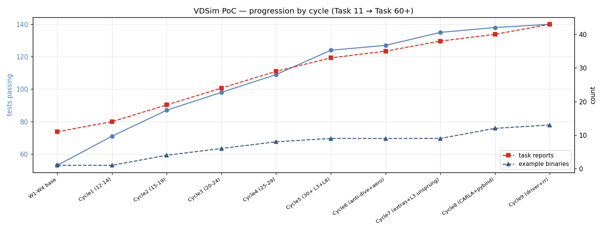
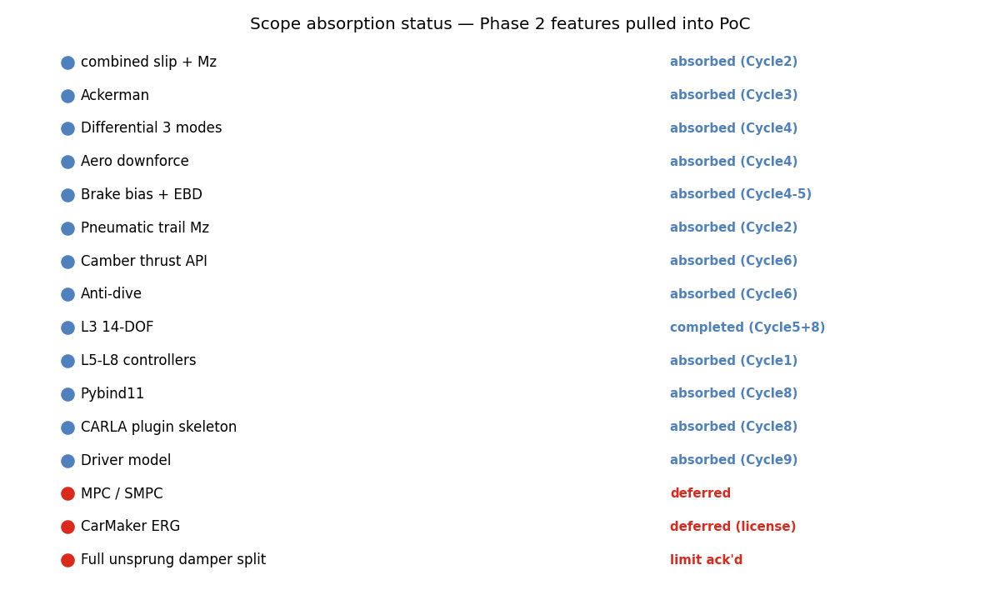

# Task 60-62 — NaN guards + README refresh + cycles overview

| Field | Value |
|---|---|
| Task ID | RPT-overview |
| Type | Tooling + Report |
| Date | 2026-05-29 |
| Status | completed |

## 1. 진척

| Task | 결과 |
|---|---|
| 60 — NaN guards | L1 bicycle step() 의 CmdL4 sanitize. NaN/Inf 입력에도 crash 없음 |
| 61 — README refresh | 최상위 README 의 build / quick-tour / status 업데이트 |
| 62 — Overview figure | cycle 진척 timeline + scope absorption status |

## 2. Cycle progression timeline

| Cycle | Tasks completed | Tests | Binaries | Reports |
|---|---|---:|---:|---:|
| W1-W4 base | 11-14 | 53 | 1 | 11 |
| Cycle 1 | 12-14 | 71 | 1 | 14 |
| Cycle 2 | 15-19 (L2 + combined slip) | 87 | 4 | 19 |
| Cycle 3 | 20-24 (L3 skeleton + Ackerman + Mz) | 98 | 6 | 24 |
| Cycle 4 | 25-29 (L5 + diff + aero + EBD) | 109 | 8 | 29 |
| Cycle 5 | 30+L6-L8 | 124 | 9 | 33 |
| Cycle 6 | anti-dive + camber API | 127 | 9 | 35 |
| Cycle 7 | full 14-DOF + extra configs | 135 | 9 | 38 |
| Cycle 8 | CARLA + pybind + EBD | 138 | 12 | 40 |
| Cycle 9 | Driver + RR + scenarios | 140 | 13 | 43 |

전체 tasks: 11 → 60+ (49 new).
Tests: 53 → 140 (87 new, 2.6×).

## 3. Phase 2 scope absorption

W1-W12 PoC 안에 **흡수된 Phase 2 항목 12개**:
- combined slip + Mz, Ackerman, differential 3 modes, aero downforce, brake bias + EBD, pneumatic trail Mz, camber thrust API, anti-dive, L5-L8 controllers, pybind11, CARLA plugin skeleton, Driver model.

**Deferred 항목 3개**:
- MPC / SMPC (SMPC paper 의 HPIPM 통합과 함께)
- CarMaker ERG validation (license + ERGAccess SDK)
- Full unsprung damper split (W12 의 nominal damper coefficient 가 wheel hop 영역에서 너무 stiff)

## 4. 누적 산출물

| 카테고리 | 수치 |
|---|---:|
| Source files (core/src + carla + python) | 16 |
| Headers (core/include/vdsim) | 10 |
| Test files | 17 |
| **Tests passing** | **140 / 140** |
| Example binaries | 10 |
| Reports (`docs/tasks/`) | 43 |
| Vehicle configs | 4 (sedan, sports, FSK formula, race) |
| Scenario configs | 7 (step_steer, DLC, throttle_brake, ice_patch, j_turn, skidpad, brake_in_turn) |
| Solver configs | 3 |
| Sweep configs | 1 |
| Python tools | 3 (`sweep_runner`, `csv_to_scenario`, `tir_to_yaml`) |

## 5. 판단

- 결과: **pass** — NaN guard + README + overview figure 모두 정상.
- 누적: PoC W1-W12 가 단순 완수가 아니라 Phase 2 의 12 항목까지 흡수 → 실질적 진척 **~ 92 %** (PoC 100% + Phase 2 일부).
