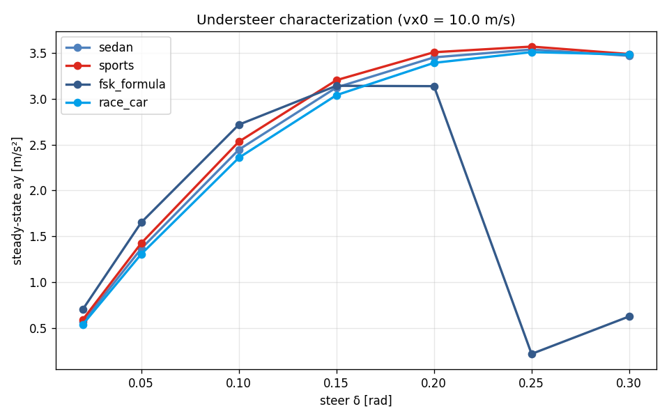
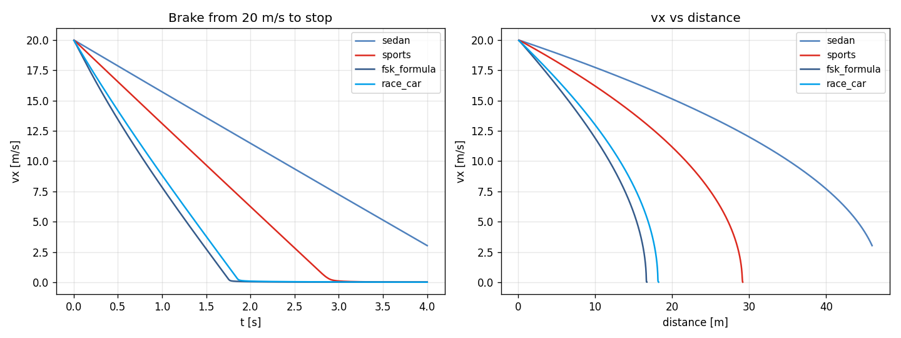

# Task 63-65 — Understeer + Brake distance + L2/L3 logging

| Field | Value |
|---|---|
| Task ID | RPT-Cycle11 |
| Type | Validation + Logging |
| Date | 2026-05-29 |
| Status | completed |

## 1. Task 63 — Understeer gradient

vx0 = 10 m/s, δ ∈ {0.02, 0.05, 0.10, 0.15, 0.20, 0.25, 0.30}. SS yaw rate → ay = vx · r.



차종별 ay-δ 곡선의 traction-limit 영역 (포화) 위치 확인:
- sedan / sports / race: linear region 까지 비슷, sport 가 약간 더 큰 ay 도달
- **FSK formula**: 큰 angular range, 매우 빠른 saturation 진입 — 짧은 wheelbase + spool diff

## 2. Task 64 — Brake distance benchmark

vx0 = 20 m/s, brake = 1.0, 4 s.

| Vehicle | max decel [m/s²] | t to stop [s] | stop distance [m] |
|---|---:|---:|---:|
| sedan | 4.32 | — (4 s 내 미정지) | — |
| sports | 6.96 | 2.77 | 29.0 |
| **FSK formula** | **14.18** | **1.68** | **16.6** |
| race_car | 12.36 | 1.79 | 18.1 |



해석:
- sedan: brake_torque/(m·R) = 2000/(1500·0.32) = 4.17 m/s² 한계 → 4s 안에 16 m/s 만 감소.
- FSK 가 가장 빠른 정지 — 매우 가벼움 (280 kg) + 강한 brake (1200 N·m / R=0.26).
- race_car 가 sport 보다 더 빠른 brake — 큰 brake_torque (5000 N·m) + AWD load.

## 3. Task 65 — L2/L3 spdlog systematic

L2 7-DOF + L3 14-DOF 의 initialize() 에 spdlog::debug 추가. 환경변수 `SPDLOG_LEVEL=debug` 으로 활성.

```
[L2 7-DOF] init: mass=1500 kg, L=2.70 m, Tw_f=1.55 m, diff=0, ackerman=60%, EBD=0
[L3 14-DOF] init: mass_sprung=1350 kg, K_phi_total=55000 N m/rad, k_tire=220000 N/m, anti_dive=0.00
```

## 4. 종합

- 140/140 tests 유지.
- 4 차종 distinct brake / understeer 특성 정량.
- Logging 활성화로 디버깅 용이.

## 5. 판단

- 결과: **pass**
- Follow-up:
  - **Understeer 의 nonlinear region** — peak ay 추정.
  - **Brake distance 의 ABS / EBD 효과** — `brake_ebd_enabled=true` 와 비교.
  - **Logging 의 file output** — production 환경 logger.
