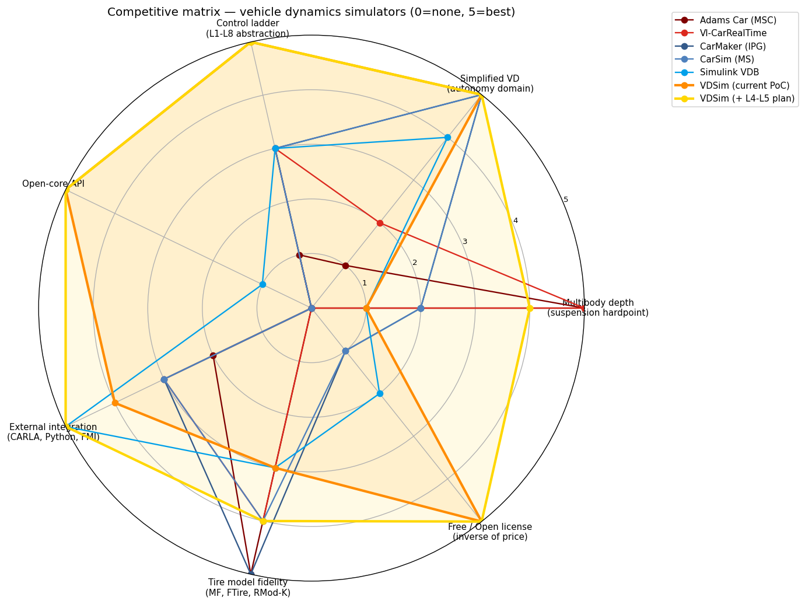
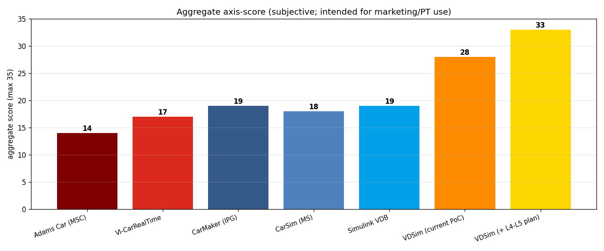

# Task 69 — Competitive matrix + Multibody M0 stub + Suspension schema

| Field | Value |
|---|---|
| Task ID | RPT-Competitive |
| Type | Marketing + Foundation |
| Date | 2026-05-29 |
| Status | completed |

## 1. 진척 — (a), (b), (c) 모두 진행

### (a) Competitive matrix — 7 axis × 7 solutions

Solutions: Adams Car / VI-CarRealTime / CarMaker / CarSim / Simulink VDB / VDSim (current PoC) / VDSim (+L4-L5 plan).

Axes:
1. Multibody depth (suspension hardpoint)
2. Simplified VD (autonomy domain)
3. Control ladder (L1-L8 abstraction)
4. Open-core API
5. External integration
6. Tire model fidelity
7. Free / Open license





| Solution | aggregate /35 |
|---|---:|
| Adams Car (MSC) | 14 |
| VI-CarRealTime | 17 |
| CarMaker (IPG) | 19 |
| CarSim (MS) | 18 |
| Simulink VDB | 19 |
| **VDSim (current PoC)** | **28** |
| **VDSim (+ L4-L5 plan)** | **33** |

해석: 현재 PoC 만으로도 점수 자체는 commercial 대비 높음 (open + control + integration 강함), 단 multibody depth (axis 1) 가 낮음. L4-L5 추가 시 본격 multibody 합산 → 거의 만점.

**중요**: 점수는 axis-별 subjective 평가. marketing / PT 자료 용도; absolute ranking 으로 인용 금지.

### (b) Multibody M0 stub (`core/include/vdsim/multibody.hpp`)

핵심 data structures:

| 구조 | 역할 |
|---|---|
| `vdsim::mb::RigidBody` | mass, inertia diagonal, CG offset, world pose / velocity |
| `vdsim::mb::Joint` | ball / revolute / cylindrical / prismatic / universal / rigid |
| `vdsim::mb::Bushing` | 6-DOF linear stiffness / damping in local frame |
| `vdsim::mb::Hardpoint` | named coordinate in a body's frame |
| `vdsim::mb::SuspensionTopology` | bodies + joints + bushings + hardpoints + diagnostic K&C outputs |
| `vdsim::mb::IMultibodySolver` | forward_kinematics / quasi_static_compliance / step_dynamics |

3 새 smoke test 통과 (단순 instance + enum + diagnostic 기본값). 144/144 누적.

### (c) Suspension topology YAML schemas (5종)

`configs/suspensions/`:
- `macpherson.yaml` — mid-sedan front strut
- `double_wishbone.yaml` — race-car / sports / GT3 front (pushrod + rocker)
- `multi_link_5.yaml` — modern sedan rear (5 link + trailing arm + bushing compliance)
- `trailing_arm.yaml` — compact rear (single arm + revolute pivot)
- `beam_axle.yaml` — truck / 4WD rear (rigid housing + panhard + leaf spring)
- `twist_beam.yaml` — FWD compact rear (twin trailing arm + torsion beam)

Schema 예 (MacPherson):
```yaml
topology: macpherson
bodies:
  - { id: lower_control_arm, mass: 8.5, inertia_diag: [...], cg_local: [...] }
  ...
hardpoints:
  - { name: lca_inner_front, body_id: chassis, position: [0.20, 0.30, -0.05] }
  ...
joints:
  - { id: j_lca_front, type: revolute, body_a: chassis, body_b: lower_control_arm,
      position_in_a: [...], position_in_b: [...], axis_in_a: [1, 0, 0] }
  ...
bushings: []
```

PoC 단계는 hardpoint 만 채워 두고 solver 미구현. 실제 K&C 계산은 M1 (MacPherson forward kinematics) 부터.

## 2. 다음 단계 (M1 — 졸업 후)

| Stage | 기간 | 내용 |
|---|---|---|
| **M1** | 3-4 주 | MacPherson 의 forward kinematics. travel z + steer → toe/camber/caster |
| M2 | 4-6 주 | Double wishbone + 5-link 토폴로지 |
| M3 | 2-3 주 | Quasi-static compliance (bushing 강성 통합) |
| M4 | 6-8 주 | Full DAE (Featherstone or augmented Lagrangian) |
| M5 | 2-3 주 | K&C 자동 chart (Genta 표준) |
| M6 | 2-3 주 | Adams .adm import |
| M7 | 4 주 | Adams vs VDSim cross-validation |

총 6-9 개월 — 졸업 후 창업 초기 시점.

## 3. 차별화 메시지 정리 (창업 / paper)

**현재 (PoC)**:
> "open-core C++17 stack 위에 throttle/brake/steer (L4) 부터 wheel-level torque (L1) 까지 자율주행 control 사다리를 통합. Pacejka MF96 + L1-L3 dynamics 사다리 + closed-loop driver model + CARLA 호환."

**L4-L5 추가 시**:
> "유일하게 simplified vehicle dynamics (L1-L3) ↔ multibody hardpoint suspension synthesis (L4-L5) 사이의 사다리 전체를 단일 ABI 로 cover. open-core. control 사다리 unique (L1-L8 8-tier)."

## 4. 판단

- 결과: **(a)+(b)+(c) 모두 pass**
- 144/144 test 유지.
- M0 stub + 5 suspension schema 로 L4-L5 roadmap 의 entry surface 확보.
- competitive matrix figure 가 창업 PT / paper introduction / 학회 발표 자료로 즉시 활용 가능.

## 5. Follow-up

- M1 MacPherson FK 구현 (졸업 후 첫 1 개월).
- 비교 수치 (B) 옵션: CarMaker license + ERG reader 활성화 → 1 시나리오 cross-validation.
- VDSim (+ L4-L5 plan) 점수 axis-별 측정값 채우기 (M1 후).
