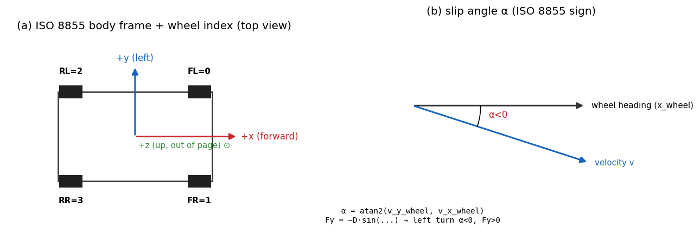

# 01. 좌표계와 부호 약속

> **학습 목표.** ISO 8855 RH 와 SAE J670 의 부호 차이를 정확히 구별한다. body / world / wheel / contact frame 사이의 변환을 quaternion 으로 정의한다. 이후 모든 챕터의 식에서 부호가 어떤 convention 에서 유도된 것인지 즉시 판별할 수 있다.

## 1.1 왜 좌표계가 별도 챕터인가

차량 동역학에서 가장 흔한 버그는 **부호 실수**다. 같은 단어가 책마다 다른 부호를 의미한다.

| 책 | y 축 | α 부호 (좌선회) | Fy 부호 (좌선회) | yaw 양의 방향 |
|---|---|---|---|---|
| ISO 8855 RH (Genta, EU) | leftward | α > 0 | Fy < 0 | CCW (위에서 본) |
| SAE J670 (Rajamani, US) | rightward | α < 0 | Fy < 0 | CW (위에서 본) |

VDSim 은 **ISO 8855 RH 단일 채택**. 모든 식이 이 가정 위에 유도되어 있다.
Rajamani 의 `δ - atan(v_y / v_x)` 같은 식은 SAE convention 이므로 **그대로 옮기면 부호가 반대로 들어간다**.

`core/include/vdsim/types.hpp` line 15-19:
```cpp
constexpr int WHEEL_FL  = 0;   // front left  (+x forward, +y leftward)
constexpr int WHEEL_FR  = 1;
constexpr int WHEEL_RL  = 2;
constexpr int WHEEL_RR  = 3;
constexpr int NUM_WHEELS = 4;
```

## 1.2 네 가지 frame

### Inertial (world) frame — `W`

- ENU (East-North-Up). 지구 곡률 무시 (flat ground).
- 원점은 시뮬레이션 시작 시점의 차량 CG (또는 임의).
- 차량 trajectory `x_w, y_w` 가 여기서 측정된다.

### Body frame — `B`

- 원점: sprung body 의 CG.
- `x_B` forward, `y_B` leftward, `z_B` up (ISO 8855 RH).
- vehicle 의 모든 속도 / 가속도 / 힘은 별도 표기 없는 한 body frame.

### Wheel frame — `W_i`

- 원점: i 번째 wheel 의 contact point (또는 wheel center).
- `x_W` 는 wheel 의 forward 방향 (steered 시 body x 에서 δ 만큼 회전).
- `y_W` 는 wheel 의 left.
- `z_W` 는 contact normal (flat ground 에서 = `z_B`).

### Contact frame — `C_i`

- Wheel frame 과 동일하나 contact normal 이 ground normal 과 align 됨.
- VDSim 의 `IContactProvider` 가 반환하는 `normal` 이 contact frame 의 z.
- 본 PoC 에서 flat ground 가정이라 contact = wheel frame.

## 1.3 Quaternion 변환



VDSim 은 Eigen `Quaterniond` 사용. **body → world** 변환:

$$
v_{\text{world}} = q \otimes v_{\text{body}} \otimes q^{-1}
$$

코드: `core/src/coordinate.cpp` 의 `yaw_from_quat`, `quat_from_euler` 두 함수.

```cpp
inline double yaw_from_quat(const Quat& q) {
    return std::atan2(2.0 * (q.w() * q.z() + q.x() * q.y()),
                      1.0 - 2.0 * (q.y() * q.y() + q.z() * q.z()));
}
```

이는 ZYX intrinsic Euler 의 yaw 추출 공식. roll / pitch 가 0 일 때 `q.z()` 만 사용해도 같은 결과 (small-angle 영역).

### Euler 의 함정

VDSim 은 ZYX intrinsic 사용. order 가 다르면 동일 angle 이라도 결과 다름. **Tait-Bryan vs proper Euler** 차이 — VDSim 은 Tait-Bryan (ZYX, no axis repetition).

$$
R(\text{roll}, \text{pitch}, \text{yaw}) = R_z(\text{yaw}) \cdot R_y(\text{pitch}) \cdot R_x(\text{roll})
$$

`quat_from_euler({roll, pitch, yaw})` 의 입력 순서가 (x, y, z) 회전이 아니라 (φ, θ, ψ) — 즉 (roll, pitch, yaw) 라는 점에 주의.

## 1.4 Slip 의 정확한 정의 (ISO 8855)

### Slip angle `alpha` (lateral)

$$
\alpha = \operatorname{atan2}(v_{y,\text{wheel}},\; v_{x,\text{wheel}})
$$

여기서 $v_{x,\text{wheel}}, v_{y,\text{wheel}}$ 은 wheel center 의 velocity 를 **wheel frame** 으로 변환한 값.

- **Front wheel (steered)**:

  $$
  v_{x,\text{wheel}} =  v_{x,\text{body}} \cos\delta + v_{y,\text{body}} \sin\delta, \qquad
  v_{y,\text{wheel}} = -v_{x,\text{body}} \sin\delta + v_{y,\text{body}} \cos\delta
  $$

  여기서 $v_{y,\text{body}} = v_{y,cg} + a r$ (wheel position 의 lever arm 적용).
- **Rear wheel** (un-steered): wheel frame = body frame.

  $$
  v_{x,\text{wheel}} = v_{x,\text{body}}, \qquad v_{y,\text{wheel}} = v_{y,cg} - b r
  $$

부호 직관:

- 좌선회 (r > 0, δ > 0). rear 의 경우 `v_y_wheel = v_y − b·r`. SS 에서 `v_y` 가 약간 음수, `b·r` 가 양수 → 합쳐서 음수. `v_x` 양수 → `α_r = atan2(− , +) < 0`.
- 그러므로 **좌선회에서 alpha < 0**. ISO 8855 RH 의 약속.
- 그리고 Pacejka 에서 `Fy = − D · sin(...)` 로 leading minus 부호. `α < 0` → `sin(...) < 0` → `Fy > 0` (i.e., +y_body = leftward = inside of left turn). 즉 cornering force 가 차량을 안쪽으로 잡아준다.

VDSim 코드: `core/src/bicycle_dynamics.cpp:146-147`:
```cpp
const double alpha_f = std::atan2(v_fy_wheel, v_fx_wheel);
const double alpha_r = std::atan2(v_ry_body, v_rx_body);
```

### Slip ratio `kappa` (longitudinal)

$$
\kappa = \frac{R\, \omega - v_{x,\text{wheel}}}{\max(|v_{x,\text{wheel}}|,\; \varepsilon)}
$$

- `omega` — wheel angular velocity [rad/s], positive when rolling forward.
- `R` — kinematic (loaded) wheel radius.
- `R · omega` 는 wheel 이 rolling 으로 진행할 속도 (slip 없을 때).
- `v_x_wheel` 은 wheel center 의 longitudinal velocity.
- `ε = 0.5 m/s` 의 floor — 정지 근처에서 발산 방지.

부호 직관:

- 가속 (drive): `R · omega > v_x` → κ > 0 → `Fx > 0` (drive force).
- 제동 (brake): `R · omega < v_x` → κ < 0 → `Fx < 0`.
- 정지: `omega = v_x = 0` → κ = 0.

VDSim 코드: `core/src/bicycle_dynamics.cpp:151-152`:
```cpp
const double kappa_f = (R * of  - v_fx_wheel) / denom_f;
const double kappa_r = (R * or_ - v_rx_body)  / denom_r;
```

## 1.5 World 변환 (yaw integration)

차량의 world position 을 적분할 때, body velocity 를 world 로 회전시킨다.

$$
\dot x_w = v_x \cos\psi - v_y \sin\psi, \qquad
\dot y_w = v_x \sin\psi + v_y \cos\psi, \qquad
\dot\psi = r
$$

여기서 $\psi$ 는 yaw. roll / pitch 가 작은 경우의 simplified.
정확히는 quaternion ODE:

$$
\dot q = \tfrac{1}{2}\, q \otimes [0,\; \omega_{\text{body}}], \qquad \omega_{\text{body}} = (p, q, r)
$$

VDSim 의 Ld1-Bicycle 은 yaw-only 적분 (planar) — 단순한 ψ 적분 후 quat reconstruct.
Ld3-FourteenDOF 는 roll/pitch 도 함께 quat 에 encoding.

## 1.6 ABI / API 상의 약속

- `State::position` — world frame ENU, `Vec3` (m).
- `State::orientation` — body → world `Quat`.
- `State::velocity` — body frame `Vec3` (m/s) = (vx, vy, vz).
- `State::angular_velocity` — body frame `Vec3` (rad/s) = (p, q, r).
- `tire_forces_body()` — body frame `Vec3[4]` (N).
- `wheel_slip_angle()` — wheel frame `double[4]` (rad), per-wheel.

이 약속은 **모든 사다리 (Ld1-Ld3, Ld4-Ld5 계획) 에서 동일**. dynamics 갈아끼우기로 다른 fidelity 로 가도 외부 코드 (controller, CARLA plugin) 가 다시 짜지 않는다.

## 1.7 자주 발생하는 실수와 해결

| 실수 | 증상 | 해결 |
|---|---|---|
| Rajamani 의 `δ − atan(...)` 사용 | yaw rate 부호 반대 | `atan2(vy_wheel, vx_wheel)` 로 대체 |
| Wheel 위치 lever arm 빠뜨림 | rear axle 의 alpha 부호 틀림 | `vy − b·r` 명시 |
| Yaw 적분에 `vx` 사용 | low-speed 에서 stationary 차량의 yaw 가 표류 | `r` 로 yaw 적분 |
| Quat 의 (w, x, y, z) 순서 혼동 | rotation 결과 깨짐 | Eigen 의 `w(), x(), y(), z()` accessor 사용 |
| ε floor 빠뜨림 | 저속에서 κ 가 ±∞ | `max(|vx_wheel|, 0.5)` 강제 |
| Roll/pitch 가 quaternion 에 안 들어감 | Ld3 시각화에서 차체 안 기울어짐 | `quat_from_euler({roll, pitch, yaw})` |

## 1.8 다음 챕터 연결

좌표계가 정해졌으니, 다음 챕터에서는 **이 frame 위에서의 강체 운동방정식 (Newton-Euler)** 을 정리한다.
이게 정리되어야 Pacejka / Ld1 / Ld2 / Ld3 모두 같은 base 위에 올릴 수 있다.

## 1.9 검증

VDSim 의 `test_headers_compile.cpp` 와 `test_coordinate.cpp` 에서:

- `Vec3::UnitZ()` 가 contact normal 의 default 와 일치.
- `quat_from_euler({0,0,0}).isApprox(Quat::Identity())`.
- `yaw_from_quat(quat_from_euler({0,0,π/2}))` ≈ π/2.

또한 `test_bicycle_steady_state.cpp` 의 `LeftTurnYawRateMatchesAnalytical` 이 ISO 8855 RH 부호로 짜였음을 통과로 확인.

## 1.10 참고

- Genta, *Motor Vehicle Dynamics*, §2.2 (좌표계 정의), §3.1 (slip 정의).
- Pacejka, *Tire and Vehicle Dynamics*, §1.3 (ISO 8855 vs SAE).
- Rajamani, *Vehicle Dynamics and Control*, §1 — **단, SAE convention 임을 인지하고 부호 변환 후 인용**.
