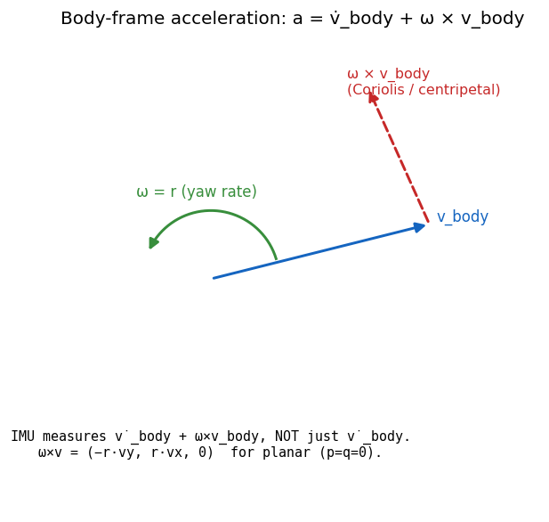

# 02. 강체 동역학 — Newton-Euler in Body Frame

> **학습 목표.** 차량을 한 개의 강체로 볼 때 Newton-Euler 방정식이 body frame 에서 왜 `m(v̇ + ω × v)` 형태가 되는지 step-by-step 유도한다. Inertial vs body frame 의 cross 항이 어디서 오는지 직관과 식으로 모두 설명할 수 있게 된다. 이게 이해되면 Ld1-Ld3 의 모든 EoM 이 자명해진다.



## 2.1 Why body-frame EoM (not inertial)

차량의 mass 와 inertia tensor 는 body 에 고정된 좌표계에서만 시간 불변이다. body 가 yaw 하면 world 의 `xy` 좌표 입장에서 차의 inertia 가 매 순간 회전한다 — 즉 매 step 마다 `I_world(t)` 가 변한다. 이걸 inertial frame 에서 풀려면 `I(t)` 의 시간 의존성을 매번 계산해야 한다.

body frame 에서 풀면 `I_body = const` (대각이 보통), 대신 frame 자체가 회전하는 효과를 **Coriolis 항** 으로 추가하면 된다. 그게 `ω × v` 그리고 `ω × (I ω)` 다.

## 2.2 위치 / 속도 / 가속도의 변환 식

$(i, j, k)$ 를 inertial frame 단위 벡터, $(e_1, e_2, e_3)$ 를 body frame 단위 벡터라 하자.
한 점 P 의 inertial frame 위치 $r$ 와 body frame 위치 $r_b$:

$$
r = R(t)\, r_b + r_O(t)
$$

여기서 $R(t)$ 는 body→world 회전, $r_O(t)$ 는 body 원점의 world 위치.

미분:

$$
\dot r = R\, \dot r_b + \dot R\, r_b + \dot r_O
$$

$\dot R = R\, [\omega_{\text{body}}]_\times$ (강체 운동학 표준), 여기서 $[\omega]_\times$ 는 skew matrix.

따라서:

$$
\dot r = R\, (\dot r_b + \omega_{\text{body}} \times r_b) + \dot r_O
$$

P 가 body 위에 고정 ($\dot r_b = 0$) 이라면:

$$
\dot r = R\, (\omega_{\text{body}} \times r_b) + \dot r_O
$$

CG ($r_b = 0$) 의 경우 $\dot r_{CG} = \dot r_O$. body 원점이 곧 CG 이므로 $\dot r_O = v_{\text{world}}$.

## 2.3 Body frame 에서 본 속도 / 가속도

$v_{\text{body}} = R^T v_{\text{world}}$ (world → body 회전).

body frame 의 시간 도함수 (lab frame 에서 본 차)와 body frame 자체에서 본 도함수는 다르다:

$$
\left.\frac{d}{dt} v_{\text{world}}\right|_{\text{world}}
= R \left.\frac{d}{dt} v_{\text{body}}\right|_{\text{body}} + \dot R\, v_{\text{body}}
= R\,(\dot v_{\text{body}} + \omega_{\text{body}} \times v_{\text{body}})
$$

즉 **inertial frame 가속도** = body frame 도함수 + Coriolis term.

좌변 = inertial frame 가속도 = $a_{\text{world}}$. 양변에 $R^T$:

$$
R^T a_{\text{world}} = \dot v_{\text{body}} + \omega_{\text{body}} \times v_{\text{body}}
$$

$R^T a_{\text{world}} = a_{\text{body,observed}}$ 라 하자. 이게 **차체에 탑승한 관측자가 measure 하는 가속도** (IMU x-accel, y-accel).

**여기가 직관 핵심**: IMU 가 measure 하는 양은 $\dot v_{\text{body}} + \omega \times v_{\text{body}}$ 다. 단순히 $\dot v_{\text{body}}$ 가 아니다.

## 2.4 Newton 의 운동 법칙 (body frame)

Newton:

$$
m\, a_{\text{world}} = F_{\text{world}}
$$

양변에 $R^T$:

$$
m\,(\dot v_{\text{body}} + \omega_{\text{body}} \times v_{\text{body}}) = R^T F_{\text{world}} = F_{\text{body}}
$$

차량의 경우 $\omega_{\text{body}} = (p, q, r)$ 인데 Ld1-Ld2 는 planar 가정으로 $p = q = 0$, $r$ = yaw rate. cross product:

$$
\omega \times v_{\text{body}} = (0, 0, r) \times (v_x, v_y, v_z) = (-r v_y,\; r v_x,\; 0)
$$

따라서:

$$
\begin{aligned}
m\, \dot v_x - m\, r\, v_y &= F_{x,\text{body}} \\
m\, \dot v_y + m\, r\, v_x &= F_{y,\text{body}} \\
m\, \dot v_z &= F_{z,\text{body}} - m g \quad (\text{vertical balance})
\end{aligned}
$$

VDSim 의 모든 사다리는 이 두 식을 핵심 EoM 으로 사용한다. 코드 `core/src/bicycle_dynamics.cpp:208-209`:
```cpp
d_out.dvx = Fx_total / m + vy * r;
d_out.dvy = Fy_total / m - vx * r;
```

**부호 확인**: 좌선회 (r > 0) 에서 `+vy · r` 는 vy 가 음수면 vx 감소 방향 (centripetal 부분), `-vx · r` 는 vx 가 양수면 vy 가 음수 쪽으로 — 이게 centripetal acceleration 의 body-frame 표현이다.

## 2.5 Euler 의 회전 방정식 (body frame)

각운동량의 body-frame 시간 도함수도 Coriolis 항을 포함한다:

$$
I_{\text{body}}\, \dot\omega_{\text{body}} + \omega_{\text{body}} \times (I_{\text{body}}\, \omega_{\text{body}}) = M_{\text{body}}
$$

$I_{\text{body}}$ 가 대각 ($\operatorname{diag}(I_{xx}, I_{yy}, I_{zz})$) 이라 가정.
planar 차량 ($p = q = 0$):

$$
\begin{aligned}
I_{xx}\, \dot p + (I_{zz} - I_{yy})\, q r &= M_x \\
I_{yy}\, \dot q + (I_{xx} - I_{zz})\, p r &= M_y \\
I_{zz}\, \dot r + (I_{yy} - I_{xx})\, p q &= M_z
\end{aligned}
$$

planar 의 경우 $p = q = 0$ 이면 cross 항 모두 0:

$$
I_{zz}\, \dot r = M_z
$$

VDSim Ld1-Ld2 는 이 단순화. 코드 `core/src/bicycle_dynamics.cpp:210`:
```cpp
d_out.dr = Mz_total / Izz;
```

## 2.6 Ld3 에서의 부분: sprung body 의 roll/pitch

Ld3 (FourteenDOF) 는 `p, q` 가 nonzero (roll/pitch DOF 활성).
그러나 본 PoC 는 **small-angle linearization** 사용:

$$
\begin{aligned}
I_{xx}\, \ddot\phi + K_\phi\, \phi + C_\phi\, \dot\phi &= m_s\, a_y\, h_{cg} \\
I_{yy}\, \ddot\theta + M_{\text{pitch,spring}} &= m_s\, a_x\, h_{cg}\, (1 - \text{anti\_dive})
\end{aligned}
$$

cross 항 $(I_{zz} - I_{yy})\, q r$ 등은 small-angle 가정으로 무시. 본격 multibody (Ld4-Ld5) 에서는 다시 살린다 (Featherstone formulation).

## 2.7 가속도 표기 약속 (자주 헷갈리는 정의)

**3 종류의 "ax"** 가 있다:
1. **body-frame velocity 도함수** `v̇x`. 단순히 ODE 의 상태 derivative.
2. **kinematic body-x acceleration** `ax = v̇x − vy · r`. body 의 inertial-frame 가속도를 body-x 로 표현. weight transfer 식의 `ax`.
3. **IMU 측정값** = (2)에 gravity projection 더한 것. `ax_imu = ax + g · sin(pitch)`. 평지면 (3) = (2).

VDSim 의 `ax_body_est()` 는 **(2) 의 `Fx_total / m`**. weight transfer 에 들어가는 그 ax.

코드 `core/src/seven_dof_dynamics.cpp:353-354`:
```cpp
d_out.ax_body = Fx_total / m;
d_out.ay_body = Fy_total / m;
```

이게 정확한 weight transfer 의 input. 만약 그냥 `v̇x` 를 쓰면 `vy · r` 부분이 빠져서 SS cornering 에서 lateral transfer 가 0 으로 나온다 (Task 20 에서 실제로 발생했던 버그).

## 2.8 EoM 정리 — 모든 Ld 의 공통 backbone

$$
\begin{aligned}
m\, \dot v_x  &= F_{x,\text{total}} + m\, v_y\, r \\
m\, \dot v_y  &= F_{y,\text{total}} - m\, v_x\, r \\
I_{zz}\, \dot r &= M_{z,\text{total}}
\end{aligned}
$$

$v_x, v_y$ = body frame translation velocity, $r$ = yaw rate ($= \omega_z$).
World 적분 (yaw-only):

$$
\dot x_w = v_x \cos\psi - v_y \sin\psi, \quad
\dot y_w = v_x \sin\psi + v_y \cos\psi, \quad
\dot\psi = r
$$

Ld 별 차이는 **Fx_total, Fy_total, Mz_total 을 어떻게 결정하는가** 뿐이다. base EoM 은 동일.

| Tier | Fx/Fy/Mz 의 출처 |
|---|---|
| Ld1 | per-axle (front, rear) — bicycle |
| Ld2 | per-tire (4) with weight transfer |
| Ld3 | per-tire + dynamic suspension |
| Ld4 | per-tire + multibody kinematic |
| Ld5 | per-tire + multibody compliant |

## 2.9 가정과 한계

VDSim 의 base EoM 은 다음을 **가정** 한다:

1. **Sprung body 는 단일 강체.** — Ld3 까지 OK (실은 sprung + 4 unsprung 의 7 body). Ld4-Ld5 는 multibody 전개.
2. **Inertia tensor 대각.** — 대칭 차량 가정 (Ixy, Ixz, Iyz = 0). 실측 차량은 작지만 non-zero. 본 PoC 무시.
3. **CG 위치 고정.** — fuel sloshing, payload shift 무시.
4. **Flat ground.** — IRoughnessProvider 의 ISO 8608 PSD road profile 은 Phase 2.

이 가정 모두 사용자가 의식하면 어디서 깨지는지 사전에 안다.

## 2.10 검증

`core/src/bicycle_dynamics.cpp` 의 EoM 이 textbook (Rajamani 식 2.45-2.47, ISO 8855 부호로 변환) 과 일치하는지 verify.
SS test (`BicycleSteadyState.LeftTurnYawRateMatchesAnalytical`) 에서 linear region 의 yaw rate 가 analytical bicycle steady-state 와 ±10 % 이내 → EoM + tire model 조합이 textbook 과 정합.

## 2.11 참고

- Genta, *Motor Vehicle Dynamics*, §3.2 (Body-fixed reference), §3.3 (Newton-Euler).
- Rajamani, *Vehicle Dynamics and Control*, §2 — **SAE 좌표계임에 주의**.
- Featherstone, *Rigid Body Dynamics Algorithms*, Ch. 2 (rigid body kinematics) — multibody 진입 전 필독.
