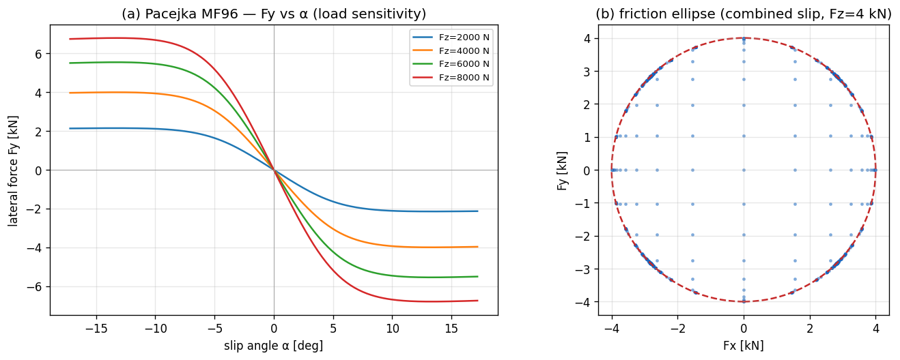
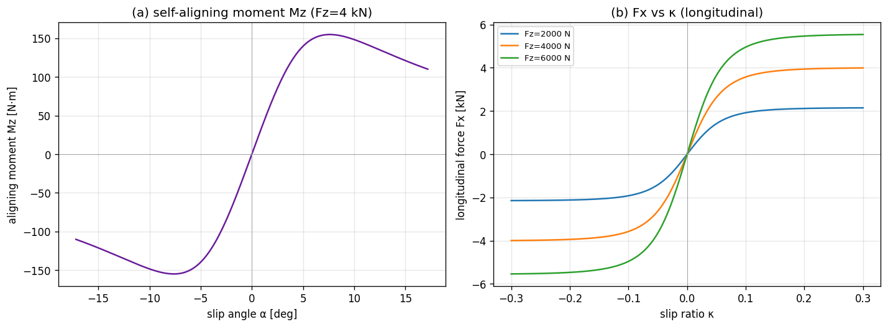

# 03. Tire Model — Pacejka Magic Formula 1996

## Learning objectives

이 chapter 를 마치면 다음을 할 수 있다.

1. Magic Formula `F(s) = D sin(C atan(B s − E (B s − atan(B s))))` 의 각 계수
   `B / C / D / E` 의 물리적 역할을 독립적으로 설명한다.
2. Pure-slip 모델과 combined slip 의 차이를 friction-ellipse rescale 의 가정 위에서
   유도한다.
3. Aligning moment `Mz` 와 pneumatic trail `t_p` 의 정의로부터 self-aligning 효과를
   부호와 함께 설명한다.
4. Load sensitivity / relaxation length / camber thrust 의 세 가지 확장이 어떤
   실험적 현상을 모델링하는지 안다.
5. MF96 simple form 과 MF2002 full form 의 trade-off (parameter 수, 발산 처리,
   구현 복잡도) 를 비교한다.

## Prerequisites

- **Chapter 01** — slip angle `α` / slip ratio `κ` 의 ISO 8855 정의.
- **Chapter 02** — body frame 의 force / moment 합산.
- **외부 reference** — Pacejka §4 (Magic Formula derivation), Milliken & Milliken §2
  (tire force fundamentals).

---

## 3.1 동기 — 타이어가 비선형 핵심인 이유

차량 동역학은 본질적으로 **타이어 한계 동역학**이다. 정상 운전 (linear region) 에서는
거의 모든 차량이 비슷하게 거동한다. cornering / brake / traction 한계는 모두
타이어의 비선형 saturation 에서 결정된다.

vehicle dynamics 의 sensitivity 를 비교해 보면, mass / wheelbase / aero 보다
**tire 의 `(D, μ, Cα)`** 에 훨씬 강하게 의존한다. Pacejka 가 타이어 modeling 에
한 평생을 쓴 이유다.



위 그림은 본 시리즈가 채택한 Pacejka 모델의 실제 출력이다. load sensitivity
(`Fz = 8 kN` 의 peak 가 `4 kN` 의 1.7 배 — 선형이면 2 배) 와 friction ellipse 의
boundary saturation 이 함께 보인다.

---

## 3.2 가정

본 chapter 의 모든 식은 다음 가정 위에서 유도된다.

| 가정 | 의미 | 깨지는 case |
|---|---|---|
| Quasi-static (instantaneous slip → force) | linear region 의 정상 모델 | step steer / brake 의 transient (§3.9) |
| Combined slip = friction ellipse | pure-slip case 의 backward-compat 보장 | MF2002 의 unified `σ_x, σ_y` |
| Constant μ over temperature | tire warming 무시 | race / endurance |
| Camber `γ` 는 외부 입력 (forward only) | suspension geometry → tire force 단방향 | Compliance 가 force → camber 로 되먹임 |
| Aligning moment = `−t_p · Fy + camber 보정` | pneumatic trail 의 단순 falloff | MF2002 의 residual `Mzr` |
| Load sensitivity 선형 (`μ_eff(Fz)` linear) | reference Fz 부근 양호 | 극단 Fz 의 non-linear curve |

가정이 깨지는 case 의 모델 확장은 §3.11 한계 표에서 정리한다.

---

## 3.3 Magic Formula 의 모양

기본형:

$$
F(s) = D \sin\!\Big( C \arctan\big( B s - E (B s - \arctan(B s)) \big) \Big)
$$

여기서 `s` 는 입력 — lateral 의 경우 slip angle `α`, longitudinal 의 경우 slip
ratio `κ`. 네 계수의 역할:

| 계수 | 역할 | 단위 / 영향 |
|---|---|---|
| `D` | peak force amplitude | `D = D_param · F_z · μ` |
| `B` | stiffness factor | linear-region slope = `B · C · D` |
| `C` | shape factor | 곡선의 폭 / 비선형 정도 |
| `E` | curvature factor | peak 주변의 형상 |

### 왜 `sin(atan(...))` 인가

`atan(B·s)` 는 `s → ∞` 에서 `π/2` 로 saturate. `sin(C · π/2)` 가 1 이면 peak 위치
결정. 두 함수를 합치면 다음 세 성질을 한 식으로 표현한다:

1. 작은 `s` 에서 linear (slope = `B·C·D`),
2. peak 후 자연스러운 descent (sliding 영역),
3. `D` 가 peak 값.

타이어의 force-slip 곡선은 작은 slip 에서 linear, 중간에서 peak, 큰 slip 에서
sliding 영역으로 감소한다. `sin(atan)` 이 이 모양을 4 parameter 로 표현하는 가장
간결한 함수 family.

### `E` 항의 역할

`B s − E (B s − arctan(B s))` 의 두 번째 항 `(B s − arctan(B s))` 는 `s > 0`
영역에서 항상 양수 (atan 이 항상 더 작음).

- `E < 1` 이면 inner argument 가 커져서 peak 가 더 sharp.
- `E > 1` 이면 over-saturation — 일부 race tire 의 sharp peak 표현.

---

## 3.4 ISO 8855 lateral 의 부호

Pacejka 의 lateral 식을 ISO 8855 RH 부호 약속과 일치시키면:

$$
F_y(\alpha) = -D \sin\!\Big( C \arctan\big( B\alpha - E (B\alpha - \arctan(B\alpha)) \big) \Big)
$$

leading minus 부호의 정당화:

- `α > 0` (좌선회 시 wheel velocity 가 wheel frame 의 `+y` 쪽으로 기울어진 상황)
- 타이어가 restoring force 를 `−y` 방향으로 생성 → `Fy < 0`
- 즉 leading minus 가 ISO 8855 좌선회의 *restoring* 부호를 자동 부여

SAE J670 convention 의 책 (Rajamani 등) 은 같은 좌선회의 `α` 부호가 반대이므로
leading minus 없이도 동일한 부호 결과가 나오게 식이 짜여 있다. 외부 식을 옮길
때는 ISO 8855 / SAE 식별을 항상 우선 확인한다.

---

## 3.5 Combined slip — friction ellipse rescale

### 문제

Pure-slip 의 `Fx(κ)` 와 `Fy(α)` 가 동시에 비-zero 일 때, 단순 합 `(Fx, Fy)` 의
크기가 friction circle 의 한계 `μ · Fz` 를 넘을 수 있다. 실제 타이어는 합력이
friction limit 내부에 머무르므로 어떤 cap 이 필요하다.

### 해법 — friction-ellipse rescale

각 축의 peak:

$$
F_{x,\max} = D_{\text{long}} F_z \mu_{\text{long}}, \qquad
F_{y,\max} = D_{\text{lat}}  F_z \mu_{\text{lat}}
$$

Pure-slip force `(F_{x,\text{pure}}, F_{y,\text{pure}})` 의 normalized magnitude:

$$
r^2 = \left(\frac{F_{x,\text{pure}}}{F_{x,\max}}\right)^2 + \left(\frac{F_{y,\text{pure}}}{F_{y,\max}}\right)^2
$$

Rescale rule:

$$
(F_x, F_y) =
\begin{cases}
(F_{x,\text{pure}}, F_{y,\text{pure}}) & r^2 \le 1 \\[4pt]
\dfrac{1}{r}\,(F_{x,\text{pure}}, F_{y,\text{pure}}) & r^2 > 1
\end{cases}
$$

`(Fx_max = Fy_max)` 이면 circle, 일반적으로 ellipse. 내부면 그대로 두고, 외부면
가장 가까운 ellipse boundary 로 끌어당긴다.

### 왜 단순 rescale 이 OK 인가

Pure-slip case (`κ = 0` 또는 `α = 0`) 에서는 한 축의 force 가 0 이라
`r² ≤ 1` 이 항상 보장 → rescale 발생 안 함. 즉 friction-ellipse rescale 은
모든 pure-slip 식의 backward-compat 을 깨지 않는다.

### MF2002 의 unified 모델 (비교)

MF2002 는 normalized slip `σ_x = κ / (1 + κ)`, `σ_y = tan(α) / (1 + κ)` 으로
통합한 한 식으로 푼다. 더 정확하지만:

1. `κ = -1` 의 brake-locked 발산 처리 필요,
2. 파라미터가 5 개 추가,
3. 구현 복잡도가 크게 증가.

MF96 + friction-ellipse rescale 은 단순 모델이 충분한 영역의 합리적 trade-off.



---

## 3.6 Aligning moment `Mz`

### 정의

타이어가 받는 lateral force `Fy` 의 application point 가 contact patch 중심에서
**`t_p` (pneumatic trail)** 만큼 뒤에 있다. 즉:

$$
M_{z,\text{wheel}} = -t_p(\alpha) \cdot F_y
$$

부호 확인 — `α > 0` 일 때 `Fy < 0` (§3.4) → `Mz > 0` (위에서 본 CCW). 즉 wheel
이 `α` 가 줄어드는 방향으로 회전하는 *self-aligning* 모멘트.

### `t_p` 의 falloff

low `α` 영역: `t_p ≈ t_{p,0}` (constant, 보통 약 50 mm). `α` 가 커지면 contact
patch 의 pressure distribution 이 앞쪽으로 이동 → `t_p` 감소. 본 시리즈의 채택:

$$
t_p(\alpha) = \frac{t_{p,0}}{\sqrt{1 + (\alpha / \alpha_{\text{falloff}})^2}}
$$

이는 `cos(arctan(α / α_falloff))` 와 등가. 단순하지만 textbook 의 일반 trend
(`α` 작을 때 거의 일정, 큰 `α` 에서 단조 감소) 를 잘 표현한다.

### 차량 yaw moment 로의 합산

`Mz_wheel` 은 steering 시스템을 통해 chassis 의 yaw moment 에 더해진다. 차량
body frame 의 총 yaw moment:

$$
M_{z,\text{body}} =
\underbrace{\sum_i \big(r_{x,i} F_{y,\text{body},i} - r_{y,i} F_{x,\text{body},i}\big)}_{\text{force translation}}
+ \underbrace{\sum_i M_{z,\text{wheel},i}}_{\text{per-tire intrinsic } M_z}
$$

첫 항이 wheel 위치의 lever arm 효과, 두 번째 항이 per-tire self-aligning 의 합.
linear-bicycle 의 해석해는 두 번째 항을 무시하므로, simulator vs analytical 차이가
$M_z$ 만큼 발생하는 것은 model-mismatch (구현 bug 아님).

---

## 3.7 Camber thrust 와 camber `Mz`

### 정의

Wheel 이 vertical 에서 `γ` 만큼 기울었을 때 추가 lateral force 가 생성된다.

$$
F_{y,\text{camber}} = -C_\gamma \cdot \gamma \cdot F_z \cdot \mu_{\text{lat}}
$$

`C_γ` 는 camber stiffness coefficient. `γ` 양의 부호는 wheel 의 top 이 vehicle
center 쪽으로 기우는 방향 (ISO 8855).

### Camber 가 `Mz` 에도 기여

Camber thrust 의 application point 도 contact patch 중심에서 약간 벗어나 작은
aligning moment 를 만든다.

$$
M_{z,\text{camber}} = -t_{p,0} \cdot k_{\text{camber-arm}} \cdot C_\gamma \cdot \gamma \cdot F_z \cdot \mu
$$

`k_camber-arm ≈ 0.25` 가 contact patch 길이의 약 1/4 (실험적 근사). 결과:

$$
M_{z,\text{total}} = -t_p(\alpha) \cdot F_y + M_{z,\text{camber}}
$$

`γ` 에 anti-symmetric — `±γ` 가 `∓ M_z` 를 만들고, `α = 0` 에서도 `γ ≠ 0` 이면
`Mz ≠ 0`. 

### `γ` 의 source

`γ` 는 tire model 의 외부 입력. 어디서 오는가는 dynamics 사다리에 따라 다르다:

| 모델 | `γ` source |
|---|---|
| Ld1 (bicycle, chapter 04) | `γ = 0` 고정 |
| Ld2 (7-DOF, chapter 05) | legacy: `camber_per_roll · φ` 의 roll-linear 근사 또는 `γ = 0` |
| Ld3 (14-DOF, chapter 06) | suspension travel + camber gain table |
| Ld4 (hardpoint, chapter 14) | hardpoint kinematics 의 정확 계산 |

즉 chapter 14 의 hardpoint kinematics 가 attach 되면 geometry-driven camber 가
가능하고, 안 되면 legacy fallback. tire model 자체는 input `γ` 를 받아 forward
계산할 뿐 source 와 무관하다.

---

## 3.8 Load sensitivity — `μ` 가 `Fz` 에 따라 감소

실제 타이어는 수직 하중이 클수록 *단위 하중당 grip* 이 감소한다 (rubber 의 load
sensitivity). 모델:

$$
\mu_{\text{eff}}(F_z) = \mu_{\text{nominal}} \cdot \Big(1 - k_{\text{load}} \cdot (F_z / F_{z,\text{nominal}} - 1)\Big)
$$

극단 `Fz` 에서 수치 안정 위해 `μ_eff ≥ 0.3 · μ_nominal` 의 floor 적용. 결과:

- `Fz = Fz_nominal` 이면 `μ_eff = μ_nominal`.
- `Fz > Fz_nominal` 이면 grip 감소 → cornering 시 외측 wheel 이 안쪽보다 *상대적으로*
  덜 받쳐줌 → 자연스러운 lateral load transfer 효과의 일부.
- `k_load = 0` 이면 legacy (peak 가 `Fz` 에 비례).

전체 force 식에 통합:

$$
\begin{aligned}
F_x &= (D_{\text{long}} F_z \mu_{\text{eff,long}}) \sin(C_{\text{long}} \arctan(\cdots)) \\
F_y &= -(D_{\text{lat}}  F_z \mu_{\text{eff,lat}})  \sin(C_{\text{lat}}  \arctan(\cdots))
\end{aligned}
$$

`μ_long`, `μ_lat` 는 contact point 에서 받는 surface friction (per wheel) — 노면
변화 (icy patch 등) 표현.

---

## 3.9 Relaxation length — slip 의 1차 지연

Quasi-static 모델은 slip 이 바뀌면 force 가 즉시 따라간다. 실제 타이어는 carcass
변형 때문에 일정 **rolling distance `σ`** 만큼 지연된다 (relaxation length).

### Transient slip 의 1차 ODE

Transient slip angle `α_dyn` 이 geometric slip `α_geom` 을 1차 시스템으로
추종:

$$
\frac{\sigma}{|v_{\text{long}}|}\,\dot\alpha_{\text{dyn}} = \alpha_{\text{geom}} - \alpha_{\text{dyn}}
$$

Force 는 `α_dyn` 으로 계산 (instantaneous `α` 가 아니라). 시상수 `τ = σ / |v|`
이므로, **속도가 빠를수록 더 빠르게 build-up**.

### Closed-form substep update

Substep `h` 동안 `α_geom` 이 상수라 가정하면 closed-form 적분이 가능하다:

$$
\alpha_{\text{dyn}}(t+h) = \alpha_{\text{geom}} + \big(\alpha_{\text{dyn}}(t) - \alpha_{\text{geom}}\big)\, e^{-|v|\,h/\sigma}
$$

이는 explicit Euler 보다 안정적이고, large `h` 에서도 발산하지 않는다.

### 구현 위치

Relaxation 의 state (`α_dyn`) 는 tire model 이 아니라 host dynamics 에 둔다. 즉
`ITireModel::compute` 는 stateless 를 유지하고, dynamics 가 매 substep
`α_dyn` 을 업데이트 한 후 tire model 에 넘긴다. 이렇게 하면 tire model 의 thread
safety 와 reentrancy 가 유지된다.

---

## 3.10 검증 전략

본 chapter 의 식은 다음과 같이 자동 검증한다.

| 검증 | 식 / 케이스 |
|---|---|
| Boundary | `α = 0 → Fy = 0`, `Fz = 0 → F = 0` |
| Linear-region slope | `α = 1e-4` 에서 `Fy / α ≈ −B·C·D·Fz·μ` (±1 %) |
| 부호 약속 | `α > 0 → Fy < 0`, `κ > 0 → Fx > 0` (§3.4) |
| Peak bound | sweep `[-0.5, 0.5]` 에서 `|Fy| ≤ Fz · μ · D_lat · (1 + ε)` |
| μ 스케일 | linear region 에서 `Fy ∝ μ` |
| Fz 스케일 (linear region) | `Fz/2 → Fy/2` |
| Friction ellipse bound | combined slip 격자 sweep 에서 `(Fx/Fmax)² + (Fy/Fmax)² ≤ 1 + ε` |
| Pure-slip backward-compat | combined flag 토글이 pure case 의 force 안 바꿈 |
| Mz 의 부호 / 영점 | `α = 0 → Mz_no-camber = 0`, `sign(Mz) = -sign(Fy)` |
| Mz linear region | `α = 1e-4` 에서 `Mz ≈ -t_p · Fy` |
| Mz 의 falloff | `|Mz/Fy|_large_α < |Mz/Fy|_small_α` |
| Camber Fy 가산 | `γ ≠ 0, α = 0` 에서 `Fy_camber ≠ 0` |
| Load sensitivity | `Fz = 2·Fz_nominal` 에서 Fy ratio < 2 (default config 에서 ≈ 1.6) |
| Relaxation 지연 | step `α_geom` 입력 시 `t = σ/v` 에서 `Fy < 0.85 · Fy_steady` |

세부 unit test 매핑은 §3.14 implementation note 참조.

---

## 3.11 한계

| 항목 | 본 모델 | 한계 |
|---|---|---|
| Combined slip | friction-ellipse rescale | MF2002 의 unified σ_x, σ_y 가 더 정확 |
| Aligning moment | `−t_p · Fy + Mz_camber` | MF2002 의 residual Mzr 누락 |
| Camber | linear `Fy_camber`, linear `Mz_camber` | non-linear (peak μ 의 camber 의존) |
| Load sensitivity | linear `μ_eff(Fz)` | non-linear load curve |
| Transient | lateral 만 1차 relaxation | longitudinal relaxation 누락, carcass 동역학 |
| `γ` source | Ld4 hardpoint kinematics 가 forward 계산 | force → camber 의 compliance feedback 없음 |
| Temperature | constant μ | tire warming, thermal evolution |
| Fz peak shift | constant B/C/E, μ_eff 만 Fz 의존 | Fz-dependent B/C/E |
| Camber-Fx | 무시 | 일부 race tire 에서 의미 |

---

## 3.12 다음 chapter 와의 연결

Tire force model 이 정의되었으므로, chapter 04 (Ld1 bicycle) 에서 이 model 을
single-track + per-axle Fz 에 통합한다. 본 chapter 의 `(F_x, F_y, M_z)` 가 wheel
frame 에서 정의되었음을 기억하고, chapter 04 에서 body frame 으로 회전시켜
사용한다.

Chapter 05 (Ld2 7-DOF) 부터는 per-wheel tire model 을 4 번 호출하고 lateral load
transfer + Ackerman + differential 을 결합한다. Camber 의 source 는 chapter 06
(Ld3) 또는 chapter 14 (Ld4 hardpoint).

---

## 3.13 참고문헌

- **Pacejka, H.B.** *Tire and Vehicle Dynamics*, 3rd ed., Butterworth-Heinemann, 2012. §4 (Magic Formula derivation), §6 (Combined slip), §7 (Mz, Mzr).
- **Genta, G.** *Motor Vehicle Dynamics*, World Scientific, 2014. §3.4-3.6 (tire models survey).
- **Milliken, W.F. & Milliken, D.L.** *Race Car Vehicle Dynamics*, SAE International, 1995. §2 (tire force fundamentals, empirical 관점).

---

## 3.14 Self-check

<details>
<summary>1. <code>B / C / D / E</code> 중 linear-region slope 와 peak force 에 각각 영향을 주는 것은?</summary>

- linear-region slope = `B · C · D`. 세 계수가 모두 곱으로 들어간다.
- peak force = `D`. peak 의 절대값은 `D = D_param · F_z · μ` 에 의해서만 결정.
- `E` 는 peak 부근의 형상만 변화 (sharp 한지 round 한지).
</details>

<details>
<summary>2. ISO 8855 RH 에서 <code>Fy</code> 식의 leading minus 가 정당화되는 부호 추적 과정은?</summary>

좌선회 → `α > 0` (§1.5 의 부호 직관). 타이어가 restoring force 를 `-y_wheel`
방향으로 생성하므로 `Fy < 0` 이어야 함. Magic Formula 의 `sin(C atan(...))` 의
inner 가 `α > 0` 에서 양수이므로, 그 자체로는 `Fy > 0`. ISO 의 부호 약속과 맞추기
위해 leading minus 가 필요. SAE Y-right convention 의 책에서는 같은 좌선회의 `α`
가 음수이므로 leading minus 없이 동일한 결과가 나오게 식이 짜여 있다.
</details>

<details>
<summary>3. Friction-ellipse rescale 이 pure-slip case 에서 backward-compat 한 이유는?</summary>

Pure-slip 은 `κ = 0` 또는 `α = 0` 의 case. 한 축의 pure force 가 0 이라
`r²` 의 한 항이 0. 다른 항 (예: `Fy_pure / Fy_max`) 은 individual peak 에 의해
정의상 `|·| ≤ 1`. 즉 `r² ≤ 1` 이 항상 성립 → rescale 발생 안 함.
</details>

<details>
<summary>4. <code>Mz</code> 가 self-aligning 인 이유를 부호 단계별로 추적하면?</summary>

1. 좌선회 → `α > 0`.
2. `Fy < 0` (§3.4 의 leading minus).
3. `Mz_wheel = -t_p · Fy = -t_p · (음수) = 양수`.
4. 위에서 본 CCW (`+Mz`) → wheel 을 `α` 가 줄어드는 방향으로 (즉 vehicle 의
   진행 방향으로 다시 align) 회전시킴.

따라서 자체적으로 `α` 를 0 쪽으로 회복시키는 *self-aligning* 효과.
</details>

<details>
<summary>5. Relaxation length <code>σ</code> 의 시상수가 <code>v</code> 에 따라 어떻게 변하나? 왜?</summary>

`τ = σ / |v_long|`. 즉 **속도가 빠를수록 시상수가 짧고 force build-up 이 빠름**.

이유: relaxation 은 "carcass 가 rolling distance `σ` 만큼 굴러야 force 가
80 % 도달" 의 *거리* 단위 지연. 같은 거리를 통과하는데 걸리는 시간이 속도의 역수.
따라서 `τ ∝ 1/v`.

직관: 시속 60 km/h 에서 step steer 시 약 36 ms 의 lag, 시속 30 km/h 에서 같은
maneuver 의 lag 가 두 배.
</details>

---

## 3.15 VDSim 구현 노트

본 chapter 의 모델을 VDSim 코드가 따르는 방식. 본문 의존 없이 skim 가능.

> **[VDSim impl] § 3.3 — Default coefficient (`default_pacejka.yaml`)**
>
> ```
> B_long = 10.0,  C_long = 1.65,  D_long = 1.0,  E_long = +0.97
> B_lat  =  8.0,  C_lat  = 1.30,  D_lat  = 1.0,  E_lat  = -1.00
> ```
>
> `E_lat = −1` 가 음수인 이유: lateral 곡선이 peak 후 더 sharp 하게 떨어지도록.

> **[VDSim impl] § 3.4 — Pacejka MF96 본체 코드**
>
> `core/src/pacejka_mf96.cpp:42-48`:
>
> ```cpp
> {
>     const double s   = in.alpha;
>     const double t   = tp_.B_lat * s;
>     const double phi = t - tp_.E_lat * (t - std::atan(t));
>     out.Fy = -Dy * std::sin(tp_.C_lat * std::atan(phi));
> }
> ```

> **[VDSim impl] § 3.6 — Mz aggregation 코드**
>
> `core/src/seven_dof_dynamics.cpp:336-340`:
>
> ```cpp
> for (int i = 0; i < NUM_WHEELS; ++i) {
>     Mz_total += r_x[i] * F_body[i].y() - r_y[i] * F_body[i].x();
> }
> for (int i = 0; i < NUM_WHEELS; ++i) {
>     Mz_total += mz_wheel[i];
> }
> ```
>
> step_steer 의 SS yaw rate 가 analytical (Mz 무시) 대비 약 2.6 % 감소
> (model-mismatch, bug 아님).

> **[VDSim impl] § 3.7 — Camber 의 Ld4 연결 경로**
>
> 1. Ld3 (`fourteen_dof_dynamics.cpp`) 가 매 substep per-wheel travel 을
>    `ISuspensionKinematics::compute` 로 보내 `γ` 를 받음.
> 2. `inner_->set_camber_per_wheel(γ)` 로 Ld2 (`seven_dof_dynamics.cpp`) 에
>    전달.
> 3. Ld2 가 Pacejka `in.gamma = camber_ext_[i]` 로 호출.
>
> Hardpoint kinematics 가 attach 안 됐으면 legacy fallback
> (`camber_per_roll · φ`) 또는 `γ = 0`. Backward-compat 유지 + geometry-driven
> camber 가능. 상세: chapter 14 §14.8.

> **[VDSim impl] § 3.8 — Load sensitivity config**
>
> `default_pacejka.yaml`:
>
> ```yaml
> load_sensitivity: 0.15
> Fz_nominal:       4000
> ```
>
> 검증 `LoadSensitivityFadeAtHighFz`: `2 · Fz` 에서 Fy ratio = 1.6 (선형이면 2.0).

> **[VDSim impl] § 3.9 — Relaxation length config + state**
>
> `default_pacejka.yaml`:
>
> ```yaml
> relaxation_length_lat: 0.6
> ```
>
> 시상수 = `σ / v` → `v = 15 m/s` 에서 `τ ≈ 40 ms`.
>
> State 위치: tire model 이 아니라 host dynamics. `seven_dof_dynamics` 와
> `bicycle_dynamics` 의 멤버 `alpha_dyn_[4]`. tire `compute()` 는 stateless 유지.
> 검증 `RelaxationLengthDelaysLateralForce`: `t = σ/v` 시점 Fy 가 instant
> 대비 < 85 %.

> **[VDSim impl] § 3.10 — Tire API 사용 패턴**
>
> ```cpp
> ITireModel::Input in;
> in.Fz       = Fz_axle / 2;       // per tire
> in.kappa    = (R * omega - vx_wheel) / std::max(std::abs(vx_wheel), 0.5);
> in.alpha    = std::atan2(vy_wheel, vx_wheel);
> in.mu_long  = contact.mu_long;
> in.mu_lat   = contact.mu_lat;
> in.Vx_wheel = vx_wheel;
> in.gamma    = 0.0;               // Ld2-Ld3: 0, Ld4+: kinematics-driven
>
> const auto F = tire_->compute(in);
> // F.Fx, F.Fy in wheel frame. steered wheel 은 body frame 으로 회전.
> ```
>
> 이 호출이 차량 EoM 의 모든 lateral / longitudinal force 의 source.

> **[VDSim impl] § 3.10 — 검증 unit test**
>
> | 검증 | test 파일 / 케이스 |
> |---|---|
> | Boundary, linear region, 부호 | `tests/unit/test_tire_models.cpp` 의 `ZeroSlipZeroForce`, `ZeroFzZeroForce`, `LinearRegionLateralSlope`, `LinearRegionLongitudinalSlope`, `SignConventions` |
> | Peak bound, μ / Fz 스케일 | `PeakBoundedByFzMu`, `MuScalesLinearly`, `FzScalesLinearlyInLinearRegion` |
> | Friction ellipse | `PacejkaCombinedFixture::FrictionEllipseBound` (1024 점, ±1e-9) |
> | Pure-slip backward-compat | `PureSlipUnchangedByCombinedFlag` |
> | Mz | `MzZeroWhenAlphaZero`, `MzSignOppositeFy`, `MzLinearRegionMatchesPneumaticTrail`, `MzDecreasesAtLargeAlpha` |
> | Camber | `CamberAddsLateralForce`, `CamberContributesToMz`, `CamberZeroByDefault` |
> | Load sensitivity | `LoadSensitivityFadeAtHighFz` |
> | Relaxation | `RelaxationLengthDelaysLateralForce` |
