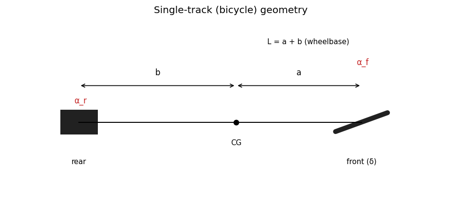
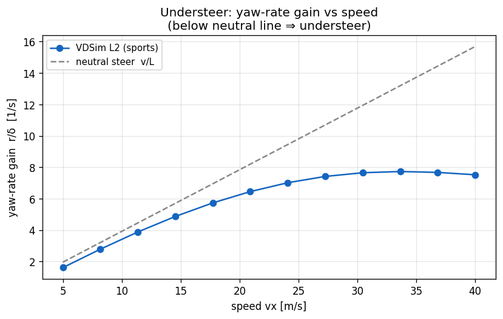
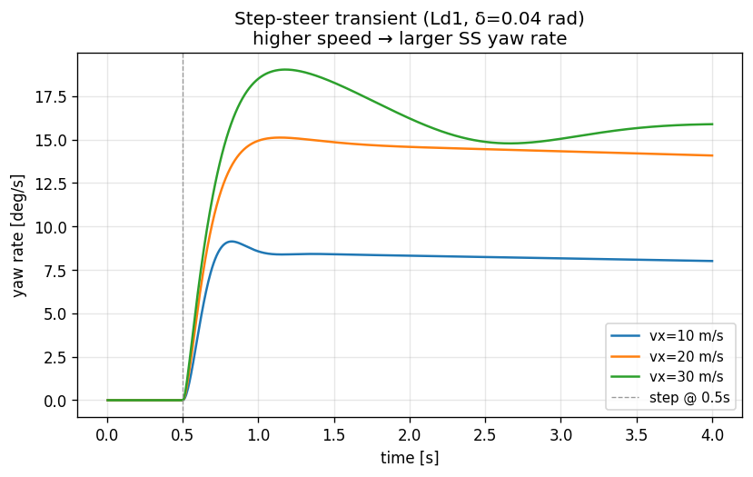

# 04. Ld1-Bicycle (Single-Track, 5 DOF)

## Learning objectives

이 chapter 를 마치면 다음을 할 수 있다.

1. single-track 모델의 가정과 적용 범위를 한계와 함께 설명한다.
2. 5-DOF state vector 의 각 성분과 적분 구조를 기술한다.
3. linear-bicycle 의 steady-state yaw rate 와 understeer gradient $K_{us}$ 를
   유도하고, 그것이 simulator 검증의 baseline 이 되는 이유를 설명한다.
4. longitudinal weight transfer 의 self-referential 구조와 1-step lag 처리의
   타당성을 판단한다.
5. Ld1 아래 rung 인 **Lk-Kinematic**(타이어·slip 없는 기하 모델)의 식과 적용
   범위를 구분한다 (§4.14).

## Prerequisites

- **Chapter 01** — frame, slip 정의, 부호 약속.
- **Chapter 02** — body-frame EoM, kinematic $a_x$.
- **Chapter 03** — Pacejka 로부터 $F_x, F_y, M_z$.
- **외부 reference** — Genta §4-5, Rajamani §2 (SAE 부호 주의).

---

## 4.1 동기 — 왜 single-track 부터인가

차량 동역학의 핵심 거동 (cornering / braking / accel) 은 single-track 만으로
정성적으로 정확히 표현된다. 4-wheel per-tire 모델 (Ld2) 은 weight transfer 의
정량 정확도를 더하지만, **제어기 개발 단계에서는 single-track 으로 충분**하다.
제어기가 Ld1 에서 동작하면 더 높은 fidelity (Ld2-Ld3) 로 옮겨도 거의 그대로
동작한다 — 그렇지 않다면 제어기의 모델 invariance 가 부족한 것이다.



위 그림은 CG 로부터 front/rear axle 거리 $a, b$, 조향각 $\delta$, 그리고 각
axle 의 slip angle $\alpha_f, \alpha_r$ 의 기하 관계를 보여준다.

---

## 4.2 가정

| 가정 | 의미 | 깨지는 case |
|---|---|---|
| Single-track | 양 wheel 을 axle 평균으로 (wheel 수 = 2) | chapter 05 (per-tire 4) |
| Planar | roll/pitch = 0, yaw 만 | chapter 06 (Ld3) |
| Static Fz (lateral) | longitudinal transfer 만, lateral 무시 | chapter 05 (lateral transfer) |
| Per-axle Pacejka | axle Fz + 평균 slip 으로 1 회 call | chapter 05 (per-tire 4 call) |
| Rigid wheel-spin | spin inertia = disk approximation | — |

---

## 4.3 State vector (5 DOF)

적분 상태:

$$
y = [\,x_w,\; y_w,\; \psi,\; v_x,\; v_y,\; r,\; \omega_f,\; \omega_r\,]
$$

물리적 DOF 는 5 개 ($v_x, v_y, \psi$ + 2 wheel spin) 이며, 적분기 관점에서는
8 개의 first-order ODE (position 3 개는 kinematic). $\omega_f, \omega_r$ 는
front/rear axle 의 wheel spin.

state 와 frame 약속의 매핑 (position=world, velocity=body 등) 은 chapter 01
§1.5 의 ABI 약속을 따른다.

---

## 4.4 Bicycle EoM

body-frame Newton-Euler (chapter 02) + per-axle tire force:

$$
\begin{aligned}
m\, \dot v_x  &= F_{x,\text{total}} + m\, v_y\, r &&\text{(body-x)} \\
m\, \dot v_y  &= F_{y,\text{total}} - m\, v_x\, r &&\text{(body-y)} \\
I_{zz}\, \dot r &= a\, F_{y,\text{body},f} - b\, F_{y,\text{body},r} + \textstyle\sum M_{z,\text{wheel}} &&\text{(yaw)} \\
I_w\, \dot\omega_f &= T_{\text{drive},f} + T_{\text{brake},f} - F_{x,\text{wheel},f}\, R &&\text{(front spin)} \\
I_w\, \dot\omega_r &= T_{\text{drive},r} + T_{\text{brake},r} - F_{x,\text{wheel},r}\, R &&\text{(rear spin)}
\end{aligned}
$$

힘의 구성 (wheel frame → body frame 회전 포함):

$$
\begin{aligned}
F_{x,\text{total}} &= F_{x,\text{body},f} + F_{x,\text{body},r} - F_{\text{aero}} - F_{rr} \\
F_{y,\text{total}} &= F_{y,\text{body},f} + F_{y,\text{body},r} \\
F_{x,\text{body},f} &= F_{x,\text{wheel},f}\cos\delta - F_{y,\text{wheel},f}\sin\delta \\
F_{y,\text{body},f} &= F_{x,\text{wheel},f}\sin\delta + F_{y,\text{wheel},f}\cos\delta
\end{aligned}
$$

rear 는 un-steered 이므로 $F_{x,\text{body},r} = F_{x,\text{wheel},r}$,
$F_{y,\text{body},r} = F_{y,\text{wheel},r}$. $a, b$ 는 CG-to-front,
CG-to-rear 거리.

---

## 4.5 Per-axle Fz — longitudinal weight transfer

Static Fz:

$$
F_{z,f}^{\text{static}} = \frac{m g b}{L}, \qquad
F_{z,r}^{\text{static}} = \frac{m g a}{L}
$$

Longitudinal transfer (axle 단위):

$$
\Delta F_{z,\text{long}} = \frac{m\, a_x\, h_{cg}}{L}
$$

$$
F_{z,f} = \frac{m g b}{L} + F_{z,\text{aero},f} - \Delta F_{z,\text{long}}, \qquad
F_{z,r} = \frac{m g a}{L} + F_{z,\text{aero},r} + \Delta F_{z,\text{long}}
$$

부호 직관:

- 가속 ($a_x > 0$) → $\Delta F_{z,\text{long}} > 0$ → rear loaded, front 가 덜 loaded.
- 제동 ($a_x < 0$) → front loaded (nose dive).

### Self-referential 구조와 1-step lag

$a_x = F_{x,\text{total}}/m$ 인데, $F_{x,\text{total}}$ 은 tire $F_x$ 의 합이고,
tire $F_x$ 는 Pacejka 가 $F_z$ 의 함수로 계산하며, $F_z$ 는 다시 $a_x$ 의
함수다. 즉 $a_x = f(F_z(a_x))$ 의 self-referential 구조 — 엄밀히 풀려면
fixed-point iteration 이 필요하다.

표준적 해법은 **1-step lag**: 직전 substep 의 $a_{x,\text{prev}}$ 를 사용한다.

$$
F_z(t) = F_z^{\text{static}} + \frac{m\, a_{x,\text{prev}}\, h_{cg}}{L}
$$

substep 이 충분히 작으면 (1 ms 수준) lag bias 가 무시 가능하다. 정량 검증은
§4.8 과 §4.13 의 implementation note 참조. iteration 의 trade-off 는
chapter 11 (수치 적분) 에서 다룬다.

### Aero downforce

$$
q = \tfrac{1}{2} \rho_{\text{air}} A\, v_x |v_x|, \qquad
F_{z,\text{aero},f} = C_{l,f}\, q, \qquad
F_{z,\text{aero},r} = C_{l,r}\, q
$$

$v_x|v_x|$ 표기로 후진 시 부호 반전. 승용차는 $C_l \approx 0$, sports/race
에서 nonzero.

---

## 4.6 Drive / brake torque 분배

Drive split (drive_type 별):

- FWD: front axle 만.
- RWD: rear axle 만.
- AWD: front/rear 50:50.

Brake (brake_bias_front):

$$
T_{b,f} = \text{bias} \cdot \text{brake} \cdot T_{\text{brake,max}}, \qquad
T_{b,r} = (1 - \text{bias}) \cdot \text{brake} \cdot T_{\text{brake,max}}
$$

EBD (electronic brake distribution) 활성 시 dynamic bias:

$$
\text{bias} = \operatorname{clamp}\!\left(\frac{F_{z,f}}{F_{z,f} + F_{z,r}},\; 0.05,\; 0.95\right)
$$

제동 시 front 가 더 loaded → bias 증가 → front 가 더 많이 제동 → ABS 유사
효과. wheel spin 부호는 $\tanh(\omega/w)$ 의 smooth sign 으로 처리해 정지
근처 발진을 막는다.

---

## 4.7 Linear-bicycle steady-state (검증 baseline)

linear region 의 SS yaw rate. 가정:

- 작은 $\alpha$ → $F_y = -C_\alpha \alpha$ ($C_\alpha = B C D F_z \mu$, Pacejka linear slope).
- $v_x = \text{const}$, $\dot v_y = \dot r = 0$, $v_y \ll v_x$.

SS EoM:

$$
m\, v_x\, r = F_{y,\text{total}}, \qquad
0 = a\, F_{y,f} - b\, F_{y,r}
$$

slip angle 의 linear 표현 (ISO 8855 부호):

$$
\alpha_f \approx \frac{v_y + a r}{v_x} - \delta, \qquad
\alpha_r \approx \frac{v_y - b r}{v_x}
$$

$F_{y,f} = -C_f \alpha_f$, $F_{y,r} = -C_r \alpha_r$ 대입 후 2×2 선형 시스템:

$$
\begin{bmatrix}
(C_f + C_r)/v_x & (a C_f - b C_r)/v_x - m v_x \\[2pt]
(a C_f - b C_r)/v_x & (a^2 C_f + b^2 C_r)/v_x
\end{bmatrix}
\begin{bmatrix} v_y \\ r \end{bmatrix}
=
\begin{bmatrix} C_f \delta \\ a C_f \delta \end{bmatrix}
$$

### Understeer gradient

$$
K_{us} = \frac{m}{L}\left(\frac{b}{C_f} - \frac{a}{C_r}\right), \qquad
r_{ss} = \frac{v_x\, \delta}{L\,(1 + K_{us}\, v_x^2)}
$$

$K_{us} > 0$ understeer, $< 0$ oversteer, $= 0$ neutral. $v_x \to \infty$
에서 understeer 차량은 yaw rate 증가가 둔화, oversteer 는 발산한다.

**Neutral steer 의 special case**: $a C_f = b C_r$ 이면 $K_{us} = 0$,
$r_{\text{neutral}} = v_x \delta / L$ (Ackermann). cornering stiffness 가
질량 분포에 비례해 scale 되면 ($C_f/C_r = F_{z,f}/F_{z,r} = b/a$) 자동
성립하나, 차종이 바뀌면 깨진다.



위 그림은 실제 모델 sweep — yaw-rate gain $r/\delta$ 가 고속에서 neutral 선
$v/L$ 아래로 처지고 saturate 하는 understeer 의 교과서적 거동을 보여준다.



step 입력 후 yaw rate 가 속도별로 다른 정상값으로 수렴하는 과도 응답.

---

## 4.8 검증 전략

| 검증 | 식 / 케이스 |
|---|---|
| SS yaw rate vs 해석값 | $v_x=10$, $\delta=0.05$ 에서 sim 과 linear-bicycle 해석값 오차 5 % 이내 |
| Linear region 일관성 | (vx, δ) 격자에서 $a_y < 3$ m/s² cell 의 오차 ≤ 10 % |
| Drag coast | aero drag only 의 $v_x(t) = v_{x0}/(1 + v_{x0} k t)$ 해석해와 ±5 % |
| weight transfer | brake step 의 $F_{z,f}$ 비율이 해석값과 0.1 % 이내 |

sim vs 해석값의 차이 일부는 Mz aggregation (해석 bicycle 은 무시) 와 small
nonlinearity 진입의 효과로, 구현 오류가 아니다. test 매핑은 §4.13 참조.

---

## 4.9 한계

| 항목 | 한계 | 다루는 chapter |
|---|---|---|
| Lateral weight transfer | 없음 | chapter 05 |
| Differential | 없음 (axle 평균) | chapter 05 |
| Suspension dynamics | 없음 | chapter 06 |
| Combined slip | friction-ellipse rescale 만 | chapter 03 §3.4 |
| Driver model | 외부 제어기 사용 | chapter 10 |

single-track 자체는 제어기 개발용으로 충분하다.

---

## 4.10 다음 chapter 와의 연결

single-track 은 axle 단위 Fz 만 다룬다. chapter 05 (Ld2) 는 이를 **per-tire
4-wheel** 로 확장하여 lateral weight transfer, Ackermann geometry,
differential 을 더한다. 같은 base EoM (chapter 02) 위에 force 구성만 정교해진다.

---

## 4.11 참고문헌

- **Genta, G.** *Motor Vehicle Dynamics*, 2014. §4 single-track, §5 understeer/oversteer.
- **Rajamani, R.** *Vehicle Dynamics and Control*, 2012. §2 bicycle derivation (SAE 부호).
- **Gillespie, T.** *Fundamentals of Vehicle Dynamics*, SAE, 1992. understeer gradient.

---

## 4.12 Self-check

<details>
<summary>1. single-track 에서 제어기를 개발한 뒤 Ld2-Ld3 로 옮겨도 되는 근거는?</summary>

핵심 거동 (cornering/braking/accel) 이 single-track 으로 정성적으로 정확하므로,
모델 invariant 한 제어기라면 fidelity 를 올려도 동작한다. 옮겨서 깨진다면
제어기가 특정 fidelity 에 과적합된 것.
</details>

<details>
<summary>2. <code>K_us > 0</code> 차량의 고속 거동은?</summary>

understeer. $r_{ss} = v_x\delta / (L(1+K_{us}v_x^2))$ 에서 분모가 $v_x^2$ 로
커져 yaw rate gain 의 증가가 둔화된다. 고속에서 "밀리는" 안정적 거동.
</details>

<details>
<summary>3. weight transfer 의 self-referential 구조란?</summary>

$F_z$ 가 $a_x$ 의 함수이고 $a_x = F_x/m$ 인데 $F_x$ 는 Pacejka 가 $F_z$ 로
계산 → $a_x = f(F_z(a_x))$. 닫힌 형태로 풀려면 fixed-point iteration 또는
1-step lag 근사가 필요하다.
</details>

<details>
<summary>4. neutral steer 가 default tire 에서 자동 성립하는 조건은?</summary>

$C_f/C_r = b/a$, 즉 cornering stiffness 가 static Fz 분포($F_{z,f}/F_{z,r}=b/a$)에
비례할 때. 이때 $a C_f = b C_r$ 이 되어 $K_{us}=0$. 차종(질량분포)이 바뀌면 깨진다.
</details>

<details>
<summary>5. aero downforce 식에 <code>vx·|vx|</code> 를 쓰는 이유는?</summary>

aero 힘은 $v_x^2$ 에 비례하지만 방향은 진행 방향. $v_x|v_x|$ 로 쓰면 후진
($v_x<0$) 시 부호가 자동 반전되어 항상 진행을 거스르는 drag/downforce 가 된다.
</details>

---

## 4.13 VDSim 구현 노트

> **[VDSim impl] § 4.3 — State 매핑**
>
> `core/src/bicycle_dynamics.cpp:89-99` 의 `Deriv` struct 이 state vector 와
> 1-to-1. `wheel_spin[FL]=wheel_spin[FR]=ω_f`, `wheel_spin[RL]=wheel_spin[RR]=ω_r`
> (axle 평균을 두 wheel 에 복제).

> **[VDSim impl] § 4.4 — EoM 코드**
>
> `core/src/bicycle_dynamics.cpp:165-203` 가 §4.4 의 force 구성 + EoM 그대로.

> **[VDSim impl] § 4.5 — 1-step lag 코드 + 검증**
>
> `core/src/bicycle_dynamics.cpp:120-127`:
>
> ```cpp
> const double dFz_long = m * ax_prev_ * h_cg / L;
> double Fz_f = m * kGravity * b / L + Fz_aero_f - dFz_long;
> double Fz_r = m * kGravity * a / L + Fz_aero_r + dFz_long;
> ```
>
> brake step 검증: 실측 $a_x = -3.36$ m/s² → 해석 $\Delta F_z = 1027$ N. sim
> 의 $F_{z,f}$ 비율 1.125 vs 해석 1.126 — 오차 0.1 %. 1-step lag 가 1 ms
> substep 에서 무시 가능 정확도임을 확인.

> **[VDSim impl] § 4.7 — 해석 baseline 코드**
>
> `tests/integration/test_bicycle_steady_state.cpp:42-70` 의
> `analytical_yaw_rate` 가 §4.7 의 2×2 시스템 해 그대로. sim 출력과 대조하는
> ground truth.

> **[VDSim impl] § 4.8 — 검증 test**
>
> | 검증 | test |
> |---|---|
> | SS yaw rate vs 해석 | `BicycleSteadyState.LeftTurnYawRateMatchesAnalytical` |
> | linear region 격자 | `StepSteerSweep.LinearRegionWithinTenPercent` |
> | drag coast | `LongScenarios.DragCoastMatchesAnalytical` |

> **[VDSim impl] § 4.x — 최소 사용 예제**
>
> ```cpp
> auto dyn = vdsim::create_bicycle();
> dyn->initialize(vp, tp, sp);
>
> vdsim::State s0;
> s0.velocity = {10, 0, 0};
> dyn->reset(s0);
>
> vdsim::ContactArray contacts;          // flat ground, mu = 1
> for (auto& p : contacts) {
>     p.is_valid = true; p.normal = {0, 0, 1};
>     p.mu_long = 1; p.mu_lat = 1;
> }
>
> vdsim::CmdL4 cmd;
> cmd.steer_angle_wheel = 0.05;
> for (int i = 0; i < 1000; ++i) dyn->step(cmd, contacts, 0.005);
>
> std::cout << "yaw rate = " << dyn->state().yaw_rate() << "\n";
> ```
>
> minimal controller-on-bicycle 루프 (Lc4-Pedal level). 상위 제어 cascade 는
> chapter 07-09.

---

## 4.14 Lk — Kinematic bicycle (the precursor rung)

Ld1 아래의 가장 단순한 사다리 rung. **타이어 힘도 slip 도 없다** — 순수 기하·운동학
으로만 차량을 움직인다. path-planning / kinematic-MPC / 가장 가벼운 시각화에 쓴다.

$$
\dot v = a, \qquad \dot\psi = \frac{v\,\tan\delta}{L}, \qquad
\dot x = v\cos\psi, \quad \dot y = v\sin\psi, \qquad v_y \equiv 0
$$

- **longitudinal**: 가속도 $a$ 는 pedal 에서 — 모터/브레이크 토크를 질량으로 환산한
  cap 으로. $a = \text{thr}\cdot A - \text{brk}\cdot B$, $A = T_{\text{motor,max}}/(R\,m)$,
  $B = T_{\text{brake,max}}/(R\,m)$. forward gear 면 $v\ge0$ 로 clip(역주행 방지).
- **lateral/yaw**: $\dot\psi = v\tan\delta/L$ — sideslip 없는 **kinematic steering**.
  따라서 $v_y=0$, $a_y = v\dot\psi$ (구심).
- **Fz**: 동역학 없이 정적 배분 $m g\,b/(2L)$(front), $m g\,a/(2L)$(rear) 만 보고
  (slip/transfer 없음).

Ld1(동역학 bicycle)과의 차이: Lk 는 tire 모델·slip·weight transfer 가 전부 없어
한계주행·제동 거동을 표현 못 한다. 대신 결정론적이고 빠르며, 경로 추종 기하의
baseline 이다. ISO 8855 frame.

> **[VDSim impl] § 4.14 — Lk 코드**
>
> `core/src/kinematic_dynamics.cpp` 의 `KinematicBicycle` (`Level::Lk_Kinematic`,
> `create_kinematic()`). substep Euler 적분, `tire_forces`/`slip` 은 빈 배열.
> make_sim_session 의 level `"K"`/`"L0"` 가 이 모델.
