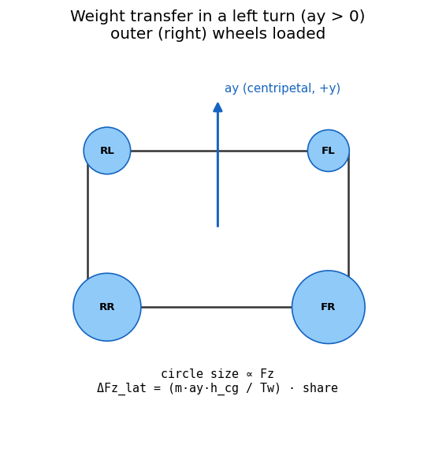

# 05. Ld2-SevenDOF — Per-Tire, Weight Transfer, Ackerman, Differential

> **학습 목표.** Ld2 가 Ld1 위에 무엇을 더 하는지 정확히 안다. lateral weight transfer 의 roll-stiffness 분배 공식을 유도한다. Ackerman steering geometry 의 inside/outside wheel angle 식을 안다. Open / Locked / LSD differential 의 torque 분배 메커니즘을 안다. 본 PoC 의 1-step lag 가 SS cornering 의 lateral transfer 에서도 충분한지 / 어떤 한계가 있는지 안다.

## 5.1 Ld1 → Ld2 의 step (정리)

| 항목 | Ld1 | Ld2 |
|---|---|---|
| Wheel count | 2 (axle 평균) | 4 (per-tire) |
| Fz | axle static + longitudinal | per-tire static + long + lat transfer |
| Pacejka call | 2 (front, rear) | 4 |
| Wheel spin | 2 (ω_f, ω_r) | 4 (independent) |
| Differential | 없음 | Open / Locked / LSD |
| Ackerman | 평균 δ only | per-wheel δ_inner / δ_outer |
| Steering rack torque | 없음 | front-axle Mz sum × ratio |
| Roll/pitch 진단 | 0 | quasi-static estimate |

Ld2 는 본격 차량 dynamics validation 의 entry level. autonomy 도메인 (ADAS) 의 표준 fidelity.



## 5.2 Per-tire Fz with lateral + longitudinal weight transfer

Static per-tire:

$$
F_{z,f}^{\text{static}} = \frac{m g b}{2 L}, \qquad
F_{z,r}^{\text{static}} = \frac{m g a}{2 L}
$$

Longitudinal transfer (per-tire axle 의 절반):

$$
\Delta F_{z,\text{long,half}} = \frac{m\, a_x\, h_{cg}}{2 L}
$$

Lateral transfer — 핵심 식:

$$
\Delta F_{z,\text{lat},f} = \frac{m\, a_y\, h_{cg}}{T_{w,f}} \cdot s_f, \qquad
\Delta F_{z,\text{lat},r} = \frac{m\, a_y\, h_{cg}}{T_{w,r}} \cdot s_r
$$

$$
s_f = \frac{K_{\phi,f}}{K_{\phi,f} + K_{\phi,r}}, \qquad
s_r = \frac{K_{\phi,r}}{K_{\phi,f} + K_{\phi,r}}
$$

`K_phi_f`, `K_phi_r` 는 front / rear axle 의 roll stiffness (springs + ARB combined).

**share** 의 의미: total roll moment 가 두 axle 에 어떻게 나뉘는가. roll stiffness 비율 기준 분배.
front 가 더 stiff 한 차량 → front axle 이 더 많은 lateral transfer 를 흡수 → front outer 가 더 loaded → understeer.

### 유도 — roll moment balance

차량이 좌선회 (ay > 0). sprung mass 의 inertia force = `−m_s · ay · ŷ`. CG height `h_cg` 의 lever arm 으로 roll moment `M_roll = m · ay · h_cg`.

이 moment 가 front axle 과 rear axle 의 roll spring 에 의해 분배. 각 axle 의 share 는 stiffness 비율 (parallel spring 으로 봤을 때).

axle 의 share 가 결정되면, 그 share 가 axle 내 좌우 tire 의 Fz 차이를 만든다:

$$
F_{\text{outer}} - F_{\text{inner}} = \frac{M_{\text{roll,axle}}}{T_w / 2} = 2\, \Delta F_{z,\text{lat}}
$$

따라서 $\Delta F_{z,\text{lat}} = M_{\text{roll,axle}} / T_w = (m\, a_y\, h_{cg}\, s) / T_w$.

VDSim 코드 `core/src/seven_dof_dynamics.cpp:158-176`:
```cpp
const double dFz_lat_f = (Tw_f > 1e-3)
    ? m * ay_prev_ * h_cg / Tw_f * share_f : 0.0;
const double dFz_lat_r = (Tw_r > 1e-3)
    ? m * ay_prev_ * h_cg / Tw_r * share_r : 0.0;

Fz[WHEEL_FL] = Fz_static_f - dFz_long_half - dFz_lat_f;
Fz[WHEEL_FR] = Fz_static_f - dFz_long_half + dFz_lat_f;
Fz[WHEEL_RL] = Fz_static_r + dFz_long_half - dFz_lat_r;
Fz[WHEEL_RR] = Fz_static_r + dFz_long_half + dFz_lat_r;
```

**부호 직관**: `ay > 0` (left turn, centripetal +y) → 차체가 right (−y) 쪽으로 기울고 → right side tire (FR, RR) loaded → `Fz_FR > Fz_FL`. 위 식에서 `+dFz_lat_f` 가 FR 에 더해져 정확.

`ay_prev_` 사용 — 1-step lag (Ld1 의 ax 와 동일 이유).

### ay 의 정확한 정의 — Task 20 의 버그 사례

처음 구현에서 `ay_prev = k.dvy` 로 저장. 이건 frame velocity 도함수 (= `v̇y`). 실제 lateral acceleration 은 `ay = v̇y + vx · r = Fy / m`. Task 20 의 격자 sweep 에서 lateral transfer 가 37 N 으로 비현실적 (예상 ~2000 N). 수정 후 `ay_prev = Fy_total / m` 로 변경. transfer 가 3693 N (예상값과 동차원) 으로 수렴.

이게 chapter 02 §2.7 의 "3 종류의 ax" 의 실전 사례. 코드 `core/src/seven_dof_dynamics.cpp:353-354` 의 `d_out.ax_body / ay_body` 가 그래서 명시적으로 `Fx/m, Fy/m` 로 저장.

## 5.3 Per-wheel velocity / slip

각 wheel 의 body-frame velocity:

$$
v_{x,\text{body},i} = v_x - r\, r_{y,i}, \qquad
v_{y,\text{body},i} = v_y + r\, r_{x,i}
$$

여기서 $(r_{x,i}, r_{y,i})$ 는 wheel 의 body-frame 위치:
- FL: `(+a, +Tw_f/2)`
- FR: `(+a, −Tw_f/2)`
- RL: `(−b, +Tw_r/2)`
- RR: `(−b, −Tw_r/2)`

(ISO 8855 RH 에서 +y = leftward → left wheels 는 +y, right wheels 는 −y.)

front wheels 는 추가로 steer angle $\delta_i$ (Ackerman 적용 시 $i$ 마다 다름) 만큼 rotated:

$$
v_{x,\text{wheel}} =  v_{x,\text{body}} \cos\delta_i + v_{y,\text{body}} \sin\delta_i, \qquad
v_{y,\text{wheel}} = -v_{x,\text{body}} \sin\delta_i + v_{y,\text{body}} \cos\delta_i
$$

rear wheels: wheel frame = body frame.

이게 chapter 03 의 Pacejka input (alpha, kappa) 의 source.

## 5.4 Ackerman steering geometry

### 문제

low-speed cornering 에서 inner / outer wheel 의 path radius 가 다르다. parallel steer (both wheels at same δ) 면 inner wheel 이 의도한 path 보다 큰 radius 를 그리려고 force → unnecessary slip.

### Perfect Ackerman

차량의 instantaneous center of rotation (ICR) 이 rear axle 의 연장선과 front-wheel 의 steering plane 교점. 양 front wheel 의 steering angle 이 그 ICR 로 align 되도록.

Geometry:

$$
R = \frac{L}{\tan\delta_{\text{avg}}}, \qquad
R_{\text{inner}} = R - \tfrac{T_{w,f}}{2}, \qquad
R_{\text{outer}} = R + \tfrac{T_{w,f}}{2}
$$

$$
\delta_{\text{inner}} = \arctan\frac{L}{R_{\text{inner}}}, \qquad
\delta_{\text{outer}} = \arctan\frac{L}{R_{\text{outer}}}
$$

$\delta_{\text{inner}} > \delta_{\text{outer}}$ (inner wheel 이 더 많이 꺾임).

### VDSim 의 percent-interpolation

$$
f = \frac{\text{ackerman\_percent}}{100}, \qquad
\delta_{i,\text{eff}} = \delta + f\, (\delta_{i,\text{ack}} - \delta)
$$

- `ackerman_percent = 0` → parallel steer (default Ld1 호환).
- `ackerman_percent = 100` → perfect Ackerman.

VDSim 코드 `core/src/seven_dof_dynamics.cpp:212-228`. 좌선회 (`δ > 0`) 일 때 inside = FL, outside = FR.

차종 별 default:
- sedan: 60 % (typical street car partial Ackerman).
- sports: 85 %.
- FSK formula: 100 %.
- race: 90 %.

검증 (Task 21): tight turn (`R=20, vx=2, δ=0.35`) 에서 `ackerman_percent 0 → 100` 으로 변경 시 SS yaw rate 가 +37 % 증가. inner wheel 의 slip 감소가 net cornering efficiency 향상으로 reflect.

## 5.5 Differential model

### Open differential

$$
T_L = T_R = \frac{T_{\text{axle}}}{2}
$$

좌우 동일 torque. 한쪽이 low-mu 면 (split-mu) 그 쪽이 spin up, 다른 쪽은 동일 torque 만 받음 (low). 결국 차량 전체 traction = lower mu side 의 한계.

### Locked differential (spool)

좌우 ω 동등화 강제. 실제로는 algebraic constraint (DAE). VDSim 의 smooth approximation:

$$
\Delta\omega = \omega_L - \omega_R, \quad
\text{bias} = 0.45 \tanh(2\Delta\omega), \quad
T_L = (0.5 - \text{bias})\, T_{\text{axle}}, \quad
T_R = (0.5 + \text{bias})\, T_{\text{axle}}
$$

`Δω > 0` (L spinning faster) → bias > 0 → R 가 더 많이 받음 (slower wheel gets more torque).
0.45 cap 으로 100:0 split 발산 방지.

### LSD (limited-slip differential)

preload + Δω-dependent ramp:

$$
\text{mag} = \operatorname{clamp}(\text{preload} + \text{ramp} \cdot |\Delta\omega|,\; 0,\; 0.45), \quad
\text{bias} = \text{mag} \cdot \tanh(2\Delta\omega), \quad
T_{L,R} = (0.5 \mp \text{bias})\, T_{\text{axle}}
$$

preload = 0.10, ramp = 0.20 (sedan default).
실제 LSD ramp angle 모델은 더 복잡 (drive vs coast 비대칭), 본 PoC 는 대칭.

검증 (Task 26 split-mu accel):
- Open: Δω_end = 0.605 rad/s
- LSD: Δω_end = 0.353
- Locked: Δω_end = 0.207

수치 ordering 이 정성 정확.

## 5.6 Steering rack torque feedback

front-wheel 의 Mz 합산 × steering_ratio = steering wheel torque (driver feedback).

$$
M_{\text{rack}} = (M_{z,FL} + M_{z,FR}) \cdot \text{steering\_ratio}
$$

VDSim 코드 `core/src/seven_dof_dynamics.cpp:114-117`:
```cpp
double steering_rack_torque() const override {
    return (mz_front_sum_ * vp_.steering_ratio);
}
```

좌선회 (δ > 0) 에서 Mz_front > 0 (self-aligning) → rack torque > 0 → 운전자가 steering 을 놓으면 wheel 이 centering 으로 돌아감.

DriverModel 에서 force-feedback 통합 시 활용 예정.

## 5.7 Body force / moment 합산

$$
\begin{aligned}
F_{x,\text{total}} &= \textstyle\sum_i F_{x,\text{body},i} - F_{\text{aero}} - F_{rr} \\
F_{y,\text{total}} &= \textstyle\sum_i F_{y,\text{body},i} \\
M_{z,\text{total}} &= \textstyle\sum_i (r_{x,i} F_{y,\text{body},i} - r_{y,i} F_{x,\text{body},i}) + \textstyle\sum_i M_{z,\text{wheel},i}
\end{aligned}
$$

body EoM:

$$
m\dot v_x = F_{x,\text{total}} + m v_y r, \quad
m\dot v_y = F_{y,\text{total}} - m v_x r, \quad
I_{zz}\dot r = M_{z,\text{total}}
$$

$$
a_{x,\text{body}} = F_{x,\text{total}}/m, \qquad
a_{y,\text{body}} = F_{y,\text{total}}/m \quad (\text{1-step lag input})
$$

## 5.8 Wheel-spin EoM (per-wheel)

$$
I_w\, \dot\omega_i = T_{\text{drive},i} + T_{\text{brake},i} - F_{x,\text{wheel},i}\, R
$$

$I_w = 0.5\, m_{\text{unsprung}}\, R^2$ (solid-disk approximation).

drive split → differential → per-wheel `T_drive_i`. brake split → axle bias + EBD → per-wheel `T_brake_i`.

## 5.9 Linear region 의 Ld2 ↔ Ld1 동일성

Linear region (ay 작음) 에서 lateral transfer 가 작고 differential 차이 미미. Ld2 SS yaw rate 가 Ld1 SS 와 거의 같다.

검증 (Task 20 격자 sweep):
- vx ≤ 15, |δ| ≤ 0.04: `|r_L2 − r_L1| / r_L1 ≤ 0.5 %`.
- vx = 20, δ = 0.10 (nonlinear): up to 89 % 차이. 이는 outer-tire saturation 의 본격 효과.

즉 Ld2 의 의미는 **nonlinear region 에서 본격 부각**.

## 5.10 한계 (Ld3 가 채우는 것)

| 항목 | Ld2 의 한계 |
|---|---|
| Suspension dynamics | quasi-static (transient 진동 없음) |
| Roll / pitch 의 dynamic response | 1-step lag estimate 만 |
| Wheel hop / unsprung mass 진동 | 없음 |
| Anti-dive / anti-squat | 없음 |
| Camber from roll | 없음 (`γ = 0`) |

이 모두 Ld3 가 추가.

## 5.11 검증 (Task 19, 20 등)

`SevenDOF.*` 18 tests:
- ConstructionAndLevel
- AtRestStaticFz — sum = m·g, per-axle 정확.
- HardBrakeLoadsBothFrontWheels — Fz_F > 1.05 · static_F.
- LeftTurnLoadsRightWheels — Fz_FR > Fz_FL, Fz_RR > Fz_RL.
- SmallSteerYawRateMatchesBicycle — linear region Ld1 ↔ Ld2 ≤ 10 %.
- AeroDownforceIncreasesFzAtSpeed
- OpenDifferentialSplitMu / LockedDifferentialReducesSpread / LSDBetweenOpenAndLocked
- AckermanInfluencesTurningRadius / AckermanZeroReproducesBaseline
- RollAngleSignAndScale / PitchAngleSignDuringBrake
- SteeringRackTorqueSignOpposesSteer
- IndependentWheelSpinUnderSplitMu

총 18 tests pass.

## 5.12 참고

- Genta, *Motor Vehicle Dynamics*, §5 (single-track), §6 (per-tire and weight transfer).
- Milliken & Milliken, *Race Car Vehicle Dynamics*, §6 (weight transfer derivation), §15 (Ackerman geometry, diff).
- Reimpell, *The Automotive Chassis*, §3 (steering geometry).
