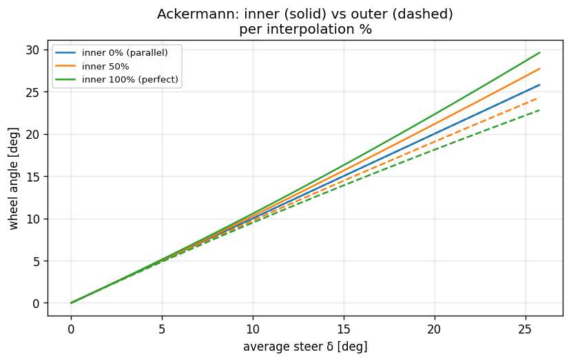

# 05. Ld2-SevenDOF (Per-Tire, 7 DOF)

## Learning objectives

이 chapter 를 마치면 다음을 할 수 있다.

1. Ld2 가 Ld1 위에 더하는 것 (per-tire Fz, lateral transfer, Ackermann,
   differential) 을 정확히 열거한다.
2. lateral weight transfer 를 geometric(roll center) + elastic(roll-stiffness
   분배) + unsprung 성분으로 분해해 유도한다. roll stiffness 는 corner spring
   에서 유도되고 ARB·roll-center 만 입력임을 안다.
3. Ackermann steering geometry 의 inner/outer wheel 각도 식을 유도하고
   percent-interpolation 의 의미를 설명한다.
4. Open / Locked / LSD differential 의 torque 분배 메커니즘과 split-mu 거동
   차이를 설명한다.
5. linear region 에서 Ld2 ↔ Ld1 이 일치하고 nonlinear 에서 갈라지는 이유를
   설명한다.

## Prerequisites

- **Chapter 04** — single-track, longitudinal transfer, 1-step lag.
- **Chapter 02** — body EoM, 3 종류의 $a_x$.
- **Chapter 03** — Pacejka $F_x, F_y, M_z$.

---

## 5.1 동기 — Ld1 → Ld2

| 항목 | Ld1 | Ld2 |
|---|---|---|
| Wheel count | 2 (axle 평균) | 4 (per-tire) |
| Fz | axle static + long | per-tire static + long + lat transfer |
| Pacejka call | 2 | 4 |
| Wheel spin | 2 | 4 (independent) |
| Differential | 없음 | Open / Locked / LSD |
| Ackermann | 평균 δ | per-wheel $\delta_{\text{inner}}/\delta_{\text{outer}}$ |
| Steering rack torque | 없음 | front Mz sum × ratio |
| Roll/pitch 진단 | 0 | quasi-static estimate |

Ld2 는 본격 차량 dynamics validation 의 entry level — ADAS 도메인의 표준
fidelity.


---

## 5.2 가정

| 가정 | 의미 | 깨지는 case |
|---|---|---|
| Quasi-static transfer | weight transfer 가 즉시 (suspension transient 없음) | chapter 06 (Ld3 dynamic roll) |
| 1-step lag $a_y$ | lateral transfer 가 직전 step $a_y$ 기반 | chapter 11 (iteration 옵션) |
| Symmetric LSD | drive/coast ramp 대칭 | 실차 LSD 비대칭 |
| Zero camber | roll 로부터 camber 없음 ($\gamma=0$) | chapter 06 |
| Rigid roll axis | geometric(roll center) + elastic(roll-stiffness 비율) + unsprung 으로 분배 | chapter 06 (compliance) |
| Planar body (no road attitude) | 노면 기울기는 force 로만, body 자세로는 X | chapter 06 (Ld3) |

### 노면 기울기와 ladder level (중요)

노면(grade/bank/지형)이 거동에 들어오는 통로는 level 마다 다르다:

- **L1 (Bicycle)**: planar, slope 는 slope-gravity + $F_z\propto\cos(\text{slope})$
  만. roll/pitch·하중이동 없음.
- **L2 (7DOF)**: **roll/pitch 자유도(state)는 없다** (transient 동특성 없음). 그러나
  noise 기울기는 두 경로로 들어간다: (1) slope-gravity + $\cos(\text{slope})$ 수직하중
  스케일, (2) **quasi-static 하중이동·roll/pitch 추정에 specific force**
  $a_\text{felt}=a_\text{kin}-g_\text{tangential}$ 를 사용. 일정 bank 직진처럼
  $a_y^\text{kin}\to0$ 이라도 타이어가 중력 횡성분을 받치는 $a_y^\text{felt}=-g_{y,b}$
  가 남아 **bank 에 의한 좌우 하중이동과 quasi-static roll 추정**이 생긴다 (예: 8°
  bank → downhill 측 +660 N, roll≈0.76°). 단 이는 정상상태 대수해이며 **차체 자세를
  state 로 적분하지 않는다** — transient·실제 attitude state 는 L3 의 몫. 뷰어가 차를
  노면에 기울여 그리는 것은 시각 표현이다.
  - 자유 coasting incline 은 종방향 하중이동 0 (중력·관성이 CG 에서 상쇄, $\cos$
    재분배만), 제동/등판 유지 시 종방향 이동 발생 — specific-force 정식화에서 자동.
  - **CG-migration (jacking)**: roll $\phi$ 가 sprung CG 를 횡으로
    $(h_{cg}-h_{ra})\sin\phi$ 이동시켜 추가 중력 roll moment 를 만든다 →
    유효 roll stiffness 가 $m_s g_\perp (h_{cg}-h_{ra})$ 만큼 감소
    ($M_\text{roll}$·종방향 transfer 를 $1/(1-\varepsilon)$ 로 증폭,
    $\varepsilon=m_s g_\perp\,\text{arm}/K$). pitch 도 동일. sedan flat 코너링
    ~6-10%, 8° bank 에서 roll 0.76→0.81°, 횡 transfer 660→696 N. flat 직진은 불변.
- **L3 (14DOF)**: 바퀴별 `road_dz` 가 unsprung↔노면 tire spring 에 들어가 sprung
  body 의 roll/pitch 가 노면 평면을 **자세로** 따라간다 (chapter 06 §6.4). 단
  grip $F_z$ 는 아직 quasi-static (같은 chapter 한계 box).

---

## 5.3 Per-tire Fz — lateral + longitudinal transfer

Static per-tire:

$$
F_{z,f}^{\text{static}} = \frac{m g b}{2 L}, \qquad
F_{z,r}^{\text{static}} = \frac{m g a}{2 L}
$$

Longitudinal transfer (axle 의 절반):

$$
\Delta F_{z,\text{long,half}} = \frac{m\, a_x\, h_{cg}}{2 L}
$$

Lateral transfer — geometric + elastic + unsprung 분해:

$$
\Delta F_{z,\text{lat},f} = \frac{1}{T_{w,f}}\Big[
\underbrace{F_{y,s}\,\tfrac{b}{L}\,h_{rc,f}}_{\text{geometric (jacking)}}
+ \underbrace{M_{\text{roll}}\, s_f}_{\text{elastic (roll)}}
+ \underbrace{m_{u,f}\, a_y\, h_{u}}_{\text{unsprung}} \Big]
$$

(rear 도 $a\leftrightarrow b$, $f\leftrightarrow r$ 대칭). 여기서

$$
F_{y,s} = m_s\, a_y, \quad
M_{\text{roll}} = F_{y,s}\,(h_{cg}-h_{ra}), \quad
h_{ra} = h_{rc,f}\tfrac{b}{L} + h_{rc,r}\tfrac{a}{L},
$$

$$
s_f = \frac{K_{\phi,f}}{K_{\phi,f}+K_{\phi,r}}, \qquad
K_{\phi,\text{axle}} = (k_{\text{left}}+k_{\text{right}})\left(\tfrac{T_w}{2}\right)^2 + K_{\text{ARB}}.
$$

핵심: axle roll stiffness $K_\phi$ 는 **corner spring 에서 유도**되며 ($spring \cdot arm^2$),
ARB 는 roll 전용 추가항이다 (입력은 ARB 와 roll-center height 만). $h_u$ 는 unsprung
CG 높이 ($\approx$ wheel radius).

### 유도 — geometric vs elastic

lateral force 가 sprung mass 에 작용할 때 전달 경로는 둘로 갈린다.
- **Geometric (jacking)**: roll center 를 통해 suspension link 로 즉시 전달되는
  성분. roll 을 일으키지 않고 $F_{y,s}\,h_{rc}/T_w$ 만큼 직접 Fz 차이.
- **Elastic (roll)**: roll axis (front/rear roll center 를 잇는 선, CG 아래 높이
  $h_{ra}$) 둘레의 roll moment $M_{\text{roll}} = F_{y,s}(h_{cg}-h_{ra})$ 가 두
  axle 의 roll spring 에 stiffness 비율 $s_f$ 로 분배.

front 가 더 stiff (또는 front ARB↑) → front share↑ → front outer 가 더 loaded
→ understeer 경향. $h_{rc}=0$ 이면 geometric=0, $h_{ra}=0$ 으로 elastic-only
($M_{\text{roll}}=m_s a_y h_{cg}$) 이 되어 단순 모델로 환원된다.

### roll-DOF 없는 L2 가 roll stiffness 를 쓰는 근거 (중요)

elastic 분배 $s_f = K_{\phi,f}/(K_{\phi,f}+K_{\phi,r})$ 는 **sprung mass 의 roll 이
front/rear roll spring 에 분배되는** roll 매개 효과다. L2 는 roll 자유도를 적분하지
않는데 이걸 쓰는 것이 모순처럼 보이지만, 다음으로 정당화된다:

- **total transfer (front+rear 합)** 은 순수 statics — roll 무관.
- **front/rear 분배** 는 정상상태에서 실제로 roll-stiffness 비율로 결정된다
  (**TLLTD**, total lateral load transfer distribution — 측정 가능한 실물리량).
  따라서 **정상상태에서는 근사가 아니라 정확**하다.
- L2 는 "roll 이 무한히 빠르게 정상상태로 settle 한다"는 **quasi-static roll
  가정**(§5.2) 하에 그 정상상태 결과만 대수적으로 가져온다. roll 이 없다고 보는 게
  아니라 transient 를 무시(즉시 settle)하는 것.
- **transient 한계**: turn-in 같은 빠른 과도에서 실제 elastic transfer 는 roll
  시상수만큼 지연되며 쌓이는데 L2 는 lag 없이 즉시 full split 을 건다 → 과도
  구간에서 약간 aggressive. 이 lag 는 roll 을 상태로 갖는 chapter 06 (Ld3) 가 메운다.
- "순수 2D" 를 원하면 분배를 정적하중 $b/L, a/L$ 로 바꿀 수 있으나, ARB·spring 의
  front/rear balance 튜닝(understeer 의 #1 손잡이)이 L2 에서 무력화된다. 본 시리즈는
  balance tunability 를 위해 roll-stiffness 분배(TLLTD)를 채택한다.

부호 직관: $a_y > 0$ (좌선회, centripetal $+y$) → 차체가 $-y$ 쪽으로 기울고
→ right side (FR, RR) loaded → $F_{z,FR} > F_{z,FL}$.

### $a_y$ 의 정확한 정의

lateral acceleration 은 $a_y = \dot v_y + v_x r = F_y/m$ 이지 frame 도함수
$\dot v_y$ 가 아니다 (chapter 02 §2.7). 이를 혼동하면 lateral transfer 가 두
자릿수 N 으로 비현실적으로 작아진다. 정량 사례는 §5.13 box.

---

## 5.4 Per-wheel velocity / slip

각 wheel 의 body-frame velocity:

$$
v_{x,\text{body},i} = v_x - r\, r_{y,i}, \qquad
v_{y,\text{body},i} = v_y + r\, r_{x,i}
$$

wheel 의 body-frame 위치 $(r_{x,i}, r_{y,i})$:

- FL: $(+a, +T_{w,f}/2)$
- FR: $(+a, -T_{w,f}/2)$
- RL: $(-b, +T_{w,r}/2)$
- RR: $(-b, -T_{w,r}/2)$

(ISO 8855 RH: $+y$ = leftward → left wheels $+y$, right wheels $-y$.)

front wheels 는 추가로 steer $\delta_i$ (Ackermann 시 wheel 마다 다름) 회전:

$$
v_{x,\text{wheel}} =  v_{x,\text{body}}\cos\delta_i + v_{y,\text{body}}\sin\delta_i, \qquad
v_{y,\text{wheel}} = -v_{x,\text{body}}\sin\delta_i + v_{y,\text{body}}\cos\delta_i
$$

rear: wheel frame = body frame. 이것이 chapter 03 Pacejka input
($\alpha, \kappa$) 의 source.



---

## 5.5 Ackermann steering geometry

### 문제

low-speed cornering 에서 inner/outer wheel 의 path radius 가 다르다. parallel
steer (양 wheel 동일 $\delta$) 면 inner wheel 이 의도 path 보다 큰 radius 를
그리려 해 불필요한 slip 발생.

### Perfect Ackermann

instantaneous center of rotation (ICR) 이 rear axle 연장선과 front steering
plane 의 교점. 양 front wheel 의 angle 이 그 ICR 로 align:

$$
R = \frac{L}{\tan\delta_{\text{avg}}}, \qquad
R_{\text{inner}} = R - \tfrac{T_{w,f}}{2}, \qquad
R_{\text{outer}} = R + \tfrac{T_{w,f}}{2}
$$

$$
\delta_{\text{inner}} = \arctan\frac{L}{R_{\text{inner}}}, \qquad
\delta_{\text{outer}} = \arctan\frac{L}{R_{\text{outer}}}
$$

$\delta_{\text{inner}} > \delta_{\text{outer}}$ (inner 가 더 꺾임).

### Percent-interpolation

$$
f = \frac{\text{ackermann\_percent}}{100}, \qquad
\delta_{i,\text{eff}} = \delta + f\,(\delta_{i,\text{ack}} - \delta)
$$

- $0$ → parallel steer (Ld1 호환).
- $100$ → perfect Ackermann.

차종 default: sedan 60 %, sports 85 %, FSK formula 100 %, race 90 %.

---

## 5.6 Differential model

### Open

$$
T_L = T_R = \frac{T_{\text{axle}}}{2}
$$

split-mu 면 low-mu side 가 spin up, 차량 traction = lower-mu side 한계.

### Locked (spool)

좌우 $\omega$ 동등화 (실제는 algebraic constraint/DAE). smooth approximation:

$$
\Delta\omega = \omega_L - \omega_R, \quad
\text{bias} = 0.45\tanh(2\Delta\omega), \quad
T_L = (0.5 - \text{bias})T_{\text{axle}}, \quad
T_R = (0.5 + \text{bias})T_{\text{axle}}
$$

$\Delta\omega>0$ (L faster) → bias$>0$ → R 가 더 받음 (slower wheel gets more
torque). 0.45 cap 으로 발산 방지.

### LSD

preload + ramp:

$$
\text{mag} = \operatorname{clamp}(\text{preload} + \text{ramp}\cdot|\Delta\omega|,\;0,\;0.45), \quad
\text{bias} = \text{mag}\cdot\tanh(2\Delta\omega)
$$

sedan default preload 0.10, ramp 0.20. 실차 ramp angle (drive/coast 비대칭)
보다 단순화된 대칭 모델.

split-mu accel 에서 종단 $\Delta\omega$ ordering: Open > LSD > Locked (정성
정확). 정량은 §5.13 box.

---

## 5.7 Steering rack torque

$$
M_{\text{rack}} = (M_{z,FL} + M_{z,FR}) \cdot \text{steering\_ratio}
$$

좌선회 ($\delta>0$) 에서 $M_z>0$ (self-aligning) → rack torque$>0$ → 운전자가
놓으면 centering. DriverModel force-feedback 통합용.

---

## 5.8 Body force / moment + EoM

$$
\begin{aligned}
F_{x,\text{total}} &= \textstyle\sum_i F_{x,\text{body},i} - F_{\text{aero}} - F_{rr} \\
F_{y,\text{total}} &= \textstyle\sum_i F_{y,\text{body},i} \\
M_{z,\text{total}} &= \textstyle\sum_i (r_{x,i} F_{y,\text{body},i} - r_{y,i} F_{x,\text{body},i}) + \textstyle\sum_i M_{z,\text{wheel},i}
\end{aligned}
$$

$$
m\dot v_x = F_{x,\text{total}} + m v_y r, \quad
m\dot v_y = F_{y,\text{total}} - m v_x r, \quad
I_{zz}\dot r = M_{z,\text{total}}
$$

$$
a_{x,\text{body}} = F_{x,\text{total}}/m, \qquad
a_{y,\text{body}} = F_{y,\text{total}}/m \quad (\text{1-step lag input})
$$

per-wheel spin EoM:

$$
I_w\,\dot\omega_i = T_{\text{drive},i} + T_{\text{brake},i} - F_{x,\text{wheel},i}\, R,
\qquad I_w = 0.5\, m_{\text{unsprung}}\, R^2
$$

---

## 5.9 검증 전략

| 검증 | 케이스 |
|---|---|
| Static Fz | at-rest sum $= mg$, per-axle 정확 |
| Hard brake | $F_{z,f} > 1.05\,F_{z,f}^{\text{static}}$ |
| Left turn | $F_{z,FR} > F_{z,FL}$, $F_{z,RR} > F_{z,RL}$ |
| Ld1↔Ld2 linear | $v_x\le 15, |\delta|\le 0.04$ 에서 $|r_{L2}-r_{L1}|/r_{L1}\le 0.5\%$ |
| Differential ordering | split-mu $\Delta\omega$: Open > LSD > Locked |
| Ackermann | tight turn 에서 percent $0\to100$ 시 SS yaw rate 증가 |

linear region 에서 Ld2≈Ld1, nonlinear ($v_x=20,\delta=0.10$) 에서 outer-tire
saturation 으로 최대 ~89 % 차이 — Ld2 의 가치는 nonlinear region 에 있다.

---

## 5.10 한계

| 항목 | 한계 | 다루는 chapter |
|---|---|---|
| Suspension dynamics | quasi-static (transient 없음) | chapter 06 |
| Roll/pitch dynamic response | 1-step estimate 만 | chapter 06 |
| Wheel hop / unsprung 진동 | 없음 | chapter 06 |
| Anti-dive / anti-squat | 없음 | chapter 06 |
| Camber from roll | $\gamma=0$ | chapter 06 |

---

## 5.11 다음 chapter 와의 연결

Ld2 는 weight transfer 를 quasi-static 으로 처리한다. chapter 06 (Ld3,
14-DOF) 는 sprung/unsprung mass 를 분리하여 suspension 의 dynamic response
(roll/pitch transient, wheel hop, camber) 를 추가한다.

---

## 5.12 참고문헌

- **Genta, G.** *Motor Vehicle Dynamics*, §6 per-tire and weight transfer.
- **Milliken & Milliken**, *Race Car Vehicle Dynamics*, §6 weight transfer, §15 Ackermann/diff.
- **Reimpell, J.** *The Automotive Chassis*, §3 steering geometry.

---

## 5.13 Self-check

<details>
<summary>1. front roll stiffness 를 키우면 understeer/oversteer 중 어느 쪽?</summary>

understeer. front share $s_f$ 증가 → front lateral transfer 증가 → front
outer tire 과대 loading → tire saturation 으로 front cornering 능력 저하 →
understeer.
</details>

<details>
<summary>2. <code>ay_prev</code> 를 <code>v̇y</code> 로 두면 무슨 일이 생기나?</summary>

$a_y = \dot v_y + v_x r$ 인데 $\dot v_y$ 만 쓰면 $v_x r$ centripetal 항이
빠져 lateral transfer 가 수십 N 으로 비현실적으로 작아진다. $a_y = F_y/m$ 로
써야 한다.
</details>

<details>
<summary>3. split-mu 에서 Open diff 가 Locked 보다 traction 이 나쁜 이유?</summary>

Open 은 좌우 torque 동일 → low-mu wheel 이 먼저 spin up 하고 high-mu wheel
도 같은 (낮은) torque 만 받음. Locked 는 slower(high-mu) wheel 로 torque 를
몰아줘 traction 확보.
</details>

<details>
<summary>4. parallel steer (0 % Ackermann) 의 low-speed 문제는?</summary>

inner wheel 의 필요 steer 각이 outer 보다 큰데 둘이 같으면 inner 가 의도보다
큰 radius 를 그리려 해 slip/타이어 마모 발생. tight/low-speed turn 에서 두드러짐.
</details>

<details>
<summary>5. Ld2 가 Ld1 대비 의미를 갖는 영역은?</summary>

nonlinear region. linear 에서는 lateral transfer 효과가 작아 SS yaw rate 가
거의 동일 (≤0.5 %). 고 $a_y$ 에서 outer-tire saturation 이 본격화되며 갈라진다.
</details>

---

## 5.14 VDSim 구현 노트

> **[VDSim impl] § 5.3 — Lateral transfer 코드**
>
> `core/src/seven_dof_dynamics.cpp:158-176`:
>
> ```cpp
> const double Kf = axle_roll_stiffness(vp_, 0);   // (k_l+k_r)*(tw/2)^2 + ARB
> const double Kr = axle_roll_stiffness(vp_, 1);
> const double h_ra  = hrc_f * (b/L) + hrc_r * (a/L);
> const double Fys   = vp_.mass_sprung * ay_prev_;
> const double Mroll = Fys * (h_cg - h_ra);
> const double dFz_lat_f = (Tw_f > 1e-3)
>     ? (Fys*(b/L)*hrc_f + Mroll*(Kf/(Kf+Kr)) + m_uf*ay_prev_*R) / Tw_f : 0.0;
> Fz[WHEEL_FL] = Fz_static_f - dFz_long_half - dFz_lat_f;
> Fz[WHEEL_FR] = Fz_static_f - dFz_long_half + dFz_lat_f;
> ```
>
> 3-성분(geometric+elastic+unsprung). `+dFz_lat_f` 가 FR 에 더해져 좌선회 시
> $F_{z,FR}>F_{z,FL}$ 부호 정확. roll stiffness 는 spring 에서 유도되며 ARB·roll-center
> 만 입력.

> **[VDSim impl] § 5.3 — ay 정의 버그 history**
>
> 초기 구현이 `ay_prev = k.dvy` (frame 도함수). 격자 sweep 에서 lateral
> transfer 가 37 N 으로 비현실적 (예상 ~2000 N). `ay_prev = Fy_total/m` 로
> 수정 후 3693 N 으로 수렴. chapter 02 §2.7 "3 종류 ax" 의 실전 사례.
> `core/src/seven_dof_dynamics.cpp:353-354` 의 `ax_body/ay_body` 가 명시적으로
> `Fx/m, Fy/m`.

> **[VDSim impl] § 5.5 — Ackermann 코드**
>
> `core/src/seven_dof_dynamics.cpp:212-228`. 좌선회 ($\delta>0$) 시 inside=FL,
> outside=FR. 검증: tight turn ($R=20, v_x=2, \delta=0.35$) 에서 percent
> $0\to100$ 시 SS yaw rate +37 %.

> **[VDSim impl] § 5.6 — Differential 검증**
>
> split-mu accel 종단 $\Delta\omega$: Open 0.605, LSD 0.353, Locked 0.207 rad/s.
> 정성 ordering 일치.

> **[VDSim impl] § 5.7 — Rack torque 코드**
>
> `core/src/seven_dof_dynamics.cpp:114-117`:
>
> ```cpp
> double steering_rack_torque() const override {
>     return (mz_front_sum_ * vp_.steering_ratio);
> }
> ```

> **[VDSim impl] § 5.9 — 검증 test**
>
> `SevenDOF.*` 18 tests: `ConstructionAndLevel`, `AtRestStaticFz`,
> `HardBrakeLoadsBothFrontWheels`, `LeftTurnLoadsRightWheels`,
> `SmallSteerYawRateMatchesBicycle`, `AeroDownforceIncreasesFzAtSpeed`,
> `OpenDifferentialSplitMu`, `LockedDifferentialReducesSpread`,
> `LSDBetweenOpenAndLocked`, `AckermanInfluencesTurningRadius`,
> `AckermanZeroReproducesBaseline`, `RollAngleSignAndScale`,
> `PitchAngleSignDuringBrake`, `SteeringRackTorqueSignOpposesSteer`,
> `IndependentWheelSpinUnderSplitMu` 외. 전 18 pass.
