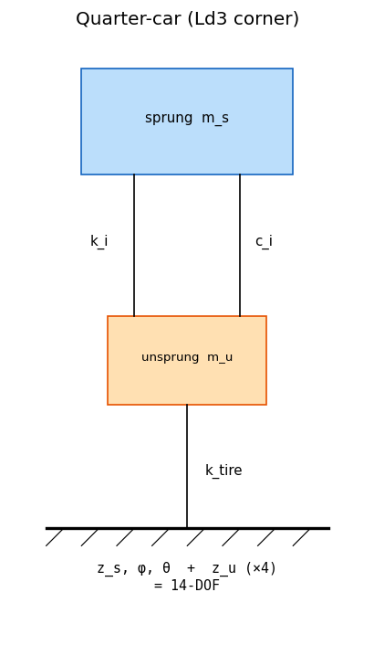
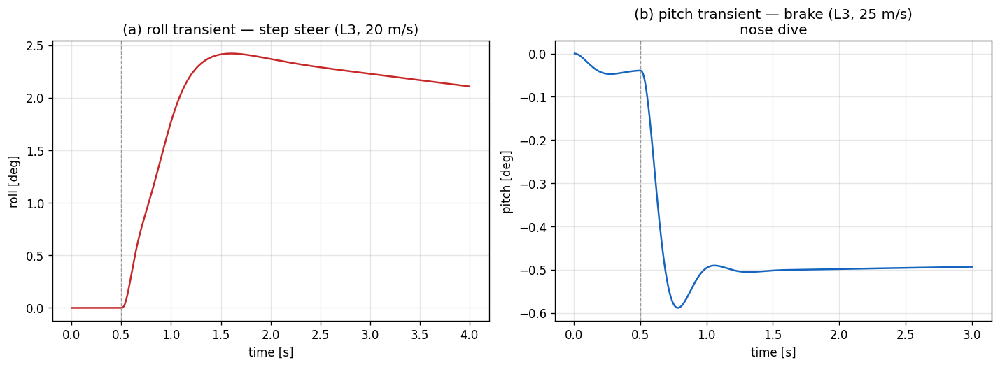

# 06. Ld3-FourteenDOF (Sprung 3 + Unsprung 4 Vertical DOF)

## Learning objectives

이 chapter 를 마치면 다음을 할 수 있다.

1. lumped 14-DOF 모델의 state 구성과 sprung heave/roll/pitch ↔ unsprung z 의
   결합을 식 단위로 기술한다.
2. anti-dive geometry 의 effective $h_{cg}$ (scalar factor) 가 pitch moment 를
   어떻게 줄이는지 설명한다.
3. wheel-hop frequency 의 이론값과 lumped corner-damper 모델에서 그 peak 이
   왜 뚜렷하지 않은지 (overdamped unsprung) 를 판단한다.
4. quasi-static (Ld2) 과 dynamic (Ld3) 의 거동 차이가 transient 와 dynamic Fz
   에서 드러남을 설명한다.

## Prerequisites

- **Chapter 05** — quasi-static weight transfer, roll-stiffness share.
- **Chapter 11** — RK4 substepping, 1-step lag.
- **외부 reference** — Genta §7 (lumped 14-DOF), spring-mass-damper 기초.

---

## 6.1 동기 — 14-DOF 의 분해

| DOF group | 성분 | 수 |
|---|---|---|
| Sprung translation | $x, y, z$ | 3 |
| Sprung rotation | $\phi, \theta, \psi$ | 3 |
| Unsprung vertical | $z_{u}$ (FL,FR,RL,RR) | 4 |
| Wheel spin | $\omega$ (FL,FR,RL,RR) | 4 |

합계 14. Ld3 는 planar (x, y, ψ, vx, vy, r) + 4 wheel spin 을 inner Ld2 로
위임하고, sprung vertical 3 ($z_s, \phi, \theta$) + unsprung vertical 4
($z_{u,i}$) 를 추가한다. planar 7 + vertical 7 = 14 DOF (14 second-order ODE
= 28 first-order).



---

## 6.2 가정

| 가정 | 의미 | 깨지는 case |
|---|---|---|
| Lumped suspension | spring/damper 가 corner-to-unsprung 1D | chapter 13-16 (Ld4-Ld5 hardpoint) |
| Small-angle linearized | corner disp $= z_s + r_y\phi - r_x\theta$ | 대각 자세 |
| Single corner damper | sprung/unsprung damping 공유 | wheel-hop FFT (§6.4 한계) |
| Scalar anti-dive | geometry 를 $[0,1]$ factor 로 | instant-center 정확 모델 |
| Zero camber | $\gamma=0$ (Pacejka API 만) | chapter 13-16 |
| Outer-step lag $a_x,a_y$ | vertical 적분 중 constant | chapter 11 (substep update) |

lumped 가정을 푸는 것이 chapter 13-16 (Ld4-Ld5) 의 hardpoint + joint + bushing
분해.



---

## 6.3 Sprung body EoM (heave / roll / pitch)

corner displacement (sprung side) — heave + pitch + **roll** 결합:

$$
z_{\text{corner},i} = z_s + r_{y,i}\, \phi - r_{x,i}\, \theta, \qquad
v_{\text{corner},i} = \dot z_s + r_{y,i}\, \dot\phi - r_{x,i}\, \dot\theta
$$

$r_{y,i} = \pm T_w/2$ (좌 $+$, 우 $-$). corner 변형에 roll arm 을 포함시키면
per-corner spring/damper 가 roll stiffness 와 roll damping 을 **자연히** 생성한다
(별도 lumped $K_\phi$/$C_\phi$ 불필요).

spring + damper force on sprung corner (upward positive):

$$
\delta_i = z_{\text{corner},i} - z_{u,i}, \quad
v_i = v_{\text{corner},i} - \dot z_{u,i}, \quad
F_i = - k_i\, \delta_i - c_i\, v_i
$$

Sprung body EoM:

$$
\begin{aligned}
m_s\, \ddot z_s &= \textstyle\sum_i F_i \\
I_{yy}\, \ddot\theta &= -\textstyle\sum_i r_{x,i} F_i - m_s\, a_x\, h_{cg}\, (1 - \text{anti}) \\
I_{xx}\, \ddot\phi &= \textstyle\sum_i r_{y,i} F_i - K_{\text{ARB}}\, \phi + m_s\, a_y\, h_{cg}
\end{aligned}
$$

좌우 대칭 spring 이면 $\sum_i r_{x,i}F_i$ 의 roll 성분과 $\sum_i r_{y,i}F_i$ 의
pitch 성분이 상쇄되어 pitch/roll 이 분리된다.

### Heave (z_s)

spring 합력이 sprung mass 의 vertical 가속도를 만든다.

### Pitch (θ) 와 anti-dive

$$
I_{yy}\, \ddot\theta = -\textstyle\sum_i r_{x,i} F_i - m_s\, a_x\, h_{cg}\, (1 - \text{anti})
$$

- $-\sum_i r_{x,i} F_i$: spring/damper 의 pitch moment (front 압축 → nose down).
- $-m_s a_x h_{cg}$: inertia 의 pitch 기여. ISO 부호 $+\theta=$ nose-down 이므로
  제동($a_x<0$)→$+\theta$ (dive), 가속($a_x>0$)→$-\theta$ (squat).
- $(1 - \text{anti})$: suspension geometry 의 anti-dive/anti-squat.

real suspension 은 brake reaction 의 일부가 suspension link 의 instant center
를 통해 chassis 로 직접 전달되어 그만큼 pitch moment 가 감소한다. 단순 모델:

$$
\text{anti} = \begin{cases} \text{anti\_dive\_front} & a_x < 0 \\ \text{anti\_squat\_rear} & a_x \ge 0 \end{cases}
\;(\text{clamp } [0,1]), \qquad
M_{\text{inertia,pitch}} = -m_s\, a_x\, h_{cg}\, (1 - \text{anti})
$$

$\text{anti}=1$ 이면 brake 시 pitch 없음, $0$ 이면 full pitch.

### Roll (φ)

$$
I_{xx}\, \ddot\phi = \underbrace{\textstyle\sum_i r_{y,i} F_i}_{\text{spring/damper}}
- \underbrace{K_{\text{ARB}}\, \phi}_{\text{anti-roll bar}} + m_s\, a_y\, h_{cg}
$$

- $\sum_i r_{y,i} F_i$: corner spring/damper 가 만드는 roll restoring moment +
  roll damping. 대칭 spring 이면 등가 stiffness $= (k_l+k_r)(T_w/2)^2$,
  damping $= (c_l+c_r)(T_w/2)^2$ — 별도 항 없이 자동.
- $K_{\text{ARB}} = K_{\text{ARB},f} + K_{\text{ARB},r}$: anti-roll bar 의 roll
  전용 stiffness (undamped). 유일한 roll 전용 입력.

> **단위 두 관례**: $K_{\text{ARB}}$ 는 차체 roll 각 기준 roll stiffness
> [N·m/rad] (Milliken RCVD 표준). 시뮬레이터/setup 에서 흔한 wheel-rate
> [N/m] 와는 axle track 으로 환산된다:
> $K_{\text{ARB,axle}} = k_{\text{wheel}}\cdot T_w^2/2$, 즉
> $k_{\text{wheel}} = 2 K_{\text{ARB,axle}}/T_w^2$. spring 유도식
> $(k_l+k_r)(T_w/2)^2$ 와 동일 factor. GUI 는 두 입력을 track 으로 양방향
> 링크해 한쪽 입력 시 나머지를 자동 계산하고, 저장은 roll stiffness 가 canonical.

quasi-static SS ($K_{\phi,\text{spring}} = (k_l+k_r)(T_w/2)^2$ 의 axle 합):

$$
\phi_{ss} = \frac{m_s\, a_y\, h_{cg}}{K_{\phi,\text{spring}} + K_{\text{ARB}}}
$$

### 왜 roll 도 corner spring 에서 유도하는가

이전 구현은 heave/pitch 만 corner spring 에서 유도하고 roll 은 별도 lumped
$K_\phi$ 입력을 썼다 — spring set 과 roll 거동이 decouple 되어 부드러운 spring +
임의의 큰 roll stiffness 같은 비물리 조합이 가능했다. corner 변형에 $r_{y,i}\phi$
를 넣으면 roll stiffness/damping 이 spring 에서 자동 유도되어 heave/pitch 와
정합한다. ARB 는 spring 으로 표현 안 되는 roll 전용 요소이므로 $K_{\text{ARB}}$
로 분리 — spring 과 ARB 를 독립적으로 tune 할 수 있다 (motorsport setup).

---

## 6.4 Unsprung mass EoM

per-corner unsprung 의 vertical:

$$
m_{u,i}\, \ddot z_{u,i} = - F_{\text{susp},i} - k_{\text{tire}}\, z_{u,i}
= + k_i\, \delta_i + c_i\, v_i - k_{\text{tire}}\, z_{u,i}
$$

(Newton III: spring/damper 가 sprung 을 위로 미는 force 의 반작용이 unsprung
을 아래로.) $k_{\text{tire}}$ = `tire_vertical_stiffness` (default 220 kN/m).

### Wheel-hop frequency

tire 가 vertical spring 으로 작용 (radial deformation $= F_z / k_{\text{tire}}$,
승용 200-300 kN/m). 이것이 unsprung resonance 의 dominant stiffness:

$$
\omega_{\text{hop}} = \sqrt{\frac{k_{\text{tire}}}{m_u}}, \qquad
f_{\text{hop}} = \frac{\omega_{\text{hop}}}{2\pi}
$$

sedan default: $\sqrt{220000/40}/(2\pi) \approx 11.8$ Hz.

### Damping ratio 한계

unsprung 의 critical damping:

$$
\zeta_u = \frac{c_{\text{corner}}}{2\sqrt{k_{\text{spring}}\, m_u}}
$$

sedan default ($c=3000, k=30000, m_u=40$): $\zeta_u = 1.37$ — overdamped. 실차
corner damper 는 sprung resonance (~1-2 Hz) 에 맞춰 $\zeta\sim0.3$-$0.5$ 인데,
동일 $c$ 를 unsprung (10+ Hz) 에 쓰면 너무 stiff 하다. 단일 corner damper 모델
에서는 wheel-hop FFT 의 11.8 Hz peak 이 뚜렷이 안 보이고 ~5 Hz coupled mode
만 보인다. follow-up: corner damper 를 sprung/unsprung 로 분리 (§6.13 box).

---

## 6.5 RK4 적분 — 14 vertical DOF

State (planar 7 은 inner Ld2):

$$
y = [\,z_s, \dot z_s, \phi, \dot\phi, \theta, \dot\theta,\;
z_{u,FL}, \dot z_{u,FL},\, \ldots,\, z_{u,RR}, \dot z_{u,RR}\,]
$$

각 second-order 항이 §6.3-6.4 식대로 계산되어 $\dot y = f(y,t)$ 구성, RK4
(chapter 11) 로 적분. substep dt = 1 ms. $a_x, a_y$ 는 outer-step 1-step lag
(vertical 적분 동안 constant).

---

## 6.6 Pose 의 quaternion encoding

yaw 는 planar Ld2 가 적분, roll $\phi$ / pitch $\theta$ 는 Ld3 의 결과. ZYX
intrinsic Euler 로 quat 구성하면 외부 시각화 (CARLA, viewer) 가 차체 자세를
그대로 표현한다. Ld1-Ld2 는 yaw 만 encode (RPY = 0,0,yaw).

---

## 6.7 Susp_compression / susp_velocity 진단

$$
\text{susp\_compression}_i = \text{static\_compression}_i + \delta_i, \qquad
\text{susp\_velocity}_i = v_{\text{corner},i} - \dot z_{u,i}
$$

$\text{static\_compression}_i = F_{z,i}^{\text{static}} / k_i$ (정적 weight 압축),
$\delta_i$ 는 동적 deviation. compression > static → spring 압축, < static →
신장 (떨림/wheel 들림). ride 분석의 핵심 진단량.

---

## 6.8 Ld2 ↔ Ld3 거동 차이

quasi-static SS yaw rate / Fz 는 Ld2 와 Ld3 가 일치 (분석값 동일). 차이는:

- Transient — Ld3 가 roll overshoot, settle 시간, wheel-hop oscillation 표현.
- dynamic Fz — Ld3 의 Fz 가 매 step spring transient 반영, Ld2 는 quasi-static.

Ld3 의 planar (vx, vy, r) 는 Ld2 와 bit-equal — Ld3 가 Ld2 위에 vertical 만
추가했음을 보장 (§6.11 검증).

---

## 6.9 검증 전략

| 검증 | 케이스 |
|---|---|
| Static suspension | at-rest 에서 susp_compression = static_compression |
| Planar 일치 | Ld3 의 vx, vy, r 가 Ld2 와 $10^{-9}$ 이내 |
| Pose encode | quat 의 roll 추출이 $\phi_{qs}$ 와 0.02 rad 이내 |
| Roll transient | step steer 의 overshoot + settle |
| Pitch transient | brake 의 nose dive |
| Anti-dive | anti 0 vs 0.5 에서 pitch 감소 |

---

## 6.10 한계

| 항목 | 한계 | follow-up / chapter |
|---|---|---|
| Sprung 6-DOF | small-angle linearized | full nonlinear (Featherstone) |
| Corner damper | 단일 $c$ | sprung / unsprung 분리 |
| Anti-dive | scalar factor | instant-center 모델 |
| Link friction | 무시 | bushing nonlinearity (Ld5) |
| Camber from roll | $\gamma=0$ | chapter 13-16 (hardpoint) |
| Tire relaxation | 무시 | 1st-order tire dynamics (ch03) |

Ld4-Ld5 (chapter 13-16) 의 본격 multibody 가 위 한계 대부분을 해소한다.

---

## 6.11 다음 chapter 와의 연결

Ld3 까지가 lumped EoM 사다리의 마지막. 이후 chapter 07-10 은 이 plant 위에서
동작하는 control cascade (Lc1-Lc8) 를, chapter 13-16 은 lumped 가정을 푸는
multibody kinematics (Ld4-Ld5) 를 다룬다.

---

## 6.12 참고문헌

- **Genta, G.** *Motor Vehicle Dynamics*, §7 lumped 14-DOF.
- **Milliken & Milliken**, *Race Car Vehicle Dynamics*, §17 anti-dive/anti-squat.
- **Reimpell, J.** *The Automotive Chassis*, §6 suspension kinematics.

---

## 6.13 Self-check

<details>
<summary>1. roll stiffness 를 corner spring 에서 유도하면서 ARB 만 따로 받는 이유?</summary>

corner 변형 $\delta_i = z_s + r_{y,i}\phi - r_{x,i}\theta$ 에 roll arm 을 넣으면
spring/damper 가 roll stiffness $(k_l+k_r)(T_w/2)^2$ 와 roll damping 을 자동
생성 — heave/pitch 와 정합. ARB 는 spring 으로 표현 안 되는 roll 전용 요소라
$K_{\text{ARB}}$ 로 분리한다. 이렇게 해야 spring 과 ARB 를 독립 tune 할 수 있고,
부드러운 spring + 임의의 큰 roll stiffness 같은 비물리 조합을 막는다.
</details>

<details>
<summary>2. wheel-hop peak (11.8 Hz) 이 FFT 에 뚜렷이 안 보이는 이유?</summary>

단일 corner damper 가 sprung resonance 기준이라 unsprung 영역에서 $\zeta_u=1.37$
overdamped → hop oscillation 이 감쇠되어 peak 이 묻힌다. damper 를 sprung/unsprung
로 분리하면 해소.
</details>

<details>
<summary>3. anti-dive factor = 1 의 물리적 의미?</summary>

brake reaction 이 suspension geometry 를 통해 전부 chassis 로 직접 전달되어
inertia pitch moment 가 0 → 제동해도 nose dive 가 없다. 실차는 보통 0.3-0.6.
</details>

<details>
<summary>4. Ld3 의 SS yaw rate 가 Ld2 와 같은데 Ld3 를 쓰는 이유?</summary>

SS 는 동일하나 transient 가 다르다. roll/pitch overshoot, settle 시간, dynamic
Fz 변동 등 시간 응답이 필요한 ride/handling 분석에서 Ld3 가 의미를 갖는다.
</details>

<details>
<summary>5. susp_compression < static_compression 이 뜻하는 상태는?</summary>

spring 이 정적 상태보다 신장됨 — 해당 corner 가 들리거나(rebound) 떨리는 중.
지속되면 wheel lift / 접지 상실 위험.
</details>

---

## 6.14 VDSim 구현 노트

> **[VDSim impl] § 6.3 — Sprung EoM 코드**
>
> `derivatives_vertical()` 의 corner loop 가 `delta = z + ry*phi - rx*th` 로
> heave/pitch/roll 을 한 번에, roll EoM 은 `dphi_dot = (M_roll_spring -
> K_arb*phi + m_s*ay*h)/Ixx` (`M_roll_spring = sum ry_i*F_i`).

> **[VDSim impl] § 6.3 — spring-유도 roll stiffness 정량**
>
> sedan default 의 axle roll stiffness 는 spring 에서 유도:
> $(k_l+k_r)(T_w/2)^2 = (30000+30000)\cdot(0.775)^2 \approx 36$ kN·m/rad/axle
> (front=rear, 총 $\approx 72$ kN·m/rad). ARB default 0. 이전의 lumped
> `roll_stiffness = 30+25 = 55 kN` 보다 오히려 큼 — 구 preset 이 spring 을
> 과소계상하고 있었다. ARB 를 추가하면 그 위에 roll 전용으로 더해진다.

> **[VDSim impl] § 6.4 — Unsprung EoM 코드**
>
> `core/src/fourteen_dof_dynamics.cpp:155-160`:
>
> ```cpp
> const double k_tire = std::max(1.0, tp_.tire_vertical_stiffness);
> for (int i = 0; i < NUM_WHEELS; ++i) {
>     const double m_u = std::max(1.0, vp_.unsprung_mass[i]);
>     d.dz_u[i]     = zu_dot[i];
>     d.dz_u_dot[i] = (- F_susp[i] - k_tire * zu[i]) / m_u;
> }
> ```

> **[VDSim impl] § 6.4 — Wheel-hop FFT follow-up**
>
> wheel-hop FFT 검증에서 11.8 Hz peak 가 뚜렷하지 않고 ~5 Hz coupled mode 만
> 보임 — 단일 corner damper 의 unsprung overdamping 탓. follow-up: `corner_damper`
> 를 `damper_sprung` / `damper_unsprung` 로 분리 (Adams Car 방식).

> **[VDSim impl] § 6.5 — Vertical RK4 코드**
>
> `core/src/fourteen_dof_dynamics.cpp:182-238` 의 `integrate_vertical()`.

> **[VDSim impl] § 6.9 — 검증 test**
>
> `FourteenDOF.*` 9 tests: `ConstructionAndLevel`,
> `StaticSuspensionPopulatedAtRest`, `CompressionGrowsUnderBrakeOnFront`,
> `PlanarMotionMatchesL2Closely` (vx,vy,r 가 Ld2 와 $10^{-9}$),
> `PoseEncodesRollAndPitch`, `RollOscillatesAndSettles`,
> `PitchTransientUnderBrake`, `SuspensionVelocityNonZeroDuringTransient`,
> `AntiDiveReducesPitchUnderBrake`. 전 9 pass.

> **[VDSim impl] § 6.x — 사용 예제**
>
> ```cpp
> auto dyn = vdsim::create_fourteen_dof();
> dyn->initialize(vp, tp, sp);
> // reset / step 은 Ld1/Ld2 와 동일 API
> dyn->roll_angle_qs();    // dynamic roll (rad)
> dyn->pitch_angle_qs();   // dynamic pitch
> dyn->state().susp_compression[WHEEL_FL];
> dyn->state().susp_velocity[WHEEL_FL];
> ```
