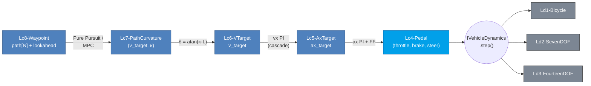

# 07. Control Ladder Lc1-Lc8 (Variant Dispatch)

## Learning objectives

이 chapter 를 마치면 다음을 할 수 있다.

1. Lc1-Lc8 abstraction 사다리의 각 tier 가 차량 system 의 어느 layer 에
   대응하는지 설명한다.
2. type-safe sum type (`variant`) 기반 dispatch 와 lowering 의 개념을 기술한다.
3. m × n (Ld × Lc) ABI claim 의 의미 — "controller 한 번 작성, 모든 Ld 에서
   동작" — 를 설명한다.
4. lowering 과 직접 dispatch (per-wheel torque) 의 차이와 각각의 use case 를
   판단한다.

## Prerequisites

- **Chapter 04-06** — Ld1-Ld3 plant 의 입력 (Lc4 pedal).
- **외부** — C++17 `std::variant` / `std::visit` 개념 (구현 세부는 박스).

---

## 7.1 동기 — 왜 8 단계인가

차량 control 입력은 abstraction 의 연속 spectrum 이다.

| 추상 수준 | tier | 의미 | 생산자 |
|---|---|---|---|
| 가장 낮음 | Lc1 | per-wheel motor/brake torque + steer | low-level ECU, TC, torque vectoring |
| 낮음 | Lc2 | axle drive torque | drivetrain controller |
| 중 | Lc3 | longitudinal force $F_x$ | ABS/EBD, 단순 controller |
| 중 (CARLA 호환) | Lc4 | throttle/brake/steer pedal | driver, CARLA, basic AV stack |
| 중-상 | Lc5 | acceleration target | ACC, longitudinal MPC |
| 상 | Lc6 | velocity target | cruise control, speed planner |
| 상 | Lc7 | curvature + speed | Pure Pursuit, Stanley |
| 가장 상 | Lc8 | waypoint path | global/behavior planner |

대부분의 commercial 시뮬레이터는 Lc4 (throttle/brake/steer) 한 단계만 노출한다.
8 tier 를 명시적으로 두는 것이 VDSim 의 설계 선택이다.

---

## 7.2 가정

| 가정 | 의미 | 깨지는 case |
|---|---|---|
| Lowering to Lc4 | Lc1-Lc3 를 Lc4 로 normalize 후 동일 path | Lc1 직접 per-wheel dispatch (Phase 2) |
| Normalize 상수 | typical max torque/force 기준 scale | 정확한 inverse mapping |
| Lc5+ external cascade | dynamics 가 직접 처리 안 함 | dynamics 내장 cascade |
| Mutually-exclusive pedal | throttle/brake 동시 비영 없음 | regen braking |

---

## 7.3 Tier 정의 (개념)

각 tier 는 그 layer 의 자연스러운 입력 단위를 갖는다.

- Lc1: per-wheel motor torque, per-wheel brake torque, steer (per-wheel
  traction/torque-vectoring 표현 가능).
- Lc2: axle drive torque + brake torque + steer.
- Lc3: total longitudinal force $F_x$ + steer.
- Lc4: throttle/brake $\in[0,1]$ + steer + gear + handbrake (CARLA 호환).
- Lc5: $a_x$ target + steer.
- Lc6: $v$ target + steer.
- Lc7: $v$ target + curvature $\kappa$.
- Lc8: waypoint path (s, xy, yaw, κ, v_des) + lookahead.

전체 입력이 하나의 type-safe sum type 으로 묶여 compile-time 에 어느 tier 인지
판별된다 (구현 §7.10 box).

---

## 7.4 Lowering — Lc1-Lc3 → Lc4

dynamics (Ld1-Ld3) 는 Lc4 를 직접 처리한다. Lc1-Lc3 는 lowering 으로 Lc4 로
변환된 뒤 동일 path 를 탄다.

- Lc1: per-wheel torque 합을 typical max (drive 600 N·m, brake 4000 N·m,
  both axles) 로 normalize.
- Lc2: axle torque → 동일 normalize.
- Lc3: $F_x$ 를 typical 1 g (mass · 5 m/s²) 로 normalize.

이는 정확한 inverse mapping 이 아니라 API 동작/dispatch 검증 목적이다. 본격
inverse cascade (ControlConverter 의 reverse mapping) 는 Phase 2.

---

## 7.5 m × n 매트릭스 — 핵심 claim

Dynamics 사다리 Ld1-Ld5 (5 tier) × Control 사다리 Lc1-Lc8 (8 tier) = 40 조합.
각 cell $(Ld_i, Lc_j)$ 는 "$Ld_i$ 차량을 $Lc_j$ 입력으로 구동" 을 의미한다.

| | Ld1 | Ld2 | Ld3 | Ld4 | Ld5 |
|---|---|---|---|---|---|
| Lc1 | ✓ via lower | ✓ | ✓ | plan | plan |
| Lc2 | ✓ | ✓ | ✓ | plan | plan |
| Lc3 | ✓ | ✓ | ✓ | plan | plan |
| Lc4 | ✓ primary | ✓ primary | ✓ primary | plan | plan |
| Lc5 | ✓ cascade | ✓ cascade | ✓ cascade | plan | plan |
| Lc6 | ✓ | ✓ | ✓ | plan | plan |
| Lc7 | ✓ | ✓ | ✓ | plan | plan |
| Lc8 | ✓ | ✓ | ✓ | plan | plan |

현재 8 × 3 = 24 verified cell. Ld4/Ld5 추가 시 40 까지.

이것이 차별화 지점이다. 대부분의 commercial 시뮬레이터는 Ld 를 바꾸면 Lc 를
다시 작성해야 하는 vendor lock-in 이다. VDSim 의 ABI claim 은 "controller 를
한 번 작성하면 어느 Ld 에서도 동일하게 동작" 이며, 24 verified cell + 통합
test 로 검증된다.

---

## 7.6 Lc5-Lc8 cascade

Lc4 까지가 dynamics 의 직접 입력이고, Lc5-Lc8 은 ControlConverter (chapter
08-09) 가 cascade 로 lowering 한다.



사용자가 Lc8 path 만 줘도 자동으로 Lc4 throttle/brake/steer 까지 변환되어
차량이 path 를 따라간다.

---

## 7.7 검증 전략

| 검증 | 케이스 |
|---|---|
| Lc2 drive dispatch | drive_torque>0 → vx 증가 |
| Lc3 brake dispatch | $F_x<0$ → vx 감소 |
| Lc1 per-wheel | RL/RR torque → vx 증가 |
| Higher-level fallback | Lc5 (cascade 없음) → zero command fallback |
| NaN guard | NaN/Inf Lc4 → sanitize 후 crash 없음 |

dispatch 정확성 + NaN guard 를 통합 test 로 보장 (§7.10 box).

---

## 7.8 한계

| 항목 | 한계 | 해소 |
|---|---|---|
| Lc8 직접 dispatch | external cascade 필요 | Phase 2 내장 |
| Lc1 per-wheel | lowering(평균)만 | Phase 2 direct dispatch |
| Lc7 path frame | world/vehicle frame 정의 필요 | API 명세 보강 |
| MPC dispatch | 미구현 | Phase 2 (HPIPM 통합 후) |

Lc1 direct dispatch (per-wheel `motor_torque` 가 wheel-spin EoM 의 $T_{drive,i}$
에 직접 들어가는 path) 는 traction control / torque vectoring 시뮬에 필요하나
현재는 lowering(axle 평균)만. ABI 는 ready 상태.

---

## 7.9 다음 chapter 와의 연결

이 chapter 는 control 사다리의 구조와 dispatch 를 다뤘다. chapter 08 은
Lc5/Lc6 의 PI + feed-forward cascade 를, chapter 09 는 Lc7/Lc8 의 Pure Pursuit
path tracking 을 상세히 전개한다.

---

## 7.10 VDSim 구현 노트

> **[VDSim impl] § 7.3 — CmdL1-CmdL8 + variant**
>
> `core/include/vdsim/control.hpp` 에 8 struct + `ControlInput =
> std::variant<CmdL1,...,CmdL8>`. C++17 type-safe sum type — compile-time tier
> 판별 + heap allocation 없음.
>
> ```cpp
> struct CmdL4 {                       // CARLA 호환 tier
>     double throttle {0.0};           // [0, 1]
>     double brake    {0.0};
>     double steer_angle_wheel {0.0};
>     int    gear     {1};
>     bool   handbrake {false};
> };
> using ControlInput = std::variant<CmdL1, CmdL2, CmdL3, CmdL4,
>                                   CmdL5, CmdL6, CmdL7, CmdL8>;
> ```

> **[VDSim impl] § 7.4 — lower_to_l4 코드**
>
> `std::visit` + `if constexpr` dispatch.
> `core/src/bicycle_dynamics.cpp:33-69`, `seven_dof_dynamics.cpp:46-77`.
>
> ```cpp
> inline CmdL4 lower_to_l4(const ControlInput& u) {
>     return std::visit([](const auto& cmd) -> CmdL4 {
>         using T = std::decay_t<decltype(cmd)>;
>         CmdL4 out;
>         if constexpr (std::is_same_v<T, CmdL1>) {
>             out.throttle = clamp(sum(cmd.motor_torque) / 600, 0, 1);
>             out.brake    = clamp(sum(cmd.brake_torque) / 4000, 0, 1);
>             out.steer_angle_wheel = cmd.steer_angle_wheel;
>         } else if constexpr (std::is_same_v<T, CmdL3>) {
>             const double scale = cmd.Fx_total / (1500 * 5);
>             out.throttle = clamp(scale, 0, 1);
>             out.brake    = clamp(-scale, 0, 1);
>             out.steer_angle_wheel = cmd.steer_angle_wheel;
>         } else if constexpr (std::is_same_v<T, CmdL4>) {
>             out = cmd;
>         }
>         return out;
>     }, u);
> }
> ```

> **[VDSim impl] § 7.7 — 검증 test**
>
> `ControlDispatch.*` 5 tests: `BicycleHandlesCmdL2Drive`,
> `BicycleHandlesCmdL3BrakeNegativeFx`, `SevenDOFHandlesCmdL1PerWheelTorque`,
> `BicycleFallbackOnHigherLevelInput`, `NaNInputSanitizedNoCrash`. 전 5 pass.

> **[VDSim impl] § 7.x — 사용 예제**
>
> ```cpp
> vdsim::CmdL4 cmd; cmd.throttle = 0.5; cmd.steer_angle_wheel = 0.05;
> dyn->step(vdsim::ControlInput{cmd}, contacts, dt);
>
> vdsim::CmdL1 cmd1;
> cmd1.motor_torque = {{0, 0, 150, 150}};      // rear drive (lowering 자동)
> dyn->step(vdsim::ControlInput{cmd1}, contacts, dt);
> ```

> **[VDSim impl] § 7.8 — 설계 문서**
>
> control 사다리 abstraction 분석: `docs/tasks/05_D11_control_api/README.md`
> (D11 design doc).
