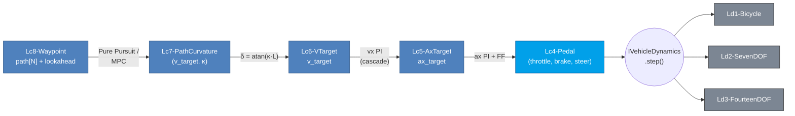

# 07. Control 사다리 Lc1-Lc8 — Variant Dispatch

> **학습 목표.** Lc1-Lc8 의 abstraction 사다리가 왜 8 단계인지, 각 tier 의 입력이 차량 system 의 어느 layer 와 대응하는지 안다. `ControlInput = variant<CmdL1, ..., CmdL8>` 의 dispatch 메커니즘과 `lower_to_l4` 의 lowering 식을 안다. **m × n 매트릭스 (Ld × Lc)** 의 ABI claim 의 의미를 정확히 설명할 수 있다.

## 7.1 왜 8 단계인가

차량 control 의 입력은 **abstraction 의 fluid spectrum**:

| 추상 수준 | 의미 | 만드는 사람 |
|---|---|---|
| 가장 낮음 | per-wheel motor / brake torque | low-level ECU, traction control, torque vectoring |
| 낮음 | axle 단위 drive torque | drivetrain controller (engine + transmission) |
| 중 | longitudinal force | ABS / EBD / 단순 controller |
| **중 (CARLA 호환)** | **throttle / brake / steer pedal** | **driver, CARLA, basic AV stack** |
| 중-상 | acceleration target | ACC, longitudinal MPC |
| 상 | velocity target | cruise control, speed planner |
| 상 | curvature + speed | Pure Pursuit, Stanley |
| 가장 상 | waypoint path | global planner, behavior planner |

VDSim 의 8 단계는 이 spectrum 을 strawman 명시. 다른 commercial 시뮬레이터는 보통 throttle/brake/steer (Lc4) 한 단계만.

## 7.2 CmdL1 - CmdL8 struct (정의)

`core/include/vdsim/control.hpp`:

```cpp
// Lc1: per-wheel motor + brake + steer
struct CmdL1 {
    std::array<double, NUM_WHEELS> motor_torque {{0,0,0,0}};   // [N·m]
    std::array<double, NUM_WHEELS> brake_torque {{0,0,0,0}};   // [N·m] (≥ 0)
    double steer_angle_wheel {0.0};                             // [rad]
};

// Lc2: axle-level
struct CmdL2 {
    double drive_torque {0.0};        // [N·m]
    double brake_torque {0.0};
    double steer_angle_wheel {0.0};
};

// Lc3: longitudinal force
struct CmdL3 {
    double Fx_total {0.0};            // [N]
    double steer_angle_wheel {0.0};
};

// Lc4: pedal (CARLA-compatible)
struct CmdL4 {
    double throttle {0.0};            // [0, 1]
    double brake    {0.0};            // [0, 1]
    double steer_angle_wheel {0.0};
    int    gear     {1};              // ±1, 0
    bool   handbrake {false};
};

// Lc5: ax target
struct CmdL5 {
    double ax_target {0.0};           // [m/s²]
    double steer_angle_wheel {0.0};
};

// Lc6: v target
struct CmdL6 {
    double v_target {0.0};            // [m/s]
    double steer_angle_wheel {0.0};
};

// Lc7: curvature
struct CmdL7 {
    double v_target {0.0};
    double kappa    {0.0};             // [1/m]
};

// Lc8: path
struct CmdL8 {
    struct PathPoint {
        double s; Vec2 xy; double yaw; double kappa; double v_des;
    };
    std::vector<PathPoint> path;
    double lookahead_distance {5.0};
};

using ControlInput = std::variant<CmdL1, CmdL2, CmdL3, CmdL4,
                                   CmdL5, CmdL6, CmdL7, CmdL8>;
```

`std::variant` 가 C++17 의 type-safe sum type. compile-time 에서 어느 alternative 가 들어왔는지 확인 가능 + heap allocation 없음.

## 7.3 Dispatch — `lower_to_l4`

본 PoC 의 dynamics (Ld1-Ld3) 는 Lc4 직접 처리. Lc1-Lc3 는 lowering 으로 Lc4 변환 후 동일 path. Lc5+ 는 fallback (zero command).

`std::visit` + `if constexpr` 패턴:
```cpp
inline CmdL4 lower_to_l4(const ControlInput& u) {
    return std::visit([](const auto& cmd) -> CmdL4 {
        using T = std::decay_t<decltype(cmd)>;
        CmdL4 out;
        if constexpr (std::is_same_v<T, CmdL1>) {
            const double T_drive = sum(cmd.motor_torque);
            const double T_brake = sum(cmd.brake_torque);
            out.throttle = clamp(T_drive / 600, 0, 1);
            out.brake    = clamp(T_brake / 4000, 0, 1);
            out.steer_angle_wheel = cmd.steer_angle_wheel;
        }
        else if constexpr (std::is_same_v<T, CmdL2>) {
            out.throttle = clamp(cmd.drive_torque / 600, 0, 1);
            out.brake    = clamp(cmd.brake_torque / 4000, 0, 1);
            out.steer_angle_wheel = cmd.steer_angle_wheel;
        }
        else if constexpr (std::is_same_v<T, CmdL3>) {
            const double scale = cmd.Fx_total / (1500 * 5);   // m · a_ref
            out.throttle = clamp(scale, 0, 1);
            out.brake    = clamp(-scale, 0, 1);
            out.steer_angle_wheel = cmd.steer_angle_wheel;
        }
        else if constexpr (std::is_same_v<T, CmdL4>) {
            out = cmd;
        }
        return out;
    }, u);
}
```

코드 `core/src/bicycle_dynamics.cpp:33-69` 및 `core/src/seven_dof_dynamics.cpp:46-77`.

### 식의 의미

Lc1 lowering: per-wheel torque 의 합을 typical max (600 N·m drive, 4000 N·m brake, both axles combined) 로 normalize. 부정확하지만 **실험 / dispatch 만 검증** 목적.

Lc2: axle 단위 → 동일.

Lc3: Fx 를 typical "1g per sedan" (mass · 5 m/s²) 로 normalize.

이게 정확한 inverse mapping 은 아니지만 **API 가 동작함을 입증**. 본격 inverse cascade (Lc1-Lc3 의 직접 dispatch + ControlConverter 의 reverse mapping) 는 Phase 2.

## 7.4 m × n 매트릭스 — VDSim 의 unique claim

### Dynamics 사다리: Ld1, Ld2, Ld3, Ld4 (plan), Ld5 (plan) — 5 tiers.

### Control 사다리: Lc1 - Lc8 — 8 tiers.

### m × n = 40 조합

각 cell `(Ldi, Lcj)` 는 "Ldi 차량을 Lcj 입력으로 구동" 의미.

| | Ld1 | Ld2 | Ld3 | Ld4 | Ld5 |
|---|---|---|---|---|---|
| Lc1 | ✓ via lower | ✓ | ✓ | plan | plan |
| Lc2 | ✓ | ✓ | ✓ | plan | plan |
| Lc3 | ✓ | ✓ | ✓ | plan | plan |
| **Lc4** | **✓ primary** | **✓ primary** | **✓ primary** | plan | plan |
| Lc5 | ✓ cascade | ✓ cascade | ✓ cascade | plan | plan |
| Lc6 | ✓ | ✓ | ✓ | plan | plan |
| Lc7 | ✓ | ✓ | ✓ | plan | plan |
| Lc8 | ✓ figure-8 | ✓ figure-8 | ✓ figure-8 | plan | plan |

**현재 8 × 3 = 24 verified 조합**. Ld4/Ld5 추가 시 40 까지.

이게 VDSim 의 **unique 차별화** — 다른 어떤 시뮬레이터도 Ld × Lc 의 m × n grid 가 ABI 안 정의되어 있지 않다.

## 7.5 Lc5-Lc8 의 cascade (현재)

Lc4 까지가 dynamics 의 직접 입력. Lc5-Lc8 는 ControlConverter 모듈 (Chapter 08-09 상세) 가 cascade 로 lowering:



즉 사용자가 Lc8 path 만 줘도 자동으로 Lc4 throttle/brake/steer 까지 변환되어 차량이 따라간다.

## 7.6 ControlInput 의 사용 패턴

```cpp
// Lc4 direct
vdsim::CmdL4 cmd; cmd.throttle = 0.5; cmd.steer_angle_wheel = 0.05;
vdsim::ControlInput u = cmd;
dyn->step(u, contacts, dt);

// Lc1 per-wheel (lowering 자동)
vdsim::CmdL1 cmd1;
cmd1.motor_torque = {{0, 0, 150, 150}};   // rear drive
vdsim::ControlInput u1 = cmd1;
dyn->step(u1, contacts, dt);   // 내부에서 lower_to_l4(u1) 로 변환

// Lc8 path (ControlConverter cascade 필요)
vdsim::PurePursuitController pp;
auto out = pp.update(x, y, yaw, vx, path_x, path_y, n_pts);
vdsim::CmdL4 cmd; cmd.steer_angle_wheel = out.steer;
// throttle/brake 는 별도 Lc6 + Lc5 cascade
```

## 7.7 검증 (Task 43)

`ControlDispatch.*`:
- `BicycleHandlesCmdL2Drive` — Lc2 drive_torque > 0 → vx 증가.
- `BicycleHandlesCmdL3BrakeNegativeFx` — Lc3 Fx < 0 → vx 감소.
- `SevenDOFHandlesCmdL1PerWheelTorque` — Lc1 RL/RR torque → vx 증가.
- `BicycleFallbackOnHigherLevelInput` — Lc5 (cascade 없으면) → zero command fallback.
- `NaNInputSanitizedNoCrash` — NaN/Inf Lc4 입력 → sanitize 후 crash 없음.

5 tests pass. dispatch 와 NaN guard 검증.

## 7.8 Lc1 의 직접 dispatch (Phase 2)

본 PoC 의 `lower_to_l4` 는 lowering. 그러나 **per-wheel torque 의 직접 적용** (variant visit 으로 Lc1 의 motor_torque 가 wheel-spin EoM 에 직접 들어가는 path) 는 미구현.

Phase 2 의 Lc1 direct dispatch:
- `CmdL1::motor_torque[i]` → wheel-spin EoM 의 `T_drive_i` 에 직접 사용.
- differential 의 결과를 직접 override (low-level controller 가 per-wheel 결정).
- traction control / torque vectoring 시뮬 가능.

본 PoC 의 lowering 으로는 위 use case 불가 (axle 평균). 그러나 ABI 는 ready.

## 7.9 한계

| 항목 | 한계 |
|---|---|
| Lc8 직접 dispatch | ControlConverter 외부 cascade 필요 |
| Lc1 직접 per-wheel | lowering 만, 평균화. 본격 dispatch 는 Phase 2 |
| Lc7 의 reference path mismatch | path[N] 의 좌표계 정의 필요 (world / vehicle frame) |
| MPC dispatch | Phase 2 (HPIPM 통합 후) |

## 7.10 사다리 magic 이 왜 의미 있나 — 한 줄

다른 commercial 시뮬레이터는 "Ld 갈아끼우면 Lc 도 다시 짜야 한다" 의 vendor lock-in.
VDSim 의 ABI claim: **"controller 한 번 짜면 어느 Ld 든 동일하게 동작"**.

이게 검증 가능한 형태 (24 verified cells, 통합 tests) 로 보장되는 게 본 PoC 의 핵심 결과.

## 7.11 참고

- `std::variant` + `std::visit` + `if constexpr` 패턴 — C++ Templates: The Complete Guide (2nd ed., Vandevoorde et al.) 또는 cppreference.com.
- 차량 control 사다리의 abstraction 분석 — VDSim 의 D11 design doc (`docs/tasks/05_D11_control_api/README.md`).
