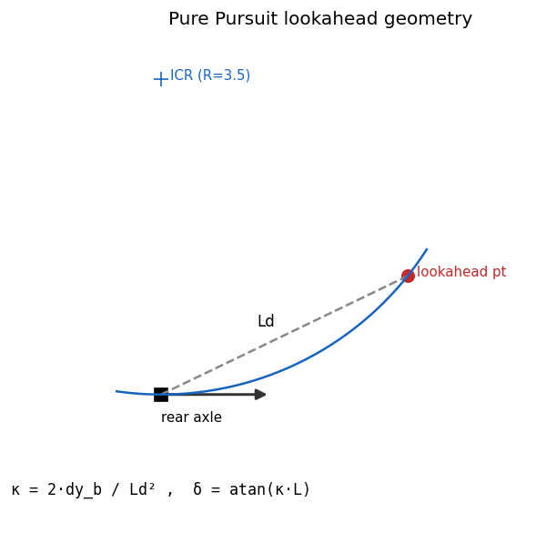

# 09. Lc7-PathCurvature (Pure Pursuit) / Lc8-Waypoint

## Learning objectives

이 chapter 를 마치면 다음을 할 수 있다.

1. Pure Pursuit 의 lookahead geometry 로부터 steer (curvature) 를 유도한다.
2. lookahead distance $L_d$ 의 vx-dependent scheduling 의 이유 (low-vx 진동,
   high-vx 부드러움) 를 설명한다.
3. Pure Pursuit 의 강점/약점 (simplicity vs straight cross-track 잔여) 을
   인지하고 Stanley/MPC 대안과 비교한다.
4. waypoint path 표현 (arc-length parameterization, frame 선택) 의 의미를
   설명한다.

## Prerequisites

- **Chapter 04** — kinematic bicycle ($\kappa = \tan\delta / L$).
- **Chapter 07-08** — control 사다리, Lc7/Lc8 의 위치, longitudinal cascade.
- **Chapter 01** — world ↔ body frame 변환.

---

## 9.1 동기 — geometry 기반 steering

차량이 $(x, y, \psi)$, path 가 waypoint sequence $\{(x_i, y_i)\}$ 일 때 Pure
Pursuit 는:

1. 차량에서 path 위 한 점 (lookahead point, distance $L_d$) 을 정한다.
2. 그 점을 통과하는 원호 (rear axle 의 instantaneous center 통과) 가 되도록
   front wheel steer 를 결정한다.

geometry 가 모든 것을 결정 — feedback 도 optimization 도 없다. 단순함이 강점.



---

## 9.2 가정

| 가정 | 의미 | 깨지는 case |
|---|---|---|
| Kinematic bicycle | $\kappa = \tan\delta/L$ | 고속 dynamic slip |
| World frame path | path 가 ENU world 좌표 | Frenet (s,d) frame |
| Dense waypoints | lookahead index 선형 탐색 | sparse / cusp path |
| Geometry-only lateral | cross-track 직접 측정 없음 | straight 잔여 error |

---

## 9.3 Geometry 유도

lookahead point 를 body frame 으로 변환 ($R(-\psi)$):

$$
\begin{aligned}
(dx_w, dy_w) &= (x_{\text{target}} - x,\; y_{\text{target}} - y) \\
dx_b &= \cos\psi\, dx_w + \sin\psi\, dy_w \\
dy_b &= -\sin\psi\, dx_w + \cos\psi\, dy_w
\end{aligned}
$$

$dx_b$ = forward distance, $dy_b$ = lateral offset (좌가 $+$). rear axle (body
origin) 과 lookahead point 를 동시에 통과하는 원의 반지름:

$$
R_{\text{path}} = \frac{L_d^2}{2\, dy_b}, \qquad L_d^2 = dx_b^2 + dy_b^2
\;\Rightarrow\;
\kappa = \frac{2\, dy_b}{L_d^2}
$$

kinematic bicycle 에서 steer:

$$
\kappa = \frac{\tan\delta}{L} \;\Rightarrow\; \delta = \arctan(\kappa L)
\approx \frac{2\, dy_b\, L}{L_d^2} \quad(\text{small angle})
$$

---

## 9.4 Lookahead distance scheduling

constant $L_d$ 의 문제: 너무 작으면 작은 lateral error 에 큰 steer → 진동
(정지 근처), 너무 크면 corner 를 일찍 cut → 부드럽지만 부정확.

scheduling:

$$
L_d = \max(L_{d,\min},\; k\, v_x)
$$

low vx → $L_{d,\min}$ (default 1.5 m, 진동 방지). high vx → $k v_x$ (default
$k=0.40$ s, "0.4 초 후 위치" 예측, 시야 확장).

lookahead index 는 직전 index 부터 선형 탐색 (O(1) amortized); $L_d$ 도달
실패 시 path 끝점 사용.

---

## 9.5 강점 / 약점

강점:

- Simple — lateral offset 한 점으로 steer 결정 (식 3 줄).
- Stable — saturation 에도 발진 없음 (geometry 기반).
- No tuning — $L_d$ 하나만.
- Real-time — O(1).

약점:

- straight 에서 cross-track error 가 0 으로 수렴하지 않음 (heading 만 맞추고
  lateral offset 은 lookahead 시야만큼 잔여).
- sharp turn 에서 corner 안쪽으로 cut.
- optimal 아님 — 차량 한계 활용 못 함.

이 약점이 MPC / SMPC 의 출발점 — receding-horizon optimization 으로 cross-track
0 수렴 + corner 한계 활용.

---

## 9.6 Stanley 와 비교

| 항목 | Pure Pursuit | Stanley |
|---|---|---|
| 기준점 | rear axle | front axle |
| Cross-track | lookahead 의존 | 직접 minimize ($k_e\,\text{cte}/v_x$) |
| Heading | indirect | 직접 minimize |
| 진동 | low | high-gain 시 진동 |
| 대표 사용 | Roborace, FSK | DARPA 2005 우승 |

---

## 9.7 Lc8-Waypoint 표현

PathPoint = (s: arc length, xy: world coord, yaw: tangent, kappa: curvature,
v_des: desired speed). `s` 가 arc length 면 미분 quantity (yaw, kappa, v_des)
가 자연 정의되고, 미리 계산된 `kappa` 는 sanity check / feed-forward 로 활용
가능하다.

### Frame 선택

path 가 어느 frame 인가가 중요하다. world (ENU), vehicle-relative, Frenet
(s, d) 가 가능하며 현재는 world frame 만 지원. highway driving 표준은 Frenet.

---

## 9.8 검증 전략

| 검증 | 케이스 |
|---|---|
| Straight | x-axis 직선 → steer ≈ 0 |
| Left circle | R=20 원호 → steer>0, κ>0 |
| Saturation | tight (R=1) → \|steer\|≤max_steer |
| End-to-end | figure-8 (R=20) 추종, corner saturation 노출 |

---

## 9.9 한계

| 항목 | 한계 | 해소 |
|---|---|---|
| Cross-track 정확 측정 | lookahead proxy 만 | Stanley/MPC |
| 차량 한계 활용 | 없음 | MPC |
| Frenet frame | 미지원 | Phase 2 |
| Path smoothness | waypoint 의존 (cusp X) | spline 전처리 |

---

## 9.10 다음 chapter 와의 연결

chapter 08 (longitudinal cascade) + chapter 09 (lateral Pure Pursuit) 가 합쳐
full path tracking 을 구성한다. chapter 10 의 DriverModel 은 이 둘을 인간
운전자 특성 (reaction delay, 보수적 gain) 으로 묶어 closed-loop scenario 를
구동한다.

---

## 9.11 참고문헌

- **Coulter, R.C.**, *Implementation of the Pure Pursuit Path Tracking Algorithm*, CMU TR, 1992 (원본).
- **Snider, J.**, *Automatic Steering Methods for Autonomous Automobile Path Tracking*, CMU TR, 2009 (PP vs Stanley vs MPC).
- **Werling, M. et al.**, *Optimal Trajectory Generation ... in a Frenét Frame*, ICRA 2010.

---

## 9.12 Self-check

<details>
<summary>1. lookahead distance 를 너무 작게 잡으면?</summary>

작은 lateral offset 에도 큰 $\kappa$(steer)가 나와 진동한다. 특히 저속에서
$dy_b/L_d^2$ 가 커져 발진. $L_{d,\min}$ floor 로 막는다.
</details>

<details>
<summary>2. Pure Pursuit 가 straight 에서 cross-track 을 0 으로 못 만드는 이유?</summary>

lookahead point 의 heading 만 align 하므로 차량이 path 와 평행하지만 일정
lateral offset 을 유지하는 평형이 존재한다. cross-track 을 직접 minimize 하지
않기 때문 (Stanley 와의 차이).
</details>

<details>
<summary>3. <code>δ = atan(κL)</code> 에서 small-angle 근사는 언제 깨지나?</summary>

tight turn (큰 κ) 에서 $\tan\delta\approx\delta$ 가 부정확해지고, 고속 dynamic
slip 이 더해지면 kinematic 가정 자체가 무너진다.
</details>

<details>
<summary>4. lookahead index 를 prev_idx 부터 탐색하는 이유?</summary>

매 step 전체 path 를 재탐색하면 O(N). path 진행은 단조 증가하므로 직전 index
부터 시작하면 O(1) amortized.
</details>

<details>
<summary>5. figure-8 추종에서 vx 가 under-track 하는 원인은?</summary>

corner 에서 sedan max_steer(0.5 rad) saturation → 필요 곡률 미달 → 추종 위해
감속. controller 버그가 아니라 차량 steer 한계의 정상 노출.
</details>

---

## 9.13 VDSim 구현 노트

> **[VDSim impl] § 9.3 — PurePursuit 코드**
>
> `core/src/control_converter.cpp` 의 `PurePursuitController::update`:
>
> ```cpp
> const double l2 = dx * dx + dy * dy;
> if (l2 < 1e-6) return out;
> const double kappa = 2.0 * dy / l2;
> const double steer = std::atan(kappa * g_.wheelbase);
> ```

> **[VDSim impl] § 9.4 — Scheduling default + 검증**
>
> $L_{d,\min}=1.5$ m, $k=0.40$ s. vx=8 → $L_d=\max(1.5,3.2)=3.2$ m. figure-8
> R=20 corner 에서 sedan max_steer 0.5 rad 도달. lookahead lookup 은
> `control_converter.cpp` 의 index search.

> **[VDSim impl] § 9.7 — CmdL8 struct**
>
> ```cpp
> struct PathPoint {
>     double s; Vec2 xy; double yaw; double kappa; double v_des;
> };
> std::vector<PathPoint> path;
> double lookahead_distance {5.0};
> ```
> `vdsim_path_tracking` 은 `path[N]` array 직접 + Pure Pursuit 호출. Lc8 의
> variant dispatch 는 lower_to_l4 fallback (steer 0); 본격 dispatch 는
> ControlConverter cascade 외부.

> **[VDSim impl] § 9.8 — 검증 test + end-to-end**
>
> `PurePursuit.*` 3 tests: `StraightAheadZeroSteer`,
> `LeftCircleProducesPositiveSteer`, `MaxSteerClamped`. End-to-end
> `vdsim_path_tracking` (sedan, figure-8 R=20, v_target=8): vx mean
> 5.79±0.37 (under-track), steer max 0.50 (saturated), 25 s. Pure Pursuit
> 자체는 정상, sedan steer 한계 노출.

> **[VDSim impl] § 9.x — 사용 예제**
>
> ```cpp
> vdsim::PurePursuitController pp;
> pp.initialize({.wheelbase=vp.wheelbase, .max_steer=vp.max_steer_angle_wheel,
>                .lookahead_min=2.0, .lookahead_k=0.45});
> std::vector<double> px, py;
> make_figure_eight(20.0, 80, px, py);
> int prev_idx = 0;
> while (...) {
>     auto out = pp.update(x, y, yaw, vx, px.data(), py.data(),
>                          (int)px.size(), prev_idx);
>     prev_idx = out.idx; steer = out.steer;
>     // 이후 v_target → ax_target → throttle/brake cascade
> }
> ```
> `examples/path_tracking_demo.cpp` 의 main loop.
