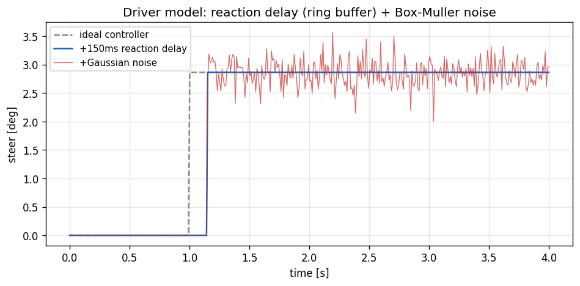

# 10. Driver Model (Latency + Gaussian Noise)

## Learning objectives

이 chapter 를 마치면 다음을 할 수 있다.

1. human reaction time 을 ring-buffer 로 discrete delay 표현하는 방법과 그
   한계 (dt 정수배) 를 설명한다.
2. Box-Muller 변환으로 두 uniform 에서 Gaussian 을 생성하는 원리를 유도한다.
3. Pure Pursuit + Lc6 + Lc5 cascade 외측에 인간 imperfection 을 wrapping 하는
   minimal driver model 의 의의 (autonomous baseline) 를 설명한다.
4. 외부 uniform 입력으로 reproducibility 를 보장하는 설계를 설명한다.

## Prerequisites

- **Chapter 08-09** — Lc5/Lc6 cascade, Pure Pursuit.
- **외부** — 정규분포 / random number 기초.

---

## 10.1 동기 — 인간 driver baseline

controller 측은 두 영역으로 나뉜다.

1. Autonomous controller (Pure Pursuit / Stanley / MPC) — perfect, instant.
2. Human driver — imperfect (reaction delay, jitter), bounded.

ADAS/autonomous 성능 평가에는 인간 driver baseline 또는 driver-in-the-loop
surrogate 가 필요하다. DriverModel 은 ideal cascade (PP + Lc6 + Lc5) 위에
reaction delay (ring buffer) 와 Gaussian noise 를 더한 minimal driver 다.



---

## 10.2 가정

| 가정 | 의미 | 깨지는 case |
|---|---|---|
| Fixed reaction time | latency 일정 | fatigue / 인지부하 |
| dt 정수배 delay | ring buffer 가 정확 N step | 비정수 latency |
| Gaussian noise | jitter 가 정규분포 | fat-tail 실측 |
| Correlated thr/brake | 같은 noise z 공유 | independent |
| No anticipation | lookahead 만 미래 정보 | preview control |

---

## 10.3 Reaction delay — ring buffer

인간 visual-to-motor latency ≈ 150-300 ms (도시 driving). ring buffer 로
discrete delay:

$$
N_{\text{buf}} = \text{round}(t_{\text{react}} / dt)
$$

매 step 현재 PP 출력을 buffer 에 쓰고, index 를 순환시켜 $N_{\text{buf}}$ step
전 값을 읽는다 → 정확히 $N_{\text{buf}}$ step delay.

한계: latency 가 dt 정수배만 표현 가능 (150 ms / 5 ms = 30 OK, 150.5 ms 는
round). time-varying reaction (fatigue) 미반영.

---

## 10.4 Gaussian noise — Box-Muller

두 uniform $u_1, u_2 \in (0,1)$ 로 표준정규 $z\sim N(0,1)$:

$$
z = \sqrt{-2\ln u_1}\,\cos(2\pi u_2)
$$

유도: 2D Gaussian 의 polar form 에서 $r^2 = -2\ln u_1$, $\theta = 2\pi u_2$ →
$(r\cos\theta, r\sin\theta)$ 가 독립 Gaussian 쌍. 첫 성분만 사용.

noise level (default): steer σ=0.005 rad (3σ≈0.9°, 실인간 jitter order),
throttle σ=0.02 (±6 %). calibration starting point — 특정 driver 측정으로 fit
가능.

---

## 10.5 Cascade 통합 + reproducibility

```
PurePursuit → raw_steer
  → reaction delay (ring buffer) → delayed_steer
  → + Gaussian noise → noisy_steer (clamp max_steer)

v_target → Lc6 PI → ax_target → Lc5 PI+FF → throttle/brake
  → + Gaussian noise → noisy_throttle/brake
→ CmdL4
```

uniform $u_1, u_2$ 를 외부에서 주입 (controller 가 내부 RNG 를 갖지 않음) →
같은 seed 면 결과 bit-equal. 이는 회귀 test 와 시나리오 재현에 필수다.

---

## 10.6 검증 전략

| 검증 | 케이스 |
|---|---|
| Reaction delay | 100 ms 동안 buffer 가 0 출력 후 release |
| Noise bound | 200 ticks σ=0.005 에서 max steer ≤ 0.04 (8σ) |
| End-to-end | figure-8 에서 PP-perfect 대비 jittery+delayed steer, 추종 유지 |

---

## 10.7 Pure Pursuit perfect vs DriverModel

| Metric | Pure Pursuit | DriverModel |
|---|---|---|
| Steer | smooth | jittery + 150 ms delay |
| vx tracking | tight | slight over/undershoot |
| Trajectory | path 근접 | 약간 vibration |

두 binary 의 비교가 "autonomous 가 인간 대비 얼마나 깨끗한 driving 이 가능한가"
의 quantification 이다.

---

## 10.8 한계

| 항목 | 한계 |
|---|---|
| Reaction time | fixed (fatigue/distraction 미반영) |
| Noise 분포 | Gaussian (실제 fat tail) |
| thr/brake | correlated (independent 가 정확) |
| Anticipation | lookahead 만, preview 없음 |
| Driver intent/mood | 미반영 |
| Force feedback | rack torque 입력만, 반응 없음 |

본격 driver model (Werling OpenDriver, IPGDriver) 은 30+ parameter. 본 모델은
minimal 5 parameter.

---

## 10.9 다음 chapter 와의 연결

chapter 04-10 이 plant(Ld) + control(Lc) 사다리를 완성했다. chapter 11 은 이
모든 EoM 을 적분하는 수치 기법 (RK4, substepping, 1-step lag), chapter 12 는
전체 software architecture 를 다룬다.

---

## 10.10 참고문헌

- **Hess, R.A. & Modjtahedzadeh, A.**, *A control theoretic model of driver steering behavior*, IEEE CSM, 1990.
- **MacAdam, C.C.**, *Application of an optimal preview control ...*, IEEE Trans. SMC, 1981.
- **IPGDriver Reference Manual**, IPG Automotive (commercial driver model).

---

## 10.11 Self-check

<details>
<summary>1. ring buffer 크기가 reaction_time/dt 인 이유?</summary>

매 step 쓰고 한 칸씩 순환하므로, $N$ 칸 buffer 는 정확히 $N$ step 전 값을
반환한다. $N = t_{\text{react}}/dt$ 면 $t_{\text{react}}$ 지연이 된다.
</details>

<details>
<summary>2. Box-Muller 에서 u1 을 1e-6 으로 clamp 하는 이유?</summary>

$u_1=0$ 이면 $\ln u_1 = -\infty$ → $z$ 발산. 하한 clamp 로 수치 안정성 확보.
</details>

<details>
<summary>3. 외부에서 uniform 을 주입하는 설계의 이점?</summary>

controller 가 내부 RNG state 를 갖지 않아 같은 seed → bit-equal 재현. 회귀
test 와 시나리오 reproducibility 에 필수.
</details>

<details>
<summary>4. throttle/brake 에 같은 noise z 를 쓰는 단순화의 부작용?</summary>

둘이 correlation 1.0 → 동시에 같은 방향으로 흔들린다. 실제는 독립적이라
pedal 전환 구간의 noise 통계가 부정확해진다.
</details>

<details>
<summary>5. discrete delay 가 비정수 latency 를 표현 못 하는 이유와 완화책?</summary>

ring buffer 가 step 단위라 dt 정수배만 가능. 작은 dt 를 쓰거나, fractional
delay 를 위해 두 칸을 선형 보간하면 완화된다.
</details>

---

## 10.12 VDSim 구현 노트

> **[VDSim impl] § 10.3 — Ring buffer 코드**
>
> ```cpp
> struct DriverModel {
>     std::vector<double> steer_buffer_;
>     int    steer_idx_ {0};
>     double reaction_time_s {0.150};
> };
> // 매 step:
> buf_size = round(reaction_time / dt);
> steer_buffer_[steer_idx_] = pp_steer_now;
> steer_idx_ = (steer_idx_ + 1) % buf_size;
> delayed_steer = steer_buffer_[steer_idx_];
> ```
> dt=5 ms, reaction=150 ms → buffer size 30 (trivial memory).

> **[VDSim impl] § 10.4 — Box-Muller 코드**
>
> ```cpp
> const double u1 = clamp(rand_a, 1e-6, 1 - 1e-6);
> const double u2 = rand_b;
> const double z  = sqrt(-2 * log(u1)) * cos(2 * M_PI * u2);
> delayed_steer  += g_.steer_noise_rms * z;
> ```
> default `steer_noise_rms=0.005`, `thr_noise_rms=0.02`. throttle/brake 는
> 같은 z (correlation 1.0) — minimal 단순화.

> **[VDSim impl] § 10.5 — DriverModel::update + cascade**
>
> `core/src/control_converter.cpp` 의 `DriverModel::update`. 내부 cascade
> gain: vx PID $K_p=0.6, K_i=0.15$ (auto cascade 보다 느림 — 인간 reaction
> 모사), ax PID 는 Lc5 default.

> **[VDSim impl] § 10.5 — Reproducibility 예제**
>
> ```cpp
> std::mt19937_64 rng(42);
> std::uniform_real_distribution<double> uni(0, 1);
> const double a = uni(rng), b = uni(rng);
> auto out = drv.update(x, y, yaw, vx, v_target,
>                       path_x, path_y, n, dt, a, b);
> ```
> seed 42 → bit-equal (`examples/driver_demo.cpp`).

> **[VDSim impl] § 10.6 — 검증 test + end-to-end**
>
> `DriverModel.*` 2 tests: `ReactionTimeDelaysSteer`, `NoiseIsBoundedByRMS`.
> `vdsim_driver_demo` (sedan, figure-8, v_target=10, latency 150 ms,
> σ_steer 0.005, σ_thr 0.02): PP-perfect 대비 거친 steer, trajectory 추종 유지
> (sedan saturation 한계 내).

> **[VDSim impl] § 10.x — 사용 예제**
>
> ```cpp
> vdsim::DriverModel drv;
> drv.initialize({.wheelbase=vp.wheelbase, .max_steer=vp.max_steer_angle_wheel,
>     .lookahead_min=2.0, .lookahead_k=0.45, .reaction_time_s=0.150,
>     .steer_noise_rms=0.005, .thr_noise_rms=0.02, .vx_kp=0.6, .vx_ki=0.15});
> while (...) {
>     const double a = uni(rng), b = uni(rng);
>     auto out = drv.update(x,y,yaw,vx,v_target, path_x,path_y,n, dt, a,b);
>     vdsim::CmdL4 cmd{.throttle=out.throttle, .brake=out.brake,
>                      .steer_angle_wheel=out.steer};
>     dyn->step(cmd, contacts, dt);
> }
> ```
