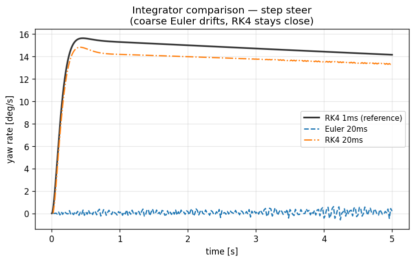

# 11. 수치 적분 — RK4, Substepping, 1-Step Lag

> **학습 목표.** Euler vs RK4 의 local / global error order 를 안다. substepping 이 stiff system 에서 왜 필요한지 stability 측면에서 설명한다. 1-step lag 의 정확한 의미 — self-referential 식을 단순화하기 위한 의도적 추정 — 를 안다. 본 PoC 가 default RK4 + 1 ms substep + 1-step lag 조합인 이유를 명확히 한다.

## 11.1 ODE 의 일반형

차량 dynamics 를 1차 ODE 로 표현:

$$
\dot y = f(y, u, t)
$$

$y$ 는 state vector, $u$ 는 input (control), $t$ 는 time.
Ld1 의 경우 `y ∈ R^8` (x_w, y_w, ψ, vx, vy, r, ω_f, ω_r), Ld3 의 경우 더 크다.

수치 적분은 `y(t + dt)` 를 `y(t)`, `f(y, t)` 로부터 추정.

## 11.2 Explicit Euler — 단순 / 부정확

$$
y_{n+1} = y_n + dt \cdot f(y_n, t_n)
$$

local error $O(dt^2)$ per step, global error $O(dt)$ over $[0, T]$.

**stable region** (linear ODE $\dot y = \lambda y$):

$$
|1 + dt\, \lambda| \le 1
$$

$\lambda = -1000$ (stiff) 이면 $dt < 0.002$ 필요. 매우 작아야 stable.

VDSim 의 spring/damper system 의 stiffness ratio (k_tire = 220 kN/m, m_u = 40 kg) → ω² ≈ 5500, ω ≈ 74 rad/s, 그리고 underdamped 모드 cluster. Euler 는 stable region 좁아 작은 dt 강제.

### 본 PoC 의 Euler 옵션

`SolverParams::Integrator::Euler` — benchmark / fairness 비교 용. default 는 RK4.
`configs/solvers/euler_10ms.yaml` 같은 coarse Euler config 으로 integrator 의 numerical error 시범 가능.



*동일 step-steer 를 RK4 1ms (reference) vs Euler 20ms vs RK4 20ms 로. stiff
suspension 에서 Euler 20ms 는 불안정해지고, RK4 는 큰 dt 에서도 reference 에
근접.*

## 11.3 Runge-Kutta 4 (RK4) — 본 PoC 의 default

$$
\begin{aligned}
k_1 &= f(y_n, t_n) \\
k_2 &= f(y_n + \tfrac{dt}{2} k_1,\; t_n + \tfrac{dt}{2}) \\
k_3 &= f(y_n + \tfrac{dt}{2} k_2,\; t_n + \tfrac{dt}{2}) \\
k_4 &= f(y_n + dt\, k_3,\; t_n + dt) \\
y_{n+1} &= y_n + \tfrac{dt}{6}(k_1 + 2k_2 + 2k_3 + k_4)
\end{aligned}
$$

local error $O(dt^5)$, global error $O(dt^4)$.

stable region (linear test problem):

$$
|R(z)| \le 1, \qquad R(z) = 1 + z + \tfrac{z^2}{2} + \tfrac{z^3}{6} + \tfrac{z^4}{24}
$$

훨씬 넓다. RK4 는 stiff system 의 일부 범위까지 stable.

### RK4 의 cost

4 evaluations of `f` per step. Euler 의 4 배. 하지만:

- error 가 `O(dt⁴)` 이므로 같은 정확도에 더 큰 dt 가능.
- 결과적으로 Euler 보다 빠를 수도 (정확도가 같다는 가정).

VDSim 의 inner substep dt = 1 ms 의 RK4 는 차량 dynamics 에서 numerical error 가 무시 가능 수준 (`O(10^{-12})`).

## 11.4 Substepping — outer dt 와 inner dt 의 분리

CARLA / 외부 host 의 tick 이 보통 20 ms (50 Hz) 정도. 그러나 차량 spring 의 frequency 가 10-15 Hz 이라 outer dt 20 ms 으로 직접 RK4 하면 oscillation 인접에서 numerical artifact.

VDSim 의 처리:

$$
dt_{\text{sub}} = \min(dt_{\text{outer}},\, dt_{\max}), \qquad
N_{\text{sub}} = \lceil dt_{\text{outer}} / dt_{\text{sub}} \rceil
$$

(capped at `max_substeps`)

매 outer step 안에서 N_substeps 회의 RK4 inner step.

코드 `core/src/bicycle_dynamics.cpp:117-119`:
```cpp
const int N = std::max(1,
               std::min(sp_.max_substeps,
                        static_cast<int>(std::ceil(dt / sp_.max_substep_dt))));
const double h = dt / static_cast<double>(N);
for (int i = 0; i < N; ++i) substep(cmd, contacts, h);
```

default: `max_substep_dt = 0.001 s`, `max_substeps = 10`.

- outer dt = 5 ms → 5 substeps of 1 ms.
- outer dt = 20 ms → cap 에 10 substeps of 2 ms.

### Inner dt 의 선택 기준

$$
dt_{\text{inner}} \le \frac{1}{10\, f_{\max}}
$$

$f_{\max}$ 는 가장 빠른 system mode 의 frequency.
sedan default: spring k = 30000, m_u = 40 → ω ≈ 27 rad/s ≈ 4.3 Hz. dt_inner ≤ 23 ms 면 충분.
하지만 tire-vertical mode k_tire = 220000, m_u = 40 → ω ≈ 74 → f ≈ 12 Hz. dt_inner ≤ 8 ms.

본 PoC 의 1 ms 는 매우 보수적. 정확도 우선.

## 11.5 1-Step Lag — Self-referential 식의 단순화

### 문제

Ld1 의 longitudinal weight transfer:

$$
F_{z,f}(t) = F_{z,f}^{\text{static}} - \frac{m\, a_x(t)\, h_{cg}}{L}, \qquad
a_x(t) = \frac{F_{x,\text{total}}(F_{z,f}(t), F_{z,r}(t), \ldots)}{m}
$$

$F_z$ 는 $a_x$ 의 함수, $a_x$ 는 $F_z$ 의 함수. **self-referential**.

엄밀하게 풀려면 fixed-point iteration:
```
Fz^{(0)}  =  static
ax^{(0)}  =  compute(Fz^{(0)})
Fz^{(1)}  =  static − m · ax^{(0)} · h_cg / L
ax^{(1)}  =  compute(Fz^{(1)})
... 수렴 까지
```

매 substep 마다 iteration → 비용 큼 + tire 의 nonlinearity 로 수렴 보장 없음.

### 1-Step Lag 의 해

직전 substep 의 $a_{x,\text{prev}}$ 를 사용:

$$
F_{z,f}(t) = F_{z,f}^{\text{static}} - \frac{m\, a_{x,\text{prev}}\, h_{cg}}{L}, \qquad
a_x(t) = \text{compute}(F_z(t)), \qquad
a_{x,\text{prev}} \leftarrow a_x(t)
$$

- bias: 직전 step 의 ax 사용 → transient 동안 small lag.
- substep dt = 1 ms 면 bias 가 `~ dt · |dax/dt|`. brake 의 ax = −5 m/s², 시간 도함수 ~ 100 m/s³ 이라도 bias = 100 · 0.001 = 0.1 m/s². ΔFz 영향 = `m · 0.1 · h / L ≈ 30 N` (sedan 의 경우). 무시 가능.

### 검증 (Task 17)

brake step 의 실측 ax = −3.36 m/s² → 분석값 ΔFz_long = 1027 N.
sim 측정 Fz_f ratio = 1.125, 분석값 = 1.126. 오차 0.1 %.

1-step lag 가 실용적으로 무시 가능 정확도.

### 다른 self-referential 예

Lateral weight transfer (Ld2): `ay_prev` 동일 패턴.
Anti-dive: pitch 의 inertia term 에 `ax` 사용 — 동일 lag.

본 PoC 는 일관되게 1-step lag.

## 11.6 RK4 substep + 1-step lag 의 combination

각 substep 마다:

1. `ax_prev`, `ay_prev` 사용해 Fz 계산.
2. RK4 4 stage 진행 (`f` 4번 evaluation).
3. substep 끝에서 `ax_prev = k.dvx − vy · r` (= `Fx_total / m`), `ay_prev = k.dvy + vx · r` 갱신.

RK4 의 4 stage 안에서는 `ax_prev` constant. 더 정확하게는 매 stage 마다 update 가능하지만 (1) 식 복잡, (2) 효과 미미.

코드 `core/src/seven_dof_dynamics.cpp:418-425`:
```cpp
state_   = apply(s0, k, h);
ax_prev_ = k.ax_body;
ay_prev_ = k.ay_body;
```

## 11.7 외부 outer step 의 dt 권고

| 사용 | outer dt | 비고 |
|---|---|---|
| CARLA 50 Hz | 20 ms | substep 10 으로 cap, inner 2 ms |
| Lab analysis | 5 ms | 5 substeps of 1 ms (PoC default) |
| Highest fidelity | 1 ms | substep 1, inner 1 ms (no substep) |
| MPC inner loop | 10-20 ms | substep 10-20 |

`sp_.max_substep_dt = 0.001` 유지 추천. `sp_.max_substeps = 10` 도.

## 11.8 검증 — Solver 별 비교 (Task 16)

step_steer (δ=0.05, vx=10, 5s):
| Integrator | substep | r(T) | vx(T) |
|---|---:|---:|---:|
| RK4 | 1 ms | 0.17993 | 9.713 |
| Euler | 10 ms (= outer dt) | 0.17950 | 9.693 |

차이 +0.24 %, +0.21 %. 작지만 측정 가능.

- outer dt 가 5 ms 같으면 Euler 가 잘 동작.
- 큰 outer dt (50 ms 이상) 면 Euler 가 진동 시작.

## 11.9 한계 / future work

| 항목 | 한계 |
|---|---|
| RK4 의 stiff system 한계 | implicit methods (BDF, IRK) 가 더 stable |
| 1-step lag 의 transient bias | fixed-point iteration 옵션 |
| Variable-step adaptive | 본 PoC 는 fixed step (RK45 / Dormand-Prince 미지원) |
| Symplectic integrators | spring/damper 에서 energy preservation 우수 (Verlet) |
| DAE | constrained multibody (Ld4-Ld5) 에서 필요 |

본 PoC 는 fixed-step RK4 단일. Phase 2 에서 adaptive / implicit / DAE 옵션 추가.

## 11.10 참고

- Hairer, E., Wanner, G., *Solving Ordinary Differential Equations II — Stiff and Differential-Algebraic Problems*, Springer, 1996.
- Press, W.H. et al., *Numerical Recipes*, 3rd ed., Cambridge, 2007 — §17 (ODE integrators).
- 본 PoC 의 검증: `configs/solvers/{rk4_1ms, euler_10ms}.yaml` + Task 16 figure.
