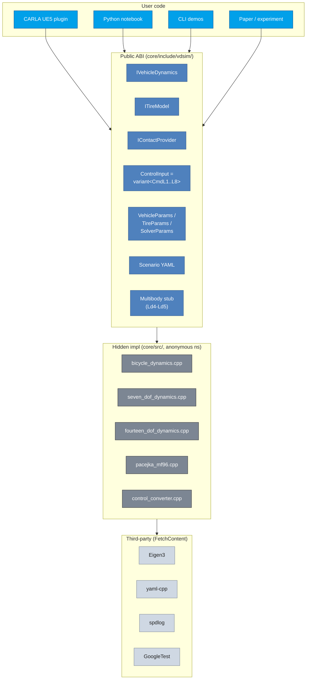

# 12. Software Architecture (ABI, Bindings, Plugin)

## Learning objectives

이 chapter 를 마치면 다음을 할 수 있다.

1. factory function + pure virtual interface 가 ABI 안정성을 보장하는 원리를
   설명한다.
2. type-safe sum type (variant) dispatch 가 control 입력 처리를 단순화·안전화
   하는 이유를 설명한다.
3. static lib 를 shared object 에 link 할 때의 PIC (fPIC) 함정을 인지한다.
4. dependency-inversion 기반 plugin (외부 시뮬레이터 의존성 0 으로 빌드) 의
   설계를 설명한다.

## Prerequisites

- **Chapter 04-11** — 이 architecture 가 묶는 plant/control/integrator.
- **외부** — C++17 (variant, unique_ptr), CMake, pybind11 기초.

---

## 12.1 동기 — layered architecture



public ABI (header) 와 hidden impl (cpp, anonymous namespace) 을 분리하여 내부
변경이 외부에 전파되지 않게 한다.

---

## 12.2 Factory + pure virtual = ABI 안정

header 는 pure virtual interface 와 factory function 만 노출하고, 구현 class
는 cpp 의 anonymous namespace 에 숨긴다.

원리:

1. implementation 이 anonymous namespace 안 → external code 가 구현 class 에
   접근 불가 → 내부 멤버 변경이 ABI 영향 없음.
2. factory 가 `unique_ptr` 반환 → heap allocation + ownership 명확, shared lib
   경계에서 안전.
3. pure virtual + `final` → derived dispatch 가능 + 추가 inherit 차단 (vtable
   최적화 + 의도 명확).

### 인터페이스 확장의 backward compat

새 method 를 default implementation 과 함께 추가하면:

```cpp
virtual double steering_rack_torque() const { return 0.0; }   // default
```

기존 derived class 는 override 없이 빌드 + 기본값, 새 class 만 override 해서
정확한 값을 반환한다. 이것이 interface 확장의 표준 backward-compat 패턴이다.

---

## 12.3 Type-safe variant dispatch

control 입력 8 tier 를 `variant<CmdL1,...,CmdL8>` 로 묶고 `visit` +
`if constexpr` 로 dispatch 한다 (chapter 07).

장점:

- Type-safe — 잘못된 멤버 접근이 compile error.
- No heap — variant 는 stack 의 fixed-size union + tag.
- Compile-time dispatch — `if constexpr` 로 runtime branch 없음.
- Exhaustive — 모든 alternative handle 을 compile-time 검증.

size 비용은 $\max_i \text{sizeof}(\text{Cmd}_i) + \text{tag}$. 가장 큰 CmdL8 도
`vector` 는 heap 에 데이터를 두므로 variant 자체는 ~32 bytes (trivial).

---

## 12.4 YAML I/O — backward compat

schema 규칙: top-level key 가 struct member 와 1:1 (flat), missing key →
default 유지 (forward-compat), unknown key → ignore (backward-compat), wrong
type → throw. 모든 to_yaml/from_yaml pair 는 bit-exact roundtrip (emitter 가
17-digit precision). 사람-친화 config 는 손작성 (한 자릿수 + 주석).

---

## 12.5 Pybind11 — PIC 함정

static lib 를 Python shared module 에 link 할 때, Linux static lib 는 default
로 PIC (Position Independent Code) 없이 빌드되어 link 가 실패한다:

```
relocation R_X86_64_TPOFF32 against ... can not be used when making
a shared object; recompile with -fPIC
```

해결: 모든 관련 target 에 `CMAKE_POSITION_INDEPENDENT_CODE = ON`. binding 은
`shared_ptr<IVehicleDynamics>` 를 Python reference-counted object 로 노출하며,
GC 시 C++ destructor 가 호출되고 C++ exception 이 Python exception 으로 자동
변환된다.

---

## 12.6 CARLA Plugin — dependency inversion

plugin static lib 가 외부 시뮬레이터 (CARLA/UE5) 의존성 없이 빌드되게 하려면,
raycast 같은 host 기능을 `std::function` 으로 주입받는다.

```cpp
using RaycastFn = std::function<bool(const Vec3& start, double max_depth,
                                     double& out_z, Vec3& out_normal,
                                     int& out_surface_id)>;
```

런타임에 host (UE5 의 `LineTraceSingleByChannel`, 또는 test 의 mock) 가
function 을 주입한다. surface ID → μ lookup 으로 노면별 마찰을 매핑하고 (asphalt,
wet, ice 등), 미지 surface 는 default μ fallback. 이로써 CARLA 실 통합 없이
ABI 를 mock test 로 검증할 수 있다.

---

## 12.7 Build / test 구조

FetchContent 로 Eigen / yaml-cpp / spdlog / GoogleTest 를 가져온다 (system
의존성 없음, submodule 보다 간단, `_deps/` offline 캐시). 첫 configure 5-10
min, 이후 incremental 1-2 sec.

test 는 unit (단일 module boundary, <100 ms) 과 integration (다 module 결합,
1 시나리오 SS 적분) 으로 분리하고 GoogleTest fixture (RAII SetUp) 를 사용한다.

---

## 12.8 검증 전략

| 검증 | 케이스 |
|---|---|
| YAML roundtrip | default→emit→parse→default' bit-equal (45 fields, max\|Δ\|=0) |
| Raycast provider | known μ lookup, unknown fallback, missed/null raycast 안전 |
| Python binding | create_*→step→GC 시 destructor, invalid YAML → RuntimeError |

---

## 12.9 한계

| 항목 | 한계 |
|---|---|
| Plugin | 정적 link 만 (dynamic loading 없음) |
| ROS/ROS2 bridge | 없음 |
| Real-time scheduler | 일반 scheduler 만 |
| Multi-threading | 단일 thread (sweep 은 process-level) |
| GPU / WASM | 없음 / 미평가 |

---

## 12.10 다음 chapter 와의 연결

chapter 01-12 가 현재 구현된 lumped EoM 사다리 + control + architecture 를
완성한다. chapter 13-16 은 미래 방향 — multibody outlook (Ld4-Ld5), hardpoint
kinematics, validation/DOE, FMI 통합 — 을 다룬다.

---

## 12.11 참고문헌

- **Lakos, J.**, *Large-Scale C++ Software Design*, Addison-Wesley, 1996 (ABI 패턴).
- **Stroustrup, B.**, *The C++ Programming Language*, 4th ed., 2013 (variant).
- **Sutter & Alexandrescu**, *C++ Coding Standards*, 2004 (factory).
- pybind11 documentation: https://pybind11.readthedocs.io/.

---

## 12.12 Self-check

<details>
<summary>1. 구현 class 를 anonymous namespace 에 두면 ABI 측면 이점은?</summary>

external translation unit 이 그 class 의 layout 에 의존할 수 없으므로 멤버를
추가/변경해도 외부 재컴파일/ABI 깨짐이 없다. header 의 interface 만 안정 유지.
</details>

<details>
<summary>2. variant dispatch 가 virtual 상속 대신 갖는 이점?</summary>

heap allocation 없이 stack 에 값으로 담기고, `if constexpr` 로 compile-time
dispatch + exhaustive check. 작은 closed set (8 tier) 에는 variant 가 적합.
</details>

<details>
<summary>3. static lib 가 PIC 없이 빌드되면 무엇이 깨지나?</summary>

shared object (.so) 로 link 시 TLS/global 의 relocation 이 PIC 를 요구해 link
실패. `CMAKE_POSITION_INDEPENDENT_CODE=ON` 으로 모든 target 을 PIC 빌드해야 한다.
</details>

<details>
<summary>4. raycast 를 std::function 으로 주입하는 설계의 핵심 이점?</summary>

plugin 이 CARLA 헤더/라이브러리에 link 하지 않아도 빌드되고, host 가 런타임에
구현을 주입한다 (dependency inversion). mock 으로 ABI 단독 test 가능.
</details>

<details>
<summary>5. interface 에 default 구현 method 를 추가하는 게 backward-compat 인 이유?</summary>

기존 derived class 는 override 없이도 default 동작으로 컴파일/실행되고, 필요한
class 만 override. 기존 코드 수정 없이 interface 확장 가능.
</details>

---

## 12.13 VDSim 구현 노트

> **[VDSim impl] § 12.2 — Factory + interface 코드**
>
> ```cpp
> class IVehicleDynamics {
> public:
>     virtual ~IVehicleDynamics() = default;
>     virtual void initialize(const VehicleParams&, const TireParams&,
>                             const SolverParams&) = 0;
>     virtual void step(const ControlInput&, const ContactArray&, double dt) noexcept = 0;
> };
> std::unique_ptr<IVehicleDynamics> create_bicycle();
> std::unique_ptr<IVehicleDynamics> create_seven_dof();
> std::unique_ptr<IVehicleDynamics> create_fourteen_dof();
> // cpp:
> namespace { class BicycleDynamics final : public IVehicleDynamics { ... }; }
> ```
> 확장 예: `steering_rack_torque()` default 0 (chapter 05 §5.7) → Ld1 은
> override 없이, Ld2/Ld3 만 override.

> **[VDSim impl] § 12.4 — YAML pull + roundtrip**
>
> `core/src/params.cpp` 의 `pull(node, key, dst)`: missing/null → default 유지,
> 파싱 실패 → `runtime_error`. roundtrip 45 fields max\|Δ\|=0.

> **[VDSim impl] § 12.5 — PIC 설정**
>
> `third_party/CMakeLists.txt:3-4`:
> ```cmake
> # Make all FetchContent targets PIC so they can link into shared objects.
> set(CMAKE_POSITION_INDEPENDENT_CODE ON)
> ```
> `python/bindings.cpp` 가 `vdsim_core` static lib 를 link 해 `vdsim` module
> 생성. `import vdsim; vdsim.create_seven_dof()` 가 자동 reference counting.

> **[VDSim impl] § 12.6 — Raycast provider 코드 + test**
>
> `carla_integration/plugin/raycast_contact_provider.{hpp,cpp}` 의
> `RaycastContactProvider : public IContactProvider`. surface ID 예: asphalt=1
> (1.0,1.0), wet=4 (0.8,0.8), ice=8 (0.2,0.2), `std::find_if` lookup, fallback
> default_mu 0.65. mock 4 tests: `FlatGroundLookupYieldsKnownMu`,
> `UnknownSurfaceFallsBackToDefault`, `MissedRaycastInvalidatesContact`,
> `NullRaycastSafe`.

> **[VDSim impl] § 12.7 — CMake 구조**
>
> ```
> VDSim/
> ├── CMakeLists.txt              top-level options
> ├── third_party/CMakeLists.txt  FetchContent
> ├── core/CMakeLists.txt         vdsim_core static lib
> ├── carla_integration/plugin/   vdsim_carla_plugin static lib
> ├── python/CMakeLists.txt       vdsim pybind11 module (shared)
> ├── tests/{unit,integration}/
> └── examples/
> ```
