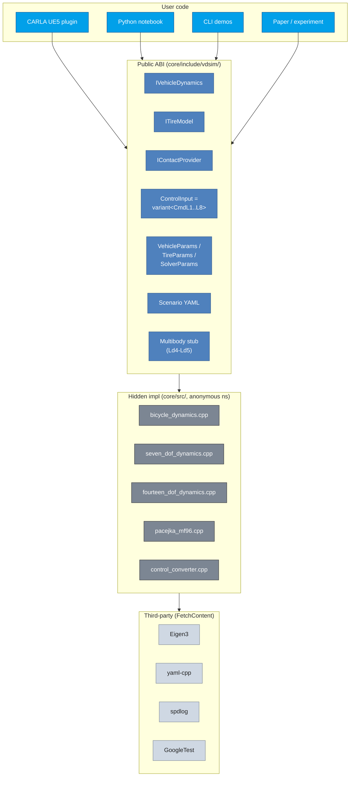

# 12. Software Architecture — C++17 ABI, Pybind11, CARLA Plug-in

> **학습 목표.** Factory function + pure virtual interface 가 ABI 안정성을 어떻게 보장하는지 안다. `std::variant` 의 type-safety 가 dispatch 코드를 어떻게 단순화하는지 안다. pybind11 + PIC 빌드의 함정 (static lib 가 shared object 에 link 될 때 fPIC 강제) 을 인지한다. CARLA plugin 의 raycast injection pattern (CARLA 의존성 0 으로 빌드 가능) 의 이론을 안다.

## 12.1 아키텍처 layer



## 12.2 Factory + pure virtual = ABI 안정

전형적 코드:
```cpp
// header — public surface
class IVehicleDynamics {
public:
    virtual ~IVehicleDynamics() = default;
    virtual void initialize(const VehicleParams&, const TireParams&,
                             const SolverParams&) = 0;
    virtual void step(const ControlInput&, const ContactArray&, double dt) noexcept = 0;
    // ... other virtual methods
};

std::unique_ptr<IVehicleDynamics> create_bicycle();
std::unique_ptr<IVehicleDynamics> create_seven_dof();
std::unique_ptr<IVehicleDynamics> create_fourteen_dof();

// cpp — hidden impl
namespace {
    class BicycleDynamics final : public IVehicleDynamics { ... };
}
std::unique_ptr<IVehicleDynamics> create_bicycle() {
    return std::make_unique<BicycleDynamics>(create_pacejka_mf96());
}
```

### 의의

1. **Implementation 이 anonymous namespace 안**. external code 가 `BicycleDynamics` 클래스 자체에 접근 불가 → 내부 멤버 변경이 ABI 변화로 외부에 영향 없음.
2. **Factory function 반환 `unique_ptr`** — heap allocation, ownership 명확. shared lib 경계에서 안전.
3. **Pure virtual + final**:

   - `virtual` 로 derived dispatch 가능.
   - `final` 로 implementation class 가 더 inherit 불가 (vtable 최적화 + 의도 명확).

### Default virtual implementation 의 ABI 추가

Chapter 5 § 5.6 에서 본 `steering_rack_torque()` 가 추가될 때:
```cpp
class IVehicleDynamics {
    // existing methods
    virtual double steering_rack_torque() const { return 0.0; }   // default
};
```

기존 derived class (e.g., L1 bicycle) 는 override 안 해도 빌드 + 기본 동작 0.
새로 추가된 L2/L3 가 override 해서 정확한 값 반환.

이게 **interface 확장 시 backward compat** 의 표준 패턴.

## 12.3 std::variant + std::visit + if constexpr

ControlInput dispatch (chapter 07 의 패턴):
```cpp
using ControlInput = std::variant<CmdL1, CmdL2, CmdL3, CmdL4, CmdL5, CmdL6, CmdL7, CmdL8>;

inline CmdL4 lower_to_l4(const ControlInput& u) {
    return std::visit([](const auto& cmd) -> CmdL4 {
        using T = std::decay_t<decltype(cmd)>;
        CmdL4 out;
        if constexpr (std::is_same_v<T, CmdL1>) {
            // CmdL1 specific lowering
        }
        else if constexpr (std::is_same_v<T, CmdL2>) {
            // CmdL2 specific
        }
        // ...
        return out;
    }, u);
}
```

### Pattern 의 의의

- **Type-safe**. CmdL4 의 멤버를 CmdL3 에 호출하면 compile error.
- **No heap allocation**. variant 는 stack 에 fixed-size union + tag.
- **Compile-time dispatch via `if constexpr`** — runtime branch 없음. 효율적.
- **Exhaustive**. 모든 variant alternative 가 handle 되면 compile-time 검증.

VDSim 의 8 single-line `if constexpr` 가 깔끔.

### Variant 의 size 비용

```
sizeof(ControlInput)  =  max(sizeof(CmdL1), ..., sizeof(CmdL8))  +  tag
                      ≈  sizeof(CmdL8)  +  4
```

CmdL8 가 `std::vector<PathPoint>` 포함이라 heap에서 데이터, ControlInput 자체는 ~32 bytes. trivial.

## 12.4 YAML I/O — backward compat

VDSim 의 YAML schema 규칙:

- top-level keys map 1:1 to struct members (flat, no nesting).
- missing keys → default 유지 (forward-compat).
- unknown keys → silently ignored (backward-compat).
- wrong types → `std::runtime_error` throw.

코드 `core/src/params.cpp` 의 `pull(node, key, dst)`:
```cpp
template <typename T>
void pull(const YAML::Node& node, const char* key, T& dst) {
    const auto sub = node[key];
    if (!sub || sub.IsNull()) return;        // missing → default 유지
    try { dst = sub.as<T>(); }
    catch (const YAML::Exception& e) {
        throw std::runtime_error(std::string("YAML field '") + key + "': " + e.what());
    }
}
```

### Roundtrip 정확성

VDSim 의 모든 to_yaml / from_yaml pair 가 **bit-exact roundtrip**:
```
default → to_yaml → from_yaml → default'   bit-equal
```

검증 (Task 12, 16): 45 fields, max |Δ| = 0.

yaml-cpp emitter 가 17-digit precision 으로 double 출력. 가독성은 나쁘지만 roundtrip 정확.

사람-친화 YAML (configs/vehicles/sedan.yaml 등) 은 손작성 — 한 자릿수 정확도, 주석 포함.

## 12.5 Pybind11 module — Build pitfall

본 PoC 의 `python/bindings.cpp` + `python/CMakeLists.txt` 가 `vdsim_core` static lib 를 link 해 Python shared module 생성.

### PIC 문제

Linux 의 static lib 는 default 로 PIC (Position Independent Code) 없이 빌드. PIC 가 없으면 shared module 에 link 불가:
```
relocation R_X86_64_TPOFF32 against `_ZGVZN6spdlog7details2os9thread_idEvE3tid' can not be used when making a shared object; recompile with -fPIC
```

해결: `CMAKE_POSITION_INDEPENDENT_CODE = ON` for spdlog / yaml-cpp / vdsim_core.

코드 `third_party/CMakeLists.txt:3-4`:
```cmake
# Make all FetchContent targets PIC so they can link into shared objects.
set(CMAKE_POSITION_INDEPENDENT_CODE ON)
```

핵심.

### Module 의 ABI 안정

Pybind11 의 `PYBIND11_MODULE(name, m)` 매크로가 entry point. C++ 의 `std::shared_ptr<IVehicleDynamics>` 가 Python 의 reference-counted object 로 노출.

```python
import vdsim
dyn = vdsim.create_seven_dof()    # 자동 reference counting
# dyn 이 GC 시 C++ 의 destructor 호출 + Pacejka tire 해제
```

C++ exception 이 Python exception 으로 자동 변환 (RuntimeError 등). 본 PoC 의 `runtime_error` 가 invalid YAML 시 Python RuntimeError 로 propagate.

## 12.6 CARLA Plugin — Raycast injection

본 PoC 의 `carla_integration/plugin/raycast_contact_provider.{hpp,cpp}`:
```cpp
using RaycastFn = std::function<bool(const Vec3& start, double max_depth,
                                       double& out_z, Vec3& out_normal,
                                       int& out_surface_id)>;

class RaycastContactProvider : public IContactProvider {
public:
    RaycastContactProvider(RaycastFn raycast,
                           const SurfaceMaterial* mats, int n_mats,
                           double default_mu = 1.0);
    void query(const State&, const VehicleParams&, ContactArray& out) override;
private:
    RaycastFn raycast_;
    std::vector<SurfaceMaterial> materials_;
    double default_mu_;
};
```

### Key idea — dependency inversion

VDSim 의 `vdsim_carla_plugin` static lib 가 **CARLA 의존성 없이 빌드** 가능.
런타임에 host process (UE5, 또는 mock for tests) 가 raycast function 을 주입.

UE5 plugin 측:
```cpp
auto provider = vdsim_carla::create_raycast_provider(
    [](const vdsim::Vec3& start, double max, ...) {
        // CARLA UE5 의 GWorld->LineTraceSingleByChannel(...)
        // return result
    },
    materials, n_materials);
```

본 PoC 의 mock test:
```cpp
auto provider = create_raycast_provider(
    [](const Vec3&, double, double& z, Vec3& n, int& sid) {
        z   = 0;
        n   = Vec3::UnitZ();
        sid = 7;
        return true;
    },
    materials, 2);
```

### Surface ID → mu lookup

UE5 의 PhysicalMaterial 이 ID 매핑.
asphalt = 1 (mu_long = 1.0, mu_lat = 1.0).
ice = 8 (mu_long = 0.2, mu_lat = 0.2).
wet asphalt = 4 (0.8, 0.8).

`std::find_if` 로 lookup. fallback `default_mu` 0.65 (typical).

### Test (Task 42)

4 mock tests:

- `FlatGroundLookupYieldsKnownMu`
- `UnknownSurfaceFallsBackToDefault`
- `MissedRaycastInvalidatesContact`
- `NullRaycastSafe` — crash 없음.

CARLA 실 통합 없이 ABI 검증.

## 12.7 CMake structure — FetchContent

```
VDSim/
├── CMakeLists.txt              top-level options + subdirectory
├── third_party/CMakeLists.txt  FetchContent: Eigen, yaml-cpp, spdlog, gtest
├── core/CMakeLists.txt         vdsim_core static lib
├── carla_integration/plugin/CMakeLists.txt  vdsim_carla_plugin static lib
├── python/CMakeLists.txt       vdsim pybind11 module (shared)
├── tests/{unit,integration}/CMakeLists.txt
└── examples/CMakeLists.txt
```

FetchContent 의 효과:

- 사용자 system 의 Eigen / yaml-cpp 버전 의존성 없음.
- git submodule 보다 간단 (cmake 가 자동 처리).
- offline build 시 `_deps/` 캐시 사용.

### Configuration time

첫 configure: 5-10 min (Eigen + yaml-cpp + spdlog + GoogleTest 다운로드 + build).
이후 incremental: cache 사용으로 1-2 sec.

## 12.8 Test 구조

`tests/unit/` 와 `tests/integration/` 분리:

- **Unit**: 단일 module 의 함수 / class 의 boundary case. typical < 100 ms.
- **Integration**: 여러 module 결합 (e.g., dyn + tire + contact). 1 시나리오 SS 까지 적분.

GoogleTest 의 fixture pattern:
```cpp
class WeightTransfer : public ::testing::Test {
protected:
    void SetUp() override { ... }
    vdsim::VehicleParams vp_;
    std::unique_ptr<vdsim::IVehicleDynamics> dyn_;
};

TEST_F(WeightTransfer, BrakeBiasInfluencesFrontFx) {
    // test body
}
```

본 PoC 의 모든 test 가 RAII fixture 활용.

## 12.9 한계 / future work

| 항목 | 한계 |
|---|---|
| Plugin system | 정적 link 만 (dynamic plugin loading 없음) |
| ROS/ROS2 bridge | 없음 |
| Real-time (RT scheduler) | 일반 scheduler 만 |
| Multi-threading | 단일 thread 만 (parallel scenario sweep 은 process-level) |
| GPU compute | 없음 |
| WASM build | 미평가 |

## 12.10 참고

- Lakos, J., *Large-Scale C++ Software Design*, Addison-Wesley, 1996 — ABI 안정 패턴.
- Stroustrup, B., *The C++ Programming Language*, 4th ed., 2013 — std::variant.
- Sutter, H. & Alexandrescu, A., *C++ Coding Standards*, 2004 — factory pattern.
- pybind11 documentation: https://pybind11.readthedocs.io/.
