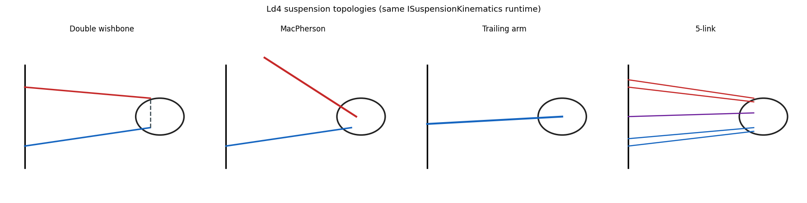

# 13. Multibody (Ld4-Ld5) — Overview

## Learning objectives

이 chapter 를 마치면 다음을 할 수 있다.

1. lumped 14-DOF (Ld3) 가 표현 못 하는 것 (wheel kinematics, compliance,
   topology 차이) 을 열거한다.
2. hardpoint + joint + bushing abstraction 이 임의의 suspension topology 를
   표현할 수 있는 이유를 설명한다.
3. forward kinematics (FK) vs full DAE (Featherstone) 의 trade-off 를 판단한다.
4. K&C (Kinematics & Compliance) chart 와 Adams Car cross-validation 의 의의를
   설명한다.

## Prerequisites

- **Chapter 06** — lumped 14-DOF (Ld3), suspension 의 quasi-static 처리.
- **Chapter 14** — 이 outlook 의 FK 가 실제로 구현된 상세.
- **외부** — multibody dynamics 기초 (Featherstone), 강체 운동학.

---

## 13.1 동기 — lumped 의 한계

Ld3 (chapter 06) 는 sprung corner displacement 를 small-angle linear 로,
unsprung 를 single-DOF point mass 로 둔다. ride 의 quasi-static + transient
까지는 정확하나 다음을 표현 못 한다.

1. wheel kinematics — bump steer, roll steer, camber-from-roll 등 suspension
   geometry 효과.
2. anti-dive/anti-squat 의 정확한 model (scalar factor 근사만).
3. bushing compliance — corner spring 효과만, bushing 6-DOF compliance 없음.
4. suspension topology 차이 — MacPherson / DW / multi-link 의 구별.
5. K&C chart — chassis 설계자의 표준 도구.

이것들이 본격 multibody (Ld4 kinematics, Ld5 compliance) 의 동기다.

---

## 13.2 가정 / 범위

| 항목 | 현재 (Ld4) | 미래 (Ld5) |
|---|---|---|
| Wheel kinematics | FK 구현 (chapter 14) | — |
| Joint | 강체 joint | bushing compliance |
| Dynamics | FK + quasi-static | full DAE (Featherstone) |
| K&C | sweep CSV + plot | 표준 chart 형식 |
| Validation | self-consistency | Adams cross-validation |

---

## 13.3 Multibody 데이터 모형

임의 suspension 을 표현하는 abstraction:

- RigidBody — mass, inertia, CG, pose (chassis, control arm, strut, knuckle,
  tie rod 등).
- Joint — Ball / Revolute / Cylindrical / Prismatic / Universal / Rigid. body
  쌍 + 위치 + 축.
- Bushing — bushing-local 6-DOF linear stiffness/damping (translation 3 +
  rotation 3).
- Hardpoint — body-frame 좌표 (e.g. "lca_inner_front").
- SuspensionTopology — 위들의 묶음 + K&C 출력 (toe, camber, caster, kingpin,
  scrub, trail).

solver interface 는 FK (`forward_kinematics`), quasi-static compliance,
dynamics step 의 세 연산을 노출한다 (구현 §13.13 box).

---

## 13.4 Standard suspension topology

| Topology | 차종 / Use |
|---|---|
| MacPherson strut | sedan front |
| Double wishbone (SLA) | sports / race front |
| Multi-link 5-link | sedan rear |
| Trailing arm | compact rear |
| Beam axle (rigid) | truck / 4WD rear |
| Twist beam | FWD compact rear |

각 topology 가 hardpoint + joint + bushing 명세로 표현된다. 예로 MacPherson
은 chassis / LCA / strut / knuckle / tie_rod 의 5 body 와 revolute (LCA pivot)
+ ball (LCA-knuckle, strut top, tie rod) + prismatic/cylindrical (strut) 의
joint skeleton 으로 구성된다.

---

## 13.5 Forward Kinematics

문제: topology + wheel travel + steer 입력 → wheel center 의 world pose + toe,
camber, caster.

해법은 각 topology 의 joint 제약을 만족하는 knuckle 자세를 푸는 것이다.
MacPherson 예: strut top 은 chassis fixed, strut axis 는 prismatic, LCA outer
ball 은 pivot 주변 원, tie rod outer 도 inner 주변 원 → knuckle 6-DOF 가 3 거리
제약 + 3 회전으로 결정. Newton-Raphson 또는 closed-form 으로 푼다 (상세
chapter 14).

### K&C chart

travel ±100 mm, steer ±0.5 rad sweep 으로:

- toe(travel) — bump steer
- camber(travel) — camber gain
- caster(steer) — caster trail change
- track_change(travel) — scrub
- roll_center(travel) — roll center height

chassis 설계자의 표준 chart. Adams Car / VI 가 GUI 로 자동 plot 한다.

---

## 13.6 Quasi-static compliance

문제: topology + travel (FK 결과) + WheelLoad (Fx, Fy, Fz) → bushing deflection
+ updated wheel pose (compliance steer/camber).

linear bushing $F = -K q - C\dot q$, quasi-static ($\dot q=0$):

$$
K\, q_{\text{local}} = F_{\text{external,local}} \;\Rightarrow\;
q_{\text{local}} = K^{-1} F_{\text{external,local}}
$$

bushing 각각의 deflection 합이 wheel pose 를 약간 회전/평행이동시킨다. 이것이
compliance steer (Fy 가 toe 를 바꾸는 정도) 의 모델링이며, Ld1-Ld3 는 무시한다.
Ld5 의 핵심이다.

---

## 13.7 Full multibody dynamics

constraint 가 있는 multibody EoM 은 DAE 가 된다. Featherstone 의 알고리즘
(kinematic tree O(n), general O(n³)) 또는 augmented Lagrangian (penalty,
정확하나 stiff) 으로 푼다. K&C chart 가 chassis 설계 deliverable 의 대부분을
cover 하므로 full DAE 는 우선순위에서 뒤로 둔다.

---

## 13.8 Adams Car cross-validation

동일 차종의 hardpoint (Adams `.adm` template) 를 import 해 K&C 를 비교한다.

| 항목 | metric | target |
|---|---|---|
| Toe gain | mm/° at ±50 mm | ±5 % vs Adams |
| Camber gain | °/° | ±5 % |
| Roll center | height [mm] static | ±10 mm |
| Caster trail | mm | ±5 % |
| Scrub radius | mm | ±3 mm |

만족 시 chassis 설계자가 신뢰 가능. `.adm` parser 는 hardpoint coord + joint
topology + bushing linear 부분을 추출한다 (nonlinear curve 는 polynomial fit).

---

## 13.9 차별화 요약

단일 C++/Python ABI 안에서 Ld1-Ld3 (autonomy 도메인 simplified) 부터 Ld4-Ld5
(chassis 도메인 multibody) 까지 사다리 전체를 cover 하고, control 사다리
Lc1-Lc8 와 m × n 통합한다. Adams Car 는 Ld4-Ld5 영역만 다루고 control 은
Simulink 외부이므로, 이 통합이 차별화 지점이다.

---

## 13.10 한계

| 항목 | 현재 |
|---|---|
| FK solver | DW/MP/TA/5-link 구현 (chapter 14) |
| Hardpoint 값 | indicative (실측 fit 필요) |
| Bushing compliance | 강체 joint 만 (Ld5, Phase 2) |
| Full DAE | FK + quasi-static 만 |
| K&C 표준 chart | sweep CSV + plot; Adams 형식 미완 |

Ld4 kinematics 는 구현 완료, Ld5 compliance 가 Phase 2 의 다음 큰 항목이다.

---

## 13.11 다음 chapter 와의 연결

이 outlook 의 FK 가 실제로 어떻게 구현됐는지 — 4 topology 의 운동학 제약과
풀이, lookup/native 두 backend, Ld3 통합 — 는 chapter 14 (Hardpoint
Kinematics) 에서 식 단위로 다룬다.

---

## 13.12 참고문헌

- **Featherstone, R.**, *Rigid Body Dynamics Algorithms*, Springer, 2008.
- **Genta, G.**, *Motor Vehicle Dynamics*, World Scientific, 2014, §8 multibody chassis.
- **Reimpell, Stoll, Betzler**, *The Automotive Chassis*, 2001, suspension geometry / K&C.
- **Adams Car User Manual** (MSC Hexagon) — `.adm` schema.

---

## 13.13 Self-check

1. lumped Ld3 가 bump steer 를 표현 못 하는 근본 이유?

unsprung 을 single vertical DOF point mass 로 두어 wheel 의 회전 운동학
(suspension geometry 가 만드는 toe/camber 변화) 자체가 모델에 없다. hardpoint
기반 FK 가 있어야 표현된다.

2. hardpoint+joint+bushing 으로 임의 topology 를 표현할 수 있는 이유?

모든 suspension 은 강체(body) + 연결(joint) + 탄성(bushing) 의 조합이다. 이
세 primitive 와 좌표(hardpoint)만 주면 DW/MP/multilink 가 같은 데이터 모형의
인스턴스가 된다.

3. FK + quasi-static 만으로도 chassis 설계에 충분한 경우는?

K&C chart (toe/camber/caster gain, roll center) 가 설계 deliverable 의 대부분.
이는 kinematic sweep + 선형 compliance 로 얻어지므로 full DAE 없이 cover 된다.

4. compliance steer 란 무엇이며 어느 ladder 가 다루나?

Fy 등 외력이 bushing 을 변형시켜 toe 가 변하는 현상. 강체 joint 만 있는
Ld1-Ld4 는 무시하고, bushing 6-DOF compliance 를 갖는 Ld5 가 다룬다.

5. Adams cross-validation 의 target 이 toe/camber gain 인 이유?

이들이 handling 거동을 좌우하는 핵심 K&C metric 이고 Adams 가 industry
reference 이므로, gain 이 ±5 % 안에 들면 kinematic 모델의 신뢰성이 입증된다.

---

## 13.14 VDSim 구현 노트

> **[VDSim impl] § 13.3 — multibody.hpp 데이터 모형**
>
> `core/include/vdsim/multibody.hpp` (M0 stub): `RigidBody`, `enum JointType
> { Ball, Revolute, Cylindrical, Prismatic, Universal, Rigid }`, `Joint`,
> `Bushing` (6-DOF k/c), `Hardpoint`, `SuspensionTopology`, `IMultibodySolver`
> (`forward_kinematics` / `quasi_static_compliance` / `step_dynamics`).

> **[VDSim impl] § 13.4 — topology config**
>
> `configs/suspensions/*.yaml` 에 hardpoint + joint + bushing 명세. MacPherson
> (sedan FL) 예: bodies LCA(8.5)/strut(12.0)/knuckle(6.5)/tie_rod(1.8),
> hardpoints lca_inner_front/rear, lca_outer_ball, strut_top_mount,
> strut_to_knuckle, tie_rod_inner/outer, wheel_center.

> **[VDSim impl] § 13.8 — Adams import**
>
> `.adm`/CSV → VDSim YAML parser: `import_hardpoints.py` (chapter 14.9). 본
> 프로젝트의 `python/tir_to_yaml.py` 패턴 재사용.

> **[VDSim impl] § 13.10 — Roadmap M0-M7 상태**
>
> | Stage | 상태 | deliverable |
> |---|---|---|
> | M0 | done | header + topology YAML stub |
> | M1 | done | FK attach, `L4_Kinematic`, native + lookup |
> | M2 | done | topology graph (MP/DW/TA/5-link) |
> | M3 | done | quasi-static bushing compliance |
> | M4 | done | hard-joint corner DAE + Baumgarte travel (**L4 runtime**) |
> | M5 | done | K&C sweep + GUI charts |
> | M6 | done | Adams import x-check (5 gains, 5% rtol) |
> | M7 | done | lumped 1-DOF revolute RNEA (**offline**, not L4 step) |
>
> Spec: [`docs/design/LD4_MULTIBODY.md`](../../design/LD4_MULTIBODY.md). Full loop
> Featherstone / augmented Lagrangian → v0.6+.
