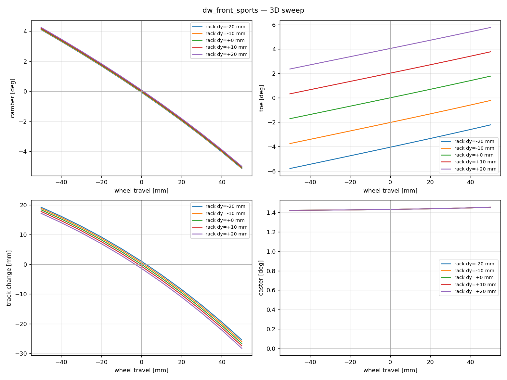

# 14. Hardpoint Kinematics — Ld4 의 실제 구현

> **학습 목표.** Chapter 13 이 "outlook" 으로 제시한 multibody kinematics 가
> 실제로 어떻게 구현됐는지 식 단위로 안다. 4 가지 suspension topology
> (double wishbone / MacPherson / trailing arm / 5-link) 각각의 운동학 제약과
> 풀이 방법을 안다. offline solver (Python) 와 native solver (C++) 의 두
> backend 가 universal `ISuspensionKinematics` 인터페이스로 통일되는 구조를
> 안다. Gruebler mobility 로 각 topology 의 자유도가 닫히는지 검증할 수 있다.

## 14.1 문제 정의 — 입력과 출력

모든 suspension 의 운동학은 동일한 black-box 인터페이스:

```
입력: (wheel_travel, steer_input)
출력: (camber, toe, track_change, caster)
```

- `wheel_travel` [m] — bump 이 양수 (wheel 이 chassis 대비 위로).
- `steer_input` — DW/MP 에서는 steering rack 의 lateral displacement [m];
  rear (TA/5-link) 에서는 무시.
- `camber` [rad] — wheel plane 의 y-z 평면 tilt (좌측 wheel: top 이 +y 쪽이면 양수).
- `toe` [rad] — wheel spin axis 의 x-y 평면 회전 (toe-in 양수).
- `track_change` [m] — wheel center 의 y 변위.
- `caster` [rad] — kingpin axis 의 x-z 평면 tilt.

C++ 인터페이스 (`core/include/vdsim/suspension.hpp`):

```cpp
class ISuspensionKinematics {
public:
    struct Output { double camber, toe, track_change, caster; };
    virtual Output compute(double wheel_travel,
                           double steer_input) const noexcept = 0;
};
```

## 14.2 강체 운동학의 공통 패턴

knuckle 은 강체. 정적 상태에서 body frame 의 wheel center 를 기준점으로
삼고, hardpoint 들의 정적 offset 을 knuckle frame 에 고정. wheel travel 에
따라 knuckle 이 회전·평행이동하면:

$$
p_{\text{world}}(R, t) = LK + R\,(p_{\text{static}} - LK_{\text{static}})
$$

여기서 $R$ 은 knuckle 의 회전 (정적 대비), $LK$ 는 현재 lower-knuckle 위치.
camber/toe 는 회전된 spin axis 로부터:

$$
\begin{aligned}
\text{spin}_{\text{world}} &= R \cdot \text{spin}_{\text{body}} \\
\text{camber} &= \operatorname{atan2}(-\text{spin}_z,\; |\text{spin}_y|) \quad (\text{좌측; 우측 부호 반전}) \\
\text{toe} &= \operatorname{atan2}(\text{spin}_x,\; \text{spin}_y)
\end{aligned}
$$

문제는 **각 topology 가 R 을 어떻게 결정하느냐** — joint 제약의 차이.

## 14.3 Double wishbone — sequential closed-form

`tools/kinematics/dw_3d_solver.py`, `core/src/dw_native_kinematics.cpp`.

UCA / LCA 가 각각 chassis 측 revolute axis 를 가짐 (chassis_front-rear 두
점이 axis 정의). knuckle 은 LCA-knuckle (LK), UCA-knuckle (UK), tie-rod-knuckle
(TK) 세 ball joint 로 부착.

**Gruebler mobility** (N=4: chassis, LCA, UCA, TieRod, knuckle 은 강체 분리 안함):

| joint | type | 제약 c |
|---|---|---|
| LCA-chassis | revolute (R) | 5 |
| LCA-knuckle | ball (S) | 3 |
| UCA-chassis | revolute (R) | 5 |
| UCA-knuckle | ball (S) | 3 |
| TieRod-rack | ball (S) | 3 |
| TieRod-knuckle | ball (S) | 3 |

`M = 6·(N−1) − Σc = 6·4 − 22 = 2`. tie rod 자체 축 회전이 passive DOF 1 →
active M = 1 (wheel travel). steer 입력 1개로 닫힘.

**풀이 순서** (sequential, no global solve 필요):

1. **LCA 각도 $\theta_l$** — wheel travel 목표로 Newton:

   $$
   \text{wheel}_z(\theta_l) = \big(LK(\theta_l) + R(\theta_l)\, \text{off}_{\text{wheel}}\big)_z \overset{!}{=} z_{\text{static}} + \text{travel}
   $$

   여기서 *진짜 wheel z* 를 쓰는 게 핵심. 초기 구현은 `LK_z + off_z` 의
   small-angle 근사를 썼는데 ±50 mm 에서 ~3 mm 오차 (`fix(ld4): Newton on
   TRUE wheel z` commit).

2. **UCA 각도 θ_u** — `|UK − LK| = L_LU` (knuckle rigid 거리) 보존하도록
   sphere–sphere 교차 Newton.

3. **TK** — 3-sphere trilateration: LK 중심 반경 `L_LT`, UK 중심 반경 `L_UT`,
   tie_rod_inner 중심 반경 `L_tr` 의 교점. 정적 위치에 가까운 해 선택.

4. **knuckle frame** — (LK→UK) 을 kingpin x축, TK 로 y축 평면 정의 →
   R_now. R_delta = R_now · R_static^T.

샘플 (sports DW, 정적): instant center (0.167, 0.059) m, roll center 7.5 cm,
camber gain −0.094 °/mm — sports car 표준 범위.



*DW 의 (travel, steer) sweep — camber/toe/track/caster 4 곡선. 이게 lookup
table 의 source.*

## 14.4 MacPherson — cylindrical joint 제약

`tools/kinematics/mp_3d_solver.py`, `core/src/mp_native_kinematics.cpp`.

DW 와 결정적 차이: UCA 가 없고 **strut** 이 그 역할. strut tube 는 knuckle 에
강체 결합, chassis 측 top mount 는 spherical bearing, 내부는 telescoping
(스프링 압축) + 축 회전 허용 → **cylindrical joint**.

**핵심 통찰** (초기 구현의 결함 수정): strut 의 운동학 제약은
"strut 길이 일정" 이 *아니라* "tube axis 가 chassis top mount 를 통과" 이다.
strut compression 길이는 자유 (스프링이 결정), 방향만 구속.

tube 축 방향은 body frame 에 고정:

$$
\text{tube\_axis}_{\text{body}} = \frac{ST_{\text{static}} - SK_{\text{static}}}{\|ST_{\text{static}} - SK_{\text{static}}\|}
$$

회전 후 cross-product 제약 (3 scalar, 1 redundant):

$$
(SK_{\text{world}} - ST_{\text{chassis}}) \times (R \cdot \text{tube\_axis}_{\text{body}}) = 0
$$

tie rod 거리 제약 1 scalar 추가 → knuckle 3 회전 DOF 가 닫힘.
`scipy.optimize.least_squares` (Python) / Eigen LM (C++) 으로 풀이.

초기 구현은 strut 을 양단 ball-joint 의 고정길이 막대로 모델 (sphere
제약 1 scalar) → knuckle 의 strut-축 회전이 미닫혀 발산. regularization hack
필요했고 camber gain 이 ~1 °/mm (비현실적). cylindrical 제약으로 수정 후
0.034 °/mm (sedan MacPherson 표준), 단발 LM 수렴.

자세한 회계는 `docs/tasks/T28_ld4_mp/REPORT.md`.

## 14.5 Trailing arm — 단일 revolute

`tools/kinematics/ta_3d_solver.py`, `core/src/ta_native_kinematics.cpp`.

가장 단순. arm + knuckle + wheel 이 한 강체, chassis 측 single revolute axis.
`M = 6·1 − 5 = 1` (wheel travel). steer 없음.

axis 방향이 camber/toe gain 을 결정:

- pure trailing (axis ∥ +y): camber/toe gain 0.
- semi-trailing (axis 가 x 또는 z 성분): gain 발생.

풀이: arm 회전각 θ 하나만 Newton (wheel z 목표). 샘플 axis tilt 14° (toe
방향) + 5.5° (anti-dive) → camber 0.022 °/mm, toe 0.009 °/mm (sedan rear typical).

## 14.6 5-link — general multilink

`tools/kinematics/fivelink_3d_solver.py`,
`core/src/fivelink_native_kinematics.cpp`.

가장 일반적. 다른 topology 들은 이것의 특수 케이스. 5 개의 양단 ball-joint
rigid link. knuckle 6-DOF, 각 link 1 length 제약 → 5 제약 + wheel-z 입력 1 →
6 제약 on 6 DOF, 닫힘.

knuckle pose = $(x, y, z, \text{axis-angle})$ 6-vector. 잔차:

$$
\begin{aligned}
r_i &= \|\text{pos} + R\, \text{off}_{\text{knuckle},i} - \text{chassis}_i\| - L_{\text{link},i}, \quad i = 1\ldots5 \\
r_6 &= \text{pos}_z - (z_{\text{static}} + \text{travel})
\end{aligned}
$$

Levenberg–Marquardt (Python scipy / C++ Eigen 직접 구현). continuation
(이전 sweep 해를 warm-start) 으로 부드러운 단조 해 family.

샘플: camber 0.019 °/mm, toe 0.026 °/mm (sports rear 의 tight 제어).

## 14.7 두 backend — lookup vs native

같은 `ISuspensionKinematics` 인터페이스에 두 구현:

| Backend | 구현 | 특성 |
|---|---|---|
| **Lookup** | `create_lookup_kinematics(csv)` | offline solver 가 만든 (travel × steer) CSV 를 bilinear 보간. O(1). |
| **Native** | `create_{dw,mp,ta,5link}_native_kinematics(yaml)` | runtime 에 hardpoint 직접 풀이. hardpoint 가 변하는 케이스 (향후 compliance). |

검증: native solver 출력이 grid point 에서 lookup 과 < 1e-3 rad 일치
(`tests/unit/test_suspension_lookup.cpp`).

## 14.8 Ld3 와의 연결

`fourteen_dof_dynamics.cpp::step()` 이 매 substep:

1. per-wheel travel = `z_u[i] − z_corner_sprung[i]` (bump 양수).
2. `kinematics->compute(travel, 0)` → camber, toe.
3. 좌/우 mirror 부호 적용 후 `inner_->set_camber_per_wheel`,
   `set_toe_per_wheel` 로 Ld2 에 전달.
4. Ld2 가 Pacejka 의 `gamma` 입력 + 각 wheel steer 에 toe 가산.

이게 Chapter 06 의 phenomenological `camber_per_roll · φ` 를 대체. attach
안 하면 legacy fallback 으로 동작 (back-compat).

```cpp
auto k = vdsim::create_lookup_kinematics("dw_front.csv");
vdsim::attach_front_kinematics(*l3_dyn, std::move(k));
```

## 14.9 Toolchain — design workflow

```
hardpoint YAML (configs/suspensions/*.yaml)
   │
   ├─ tools/kinematics/diagnose.py        — self-consistency check
   ├─ tools/kinematics/*_3d_solver.py     — sweep CSV 생성
   ├─ tools/kinematics/import_hardpoints.py — Adams CSV → VDSim YAML
   └─ viewer/suspension_editor.html       — Three.js 라이브 편집
                                              (WebSocket → native solver)
```

`diagnose.py` 출력 예 (4 type 모두 통과):
```
DW    : RC 7.5cm, camber gain -0.094°/mm, wheel-z err < 0.1 μm
MP    : strut tilt 19.4°, camber gain -0.019°/mm
TA    : semi-trailing 14°, anti-dive 5.5°
5-link: link lengths [0.36, 0.36, 0.38, 0.38, 0.35]
```

## 14.10 한계

| 항목 | 현재 |
|---|---|
| Compliance (bushing) | 없음 — 강체 joint 만 (Ld5 영역, Phase 2) |
| Steer 통합 | DW/MP 의 rack displacement 만; rear steer 없음 |
| Anti-dive/squat 정량 | kinematic 만; 종방향 reaction 의 force 효과 미반영 |
| Tire 와의 force coupling | camber/toe 가 tire 입력으로만 (역방향 force feedback 없음) |
| K&C chart 표준 출력 | sweep CSV + plot 있음; Adams 형식 chart 는 미구현 |

## 14.11 참고

- Milliken, W. & Milliken, D., *Race Car Vehicle Dynamics*, SAE, 1995 — §17 (suspension geometry, instant center, roll center).
- Reimpell, Stoll, Betzler, *The Automotive Chassis*, 2001 — K&C, suspension types.
- Gillespie, T., *Fundamentals of Vehicle Dynamics*, SAE, 1992 — camber/toe gain 정의.
- 구현: `tools/kinematics/*.py`, `core/src/*_native_kinematics.cpp`,
  `docs/tasks/T27_ld4_dw` ~ `T30_ld4_5link/REPORT.md`.
